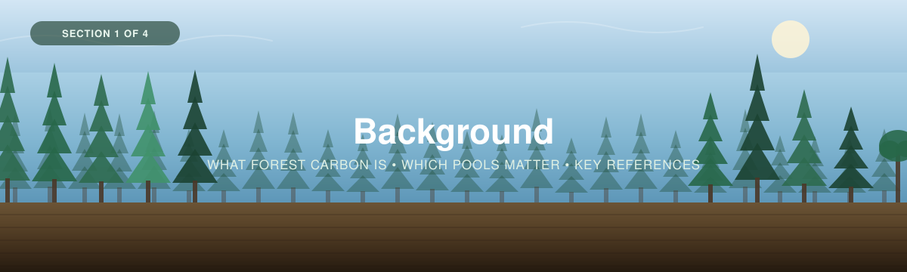

  

---

[← Back to main guide](../README.md) · Next: [2 — Project Planning →](../02_Project_Planning/)

---

# Part 1 — Background

*Intro to forest carbon in Canada, and why more of it is underground than you'd think.*

**Quick links:** [Measuring Carbon in Trees](../03_Field_Methods/Trees-FINAL-Eng-2026.pdf) · [Measuring Carbon in Non-Peat Soils](../../_Shared/Non-peat-FINAL-Eng-2026.pdf) · [Regional protocol — Southern Ontario / St. Lawrence](SO-StLawrence-Eng-2026.pdf)

---

## What is forest carbon?

**Forest carbon** is the organic carbon held by a forest — in its living trees, in the plants
beneath them, in dead wood, and in the soil under all of it. Trees pull CO₂ out of the
atmosphere through photosynthesis and build it into wood, bark, leaves and roots. When those
tissues die, some of that carbon decomposes back to the atmosphere, and some of it is worked
into the soil, where it can stay for centuries.

Two words describe the two halves of this, and they are easy to mix up:

1. **Sequestration** — the *process*: living plants pulling CO₂ out of the atmosphere. A rate,
   measured per year.
2. **Storage** — the *amount* currently held. A stock, measured at a point in time.

This workshop measures **storage**. Everything in Parts 2 to 4 produces a carbon *stock*: how
much carbon is here, right now, per square metre. Measuring sequestration means measuring a
stock twice, some years apart, which is why the guides put so much weight on **permanent
plots** you can find again.

> 📸 **[SLIDE NEEDED]** — a carbon-cycle diagram for a forest: pools (trees, understory, dead
> wood, soil, atmosphere) as boxes, fluxes as arrows. The same "pools and fluxes" framing the
> eelgrass workshop uses.

---

## Where the carbon actually is

<table>
<tr>
<td width="55%">

This is the single most important thing to take from Part 1, and it surprises most people:

**In Canadian forests, the soil holds far more carbon than the trees do.**

Canada's forest biomass stores roughly **21 billion tonnes** of carbon — the trees, their
branches and their roots. Canada's non-peat soils hold over **208 billion tonnes** in the top
metre alone. That is an order of magnitude more, sitting under the part everyone photographs.

Non-treed vegetation — the shrubs and ground plants — holds about **0.2 billion tonnes**. Small,
but it is also the pool that responds fastest to disturbance and management.

</td>
<td width="45%">

> 📸 **[FIGURE NEEDED]** — a stacked bar comparing the four Canadian pools on the same axis:
> forest biomass (21 Gt), non-peat soil to 1 m (208 Gt), non-treed vegetation (0.2 Gt), and
> peat soils for contrast. The visual point is the 10:1 soil-to-tree ratio.

*Sources: [Measuring Carbon in Trees](../03_Field_Methods/Trees-FINAL-Eng-2026.pdf) p.4;
[Measuring Carbon in Non-Peat Soils](../../_Shared/Non-peat-FINAL-Eng-2026.pdf) p.4;
Measuring Carbon in Vegetation (Non-Tree) p.5.*

</td>
</tr>
</table>

That ratio is why this workshop measures **two pools as standard** — trees and soil — and
treats understory as an optional third. A forest carbon project that measures only the trees
has measured the smaller half.

| Pool | Roughly how much | How fast it changes | Measured in this workshop |
|---|---|---|---|
| **Soil** | The majority of the stock | Slowly — decades to centuries | ✅ [Part 3B](../03_Field_Methods/3B_Soil.md) |
| **Trees** | Large, and highly visible | Years to decades | ✅ [Part 3A](../03_Field_Methods/3A_Trees.md) |
| **Understory** | Small | Fast — within a season | ⬜ Optional, [Part 3C](../03_Field_Methods/3C_Understory.md) |
| **Dead wood / litter** | Modest but real | Years | ❌ Not covered — see the note below |

> [!NOTE]
> **Dead wood and litter are a genuine gap.** Coarse woody debris and the litter layer hold
> carbon that neither the tree protocol nor the soil protocol captures, and neither WWF guide
> covers them. If your project needs a full stand-level carbon account — for crediting, for
> example — you will need a separate deadwood protocol. Say so in your reporting rather than
> letting the omission pass silently.

---

## Carbon accumulation and equilibrium

A forest does not accumulate carbon forever. Carbon comes in through photosynthesis and leaves
through respiration, decomposition and disturbance. Early in stand development, growth
outruns losses and the stock climbs steeply. As the stand matures, losses catch up, and the
stock levels off around a **carbon equilibrium** — what ecologists call the net ecosystem
carbon balance.

<table>
<tr>
<td width="60%">

> 📸 **[ANIMATION NEEDED]** — the baseline accumulation curve: carbon in (green), carbon out
> (red), and the net stock (black) levelling off at a dashed equilibrium line. The eelgrass
> workshop's `download (Null).gif` shows exactly this and can be reused with forest labels.

</td>
<td width="40%">

The two curves converge, and the stock plateaus. An old stand is not necessarily *gaining*
carbon — but it is *holding* a great deal of it, and that is a different and equally important
thing to protect.

</td>
</tr>
</table>

### Disturbance: pulse and press

Forests are shaped by disturbance, and Canadian forests more than most. Two kinds matter, and
the difference between them governs whether a forest recovers:

<table>
<tr>
<td width="50%">

**Pulse** — abrupt and bounded.

- Wildfire
- Harvest
- Blowdown and ice storms
- Land clearing

A healthy forest absorbs a pulse and grows back. The stock drops sharply, then climbs again
toward equilibrium.

</td>
<td width="50%">

**Press** — slow and sustained.

- Warming and drought stress
- Insect outbreaks (spruce budworm, mountain pine beetle)
- Invasive species and disease
- Fragmentation and edge effects

A press disturbance lowers the equilibrium itself, so the forest recovers to a *lower* stock
than before.

</td>
</tr>
</table>

> 📸 **[ANIMATION NEEDED]** — two more curves: a single pulse with recovery, then overlapping
> pulse-and-press driving the stand to a lower state and net carbon loss. (`download (pulse).gif`
> and `download.gif` from the eelgrass repo.)

When pulse and press act together — a fire in a stand already weakened by drought and beetle —
the forest can cross from being a carbon **sink** to a carbon **source**. This is not
hypothetical in Canada; it is the central question facing boreal carbon management.

**Interactive:** explore how carbon accumulates and responds to disturbance with the
[Ecosystem Carbon Accumulation Visualizer](https://cathald.github.io/CarbonAccumulationVisualizer/).

---

## What is forest soil carbon, anyway?

Leaves, needles, branches and roots fall or die. Fungi, bacteria and invertebrates break them
down. Most of that carbon returns to the atmosphere — but a fraction is stabilised: bound onto
mineral surfaces, locked in aggregates, or simply buried where oxygen is scarce. That fraction
accumulates, year after year.

<table>
<tr>
<td width="55%">

Dig a pit and you can see the result as **horizons** — layers with distinct colour, texture and
carbon content:

- The **organic horizon (O)** at the surface: recognisable litter grading into dark, decomposed
  material. Very high carbon, low density.
- The **A horizon**: mineral soil darkened by organic matter worked down from above.
- **B and C horizons**: progressively more mineral, less carbon, denser.

Carbon concentration falls sharply with depth — but bulk density *rises*, so deeper layers can
still hold a surprising amount of the total. This is why we sample by depth interval rather
than grabbing one handful.

</td>
<td width="45%">

> 📸 **[PHOTO NEEDED]** — a soil pit face with the horizons visible and a tape measure for
> scale. Ideally annotated with the depth of each horizon boundary.

</td>
</tr>
</table>

> [!TIP]
> **Stones matter.** Much of the Canadian Shield is stony, and rocks hold no carbon. If you do
> not account for the coarse fragment fraction, you will overestimate soil carbon — sometimes
> badly. [Part 3B](../03_Field_Methods/3B_Soil.md) covers how to record it and
> [Part 4](../04_Data_Interpretation/) covers how the calculator handles it.

---

## So how do you measure forest carbon?

Measuring the stock means measuring each pool in its own way, then adding them up per square
metre. For trees that means **measuring dimensions and predicting mass**; for soil it means
**collecting samples and measuring mass and carbon content directly**.

However simple that sounds, aligning the measurements with the project's larger goals is what
makes the samples worth collecting. There are four basic steps:

1. Apply a **sampling design**
2. Obtain **field measurements and samples**
3. **Analyse** the samples
4. **Calculate carbon** and **interpret** the results

The first two are the workshop's two core jobs (see the [main guide](../README.md)):

- **Making the data useful** (step 1) — *before* collecting anything, design the sampling so the
  data you gather answers your team's questions. That's
  [Section 2 — Project Planning](../02_Project_Planning/).
- **Collecting the data** (step 2) — measuring trees, sampling soil, surveying understory.
  That's [Section 3 — Field Methods](../03_Field_Methods/).

Steps 3 and 4 are [Section 4 — Data Interpretation](../04_Data_Interpretation/).

---

## Know your region before you plan

Canadian forests are not one thing. Species, soil depth, stoniness and the dominant carbon pool
all shift across the country, and they change what your sampling design should look like.

<table>
<tr>
<td width="55%">

The **regional protocols** in this series describe geography, soil and vegetation types, and
project design considerations region by region. The one included here covers
**Southern Ontario – St. Lawrence**, including the Lake Erie Lowland, and it pairs the regional
ecology with the sampling methods.

**👉 [Southern Ontario – St. Lawrence regional protocol](SO-StLawrence-Eng-2026.pdf)**

</td>
<td width="45%">

> 🔗 **[LINKS NEEDED]** — the other regional protocols in the series, as they become
> available, so teams outside Southern Ontario–St. Lawrence can find theirs.

</td>
</tr>
</table>

---

## In the next section

We'll start with **Project Planning**: deciding which pools to measure, how many plots you
need, and where they go — in a way that aligns with team, organization and community goals.

---

## In this section

- [`SO-StLawrence-Eng-2026.pdf`](SO-StLawrence-Eng-2026.pdf) — regional protocol for Southern Ontario–St. Lawrence.
- `images/` — section banner and background figures.

> ✍️ **[SLIDE DECK NEEDED]** — the workshop presentation for Part 1, as `.pptx` and `.pdf`,
> to sit alongside this page the way the eelgrass deck does.
