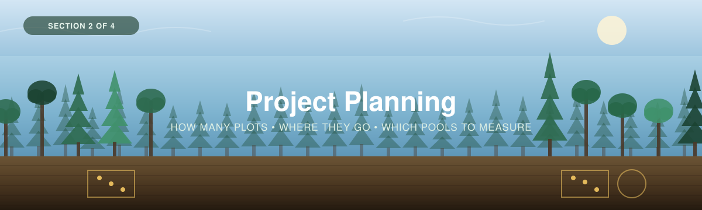

<p align="center">
  
</p>

---

[← 1 — Background](../01_Background/) · [Back to main guide](../README.md) · Next: [3 — Field Methods →](../03_Field_Methods/)

---

# Part 2 — Project Planning

## From a carbon question to a sampling design

**Quick links:** [Sampling Design Guide](../../_Shared/Sampling-Design-Eng-2026.pdf) · [Sampling design tools](Sampling%20Design%20Tools/) · [Regional protocol](../01_Background/SO-StLawrence-Eng-2026.pdf) · [Appendix A — sampling logic](#appendix-a--a-brief-lesson-in-sampling-logic)

---

**Before establishing any plots**, four questions are worth addressing:

1. **What do I want to know?** Baseline data? A comparison between management types? Tracking restoration? All of the above?
2. **Where does that question apply?** The whole property, just the mature stands, uplands versus lowlands?
3. **How much data do I need?** How many plots is enough? What is our capacity to meet this?
4. **Where should the plots go?**

Answering these is what a **sampling design** aims to achieve. It turns a carbon question into a
field plan: a number of plots, and a set of coordinates.

This section covers the five steps of a sampling design.

| # | Step | Answers |
|---|------|---------|
| 1 | **[Define the study area](#step-1--define-your-study-area)** | *Where, roughly, am I working?* |
| 2 | **[Stratify](#step-2--stratify-your-site-optional)** *(optional)* | *Does the site split into distinct areas?* |
| 3 | **[Choose the carbon pools](#step-3--choose-which-pools-to-measure)** | *Trees, soil, understory — which, and why?* |
| 4 | **[Decide how many plots](#step-4--decide-how-many-plots)** | *How many plots meet my goal?* |
| 5 | **[Decide where they go](#step-5--decide-where-the-plots-go)** | *Exactly where, and how is each plot laid out?* |

> The methods here follow WWF-Canada's [Sampling Design guide](../../_Shared/Sampling-Design-Eng-2026.pdf),
> together with the plot specifications in [Measuring Carbon in Trees](../03_Field_Methods/Trees-FINAL-Eng-2026.pdf)
> and [Measuring Carbon in Non-Peat Soils](../../_Shared/Non-peat-FINAL-Eng-2026.pdf).

**Two companion tools** appear throughout:

<table>
<tr>
<td width="50%">

**🗺 [Forest sampling-design tool](Sampling%20Design%20Tools/ForestSamplingTool_GEE.js)**  A Google Earth Engine script: draw your boundary, stratify it, size the campaign and place your plots on a map.

*Used in Steps 1, 2, 4 and 5.*

</td>
<td width="50%">

**📊 [Prior carbon scoping tool](Sampling%20Design%20Tools/PriorCarbonScoping_GEE.js)**  Pulls published carbon maps and soil profile data over your area of interest, so Step 4 starts from real numbers.

*Used in Step 4.*

</td>
</tr>
</table>

If you want to know how the tools return the numbers they do, look to
[**Appendix A**](#appendix-a--a-brief-lesson-in-sampling-logic) at the bottom of this page.

---

## Background: What sampling is, and why it works

Measuring every square metre of a forest isn't feasible. So we measure a **small portion** of
it and use that to estimate the whole. Because an estimate built from a portion will never be
exactly right every single time, we also want to know the probability that the estimate
reflects the actual value. This is called **probability-based sampling**.

<table>
<tr>
<td width="60%">

> 📸 **[SLIDE NEEDED]** — the probability-sampling explainer: a study area divided into sites,
> sites into plots, and measurements combining back up into one estimate.

</td>
<td width="40%">

**Sampling** = taking a small portion of a thing to make an informed estimate of the whole.

A **sampling design** is the framework for choosing *what* and *where* to sample by dividing
the study area into sites and plots, measuring those, and combining them into an estimate for
the full area.

</td>
</tr>
</table>

Because you don't measure everything, every estimate carries uncertainty, which is why a result
is reported in **three parts**:

| Component | | What it tells you |
|---|---|---|
| **Estimate** | $\bar{x}$ | The average carbon value across your sampled plots. |
| **Confidence level** | $1-\alpha$ | How often this procedure would capture the true value if repeated. At 90% confidence, about 90 out of every 100 such intervals contain it. |
| **Margin of error** | $E$ | How precise that estimate is — the distance from the estimate to the edge of the interval, usually given relative to the mean (e.g. ±20%). |

> Put together: *"mean carbon = 15.4 ±2.3 kg C/m², at 90% confidence."*

### The takeaway

- Sampling estimates what's impractical to measure directly.
- The same process that produces an estimate can tell you whether differences *between* sites are real.
- And it runs **backwards**: fix the precision you want, and it returns the number of plots needed to get there. That's Step 4.

---

# Implementing a sampling design

---

## Step 1 — Define your study area

*Where, roughly, am I working?*

<table>
<tr>
<td width="55%">

The **study area** is the entire area you want a number for. Draw its boundary and record its
area in square metres — every sample-size calculation downstream depends on it.

Boundaries usually come from one of three places:

- An existing property, tenure or protected-area boundary you already hold
- A boundary drawn by hand over imagery
- A boundary derived from land cover — for example, everything classified as forest within a watershed

</td>
<td width="45%">

> 📸 **[SCREENSHOT NEEDED]** — the GEE tool with a study-area boundary drawn and its area
> reported in hectares.

</td>
</tr>
</table>

<details>
<summary><b>📊 Worked example</b> &nbsp;·&nbsp; <i>what the Moose Ridge team defined</i></summary>

<br>

A **12 ha** forested block on a community property: 7.2 ha of upland mixedwood on a low ridge,
and 4.8 ha of lowland black spruce along a creek. The boundary came from the property survey,
clipped to the treed area using recent imagery.

</details>

> [!TIP]
> **✅ Before moving on, you should have:**
> - A **boundary**, as a shapefile, KML or GeoJSON
> - Its **total area in m²**

---

## Step 2 — Stratify your site *(optional)*

*Does the site split into distinct areas?*

<table>
<tr>
<td width="55%">

**Stratification** divides the study area into internally similar sub-areas — **strata**, also
called sites — and samples each one separately. Where a site genuinely splits into different
kinds of forest, this is the single most cost-effective thing you can do: it removes the
biggest source of variability from your estimate, and the same number of plots buys a tighter
answer.

In a forest, the useful splits are usually:

| Split by | Typical strata |
|---|---|
| **Stand type** | Mixedwood · conifer · hardwood |
| **Age or structure** | Regenerating · mature · old growth |
| **Drainage / position** | Upland · midslope · lowland |
| **Management history** | Harvested · burned · untouched |
| **Soil depth** | Deep till · shallow-to-bedrock |

</td>
<td width="45%">

> 📸 **[SCREENSHOT NEEDED]** — a study area split into two or three strata in the GEE tool,
> with each stratum's area reported.

The [regional protocol](../01_Background/SO-StLawrence-Eng-2026.pdf) describes the soil and
vegetation types you can expect region by region — a good place to decide what your strata
should be before you go looking at imagery.

</td>
</tr>
</table>

> [!NOTE]
> **Stratify on something you can see and map.** A stratum has to be delineable across the
> whole study area, because you need its **area** to weight it. "Stands that felt different
> when we walked them" is not a stratum; "conifer-dominated, from the land-cover layer" is.

<details>
<summary><b>📊 Worked example</b> &nbsp;·&nbsp; <i>how Moose Ridge stratified</i></summary>

<br>

Two strata, drawn from imagery and confirmed on the ground:

| Stratum | Area | Why |
|---|---|---|
| **S1 — Upland mixedwood** | 72,000 m² (7.2 ha) | Aspen, birch, spruce and fir on a well-drained ridge |
| **S2 — Lowland conifer** | 48,000 m² (4.8 ha) | Black spruce and larch on wetter ground by the creek |

They expected the two to differ several-fold in tree carbon — which
[they did](../Worked_Example/), 4.1–6.0 vs 1.6–1.8 kg C/m².

</details>

> [!TIP]
> **✅ Before moving on, you should have:**
> - Your strata **drawn and named**
> - The **area of each** in m² — these are the weights the analysis uses

---

## Step 3 — Choose which pools to measure

*Trees, soil, understory — which, and why?*

**This is the step where a forest project differs most from a coastal one.** An eelgrass survey
has one pool worth measuring. A forest has at least three, they are measured by completely
different methods, and choosing among them is a real budget decision.

<table>
<tr>
<td width="45%">

> 📸 **[SLIDE NEEDED]** — the forest carbon pools diagram: trees, understory, dead wood, forest
> floor and mineral soil, with the relative size of each pool indicated.

</td>
<td width="55%">

Recall from [Part 1](../01_Background/) that in Canadian forests the soil holds roughly ten
times the carbon of the trees. That has a blunt implication for planning:

**A project that measures only trees has measured the smaller pool.**

Trees are still worth measuring — they are what changes when a stand is harvested or burned,
they are what most partners picture, and they are far cheaper per plot than soil. But if the
question is *"how much carbon is stored here"*, soil belongs in the design.

</td>
</tr>
</table>

### What each pool costs you, and what it buys

| Pool | Field effort | Lab cost | Changes on a timescale of | Include when |
|---|---|---|---|---|
| **Trees** | Moderate — a crew of 2–3, a few hours per plot | **None** | Years to decades | Almost always. No lab cost makes this the cheapest real number in forest carbon. |
| **Soil** | High — coring or pit digging, then sample handling | **Substantial** — per sample, and there are many samples | Decades to centuries | The question is about total stock, or about a land-use change that disturbs soil. |
| **Understory** | Low for shrubs; moderate for clip-and-weigh (drying and weighing every sample) | Low | Within a single season | The understory is a meaningful share (open stands, recent disturbance, shrubland edges), or the project tracks vegetation recovery. |

> [!IMPORTANT]
> **Soil is where the budget goes.** A 400 m² tree plot costs you labour and nothing else. A
> single soil core sliced into six depth increments is **six lab samples**, and a campaign of 20
> cores is 120 samples. Get a quote before you commit to a core count —
> [Part 4](../04_Data_Interpretation/) covers what to ask a lab.

### Decide your reporting depth now, not later

If soil is in scope, decide **now** how deep you are reporting to — 30 cm, 50 cm or 1 m are the
conventional choices. It affects the corer you need, the number of lab samples, and whether
your numbers can be compared with anyone else's.

Every core should then reach that depth. A core that stops short is not wrong, but its stock
will be an underestimate at the reporting depth, and the calculator will flag it.

<details>
<summary><b>📊 Worked example</b> &nbsp;·&nbsp; <i>what Moose Ridge chose</i></summary>

<br>

**Trees and soil**, with understory recorded opportunistically.

Reporting depth: **30 cm**, on the grounds that it is the shallowest common standard, it kept
the lab bill within budget, and the shallow stony ground on the ridge made a deeper target
unrealistic. One plot (MR-03) hit refusal at 22 cm anyway.

</details>

> [!TIP]
> **✅ Before moving on, you should have:**
> - The **pools** you're measuring, written down, with the reason for any you've excluded
> - A **reporting depth** for soil
> - A rough **lab quote** if soil is in scope

---

## Step 4 — Decide how many plots

*How many plots meet my project goal?*

Too few plots and your estimate carries too much uncertainty to make confident decisions. Too
many and you spend resources collecting data you didn't need.

To get there, you define three things, and the calculation returns a number of plots:

| You provide | Meaning | Typical |
|---|---|---|
| **Area** (m²) | How big the boundary is | from Step 1 |
| **Margin of error** ($E$) | How precise the estimate must be | ±10% or ±20% |
| **Confidence level** | How reliable that interval has to be | 80% or 90% |
| **A variability prior** | Roughly how much carbon is there, and how patchy | see below |

### ⚠ One number per pool, not one number for the project

Here is a wrinkle the eelgrass workshop never has to deal with. **Each pool has its own plot
size, so each pool has its own population size $N$, and therefore its own required $n$.**

| Pool | Plot size | $N$ in a 12 ha area |
|---|---|---|
| Trees | 400 m² | 300 plots |
| Soil | 100 m² (the 10 × 10 m plot the depth survey is run over) | 1,200 plots |
| Understory (medium) | 16 or 100 m² | 7,500 or 1,200 |

At the worked example's settings, that four-fold difference in $N$ makes **no difference at all**
to the answer: trees and soil both come out at **14 plots**. That is the plateau from
[A4](#a4--what-actually-drives-sample-size) doing its work.

Run the calculation **once per pool** anyway. The tree and soil answers are usually close,
because $N$ stops mattering quickly — but the
variability priors differ between pools, and that does matter. Where the two answers differ, the
nested design in Step 5 lets you take more soil cores than tree plots, or fewer, rather than
forcing one number on both.

### Where the prior comes from

The calculation needs a rough idea of how much carbon is there and how variable it is *before*
you've measured anything. That's a **prior**.

Forests are in a much better position here than coastal ecosystems. **There is a published
carbon map for all of Canada** — so rather than hunting for comparable field studies, you can
read a prior directly over your own boundary.

| | Source | Use when |
|---|---|---|
| **1** | **A pilot survey** — mean and SD from a handful of your own plots, or an earlier survey nearby | You can get a few plots in first. Still the best option: local variability is what actually drives sample size. |
| **2** | **Sothe et al. national carbon maps** — modelled forest carbon and soil carbon at 250 m, in kg/m², with matching uncertainty layers | You have no field data yet. Read the mean and spread over your own boundary with the [prior scoping tool](Sampling%20Design%20Tools/PriorCarbonScoping_GEE.js). |
| **3** | **Published regional values** for comparable stand types | Neither of the above is available. |

The prior scoping tool loads these Earth Engine assets over your area of interest:

```javascript
// Sothe et al. — Canadian forest and soil carbon, 250 m, kg C/m²
ee.ImageCollection('projects/sat-io/open-datasets/carbon_stocks_ca/fc')  // forest carbon
ee.ImageCollection('projects/sat-io/open-datasets/carbon_stocks_ca/sc')  // soil carbon
```

> [!WARNING]
> **A map's variability is not a field crew's variability, and this will under-size your
> campaign if you let it.**
>
> The SD you read off a 250 m modelled map is the spread **between 250 m pixels of a smoothed
> statistical model**. The SD your crew will encounter is the spread **between 400 m² plots in
> real, patchy forest**. The second is substantially larger than the first — model predictions
> are pulled toward the mean, and a 250 m pixel already averages over 60-odd tree plots.
>
> Take the map's mean at face value. **Do not take its CV at face value.** Either inflate it —
> a common rule of thumb is to use at least 1.5× the map-derived CV — or, better, use a pilot.
> Being wrong in this direction costs you a second field season.

<details>
<summary><b>📊 Worked example</b> &nbsp;·&nbsp; <i>what Moose Ridge calculated</i></summary>

<br>

**Their inputs:**

- **Total area** — 120,000 m² → at 400 m² per tree plot, $N$ = **300** possible plots
- **Confidence level** — 90% ($z = 1.645$)
- **Margin of error** — ±20% ($E = 0.20$)
- **Prior** — Sothe forest carbon over the block averaged ≈ 4.2 kg C/m² with a pixel SD giving
  $CV$ ≈ 0.28; they inflated it to **0.45** for the reasons in the warning above

**Result: 14 plots.** Proportional allocation by area gives 8.4 upland and 5.6 lowland, which
[A7](#a7--proportional-allocation-across-strata)'s round-up rule turns into **9 + 6 = 15**. The
total landing above the calculated *n* is expected, not an error.

**What they actually managed: 6.** A first season, a small crew, and a wet July. The workshop's
position on this is the same as the eelgrass workshop's — an under-powered result reported
honestly is worth more than a confident one that hides its own uncertainty. The
[Site Summary](../04_Data_Interpretation/) reports the achieved precision either way.

</details>

> [!TIP]
> **✅ Before moving on, you should have:**
> - A **target margin of error** and **confidence level** you can justify
> - A **prior** for mean carbon and its variability, and a note of where it came from
> - A **required number of plots, per pool**
>
> After the field season you'll come back and check whether you actually hit that target — see
> [Appendix A8](#a8--after-the-campaign-did-you-hit-your-target). The calculator's
> [Site Summary](../04_Data_Interpretation/) does it for you.

---

## Step 5 — Decide where the plots go

*Exactly where, and how is each plot laid out?*

Two separate questions: **where the plot centres go across the landscape**, and **how each plot
is laid out once you're standing there**.

### 5A — Where the plot centres go

| Strategy | When to use it |
|---|---|
| **Random** | Plot centres placed randomly. The default when the area is uniform or you have no prior information. |
| **Systematic** | Plots on a regular grid. Guarantees even coverage; best when variation across the site is fairly even. |
| **Stratified-random** | Strata first, then plots randomly within each. The most accurate and cost-effective strategy, and what this workshop assumes. |
| **Convenience** | Plots wherever you can reach. Not statistically rigorous, but useful for a first look. |

> See WWF-Canada, [*Carbon Measurement: Sampling Design*](../../_Shared/Sampling-Design-Eng-2026.pdf), Part 1.

Each stratum gets a share of *n* **proportional to its area** — see
[Appendix A7](#a7--proportional-allocation-across-strata).

> [!NOTE]
> **Accessibility is a real constraint, and pretending otherwise is worse than accounting for
> it.** If a randomly-placed plot sits in an impassable swamp, do not quietly move it to the
> trail and say nothing. Either define an accessible sampling frame up front and report that
> your estimate applies to *that* frame, or use a replacement protocol decided in advance.
> Silently shifting plots toward roads biases every number you produce, because roadside forest
> is not average forest.

### 5B — How each plot is laid out: the nested design

Once you are at a plot centre, the pools are measured in **nested plots** of different sizes
around that one point.

<table>
<tr>
<td width="45%">

> 📸 **[FIGURE NEEDED]** — the nested plot diagram from the protocol guides: one centre, a
> 400 m² large plot, a medium plot inside it, a 1 m² micro plot, and the soil coring point
> offset **outside** the vegetation plots.

</td>
<td width="55%">

| Plot | Size | What's measured |
|---|---|---|
| **Large** | 400 m² — circular *r* = **11.28 m**, or 20 × 20 m, or 10 × 40 m | Trees over 2 m |
| **Medium** | 4 × 4 m (16 m²) or 10 × 10 m (100 m²) | Shrubs and small trees 0.5–2 m |
| **Small** | 1 × 1 m (1 m²) or 0.5 × 0.5 m (0.25 m²) | Ground vegetation under 0.5 m |
| **Soil** | Cores or a pit, offset outside the vegetation plots | Soil carbon |

Record which sizes you used on the **Plot & Site Log** — the calculator divides each pool by
its own plot area, so a mis-recorded plot size propagates straight into the carbon density.

</td>
</tr>
</table>

> [!IMPORTANT]
> **Two rules that all four protocol guides state, and that are easy to get wrong:**
>
> 1. **Vegetation before soil.** Soil sampling is destructive. Complete every vegetation survey
>    before anyone puts an auger in the ground.
> 2. **Soil samples go outside the vegetation plots** whenever the plots are permanent and will
>    be re-measured. Otherwise your next visit measures a plot you dug holes in.

### 5C — If the ground is sloped

The 400 m² plot is 400 m² **in horizontal projection**, not 400 m² of hillside. On a slope, a
tape laid along the ground covers less horizontal distance than it reads.

```
adjusted distance = horizontal distance ÷ cos(slope angle)
```

So on a 30° slope, a 20 m side needs **23.1 m** of tape. Some rangefinders and vertex
hypsometers do this for you; the [Trees guide](../03_Field_Methods/Trees-FINAL-Eng-2026.pdf)
appendix has a lookup table if yours doesn't.

Either apply the allowance in the field, **or** record the slope angles and say on the Plot &
Site Log that you didn't — the calculator will correct the area for you. What it cannot do is
guess which one you did, so answer that column honestly.

### 5D — A special case: plots that will calibrate LiDAR

If you intend to use the [LiDAR supplement](../05_LiDAR_Supplement/), your plots have extra
requirements — **circular, exactly 400 m², sub-metre GNSS on the centre, and placed across the
full range of canopy structure rather than at random**. That last rule genuinely conflicts with
the probability sampling above. Read [Part 5](../05_LiDAR_Supplement/) *before* you finalise
plot locations, not after.

<details>
<summary><b>📊 Worked example</b> &nbsp;·&nbsp; <i>where the Moose Ridge plots went</i></summary>

<br>

Circular 400 m² plots (*r* = 11.28 m), stratified-random within each stratum, generated as
coordinates and loaded onto a handheld GPS. Medium plots at 100 m², micro plots at 1 m².

Three plots landed in each stratum. MR-03 sat on an 11.5° slope where the crew laid out the
nominal distance without the allowance, so its effective area is **391 m²** rather than 400 —
the calculator applied the correction.

</details>

> [!TIP]
> **✅ Before moving on, you should have:**
> - A **sampling strategy** chosen and justified
> - A **per-stratum plot allocation**
> - A **coordinate list**, exported and loadable onto a GPS
> - The **plot sizes** you'll use for each pool, written down

---

## ✅ Sampling design complete

Before heading into the field, check you can answer all seven:

| | Question | From |
|---|---|---|
| 1 | What is my study area, and how big is it in m²? | Step 1 |
| 2 | Have I stratified, and do I know each stratum's area? | Step 2 |
| 3 | Which pools am I measuring, and to what soil depth? | Step 3 |
| 4 | What precision am I targeting, and at what confidence? | Step 4 |
| 5 | How many plots does that need — for each pool? | Step 4 |
| 6 | Where exactly are they, and how is each laid out? | Step 5 |
| 7 | Who is going, with what kit, and in what order? | [Part 3](../03_Field_Methods/) |

---

# Appendix A — A brief lesson in sampling logic

*and the derivations that drive this work*

Steps 1–5 don't require any of this. But if you want to know why the tools behave the way they
do, or you need to defend a sample size to a reviewer, it's all here — in the order the ideas
actually build on each other.

| | | Used in |
|---|---|---|
| [A1](#a1--what-an-estimate-actually-is) | What an estimate actually is | Background |
| [A2](#a2--working-backwards-from-precision-to-sample-size) | Working backwards: from precision to sample size | Step 4 |
| [A3](#a3--cochrans-correction-why-big-areas-stop-needing-more-plots) | Cochran's correction | Step 4 |
| [A4](#a4--what-actually-drives-sample-size) | What actually drives sample size | Step 4 |
| [A5](#a5--the-proportion-form) | The proportion form | Step 4 |
| [A6](#a6--symbol-crosswalk-to-the-unfccc-a64-tool) | Symbol crosswalk to the UNFCCC A6.4 tool | Step 4 |
| [A7](#a7--proportional-allocation-across-strata) | Proportional allocation across strata | Step 5 |
| [A8](#a8--after-the-campaign-did-you-hit-your-target) | After the campaign: did you hit your target? | Step 4 |

---

### A1 — What an estimate actually is

You measure a subset of plots and average them. That average, $\bar{x}$, is your estimate of the
stand's true mean carbon.

How far off might it be? That depends on two things: how much the plots differ from each other
(the standard deviation, $s$) and how many you took ($n$). Combined, they give the **standard
error of the mean**:

$$SE = \frac{s}{\sqrt{n}}$$

The $\sqrt{n}$ is the whole story of sampling economics. Four times the plots buys you *twice*
the precision — never four times.

The **margin of error** scales that standard error by a multiplier set by your confidence level:

$$E \cdot \bar{x} = z\,\frac{s}{\sqrt{n}}$$

where $z = 1.282$ at 80% confidence, $1.645$ at 90%, and $1.96$ at 95%. Writing $E$ as a
*relative* quantity (a fraction of the mean) is what lets you say "±20%" without knowing the
answer in advance.

---

### A2 — Working backwards: from precision to sample size

Everything in A1 runs in reverse. If you know the precision you want, you can solve for the $n$
that delivers it:

$$E \cdot \bar{x} = z\,\frac{s}{\sqrt{n}} \qquad \Longrightarrow \qquad n = \left(\frac{z \cdot s}{E \cdot \bar{x}}\right)^{2}$$

Then replace $s/\bar{x}$ with the **coefficient of variation**, $CV$:

$$n = \left(\frac{z \cdot CV}{E}\right)^{2}, \qquad CV = \frac{s}{\bar{x}}$$

Expressing variability as a $CV$ makes the result **scale-free** — it no longer depends on
whether carbon is in kg C/m², t C/ha, or anything else. A stand with $CV = 0.5$ needs the same
number of plots whether it holds 40 or 400 t C/ha.

Notice what's squared: **$z$, $CV$ and $E$**. That single fact explains almost everything in A4.

This is the **infinite-population** form. It assumes your study area could hold unlimited plots
— which no real site can.

---

### A3 — Cochran's correction: why big areas stop needing more plots

A 12 ha block at 400 m² per plot holds exactly 300 possible plot locations. Sampling theory
gives you credit for how much of that you've covered. Cochran's **finite-population correction**
accounts for it:

$$n \geq \frac{z^2\, N\, CV^2}{(N-1)\,E^2 + z^2\, CV^2}$$

where $N$ = study area ÷ plot footprint.

**One modelling choice everything depends on:** each plot represents a **footprint, not a
pinprick**. Change the plot size and every number downstream shifts — which is exactly why
[Step 4](#step-4--decide-how-many-plots) runs the calculation separately for trees (400 m²) and
soil (100 m²).

As $N$ grows, $(N-1)E^2$ dominates the denominator and the correction fades. That's why the
effect of area **plateaus**: it matters when plots are genuinely scarce, and stops mattering
once they aren't.

---

### A4 — What actually drives sample size

*If you read one appendix section, read this one.*

Four inputs dominate, and two of them sit **squared** in the formula.

All numbers below are anchored on a **12 ha block** ($N$ = 300 tree plots), **±20% margin of
error**, **90% confidence**, $CV$ = 0.45 → **14 plots**. One knob turned at a time:

```
                                              plots needed (from 14)
  Precision      ±20% → ±10%     ████████████████████████  47
  Variability    CV 0.45 → 0.9   ████████████████████████  47
  Confidence     90% → 95%       █████████                 19
  Study area     12 ha → 120 ha  ███████                   14
```

| Knob | Turn it… | Effect on *n* | Why |
|---|---|---|---|
| **Margin of error, $E$** | tighter: ±20% → ±10% | **3.4× more** (14 → 47) | $E$ is squared |
| **Variability, $CV$** | patchier: 0.45 → 0.9 | **3.4× more** (14 → 47) | also squared |
| **Confidence** | stricter: 90% → 95% | **~36% more** (14 → 19) | $z$ is squared too, but 1.645 → 1.96 is a small step |
| **Study area** | bigger: 12 ha → 120 ha | **none** (14 → 14) | see below |

Three things here routinely surprise people.

**CV is the hidden driver.** It's squared, exactly like $E$ — so a stand twice as patchy needs
**3.4 times** the plots. This is why a good variability prior matters more
than almost any other input, and why you inflate the SD when you're unsure (see the warning in
Step 4). It is also the one input you don't control: the forest is as variable as it is.

**Precision is expensive; confidence is cheap.** Tightening $E$ from ±20% to ±10% more than
triples the fieldwork. Raising confidence from 90% to 95% costs about a third more. **If the budget
is fixed, loosening $E$ buys back far more plots than dropping confidence** — and a wider
interval at 95% is usually easier to defend than a tight one at 90%.

**Area barely matters.** A block ten times larger needs **exactly the same** 14 plots. You're
estimating a *mean*, and pinning down a mean depends on variability, not on the size of the
field. This is the most counter-intuitive result in sampling design, and the one most worth
being able to explain to a funder: **a bigger site is not a more expensive survey.**

---

### A5 — The proportion form

Everything above estimates a **continuous** variable. Some questions are instead about a
**proportion** — what fraction of plots contain regeneration, what percentage of the block is
conifer-dominated. Those use a parallel formula:

$$n \geq \frac{z^2\, N\, p\,q}{(N-1)\,E^2 p^2 + z^2\, p\, q}, \qquad q = 1-p$$

where $p$ is the expected proportion. **Use $p = 0.5$ when you have no prior** — it maximises
$p\,q$ and therefore returns the largest, most conservative $n$.

---

### A6 — Symbol crosswalk to the UNFCCC A6.4 tool

| This guide | UNFCCC tool | Meaning |
|---|---|---|
| $z$ | $Z_{\alpha/2}$ | z-multiplier set by confidence level |
| $E$ | $e_{abs}$ | target **relative** precision (0.20 = ±20% of the mean) |
| $s$ | $SD$ | expected standard deviation (your prior) |
| $\bar{x}$ | mean | expected mean (your prior) |
| $CV$ | $CV$ | coefficient of variation, $s/\bar{x}$ |
| $N$ | $N$ | population size |
| $n$ | $n$ | number of plots to establish |

> **Where the two calculators differ — and it's only one thing.** The formula is identical.
> They differ in how $N$ is obtained: the WWF-Canada area-based calculator derives it from
> **total area ÷ plot size**, while the UNFCCC tool takes a **population count** directly.
> Because $(N-1)$ barely moves the result once $N$ is large, both converge — which is exactly
> the plateau described in [A4](#a4--what-actually-drives-sample-size).

---

### A7 — Proportional allocation across strata

Each stratum receives a share of the total $n$ proportional to its area:

$$n_h = \frac{g_h}{N}\times n$$

where $g_h$ is the size of stratum $h$ and $N$ is the total study area.

Then two practical rules on top: round each $n_h$ **up** to a whole plot, and raise any stratum
below **5 plots** to 5. Both push the total above $n$ — deliberately. Rounding down or allowing
a 2-plot stratum would leave you unable to estimate variance within that stratum at all.

> **The worked example breaks this rule, and says so.** Moose Ridge got 3 plots per stratum, not
> 5. Three plots give a mean and an interval, but a wide and fragile one. The
> [Site Summary](../04_Data_Interpretation/) reports it rather than hiding it, which is the
> point.

---

### A8 — After the campaign: did you hit your target?

Sample-size planning uses *expected* variability. Real plots may be more or less variable than
your prior assumed, so before trusting the estimate, check the **achieved** precision against
the target you set.

Recompute precision from what you actually measured:

$$\text{RME} = \frac{t \cdot SE}{\bar{x}}, \qquad SE = \frac{s}{\sqrt{n}}$$

Here $s$ and $\bar{x}$ are the **sample** standard deviation and mean — measured, not assumed.
With a small number of plots, use $t$ rather than $z$: with 3 plots at 90% confidence, $t = 2.92$
against $z = 1.645$, which is a large difference and not one to skip.

Compare the **relative margin of error (RME)** to the target $E$ you set in Step 4:

- **RME ≤ E** → the estimate meets its reliability criterion. Report it.
- **RME > E** → the forest was patchier than your prior assumed.

**The calculator's [Site Summary](../04_Data_Interpretation/) tab does this automatically** and
prints `MET` or `NOT MET` against your target.

**If you miss the target,** work down the ladder in order:

1. **Scrutinize the raw data** — outliers, skew, a mis-recorded plot
2. **Post-stratify** — is there structure you didn't account for?
3. **Add plots**
4. **As a last resort**, report the conservative confidence bound — the interval end that
   *understates* carbon — so the estimate stays defensible

---

## In this section

- [`Sampling Design Tools/`](Sampling%20Design%20Tools/) — the Earth Engine sampling tool and the prior-scoping script.
- [Sampling Design guide](../../_Shared/Sampling-Design-Eng-2026.pdf) — WWF-Canada's cross-ecosystem guide.
- [Regional protocol](../01_Background/SO-StLawrence-Eng-2026.pdf) — geography and project design for Southern Ontario–St. Lawrence.

> 📊 **[ASSET NEEDED]** — a **Forest Sample Allocation Calculator** spreadsheet, the forest
> counterpart to the blue carbon one, so teams can size a campaign without opening Earth Engine.
> The maths is in Appendix A; a copy of the blue carbon workbook is in
> [`../_source/`](../_source/) as a starting point.
