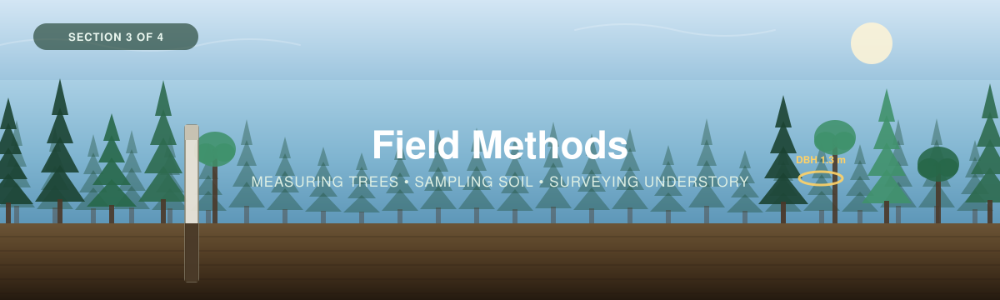

<p align="center">
  
</p>

---

[← 2 — Project Planning](../02_Project_Planning/) · [Back to main guide](../README.md) · Next: [4 — Data Interpretation →](../04_Data_Interpretation/)

---

# Part 3 — Field Methods

*Collecting the data: trees, soil, and understory.*

---

## Overview

This section is the **collecting the data** half of the workshop. The sampling design is set
([Part 2](../02_Project_Planning/)); now the crew goes out and fills the sheets.

Because a forest holds carbon in more than one pool, Part 3 splits into three pages — one per
pool. **Read this page first**: it covers the things that apply to all three, and above all the
**order** they have to happen in.

| | Page | Covers | Fills |
|---|---|---|---|
| **3A** | [**Trees**](3A_Trees.md) | Plot layout, species ID, DBH, height | `3. Tree Data` |
| **3B** | [**Soil**](3B_Soil.md) | Depth survey, coring, pits, shallow soils | `2. Core Log` · `5. Soil Data` |
| **3C** | [**Understory**](3C_Understory.md) *(optional)* | Shrub measurements, clip-and-weigh | `4. Understory Data` |

### Sources for this section

- [*Measuring Carbon in Trees*](Trees-FINAL-Eng-2026.pdf) (WWF-Canada, 2026)
- [*Measuring Carbon in Non-Peat Soils*](../../_Shared/Non-peat-FINAL-Eng-2026.pdf) (WWF-Canada, 2026)
- [*Measuring Carbon in Vegetation (Non-Tree)*](../../_Shared/Vegetation-FINAL-Eng-2026.pdf) (WWF-Canada, 2026)
- [Regional protocol — Southern Ontario / St. Lawrence](../01_Background/SO-StLawrence-Eng-2026.pdf)

> 🎥 **[VIDEO PLAYLIST NEEDED]** — each WWF guide has a corresponding video. Add the playlist
> URLs here and at the step they belong to, the way the eelgrass workshop links its coring
> videos.

---

## ⚠ The order matters more than anything else on this page

All three protocol guides say the same thing, and it is the easiest rule to break:

> **Complete every vegetation survey BEFORE any soil sampling.**

Soil sampling is **destructive**. An auger, a core or a pit disturbs the ground, the roots and
the plants growing in it. If you sample soil first, every vegetation measurement afterwards is
taken in a plot you have already damaged.

A second rule follows from it, for **permanent plots** you intend to re-measure:

> **Take soil samples OUTSIDE the vegetation plots.**

Otherwise your next visit, in five or ten years, measures regrowth on ground you dug up.

**The working order at each plot:**

```
1. Navigate to the plot centre, mark it, record GPS  ──┐
2. Lay out the plot boundaries                          │  non-destructive
3. Photo series                                         │
4. Trees        (3A)                                    │
5. Understory   (3C)  ── medium plot, then small plot ──┘
                                                       ┌── destructive
6. Soil depth survey                                    │
7. Soil cores / pit, offset outside the veg plots  ─────┘
```

---

## Setting up a plot — common to all three pools

<table>
<tr>
<td width="55%">

Every plot starts the same way, whichever pools you're measuring:

1. **Navigate to the plot centre** from your Part 2 coordinate list.
2. **Mark the centre** — a stake, a tagged tree, or flagging. For a permanent plot, a metal
   stake and a sign with the plot ID.
3. **Record the waypoint**: latitude, longitude, elevation — *and the datum*.
4. **Lay out the plot boundary** (see each page for the size).
5. **Record the slope** in both the S–N and E–W directions with a rangefinder or clinometer.
6. **Take the photo series** so the plot can be interpreted later.

</td>
<td width="45%">

> 📸 **[PHOTO NEEDED]** — a crew laying out a circular plot from the centre stake with a tape
> and flagging.

> 📸 **[PHOTO NEEDED]** — a marked plot centre with its ID sign, as it should look for a
> permanent plot.

</td>
</tr>
</table>

### Record it on the sheet — Plot & Site Log

Everything above goes on the **`1. Plot & Site Log`** tab of the
[calculator](../04_Data_Interpretation/calculators/Forest_Carbon_Calculator.xlsx), one row per
plot. It is the key every other sheet joins to, so fill it in first.

| Field | Note |
|---|---|
| Plot ID · Site ID · Study area | The ID convention is *Location–Site–Plot*, e.g. `MR-01` |
| Date · Location | |
| Latitude · Longitude | |
| **GNSS accuracy (m)** · **Datum** | Record both. If you ever use the [LiDAR supplement](../05_LiDAR_Supplement/), sub-metre accuracy is a hard requirement |
| Elevation | m above sea level |
| Plot shape | circular · square · rectangular |
| **Large / Medium / Small plot area** | The sizes you actually used. Each pool is divided by its own area |
| **Slope S–N · Slope E–W** | degrees |
| **Slope allowance applied in field?** | Yes if you lengthened the tape on the slope; No if not, and the area will be corrected for you |

> [!IMPORTANT]
> **Plot IDs must match across every sheet.** Tree, understory and soil rows are joined to this
> log by Plot ID. If an ID doesn't match, that row's plot area can't be looked up and its carbon
> never reaches the summary. Every data sheet has a QC flag column that tells you when this
> happens — read it before you leave the site if you can.

### The photo series

The peat protocol's 14-photo series works just as well in a forest, and costs two minutes:

1. One photo **straight down** (ground vegetation) and one **straight up** (canopy).
2. From the same spot, face each of N, S, E, W and take three: one **parallel** with the ground,
   one **45° up**, one **45° down**.

That's 14 photos that let anyone reconstruct what the plot looked like, years later.

---

## Equipment

<table>
<tr>
<td width="45%">

> 📸 **[PHOTO NEEDED]** — the full kit laid out before heading into the field.

</td>
<td width="55%">

**1 · Setting up the plot (all pools)**

- GPS unit — sub-metre if LiDAR calibration is planned
- Compass
- Laser rangefinder, clinometer or Abney level
- 30 m and 50 m measuring tapes
- Flagging tape, stakes, permanent markers
- Clipboard, printed datasheets, pencil
- Camera
- Altimeter *(or GPS elevation)*

</td>
</tr>
<tr>
<td width="45%">

> 📸 **[PHOTO NEEDED]** — DBH tape and rangefinder in use.

</td>
<td width="55%">

**2 · Trees** — see [3A](3A_Trees.md)

- DBH tape (circumference-to-diameter)
- Laser rangefinder or hypsometer for height
- Numbered metal tree tags and nails *(permanent plots only)*
- Field guide or dichotomous key

</td>
</tr>
<tr>
<td width="45%">

> 📸 **[PHOTO NEEDED]** — soil auger, bulk-density ring, and labelled sample bags.

</td>
<td width="55%">

**3 · Soil** — see [3B](3B_Soil.md)

- Soil probe or auger (depth survey)
- Soil corer with plastic core sleeves, **or** spade and horizontal punch for a pit
- Soil sampling ring / bulk density disk
- Trowel, knife, measuring tape
- Resealable bags, labels, cooler

</td>
</tr>
<tr>
<td width="45%">

> 📸 **[PHOTO NEEDED]** — quadrat and clippers set up on a micro plot.

</td>
<td width="55%">

**4 · Understory** — see [3C](3C_Understory.md)

- 1 × 1 m and 0.5 × 0.5 m quadrats
- Clippers
- Plastic measuring tape (shrub dimensions)
- Resealable bags, labels

</td>
</tr>
</table>

---

## Datasheets and skill checklists

<table>
<tr>
<td width="50%">

**📋 Printable field datasheets**

- [`Tree-Survey-Datasheet.docx`](datasheets/Tree-Survey-Datasheet.docx)
- [`Soil-Carbon-Data-Sheet.docx`](datasheets/Soil-Carbon-Data-Sheet.docx)

These mirror the calculator's tabs field for field, so transcription is a straight copy.

> 📄 **[ASSET NEEDED]** — an Understory Survey datasheet, to complete the set.

</td>
<td width="50%">

**✅ Skill checklists**

- [`Forest_Carbon_Skill_Checklist.docx`](checklists/Forest_Carbon_Skill_Checklist.docx)
- [`Soil_Carbon_Skill_Checklist.docx`](checklists/Soil_Carbon_Skill_Checklist.docx)

Work through these with a trainer: tick the left box when you've practised a skill, the right
when your trainer confirms it. Good for training days and for demonstrating competency to a
partner.

</td>
</tr>
</table>

---

## In this section

- [**3A — Trees**](3A_Trees.md) · [**3B — Soil**](3B_Soil.md) · [**3C — Understory**](3C_Understory.md)
- [`Trees-FINAL-Eng-2026.pdf`](Trees-FINAL-Eng-2026.pdf) — the tree protocol.
- [`datasheets/`](datasheets/) · [`checklists/`](checklists/)
- `images/` — banner and field photos.
