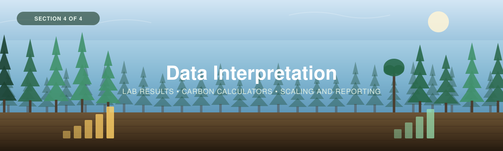

<p align="center">
  
</p>

---

[← 3 — Field Methods](../03_Field_Methods/) · [Back to main guide](../README.md) · Next: [5 — LiDAR Supplement →](../05_LiDAR_Supplement/)

---

# Part 4 — Data Interpretation

*From field sheets and lab results to a carbon stock you can report.*

**Quick links:** [Carbon calculator](calculators/Forest_Carbon_Calculator.xlsx) · [Worked example](../Worked_Example/) · [Lab Guide](../../_Shared/Lab-Guide-Eng-2026.pdf)

---

## Overview

This section covers what happens after the crew comes back: digitizing the sheets, getting
soil samples analysed, and turning the numbers into a carbon stock with an honest interval.

| # | Step | Answers |
|---|------|---------|
| 1 | **[From the field to the lab](#step-1--from-the-field-to-the-lab)** | *How do I digitize, prep samples, and find a lab?* |
| 2 | **[Run the numbers](#step-2--run-the-numbers)** | *How do field measurements become carbon?* |
| 3 | **[Report the results](#step-3--reporting-the-results)** | *What do I report, and what does each number mean?* |

> 🧭 **Want to see it done?** A full worked example — six plots followed from field sheet to a
> reportable stock — lives in [`Worked_Example/`](../Worked_Example/).

---

## Step 1 — From the field to the lab

You come back with three things: **completed paper datasheets**, **bagged soil samples**, and
possibly **bagged vegetation clippings**.

Trees need nothing further — the measurements *are* the data. Soil and clipped vegetation both
need processing.

---

### 1.1 Digitize the sheets

*Type your field notes in; the workbook calculates the rest.*

**👉 [`Forest_Carbon_Calculator.xlsx`](calculators/Forest_Carbon_Calculator.xlsx)**

The workbook has eleven tabs, in the order the workflow runs:

| Tab | What it holds | Do you type in it? |
|---|---|---|
| **0. Instructions** | Colour key, units, where every number comes from | No |
| **1. Plot & Site Log** | One row per plot — location, plot sizes, slope, GNSS | **Yes** |
| **2. Core Log** | One row per soil core — hole depth, core length, compaction | **Yes** |
| **3. Tree Data** | One row per tree — species, DBH, height | **Yes** |
| **4. Understory Data** | One row per plant or quadrat | **Yes** |
| **5. Soil Data** | One row per slice — depths, coarse fragments, lab results | **Yes** |
| **6. Plot Summary** | Per-plot carbon by pool, in kg C/m² | No |
| **7. Site Summary** | Site means, intervals, totals, precision check | Site ID + area only |
| **8. Settings** | Every assumption the workbook makes | Check before you start |
| **R1 / R2** | Allometric coefficients — Lambert/Ung and Flade | No |

**Yellow cells** are field measurements. **Blue** are lab results. **Grey** is calculated —
don't type in grey. **Red** is a QC flag.

> 📸 **[SCREENSHOT NEEDED]** — the paper Tree Survey Datasheet next to the `3. Tree Data` tab,
> showing how one transfers onto the other.

> [!IMPORTANT]
> **Plot IDs are the join key.** Tree, understory and soil rows find their plot area by matching
> Plot ID to the Plot & Site Log. A mismatch means that row's carbon never reaches the summary.
> Every sheet has a **QC flags** column that says so explicitly — read it after data entry, not
> after reporting.

**Set the Settings tab before you start.** In particular:

| Setting | Why it matters |
|---|---|
| `REPORTING_DEPTH_CM` | The depth all cores are integrated to. Set it to what you decided in [Part 2, Step 3](../02_Project_Planning/#step-3--choose-which-pools-to-measure) |
| `TARGET_MARGIN` / `TARGET_CONFIDENCE` | Your precision target from Part 2, Step 4. The Site Summary checks against these |
| Plot area defaults | The sizes your crew actually used |

---

### 1.2 Prep the samples

**Soil.** Air-dry or oven-dry at 105 °C for moisture and bulk density; then sub-sample, grind,
and dry at 65 °C for carbon analysis. Sieve to separate the **>2 mm coarse fragments** from the
fine earth, and record the coarse fraction. See the
[Lab Guide](../../_Shared/Lab-Guide-Eng-2026.pdf) for the full procedure.

**Clipped vegetation.** Dry at **50–80 °C for 48–72 hours**, then weigh. That dry mass goes
straight into `4. Understory Data` — no lab needed.

**Bulk density** you can often measure yourself with a scale and a drying oven, which saves a
meaningful share of the lab bill. Carbon content needs a lab.

---

### 1.3 Find a lab and submit your samples

<details>
<summary><b>📋 Laboratories offering soil carbon analysis</b> (click to expand)</summary>

<br>

<!-- TODO (Cathal): fill in as you confirm labs, quotes and turnaround. Keep the "quoted on"
     date so costs can be re-checked — prices go stale fast. -->

| Lab | Website | Contact | Analyses offered | Cost (per sample) | Quoted on |
|---|---|---|---|---|---|
| *(add lab)* | | | | | |
| *(add lab)* | | | | | |

</details>

**What to ask when comparing quotes**

- Is the price **per sample or per batch**, and does it include drying, sieving and grinding?
- **Which bulk density basis do you report** — fine earth over total volume, or over fine-earth
  volume? *(This one changes your answer. See [3B](../03_Field_Methods/3B_Soil.md).)*
- Are **coarse fragments** removed and reported separately?
- Is **inorganic carbon** removed by acidification, or reported separately? On calcareous soils
  this changes what "total carbon" means.
- What is the **method detection limit**? Deep mineral horizons can sit near it.
- Are **replicates and reference standards** run, and are you charged for them?
- Minimum sample mass, and do they accept field-moist or dried samples?

> [!TIP]
> **Count your samples before you get a quote.** One core sliced into six increments is six
> samples. Twenty cores is 120. At even a modest per-sample rate this is usually the largest
> single line in a forest carbon budget — and it is the reason
> [Part 2 Step 3](../02_Project_Planning/#step-3--choose-which-pools-to-measure) asks you to
> decide the reporting depth early.

> 📸 **[SCREENSHOT NEEDED]** — a filled-in lab submission manifest, showing how the Soil Data
> tab exports to it.

---

### 1.4 What comes back from the lab

Two numbers per slice, which map straight onto the calculator's blue columns:

| Lab measurement | Calculator column | Notes |
|---|---|---|
| Dry bulk density | `Bulk density (g/cm³)` | Confirm the basis — see above |
| Organic carbon | `Organic carbon (%)` | Preferred, if you have it |
| Loss on ignition | `LOI₅₅₀ (%)` | The calculator converts it: `%C = LOI × 0.5` |

Enter **either** LOI or measured carbon. If you enter both, the measured value wins and the row
is flagged so you know which was used.

<details>
<summary><b>🔬 How the lab measures carbon</b> — LOI and elemental analysis (click to expand)</summary>

<br>

**Loss-on-ignition (LOI₅₅₀)**

A dried, ground sample is burned in a muffle furnace at 550 °C for about four hours. The organic
matter combusts away; what remains is the inorganic fraction. The mass lost is the **organic
matter** content.

A **carbon conversion factor** then turns organic matter into carbon. Both WWF guides use
**0.5** — organic matter is roughly 50% carbon by weight.

> ⚠️ **The conversion factor is the weak link.** LOI measures organic *matter*, not carbon, and
> the true ratio varies with the source of the organic matter. Worse, **clay-rich samples lose
> structural water at 550 °C**, which is counted as organic matter and inflates the result. In
> mineral subsoils — low carbon, high clay — this can be a large relative error precisely where
> carbon is lowest. If your numbers need to withstand scrutiny, validate LOI against elemental
> analysis on a subset and report the relationship you used.

**Elemental analysis (CHN / CHNS)**

An elemental analyser measures carbon directly rather than inferring it from mass loss. A few
milligrams of dried, ground sample is combusted at 950–1150 °C; the resulting CO₂, H₂O and N₂
are separated and quantified against known standards.

- **Carbon** — total carbon. On calcareous soils this includes carbonate, so samples are
  **acidified** first or inorganic carbon is measured and subtracted.
- **Nitrogen** — gives the **C:N ratio**, an indicator of organic matter quality and
  decomposition stage.

The trade-off is cost and access. A common compromise is **LOI on all samples, elemental
analysis on a representative subset**, then using the calibration to correct the LOI series.

</details>

---

## Step 2 — Run the numbers

*How field measurements become carbon.*

Everything below is calculated by the workbook. This section is so you can explain it.

### Trees

Four components are predicted separately from diameter (and height, where measured), summed,
rooted and halved:

```
AGB (kg)    = Σ over {wood, bark, branches, foliage} of  a × DBH^b [× height^c]
BGB (kg)    = 1.576 × AGB^0.615   (deciduous)   or   0.222 × AGB   (conifer)
Carbon (kg) = (AGB + BGB) × 0.5
```

### Understory

```
Medium plot:  Biomass (kg) = b × x^a ÷ 1000        x = stem diameter or crown volume
Small plot:   Biomass (kg) = oven-dry mass (g) ÷ 1000
Carbon (kg)   = Biomass × 0.5                      above-ground only
```

### Soil

For each slice, following the [Non-peat guide](../../_Shared/Non-peat-FINAL-Eng-2026.pdf)
Eq 1–4:

```
Carbon density (g/cm³)   = bulk density × (%C ÷ 100)
Stock of slice (g/cm²)   = carbon density × thickness
Stock of slice (kg C/m²) = stock (g/cm²) × 10
Stock of core            = sum of its slices
```

### Scaling up

```
Plot   (kg C/m²) = Σ tree carbon ÷ large plot area
                 + Σ shrub carbon ÷ medium plot area
                 + Σ ground carbon ÷ small plot area
                 + mean of the plot's cores
Site   (kg C/m²) = mean of its plots
Site   (kg C)    = site mean × site area
Study area       = area-weighted mean of the sites
```

Each pool is divided by **its own** plot area, which is what makes them addable.

### Two things the workbook does that the printed guides don't

<table>
<tr>
<td width="50%">

**1 · Cores are integrated to a common depth.**

The guides' Eq 3 sums all of a core's slices, whatever depth it reached. But a 50 cm core holds
more carbon than a 30 cm core simply for being deeper — averaging them describes no defined
depth.

The workbook reports **two numbers**: stock to your `REPORTING_DEPTH_CM`, which every core is
integrated to and which is comparable across cores and across projects, and **full-core stock**
alongside it. Cores that stop short are flagged.

</td>
<td width="50%">

**2 · Every estimate carries an interval.**

The guides report point estimates with no standard error and no confidence interval — which
leaves the precision target you set in Part 2 with nothing to check against.

The **Site Summary** tab computes the SD, standard error, *t*-multiplier and confidence
interval across plots, and prints **`MET`** or **`NOT MET`** against your target. With few
plots the *t*-multiplier matters: at *n* = 3 and 90% confidence it's **2.92**, not 1.645.

</td>
</tr>
</table>

> [!NOTE]
> Neither of these contradicts the guides — the guides' arithmetic is exactly what runs inside
> each slice and each plot. They add the depth harmonisation and the uncertainty the guides
> leave out.

---

## Step 3 — Reporting the results

### What every report needs

| Element | Why |
|---|---|
| **Carbon stock, with its interval** | `15.4 ± 2.3 kg C/m²` — never a bare point estimate |
| **Confidence level** | 90% unless you changed it |
| **Achieved precision, against target** | From the Site Summary. Report it whether you met it or not |
| **Number of plots and cores** | The reader needs *n* to judge the interval |
| **Soil reporting depth** | A stock without a depth is meaningless |
| **Which pools are included** | And which are not — dead wood and litter are not |
| **The conversion factors used** | 0.5 for biomass and organic matter; state them |
| **Date of survey** | Especially where understory is included |

### What each number means

<table>
<tr>
<td width="55%">

**kg C/m²** — carbon per square metre. Multiply by 10 for **t C/ha**, the unit most forestry
literature uses.

**t CO₂e** — carbon expressed as carbon dioxide equivalent, by multiplying carbon by **3.67**.
This is the unit climate policy and carbon markets use. It is the *same carbon*, in different
units — not a different quantity.

**The interval** — if you repeated this survey many times, about 90% of the intervals produced
would contain the true mean. It says nothing about measurement error in any single tree.

</td>
<td width="45%">

> 📸 **[FIGURE NEEDED]** — a one-page results summary: stacked bar of the three pools per site,
> with error bars on the total, and the headline number called out.

</td>
</tr>
</table>

### What the worked example reports

<details>
<summary><b>📊 Worked example</b> &nbsp;·&nbsp; <i>Moose Ridge, six plots</i></summary>

<br>

**Per plot** (kg C/m², soil to 30 cm):

| Plot | Site | Trees | Understory | Soil | **Total** |
|---|---|---|---|---|---|
| MR-01 | S1 | 4.88 | 0.20 | 10.55 | **15.62** |
| MR-02 | S1 | 6.03 | 0.18 | 10.51 | **16.72** |
| MR-03 | S1 | 4.10 | 0.16 | 9.76 | **14.02** |
| BC-01 | S2 | 1.58 | 0.30 | 11.60 | **13.48** |
| BC-02 | S2 | 1.60 | 0.17 | 10.79 | **12.57** |
| BC-03 | S2 | 1.84 | 0.18 | 10.58 | **12.60** |

**Per site:**

| Site | *n* | Mean | SD | ± half-width | Precision |
|---|---|---|---|---|---|
| S1 — Upland mixedwood | 3 | 15.45 | 1.36 | 2.29 | **MET: ±15% at 90%** |
| S2 — Lowland conifer | 3 | 12.88 | 0.51 | 0.87 | **MET: ±7% at 90%** |

**Study area:** 12 ha · **1,730,828 kg C** · area-weighted mean **14.42 kg C/m²** ·
**6,352 t CO₂e** · soil reported to **30 cm**.

**Three things worth reading off this:**

1. **Soil is 65–85% of the stock.** In the lowland conifer stand the trees are a footnote. A
   trees-only survey would have reported about an eighth of the carbon.
2. **The two strata differ in trees by three-fold but in soil hardly at all.** Stratifying on
   stand type separated the tree signal, which is what made three plots per stratum enough.
3. **Both sites met the ±20% target on three plots** — because the design was stratified. The
   [planning step](../02_Project_Planning/#step-4--decide-how-many-plots) asked for 15. Meeting
   the target on fewer is luck as much as design, and the honest way to report it is with the
   *n* alongside.

</details>

### Communicating with partners

- **Lead with the total and its interval**, not the methodology.
- **Show the pools separately.** "Most of it is in the soil" is usually the most actionable
  finding, and it is rarely what people expect.
- **Say what isn't included.** Dead wood and litter are absent from these numbers. Saying so
  costs nothing and protects the estimate's credibility.
- **Don't convert to dollars** unless someone has asked and you have a defensible price.
- **Be plain about precision.** "We are 90% confident the true value lies between 13.2 and 17.7
  kg C/m²" is a stronger statement than a single number, not a weaker one.

> ✍️ **[SECTION TO EXPAND]** — worked language for a partner-facing summary, and a one-page
> template. The eelgrass workshop leaves the same gap.

---

## References

- Lambert, M.-C., Ung, C.-H. & Raulier, F. (2005). Canadian national tree aboveground biomass equations. *Canadian Journal of Forest Research* 35:1996–2018.
- Ung, C.-H., Bernier, P. & Guo, X.-J. (2008). Canadian national biomass equations: new parameter estimates that include British Columbia data. *Canadian Journal of Forest Research* 38:1123–1232.
- Paré, D. et al. (2013). Estimating stand-scale biomass, nutrient contents and associated uncertainties for tree species of Canadian forests. *Canadian Journal of Forest Research* 43:599–608.
- Addo-Danso, S. D., Prescott, C. E. & Smith, A. R. (2016). Methods for estimating root biomass and production in forest and woodland ecosystem carbon studies. *Forest Ecology and Management* 359:332–351.
- Flade, L. et al. (2020). Allometric equations for shrub and short-stature tree aboveground biomass.
- Billings, S. A. et al. (2021). Soil organic carbon is not just for soil scientists. *Ecological Applications* 31:e02290.
- WWF-Canada (2026). *Measuring Carbon in Trees* · *Measuring Carbon in Non-Peat Soils* · *Measuring Carbon in Vegetation (Non-Tree)* · *Carbon Measurement: Sampling Design*.

> ✍️ **[TO CONFIRM]** — full citation for Flade et al. (2020): journal, volume and DOI. The
> coefficient sheet carries the short form only.

---

## In this section

- [`calculators/Forest_Carbon_Calculator.xlsx`](calculators/Forest_Carbon_Calculator.xlsx) — the workbook.
- [Lab Guide](../../_Shared/Lab-Guide-Eng-2026.pdf) — laboratory procedures.
- [`Worked_Example/`](../Worked_Example/) — the same workbook, filled in.

> 🗺 **[COMMUNITY LED CARBON MAPPING — PLACEHOLDER]** — an **R-based analysis** that takes the
> plot measurements from this workshop and turns them into a **carbon map with uncertainty**: a
> baseline layer a community can hold, and re-map against later. Applies across all three
> workshops in this series, and will be added here when the workflow lands.
>
> Until then, the scaling above stops at the **area-weighted study-area total** — a number, not a
> map. For forests with LiDAR coverage, [Part 5](../05_LiDAR_Supplement/) is the existing route to
> a wall-to-wall map; community carbon mapping is the route for everywhere else.
>
> 📊 **[R PIPELINE FOR STOCKS — DEFERRED]** — a reproducible R workflow reading the same workbook
> and producing the same numbers. Out of scope by agreement; the workshop stops at the
> spreadsheet.
