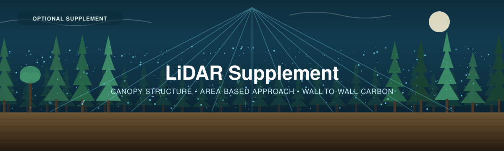

<p align="center">
  
</p>

---

[← 4 — Data Interpretation](../04_Data_Interpretation/) · [Back to main guide](../README.md)

---

# Part 5 — LiDAR Supplement *(optional)*

*Turning a few dozen field plots into a wall-to-wall carbon map.*

**Workflow repository:** [`CathalD/ForestScanWorkflow-LiDR-TreeTop-`](https://github.com/CathalD/ForestScanWorkflow-LiDR-TreeTop-)

---

## What this adds, and what it doesn't

Parts 1–4 give you a carbon estimate for your plots, scaled to your sites by area. That is a
**number with an interval**. What it is not is a **map** — it can't tell you *where* in the
block the carbon is.

LiDAR can, if you have it. The leverage is real:

> **A few dozen well-placed field plots can carry a carbon estimate across thousands of
> hectares.**

<table>
<tr>
<td width="55%">

The method is the **Area-Based Approach (ABA)**, and the logic is simple:

1. **LiDAR measures structure** — canopy height, cover, density. It cannot measure biomass.
2. **Field plots measure biomass** — via Part 3A, exactly as you already do it.
3. **ABA learns the relationship** between the two, on the plots where you have both.
4. It then **applies that relationship** everywhere the LiDAR covers.

```
field plots (AGB)  +  LiDAR metrics at those plots
        └──────── fit & validate model ────────┐
                                                ▼
        LiDAR metrics everywhere  ──►  AGB map  ──►  carbon map
```

</td>
<td width="45%">

> 📸 **[FIGURE NEEDED]** — the canopy height model for a block, with field plot locations
> overlaid and the resulting carbon map beside it.

</td>
</tr>
</table>

> [!IMPORTANT]
> **LiDAR without field plots is not carbon.** Canopy height, cover and density are *structure
> proxies*. They correlate with biomass; they are not biomass, and a height map is not a carbon
> map. If you have no plots, the pipeline still produces useful structure products — just don't
> label them carbon.

---

## Does this apply to you?

Four prerequisites. **If you don't have all four, stay with Parts 1–4** — the field estimate is
complete and defensible on its own.

| | Requirement | Notes |
|---|---|---|
| 1 | **Existing airborne LiDAR coverage** of your area | Many Canadian provinces publish open LiDAR. Commissioning a flight is a different budget conversation |
| 2 | **Roughly 30–50 field plots** | The rule is ≥10 plots per model predictor. Six plots cannot calibrate a model |
| 3 | **Sub-metre GNSS** on plot centres | Position error de-aligns plot and pixel, and adds noise you cannot model out |
| 4 | **R, and someone willing to run it** | The pipeline is `targets` + `lidR`. One command, but it is code |

---

## What changes in the field

This is the part to read **before** you finalise your sampling design in
[Part 2](../02_Project_Planning/), not after. ABA imposes plot requirements that ordinary carbon
sampling does not.

### Plot geometry is fixed

<table>
<tr>
<td width="55%">

| Decision | Requirement | Why |
|---|---|---|
| **Shape and size** | Circular, **400 m², radius 11.28 m** | ABA matches the plot footprint to the prediction pixel. A 20 m pixel is 400 m² |
| **Number** | ≥10 per model predictor — so ~30–50 minimum | Too few overfits, and cross-validation will expose it |
| **GNSS** | **Sub-metre** centre, same CRS as the LiDAR | Position error is unmodellable noise |
| **Placement** | Spread across the **full range of canopy height and density** | The model can only interpolate within the structure it has seen |

**The good news:** 400 m² circular at *r* = 11.28 m is already exactly what the
[Trees guide specifies](../03_Field_Methods/3A_Trees.md#1-lay-out-the-large-plot). If you laid
out circular plots, you are already compatible.

</td>
<td width="45%">

> 📸 **[FIGURE NEEDED]** — a 20 m prediction pixel with an 11.28 m radius circular plot
> inscribed, showing why the areas are matched.

</td>
</tr>
</table>

### The one genuine conflict with Part 2

> [!WARNING]
> **ABA wants plots spread across the structural range. Probability sampling wants them placed
> at random. These are not the same instruction, and you cannot fully satisfy both.**
>
> A random sample gives an unbiased estimate of the mean — that is the whole basis of
> [Part 2](../02_Project_Planning/). A structurally-stratified sample gives a better-calibrated
> model, because the model can only predict within the range of structure it was trained on.
>
> **How to handle it honestly:**
>
> - **Stratify on the canopy height model**, then sample **at random within each structural
>   stratum**. This is the standard resolution, and it keeps a probability basis while covering
>   the range.
> - Or run **two sets of plots**: a random set for the design-based estimate, and a
>   supplementary set in under-represented structure classes for calibration only.
> - What you must not do is **place plots subjectively** to get a nice regression and then report
>   the result as a probability-based estimate. It is one or the other.
>
> Use the pipeline's `chm_pitfree_smooth_1m.tif` or `forest_metrics_20m.tif` to see the
> structural range **before** going to the field.

### Timing: the LiDAR was flown on a different day than your survey

This is the issue most easily overlooked. The LiDAR "lift" has a date; your plots have a date.
Between them, trees grow, stands get harvested, and fires happen.

| Gap | What to do |
|---|---|
| **Under ~2 years** | Usually acceptable as-is. Record both dates |
| **2+ years** | Apply a **growth correction** to plot AGB, or drop the plot |
| **Disturbance between the two** | Drop the plot. A harvested plot measured pre-harvest teaches the model nonsense |

The workflow's default screen is `max_gap_years = 2`. Its
[`FIELD_GUIDE.md`](https://github.com/CathalD/ForestScanWorkflow-LiDR-TreeTop-/blob/main/FIELD_GUIDE.md)
covers the reconciliation in detail.

---

## The handoff: from this workshop to the pipeline

The pipeline needs one CSV. Everything in it comes from what you already collected:

```
plot_id, x, y, radius_m, agb_mgha, plot_date, notes
P001, 175120, 5432080, 11.28, 142.5, 2023-07-22, black spruce dominant
```

| Column | Where it comes from |
|---|---|
| `plot_id` | `1. Plot & Site Log` |
| `x`, `y` | Plot centre, **projected** to the LiDAR's CRS (UTM), not lat/long |
| `radius_m` | 11.28 |
| `agb_mgha` | **Above-ground biomass in Mg/ha** — see the conversion below |
| `plot_date` | `1. Plot & Site Log` |

### Converting the calculator's output to `agb_mgha`

> [!CAUTION]
> **ABA calibrates on above-ground biomass, not carbon, and not total biomass.** Three easy
> mistakes, each of which silently biases the whole map:
>
> 1. **Don't send carbon.** `3. Tree Data` column P is carbon (biomass × 0.5). ABA wants
>    **biomass**. Sending carbon halves every prediction.
> 2. **Don't include roots.** Use column **L, Above-ground biomass**, not column O, Total
>    biomass. LiDAR sees canopy; it cannot see roots, and including them puts an unmeasurable
>    quantity on the left-hand side of the model.
> 3. **Watch the units.** The sheet is kg per plot; ABA wants Mg per hectare.
>
> ```
> agb_mgha = (Σ column L for that plot, in kg) ÷ 400 m² × 10
> ```
>
> (kg/m² → Mg/ha is × 10.)

> 🛠 **[ASSET NEEDED]** — an export tab on the calculator that builds this CSV directly from the
> Plot & Site Log and Tree Data, so nobody has to do the conversion by hand. Given the three
> traps above, this should exist before the supplement is used in anger.

---

## What the pipeline produces

| Output | What it is |
|---|---|
| Digital terrain model | Bare-earth elevation under the canopy |
| **Canopy height model** | Height of vegetation above ground, everywhere |
| Forest structure metrics | Height, cover, density statistics on a grid |
| Individual tree locations and crowns | Stem map and crown polygons |
| **Biomass and carbon map** | Wall-to-wall, *with* cross-validated error — **only if you have plots** |

Tiles are processed seamlessly (each borrows a buffer from its neighbours, so there are no
edges) and every step is cached, so changing one part doesn't re-run everything.

```r
library(targets)
tar_make()                        # build structure products
source("aba_carbon_modelling.R")  # then the carbon model, once you have plots
```

---

## Reporting rules — non-negotiable

The workflow's own guide states these, and they are stricter than anything in Parts 1–4. Adopt
them.

- **Report total carbon with its cross-validated %RMSE.** A carbon number without an uncertainty
  is not usable for offsets or compliance.
- **State the temporal reconciliation** — the LiDAR lift date, the plot dates, any growth
  correction, and which plots were dropped.
- **Never transfer a model** to a different acquisition or forest type without recalibrating.
  ABA models are local to the lift and to the structure they saw.

> [!NOTE]
> **A note on attribution.** The workflow assembles established, peer-reviewed methods — chiefly
> the `lidR` package, its companion book, and the ABA method of White et al. (2013, 2017). The
> repository is the plumbing; the credit for the methods belongs to their authors.

---

## Where this fits

For a small team, the division of labour is the point:

| Who | Does what |
|---|---|
| **Field crew** | DBH, species, height and GNSS centres → plot AGB *(Parts 3A and 4)* |
| **LiDAR pipeline** | Tiles → seamless structure metrics across the block |
| **ABA script** | Marries the two → a carbon map with error bars |

The field effort that used to describe a handful of hectares now calibrates a wall-to-wall
estimate over the whole block.

---

## Open questions for this supplement

- ❓ **Is `TreeTop` part of this?** The workflow mentions a Shiny app that lets partners explore
  the canopy height model without writing code — useful for picking plot locations and for
  engagement. Confirm whether it ships here or links out.
- ❓ **Does this extend to Wetlands?** `lidR` handles peatland microtopography and shrub height,
  but ABA calibration against non-tree carbon is a much weaker link. Currently forest-only.
