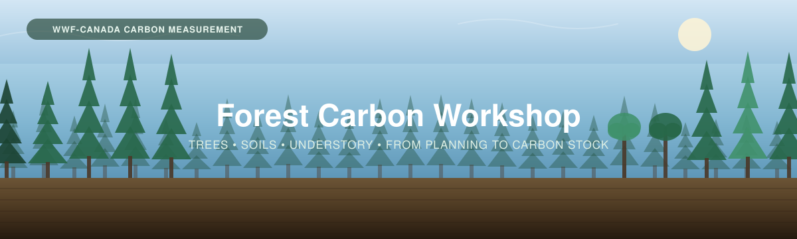

<p align="center">
  
</p>

# Forest Carbon Workshop

Materials from the **Forest Carbon Workshop** on measuring carbon stocks in forested
landscapes, from the background, through field methods, to analysis and reporting.

This workshop is organised in **four parts**, with an **optional fifth** for teams that have
LiDAR coverage. You can go in order, or jump to any section you wish.

---

## Contents

| # | Section | What it covers |
|---|---------|----------------|
| 1 | [**Background**](01_Background/) | What forest carbon is and why it matters; which pools hold it; the disturbance regimes that move it. |
| 2 | [**Project Planning**](02_Project_Planning/) | How many plots to establish and where: probability-based sampling, the nested plot design, and the sampling-design tools. Covers planning **tree plots**, **soil plots** and **understory plots** together. |
| 3 | [**Field Methods**](03_Field_Methods/) | Collecting the data: [measuring trees](03_Field_Methods/3A_Trees.md), [sampling soil](03_Field_Methods/3B_Soil.md), [surveying understory](03_Field_Methods/3C_Understory.md), and the datasheets and skill checklists that go with each. |
| 4 | [**Data Interpretation**](04_Data_Interpretation/) | Submitting samples to a lab, reading lab results, and turning field measurements into a carbon stock with an honest interval. |
| 5 | [**LiDAR Supplement**](05_LiDAR_Supplement/) *(optional)* | For areas with LiDAR coverage: scaling a handful of field plots to a wall-to-wall carbon map. |

### Useful links

- **WWF-Canada Carbon Measurement library** — [wwf.ca/carbon-measurement](https://wwf.ca/carbon-measurement/)
- **Measuring Carbon in Trees** — [PDF](03_Field_Methods/Trees-FINAL-Eng-2026.pdf)
- **Measuring Carbon in Non-Peat Soils** — [PDF](../_Shared/Non-peat-FINAL-Eng-2026.pdf)
- **Carbon Measurement: Sampling Design** — [PDF](../_Shared/Sampling-Design-Eng-2026.pdf)
- **Laboratory Analysis guide** — [PDF](../_Shared/Lab-Guide-Eng-2026.pdf)
- **Sampling design tools** — [source code](02_Project_Planning/Sampling%20Design%20Tools/)
- **NRCan biomass equations** — Lambert et al. (2005) · Ung et al. (2008), built into the [carbon calculator](04_Data_Interpretation/calculators/)

---

## Objectives

The goal of the workshop is to:

1. **Learn about forest carbon in Canada** — what it is, which pools hold it, and why it matters.
2. **Learn field methods for measuring it** — how to measure trees, sample soil, and survey understory.
3. **Turn measurements into outputs** — convert field data into carbon analyses to inform decision making.

### Skills checklists

Two printable checklists let a trainer sign off each skill in the field. Work through them
with your crew — the left box is "I have practised this", the right is "my trainer confirms".

- 🌲 [**Forest Carbon Measurements — In-Field Checklist**](03_Field_Methods/checklists/Forest_Carbon_Skill_Checklist.docx) — site selection, plot setup, tree ID, DBH and height, calculations.
- 🪨 [**Soil Carbon Sample Collection — In-Field Checklist**](03_Field_Methods/checklists/Soil_Carbon_Skill_Checklist.docx) — depth survey, site prep, three sampling methods, lab processing, scaling.

---

## How to think about this workshop

This is a *forest carbon* workshop: at its heart, it is about collecting the data needed to
quantify carbon in an ecosystem. The clearest way to see what a team needs to collect is to
start from the **data sheet** the analysis is built on, and work back from there. Each heading
on that sheet represents something real we measure in the forest — a diameter, a height, a
depth of soil, a weight, a carbon concentration — and once the sheet is complete, those
numbers let us calculate carbon stock, compare areas, and inform decisions.

The workshop therefore focuses on two things, in the order you'd do them:

1. **Making the data useful** — making sure that *before* you collect anything, the samples you
   plan to take will actually answer your team's questions and contribute to your organizational
   goals.

2. **Collecting the data** following best practices, in line with what the **data sheet** asks for.

These two phrases — *making the data useful* and *collecting the data* — come back throughout the
workshop as the names for these two jobs.

[**Section 2 — Project Planning**](02_Project_Planning/) is the **making the data useful**
component. [**Section 3 — Field Methods**](03_Field_Methods/) is the **collecting the data**
component. Done together, they ensure your samples are collected effectively and with best
practices. [**Section 4 — Data Interpretation**](04_Data_Interpretation/) then turns the
completed sheet into carbon estimates.

---

## What makes a forest different: more than one pool

The eelgrass workshop this one is built from measures a single carbon pool — sediment. A
forest holds its carbon in **several pools at once**, and they are measured in completely
different ways:

<table>
<tr>
<td width="55%">

| Pool | What it is | How it's measured |
|---|---|---|
| **Trees** | Stems over 2 m tall — wood, bark, branches, foliage, roots | Diameter and height, then **allometric equations** |
| **Soil** | Organic carbon in the mineral soil profile | **Cores or pits**, then bulk density × carbon content |
| **Understory** *(optional)* | Shrubs and ground vegetation under 2 m | Shrub **volume**, or **clip-and-weigh** |

</td>
<td width="45%">

> 📸 **[FIGURE NEEDED]** — the nested plot diagram from the protocol guides: large, medium
> and small plots overlapping at one plot centre, with the soil sampling point offset outside
> the vegetation plots.

</td>
</tr>
</table>

Because they overlap in the same place, the guides use a **nested plot design**: one plot
centre, with different-sized plots drawn around it for each pool.

| Plot | Size | What is measured in it |
|---|---|---|
| **Large** | 400 m² — circular *r* = 11.28 m, or 20 × 20 m, or 10 × 40 m | Trees over 2 m |
| **Medium** | 16 m² (4 × 4 m) or 100 m² (10 × 10 m) | Shrubs and small trees, 0.5–2 m |
| **Small** | 1 m² (1 × 1 m) or 0.25 m² (0.5 × 0.5 m) | Ground vegetation under 0.5 m |
| **Soil** | Cores or a pit, **offset outside the vegetation plots** | Soil carbon |

> [!IMPORTANT]
> **Order matters.** Soil sampling is *destructive* — it disturbs the ground and the plants
> growing on it. Complete **all vegetation surveys before any soil sampling**, and place soil
> cores outside the vegetation plots if the plots are permanent and will be re-measured.

---

## The data sheet we're building toward

Everything in Parts 3 and 4 feeds one workbook:

**👉 [`Forest_Carbon_Calculator.xlsx`](04_Data_Interpretation/calculators/Forest_Carbon_Calculator.xlsx)**
· a fully worked copy lives in [`Worked_Example/`](Worked_Example/).

| What the sheet captures | Filled in during | Covered in |
|---|---|---|
| Plot & site log (location, plot sizes, slope, GNSS) | the field | [Section 3](03_Field_Methods/) |
| Tree data (species, DBH, height) | the field | [3A — Trees](03_Field_Methods/3A_Trees.md) |
| Understory data (species, volume or clipped mass) | the field + lab | [3C — Understory](03_Field_Methods/3C_Understory.md) |
| Soil data (depths, coarse fragments) | the field | [3B — Soil](03_Field_Methods/3B_Soil.md) |
| Lab results (bulk density, %C or LOI) | after the lab | [Section 4](04_Data_Interpretation/) |
| Biomass, carbon stock, plot and site totals | calculated for you | [Section 4](04_Data_Interpretation/) |

Take some time to explore the workbook in both forms: a blank copy to fill in for your own
site, and a worked example with data already entered so you can follow along. The example data
is constructed for teaching — it is not from a real survey.

---

# TLDR

**Once the sheets are filled, how carbon stock is calculated**

Each pool takes a different route to the same unit — **kg C/m²** — and then they add up.

**Trees.** For each tree, four components are predicted from its diameter (and height, if you
measured it), summed to above-ground biomass, then roots are added and the total is halved:

```
AGB (kg)   = Σ over {wood, bark, branches, foliage} of  a × DBH^b × height^c
BGB (kg)   = root:shoot relationship applied to AGB
Carbon (kg) = (AGB + BGB) × 0.5
```

**Soil.** For each slice of a core, how much soil there is (bulk density) multiplied by how
much of it is carbon, over the thickness of the slice:

```
Carbon stock (kg C/m²) = bulk density (g/cm³) × (%C ÷ 100) × thickness (cm) × 10
```

**Understory.** Shrub volume through a published equation, or clipped vegetation dried and
weighed — then halved:

```
Carbon (kg) = biomass (kg) × 0.5
```

Bigger trees, deeper soil, denser soil and higher carbon concentration all mean more carbon
stored per square metre. The workbook does this arithmetic for every tree, plant and slice,
sums it per plot, and scales it to your site.

> [!NOTE]
> **Why 0.5?** Plant biomass and soil organic matter are both roughly **50% carbon by
> weight**, which is the convention both protocol guides use. It is a convention, not a
> measurement — Part 4 covers when it is worth measuring carbon directly instead.
>
> To report in **CO₂ equivalents** rather than carbon, multiply by **3.67**.

---

## Some resources to find in this workshop

- [`Forest_Carbon_Calculator.xlsx`](04_Data_Interpretation/calculators/) — the calculator, with Lambert/Ung allometric coefficients built in.
- [`Tree-Survey-Datasheet.docx`](03_Field_Methods/datasheets/Tree-Survey-Datasheet.docx) — the printable tree field sheet.
- [`Soil-Carbon-Data-Sheet.docx`](03_Field_Methods/datasheets/Soil-Carbon-Data-Sheet.docx) — the printable soil field sheet.
- [Skill checklists](03_Field_Methods/checklists/) — trainer sign-off sheets for both pools.
- [Sampling design tools](02_Project_Planning/Sampling%20Design%20Tools/) — the Google Earth Engine sampling tool and the prior-scoping script.
- **Measuring Carbon in Trees** and **Non-Peat Soils** — the two protocol guides this workshop follows.

---

*Part of the [Terrestrial Carbon Workshops](../) series — Forests · Grasslands · Wetlands.*
