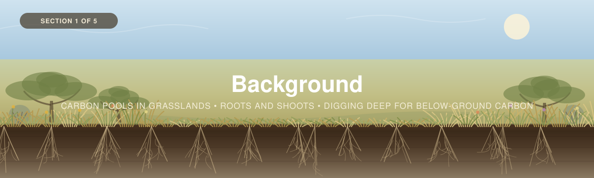

<p align="center">
  
</p>
(For Claude Change banner subtitle "Carbon pools in grasslands - Roots and shoots - Digging deep for below ground carbon"

And change the background image so there are more plants above the place where there are also roots, right now there are a bunch of roots from no plants")
---

[← Back to main guide](../README.md) · Next: [2 — Project Planning →](../02_Project_Planning/)

---

# Part 1 — Background

*Intro to grassland carbon in Canada, and why almost none of it is in a visual line of sight.*

**Quick links:** [Measuring Carbon in Vegetation (Non-Tree)](../../_Shared/Vegetation-FINAL-Eng-2026.pdf) · [Measuring Carbon in Non-Peat Soils](../../_Shared/Non-peat-FINAL-Eng-2026.pdf) · [Laboratory Analysis](../../_Shared/Lab-Guide-Eng-2026.pdf)

---

## What is grassland carbon?

**Grassland carbon** is the organic carbon held within a grassland at a point in time. The carbon is in its soil, in the living and
dead roots threading through that soil, and in the shoots, forbs and shrubs above it.

In each pool, the carbon derived from photosynthesis. What differs is **where the carbon
goes afterwards**, and it differs in two ways that together define this workshop:

1. **Native grasses especially put a large share of what they fix into roots**

(For claude insert this image - )
and this - 

Here is another image - 


2. **Those roots** input organic matter directly into the soil
   at depth, throughout the entire soil profile

The result is a soil carbon store built from the inside out.

There are two words that describe soil carbon proccesses that you will see throughout, these are:

1. **Sequestration** — the *process*: plants pulling CO₂ from the atmosphere. A **rate**, per year.
2. **Storage** — the *amount* held now. A **stock**, at a point in time.

Parts 2 to 4 measure **storage**. [Part 5](../05_Monitoring/) is about measuring it over time,
which is how you get at change.

> 📸 **[SLIDE NEEDED]** — a grassland carbon-cycle diagram: atmosphere, shoots, roots, soil, with
> the root→soil pathway drawn thick, because that is the distinguishing feature.

Image here - 

Here is another good article to pick and choose from as well - https://www.sciencedirect.com/science/article/pii/S0341816224005459?via%3Dihub

Actually I've pasted the full PDF, this should be a go to source for carbon measurment and planning in grasslands: Grasslands/1-s2.0-S0341816224005459-main.pdf

---

## Where the carbon actually is

<table>
<tr>
<td width="55%">

Carbon within grasslands exist in three "pools":

| Pool | Share of the total | How fast it changes |
|---|---|---|
| **Soil** | The majority | Slowly, decades to centuries |
| **Roots** | Small share of total carbon, but **most of the living biomass** | Fast, much of it turns over yearly |
| **Shoots** | Smallest | **Within a single season** |

The soil-dominance is not surprising — it is true in forests too. What *is* distinctive is the
second row.

More photo - 


and here - 

With this article attached - https://www.nature.com/articles/s43247-024-01795-9


**In a grassland, root biomass commonly exceeds shoot biomass several times over.** That is the
reverse of a forest, where roots are a fraction of above-ground mass. A crew measuring only what
they can see is measuring the smallest of three pools, and the least of the living biomass.

</td>
<td width="45%">

> 📸 **[FIGURE NEEDED]** — the three pools on one axis. The visual point is that the bar you can
> see from standing height is the smallest one.

> 📊 **[FIGURES NEEDED]** — this section is deliberately written without numbers, because the
> numbers should come from a citable Canadian source rather than from memory. Wanted:
> the **root:shoot relationship** for Canadian grassland with a range; **grassland soil carbon**
> per unit area for the prairie, savannah and interior BC cases; and the **area of remaining
> native grassland** in Canada. Logged in [`TODO.md`](../TODO.md).

</td>
</tr>
</table>

---

## Roots, not shoots — and we measure them

### The inversion

The [Forests workshop](../../Forests/) predicts below-ground tree biomass from above-ground
biomass using published **root:shoot ratios** — because you cannot dig up a 30 m spruce, and the
ratio for trees is both small and reasonably well constrained.

**Grassland inverts both halves of that.** The ratio is large rather than small, and far more
variable — it shifts with species, grazing, drought, soil texture and season. Applying someone
else's ratio to your site multiplies your largest biomass pool by a number that was measured
somewhere else, under conditions you cannot check.

### So this workshop measures roots instead

> **When you core the soil, the roots are already in your hand.** Separating them from the soil
> and weighing them is a **measurement**. A ratio is an estimate of a measurement.

Grassland is the ecosystem where this is actually practical. The roots are concentrated shallowly
enough to recover from a standard soil core, and the equipment is a sieve and a drying oven
rather than anything exotic.

**What it costs you:** root washing is **labour-intensive**. A forty-sample campaign is days of
lab work, not hours. That is a real trade and the workshop says so plainly in
[Part 2](../02_Project_Planning/) rather than letting a team discover it in February.

**What it buys you:** a below-ground number that is yours, defensible, and specific to the
management you are actually studying — which is usually the whole point of the project.

### ⚠ The double-counting trap

This is the central design issue of the workshop, and it is easy to walk into.

<table>
<tr>
<td width="55%">

**Soil carbon analysis conventionally removes visible roots** — but fine roots inevitably stay in
the sample. So a standard soil carbon measurement **already includes** fine-root carbon.

If you then add separately-measured root carbon on top, **you have counted the same carbon
twice.** It is structurally identical to the *Sphagnum* trap in
[Wetlands Part 3B](../../Wetlands/03_Field_Methods/3B_Vegetation.md): two methods reaching into
the same material without a boundary between them.

</td>
<td width="45%">

```
   ░░░  shoots (clipped)          ┐ ABOVE GROUND
   ────────────────────────────── ┤ ← the clip line
   ▓▓▓  coarse roots  > 2 mm      │
   ▓▓▓  fine roots   ≤ 2 mm       │ ROOTS — sieved out
   ────────────────────────────── ┤ ← the sieve mesh
   ███  root-free soil            │ SOIL — analysed after
   ███                            ┘
```

</td>
</tr>
</table>

> [!IMPORTANT]
> **The rule: sieve first, analyse root-free soil, report root carbon separately — and state the
> mesh.**
>
> The alternative is equally defensible: **accept fine roots as part of the soil pool** and report
> only coarse roots separately. Both are honest. The calculator supports either through a
> `ROOTS_REMOVED_BEFORE_SOIL_C` switch.
>
> **Being silent about which you did is the only wrong answer** — and it is the default outcome if
> nobody decides in advance. Decide it in [Part 2](../02_Project_Planning/), not at the lab bench.

### Fine and coarse roots

The conventional split is **≤ 2 mm = fine, > 2 mm = coarse**, and it is near-universal.

It is also **functionally arbitrary** — a 2 mm cutoff lumps together absorptive roots that live
weeks and transport roots that live years. Some root ecologists argue for classifying by branching
order instead. This workshop keeps the diameter convention because it is what a field crew can
apply consistently with a sieve, while noting that it is a convention rather than a biological
boundary.

Why the split matters for carbon at all:

| | **Fine roots (≤ 2 mm)** | **Coarse roots (> 2 mm)** |
|---|---|---|
| **Turnover** | Fast — much of it annual | Slow |
| **Where the carbon goes** | Straight into soil organic matter | Stays as biomass for years |
| **Recovery from a core** | **Poor** — the finest pass through the sieve and are lost | Good |
| **Double-counting risk** | **High** — this is the fraction that stays in a soil sample | Low |

> 📚 **[REFERENCES NEEDED]** — the root-methods literature to cite for sieving, live/dead
> separation and the fine/coarse argument. Candidates are listed in [`TODO.md`](../TODO.md);
> none could be retrieved in this session, so **nothing here is cited to a specific source yet**
> and every claim above is stated at a level the method itself supports.

---

## A standing crop is not a stock

The second place a grassland workshop can mislead, and it is a subtle one.

<table>
<tr>
<td width="55%">

**Soil carbon** is a stock. It accumulated over centuries and it will still be there next year.

**Herbaceous above-ground biomass is a standing crop.** It grows from nothing each spring,
peaks, senesces, and is gone — grazed, decomposed or burned. Measure it in May and again in
August and you will get numbers that differ several-fold, with **nothing having changed about the
site**.

Putting those two numbers in the same column and adding them implies a comparability that does
not exist.

</td>
<td width="45%">

> [!WARNING]
> **What to do about it:**
>
> - **Sample at peak growing season.** The
>   [Vegetation guide](../../_Shared/Vegetation-FINAL-Eng-2026.pdf) says so; the reason is that
>   peak is the only phenological point that is *repeatable* between sites and years.
> - **Record the date**, always. A clip-and-weigh without a date is uninterpretable.
> - **Report shoot biomass separately** from soil carbon, never buried inside a total.
> - **Never compare** a spring harvest with a late-summer one.

</td>
</tr>
</table>

**The same caution applies more weakly to roots.** Root biomass also varies seasonally, though
less violently than shoots. Record the date for roots too.

---

## Four grasslands, and what changes between them

Canada's grasslands are not one ecosystem. The differences run: **water and fire → vegetation →
soil → what you have to measure and correct for.**

| | 🌾 **Prairie** | 🌳 **Aspen parkland** | 🌰 **Black Oak savannah** | 🏜 **Interior BC** |
|---|---|---|---|---|
| **Where** | Prairie ecozone — mixed-grass, fescue | Prairie–boreal transition | Southern Ontario, sand plains | Southern interior — Okanagan, Thompson |
| **Moisture** | Sub-humid to semi-arid | Sub-humid | Sub-humid, but **droughty sandy soils** | **Semi-arid** |
| **Fire** | Historically frequent | Frequent — maintains the grassland | **Essential** — the system closes to forest without it | Infrequent |
| **Tree cover** | Effectively none | Aspen groves in a matrix | **Scattered open-grown oaks** | None to scattered |
| **Soils** | Deep, dark, carbon-rich | Variable; transitional | **Sandy, lower carbon** | **Shallow, often to bedrock; coarse fragments** |
| **Dominant management** | **Grazing**; conversion to cropland | Grazing; clearing | **Fire management**; encroachment | Grazing; invasion |
| **What this changes** | The baseline case | Shrub plot matters more | **Tree protocol applies.** Fire history is a stratum | **Coarse-fragment correction is mandatory.** Shallow-soil method |

### What each type demands of you

- **Prairie** — the reference case the rest of the workshop is written against. Stratify on
  **grazing and management** before anything else, and distinguish **native** from **tame or
  seeded** pasture: they differ in rooting depth, and therefore in where the carbon is.
- **Aspen parkland** — the shrub/medium plot carries more weight. Where aspen cover is high enough
  you are working at the boundary with the [Forests workshop](../../Forests/); say which side you
  chose and why.
- **Black Oak savannah** — trees are part of the system by definition, so
  [Forests Part 3A](../../Forests/03_Field_Methods/3A_Trees.md) applies. **Fire history is a
  stratification variable**, not context: a recently burned unit and a long-unburned one are
  different populations. Sandy soils also mean lower carbon per unit volume and a different
  bulk-density range than prairie.
- **Interior BC** — the one where the standard method breaks without adjustment. **Coarse
  fragments are common**, and the correction for them
  ([Forests Part 3B](../../Forests/03_Field_Methods/3B_Soil.md)) stops being optional. Soils are
  often **shallow to bedrock**, so a fixed 30 cm core may not exist — the shallow-soil method
  applies, and "depth to refusal" becomes a recorded variable rather than an assumption.

> [!NOTE]
> **Pick your type on the plot log and stay consistent.** The calculator's `1. Plot & Site Log`
> has a `Grassland type` field for exactly this. It drives nothing automatically — it is there so
> that when your interval comes out wide, you can post-stratify on it.

> 📸 **[FIGURE NEEDED]** — the four types side by side, with a soil profile under each showing
> how differently the carbon is distributed.

---

## 30 cm is a floor, not an answer

<table>
<tr>
<td width="55%">

This workshop reports **30 cm as a minimum depth**. That is the IPCC default and what most
grassland literature uses, so it is what makes your number comparable to anyone else's.

**It is not where the carbon stops.** Native grassland roots reach **metres** down, and they build
soil carbon the whole way. A 30 cm figure is a **lower bound on what is actually there**.

**So: the deeper you sample, the more accurate your estimate becomes.** Report deeper increments
alongside the 30 cm figure wherever you can reach them — the same core, the same trip, one extra
set of lab samples.

</td>
<td width="45%">

> [!IMPORTANT]
> **The shortfall is largest where the grassland is most intact.** Cultivated and tame pasture
> soils have shallower, disturbed root systems; **native grassland** has the deep systems that a
> 30 cm core misses most of.
>
> Which means the bias runs in an awkward direction: **shallow sampling systematically
> understates exactly the sites most worth protecting.**

</td>
</tr>
</table>

> [!WARNING]
> **This applies doubly to your root measurement.** If roots reach metres and your core stops at
> 30 cm, measured root biomass is a floor in the same way — and a more severe one, because root
> mass declines with depth more slowly than most people expect.
>
> The calculator flags any root total whose deepest increment is simply **the bottom of the
> core**. That is a **minimum**, not a total, and it should be reported as one.

*The [Wetlands workshop](../../Wetlands/01_Background/) makes the same argument about peat. The
series says one consistent thing about depth: **shallow sampling is a budget decision, not a
scientific one — so report it as one.***

---

## Disturbance: what takes the carbon back out

Grassland carbon is old, deep and slow to rebuild. Most of the ways it leaves are fast.

| Disturbance | What it does | Timescale |
|---|---|---|
| **Conversion to cropland** | Tillage breaks aggregates and exposes protected organic matter; the deep perennial root system is replaced by a shallow annual one | **Years to decades.** The single largest loss pathway |
| **Overgrazing** | Reduces root allocation and shoot cover; compacts the surface; can shift composition to shallower-rooted species | Decades |
| **Well-managed grazing** | Can maintain or build carbon. **Grazing is not inherently a loss** — intensity, timing and rest determine the sign | Decades |
| **Fire suppression** *(savannah, parkland)* | The system closes to woodland. Carbon may rise above ground while the grassland — and its species — are lost | Decades |
| **Fire** | Removes standing biomass; soil carbon is largely protected below the surface in a moist grassland | Immediate above ground, small below |
| **Drought** | Reduces production and can shift allocation. Repeated drought changes composition | Years, compounding |
| **Invasion** *(notably interior BC)* | Shallow-rooted invasives replace deep-rooted natives — a loss of **deep** carbon input that a surface survey will not see | Decades |

Two consequences for how you work:

1. **Record management history for every site.** Grazed, ungrazed, seeded, cultivated, burned and
   when. Two sites with identical carbon today can be on opposite trajectories, and a stock with
   no management context cannot tell them apart.
2. **Fire suppression is a carbon *and* a biodiversity question, and they point different ways.**
   A savannah closing to woodland may be gaining above-ground carbon while losing the ecosystem.
   Say both. A carbon number presented without that context will be read as endorsement.

---

## So how do you measure grassland carbon?

Short chain, and every step has a page:

1. **Stratify on management.** Grazing, fire, cultivation, native vs seeded — before anything
   else. → [Part 2](../02_Project_Planning/)
2. **Core the soil**, to 30 cm at minimum and deeper where you can.
   → [Part 3A](../03_Field_Methods/3A_Soil.md)
3. **Separate the roots** from the soil sample, by diameter class and depth.
   → [Part 3A](../03_Field_Methods/3A_Soil.md)
4. **Clip the standing vegetation at peak season**, and measure shrubs where present.
   → [Part 3B](../03_Field_Methods/3B_Vegetation.md)
5. **Measure the trees** if canopy cover warrants it.
   → [Forests Part 3A](../../Forests/03_Field_Methods/3A_Trees.md)
6. **Multiply up and add an interval**, and say what you left out.
   → [Part 4](../04_Data_Interpretation/)
7. **Optionally, come back and do it again.** → [Part 5](../05_Monitoring/)

> [!TIP]
> **Step 7 changes steps 1 and 2.** Detecting *change* in soil carbon is a harder statistical
> problem than estimating a stock once, and it needs decisions made up front — permanent plots you
> can relocate, and enough of them. If monitoring is anywhere in your objectives, read
> [Part 5](../05_Monitoring/) **before** you finalise Part 2.

---

## Know your region before you plan

The four types above are a starting frame, not a substitute for local knowledge. Rooting depth,
soil texture, coarse-fragment content and the grazing regime all vary within each of them.

> 🔗 **[REGIONAL PROTOCOL NEEDED]** — the Forests workshop pairs with a regional protocol
> ([Southern Ontario – St. Lawrence](../../Forests/01_Background/SO-StLawrence-Eng-2026.pdf)).
> **No grassland equivalent is in this folder.** If one exists in the series it belongs here.

Two things to establish before writing a sampling plan, whatever the region:

- **How deep can you actually core?** Interior BC sites may hit bedrock at 20 cm; prairie sites may
  take you to a metre without complaint. This sets your reporting depth, and it is an afternoon
  with a probe and an auger.
- **What is the management history, and who knows it?** Usually the landholder. That conversation
  is part of the sampling design, not a courtesy.

---

## In the next section

We'll move to **Project Planning**: stratifying on management rather than vegetation, sizing the
campaign separately for soil and for roots — they need different numbers of cores — and deciding
the questions that cannot be answered after the field season.

---

## In this section

- `images/` — section banners.

> ✍️ **[SLIDE DECK NEEDED]** — the workshop presentation for Part 1, as `.pptx` and `.pdf`.
> 🔗 **[VIDEO NEEDED]** — the WWF vegetation video playlist URL.

---

[← Back to main guide](../README.md) · Next: [2 — Project Planning →](../02_Project_Planning/)
