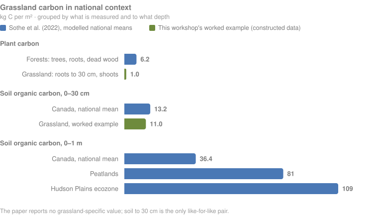
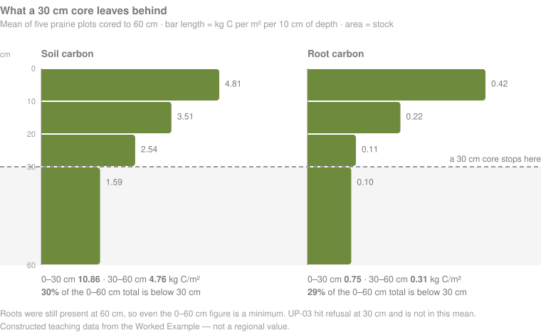

  

---

[← Back to main guide](../README.md) · Next: [2 — Project Planning →](../02_Project_Planning/)

---

# Part 1 — Background

*What ecosystem carbon is, where it sits in a grassland, and how it is measured.*

**Quick links:** 🧩 **[Workshop Presentation Slides — placeholder]** · [Measuring Carbon in Vegetation (Non-Tree)](../../_Shared/Vegetation-FINAL-Eng-2026.pdf) · [Measuring Carbon in Non-Peat Soils](../../_Shared/Non-peat-FINAL-Eng-2026.pdf) · [Laboratory Analysis](../../_Shared/Lab-Guide-Eng-2026.pdf)

> 🧩 **[PLACEHOLDER — SLIDE DECK]** Add the Part 1 `.pptx` and `.pdf` links here after the files are uploaded.

---

## What is ecosystem carbon?

Carbon is the element living things are built from, and its movement among the land, ocean, and atmosphere is one of the processes that shapes Earth's climate.

<table>
<tr>
<td width="58%">

</td>
<td width="42%">

Carbon is both a **building block of life** and a **key part of the Earth's climate system**.

</td>
</tr>
<tr>
<td width="58%">

</td>
<td width="42%">

When we talk about **ecosystem carbon**, we mean the carbon stored in the living and dead material and soils of an ecosystem at a defined time.

This workshop focuses on the pools that can be measured consistently in grasslands: soil, roots, shoots, shrubs, and trees where they occur.

</td>
</tr>
<tr>
<td width="58%">

> 🧩 **[PLACEHOLDER — SLIDE IMAGE]** Carbon cycle slide from the Part 1 deck.

</td>
<td width="42%">

Projects measure carbon for different reasons: to establish a baseline, compare management or restoration treatments, document change, or support a wider ecological assessment.

In [Part 2 — Project Planning](../02_Project_Planning/), the sampling design is aligned with those project and community goals.

</td>
</tr>
</table>

### Two words you will see throughout

**Sequestration** is a **process and rate**: carbon entering an ecosystem over time, commonly reported per year.

**Storage** is an **amount or stock**: carbon held in an ecosystem at a defined time.

Parts 2–4 focus on measuring **stocks**. [Part 5 — Monitoring](../05_Monitoring/) compares measurements over time to estimate change. A change in stock can inform—but is not automatically identical to—a sequestration rate unless the design accounts for the relevant inputs, outputs, and time interval.

---

## Grasslands and their carbon pools

Grassland carbon is distributed among the soil, and plant roots and shoots. This includes any forbs, shrubs, standing dead material, litter, and sometimes trees.

<table>
<tr>
<td width="58%">

</td>
<td width="42%">

**Grassland carbon stock** is the organic carbon held in the ecosystem at a point in time, including carbon in soil, living and dead roots, and above-ground vegetation.

</td>
</tr>
</table>

  
  &nbsp;&nbsp;
  

Many grassland plants allocate a substantial share of production below ground, and in many grasslands below-ground living biomass exceeds the shoots visible above ground. A crew that measures only above-ground vegetation therefore measures only part of the living biomass, and a small part of the ecosystem carbon this workshop considers.

Root amount and distribution vary among species, sites, seasons, and management histories, so a single root:shoot ratio should not be treated as universal.

### Where the carbon is, and why

  

Plants take up carbon dioxide and use it to build shoots and roots. Carbon reaches the soil by two routes: litter from the surface, and roots, which place living biomass and organic inputs directly through the profile. Decomposers transform both. Some carbon returns to the atmosphere; some remains in living organisms, particulate material, mineral-associated organic matter, and other soil fractions. Microbial products and remains can make an important contribution to the part that persists, and how much is retained depends on climate, soil properties, vegetation, disturbance, management, and time.

Because roots deliver carbon below the surface, a shallow sample can miss part of the distribution. That is why actual rooting depth matters when the project chooses sampling depths — see [How deep should the project sample?](#how-deep-should-the-project-sample).

  

| Pool | Role in this workshop | How quickly it may vary |
|---|---|---|
| **Soil** | Usually the largest measured stock | Often changes slowly relative to seasonal biomass, but rates vary by depth, site, and disturbance. |
| **Roots** | A smaller carbon pool but potentially a large share of living biomass | Can vary seasonally and spatially. |
| **Shoots** | A standing crop measured at the sampling date | Can change within a season through growth, senescence, grazing, mowing, or fire. |

To put these numbers in context, [Sothe et al. (2022)](https://doi.org/10.1029/2021GB007213) mapped organic carbon in plants and soils across Canada at 250 m. They report no grassland-specific value, so each bar below is grouped by what was measured and to what depth. Soil to 30 cm is the one like-for-like comparison.

  

What the national maps show:

- **Soil holds most of Canada's terrestrial carbon.** Soils store about 306 Pg C in the top metre, roughly 14 times the 21 Pg C in all plants, living and dead.
- **Forests hold far more carbon in plants than grasslands do.** Forest trees, roots, and dead wood average about 6.2 kg C/m². In the worked-example grassland, roots and shoots together hold about 1. In a grassland, nearly all the carbon is in the soil.
- **Peatlands are the hotspot.** They cover about 12% of Canada but hold about a third of the top-metre soil carbon (98 of 306 Pg C), averaging 81 kg C/m² against 36.4 nationally. The Hudson Plains average about 109.
- **A 30 cm sample misses most of it.** The top 30 cm holds about 36% of the carbon in the first metre, and the second metre adds another 266 Pg C. The authors conclude that estimates limited to 30 cm seriously underestimate soil carbon.
- **These are modelled means with wide uncertainty.** The 90% interval on the 306 Pg C is ±147 Pg C, and it is widest where stocks are largest. The worked-example soil (11.0 kg C/m² to 30 cm) is within one standard deviation of the national mean (13.2 ± 10), but it is constructed data, not a measurement.
- **They are organic carbon only.** The study in the next section reports total carbon, which includes carbonate. Keep the two apart.

### Differences in carbon stock relate to grassland type and stewardship

A carbon stock reflects the plant community growing on it, and a change in that community can move it. [Maxwell et al. (2024)](https://www.nature.com/articles/s43247-024-01795-9) measured this in sagebrush steppe in Idaho, USA, where exotic annual grasses such as cheatgrass (*Bromus tectorum*) and the wildfires they promote have converted deep-rooted perennial shrubland to annual grassland. They sampled all four combinations of burned or unburned and invaded or uninvaded land, to 1 m depth.

<table>
<tr>
<td width="55%">

</td>
<td width="45%">

**Carbon varies within a site**

Each site is a mosaic of microsites: under shrubs, under perennial bunchgrasses, under annual grasses, and bare soil. Before sampling, the authors predicted carbon would rank shrub > bunchgrass > annual grass > bare soil. They sampled each microsite and weighted its stock by how much of the site it covered.

Where cores land matters. Treating microsites as strata, weighted by their area, is the same idea as the stratified design in [Part 2](../02_Project_Planning/).

</td>
</tr>
<tr>
<td width="55%">

</td>
<td width="45%">

**Invasion and fire roughly halved soil carbon**

Invaded land had 55% less above-ground biomass and burned land 93% less. Both held about half the soil carbon of intact shrubland: a loss of 42–49% from about 11.3 kg C/m² (113 Mg C/ha) to 1 m. Burning and invasion together lost about the same as either alone, so the authors propose soil carbon had fallen to a "floor".

Above-ground biomass did not predict soil carbon. Fire removed almost all of the biomass but about the same share of soil carbon as invasion did. Measure the soil; do not infer it from the vegetation.

</td>
</tr>
<tr>
<td width="55%">

</td>
<td width="45%">

**Tipping into a different state**

Each cup is an ecosystem state, shown with its soil carbon and how stable that carbon is. The height of the hill between cups is how severe a disturbance, or how intensive a restoration, it takes to move from one state to another. Green arrows mark transitions where natural recovery is likely; red arrows mark those where it is not, and where intervention matters most.

Returning a burned and invaded site to high-carbon shrubland takes more than returning an invaded but unburned one. The authors conclude that protecting intact perennial communities may be more achievable than building new soil carbon.

</td>
</tr>
</table>

Figures 1, 2 and 4 from Maxwell, T.M., Quicke, H.E., Price, S.J. & Germino, M.J. (2024). Annual grass invasions and wildfire deplete ecosystem carbon storage by >50% to resistant base levels. *Communications Earth & Environment* 5, 669. [doi:10.1038/s43247-024-01795-9](https://www.nature.com/articles/s43247-024-01795-9). Licensed under [CC BY 4.0](https://creativecommons.org/licenses/by/4.0/).

> 🧩 **[PERMISSION CHECK]** Fig. 4's credit line reads "This original image was made for exclusive use by the authors by Mason Otis." The article's licence excludes third-party material that a credit line marks otherwise, so confirm Fig. 4 may be reused (corresponding author: M. J. Germino, USGS) or redraw the concept for the workshop.

> [!IMPORTANT]
> **What transfers to a Canadian grassland project, and what does not**
> - **Most of the difference was deep.** Two-thirds of the soil carbon lay between 40 cm and 1 m, and invasion and fire changed deep carbon more than surface carbon. A 30 cm core would have missed much of the effect. See [How deep should the project sample?](#how-deep-should-the-project-sample)
> - **These are total-carbon stocks.** The lab measured total carbon without separating organic from inorganic (carbonate) carbon, and the authors expect deep dryland carbon to be mostly inorganic. Compare these numbers only with other total-carbon figures, not with soil *organic* carbon.
> - **The setting is US cold-desert sagebrush steppe**, with 253–377 mm of precipitation a year. The mechanisms transfer: plant community change reaching deep soil carbon, and thresholds that make some losses hard to reverse. The percentages are not Canadian values.

The ball-and-cup picture treats a carbon stock as the outcome of inputs, losses, and disturbance over time. The next section turns that into curves: a stock building toward equilibrium, a single disturbance knocking it back, and overlapping disturbances tipping it into a lower state, the same move as the ball crossing into a new cup.

---

## Carbon accumulation and equilibrium

Carbon stocks change through the balance of inputs and outputs. Plants add carbon through production and transfers to the soil. Respiration, decomposition, erosion, harvest, fire, and other processes can remove or redistribute it.

As a simplified teaching model, an ecosystem may approach a relatively stable long-term stock when average inputs and outputs become similar. This is an **equilibrium concept**, not a claim that the ecosystem stops changing. **Net ecosystem carbon balance** describes the net change over a defined period and system boundary.

The graphs below preserve the accumulation sequence used in the workshop presentation: carbon entering the ecosystem in green, carbon leaving in red, and the resulting stock or balance in black.

<table>
<tr>
<td width="60%">

</td>
<td width="40%">

A simplified baseline curve. As annual inputs and losses approach one another, the stored amount levels toward the dashed equilibrium line.

</td>
</tr>
<tr>
<td width="60%">

</td>
<td width="40%">

The same teaching model with a disturbance that causes a carbon loss followed by recovery.

</td>
</tr>
<tr>
<td width="60%">

</td>
<td width="40%">

Overlapping disturbances can prevent recovery and move the ecosystem toward a lower carbon state.

**Pulse disturbances** act abruptly. **Press disturbances** act continuously or repeatedly over longer periods. Some real disturbances contain both components.

</td>
</tr>
</table>

### Disturbance in grasslands

The direction and size of a carbon response depend on ecosystem, soil, climate, intensity, duration, recovery, and the carbon pool being measured. Use the table as a set of hypotheses to test—not as a universal ranking.

| Disturbance or management change | Pulse/press framing | Potential pathway | Timescale to consider |
|---|---|---|---|
| **Conversion to cropland** | Initial pulse plus ongoing press | Breaking perennial cover, disturbing aggregates, changing plant inputs and depth distribution. | Years to decades. |
| **Heavy or poorly timed grazing** | Press or repeated pulses | Reduced cover or root inputs, compaction, erosion, and composition change. | Seasons to decades. |
| **Managed grazing** | Press with variable direction | Outcomes depend on intensity, timing, recovery, climate, and starting condition. | Years to decades. |
| **Fire** | Pulse within a fire regime | Removes above-ground material rapidly; below-ground effects depend on severity, frequency, and site. | Immediate to decades. |
| **Fire exclusion in savannah/parkland** | Press | Woody encroachment changes above- and below-ground pools while altering the grassland ecosystem. | Decades. |
| **Drought** | Pulse or repeated/long-term press | Reduces production and can shift allocation and species composition. | Seasons to decades. |
| **Invasion** | Press | Changes species traits, rooting patterns, litter, and disturbance interactions. | Years to decades. |

> 📚 **[REFERENCES NEEDED]** Add grassland- and region-specific sources for every disturbance pathway and timescale before presenting this table as evidence. Avoid unsupported claims such as a single “largest” loss pathway across all grasslands.

---

## Interactive: Ecosystem Carbon Accumulation Visualizer

Explore how the simplified inputs, losses, disturbance, and recovery assumptions affect stored carbon over time:

**👉 [cathald.github.io/CarbonAccumulationVisualizer](https://cathald.github.io/CarbonAccumulationVisualizer/)**

Use the visualizer to ask:

- What changes when a disturbance is brief versus sustained?
- How does recovery rate affect the time required to return toward the earlier stock?
- What happens when pulse and press disturbances overlap?
- Which parts of the graph represent assumptions rather than field measurements?

> [!NOTE]
> The visualizer is a conceptual teaching tool, not a calibrated prediction for a specific grassland. Record the assumptions used in any workshop exercise.

---

## What is soil carbon—and how deep does it go?

Soil organic carbon is carbon in organic compounds found in living organisms, residues, microbial products, and stabilized soil organic matter. A soil carbon **stock** combines carbon concentration with the amount of soil in a defined area and depth or equivalent mass.

Unlike a single sediment layer accumulating from above, grassland soil receives inputs both at the surface and throughout the rooting profile. That makes the selected sampling depth and bulk-density method part of the definition of the reported stock.

### How deep should the project sample?

<table>
<tr>
<td width="55%">

The current workshop recommendation is to sample the **full accessible profile** to parent material or refusal, then calculate standard reporting windows from the same profile.

Fixed windows such as **0–30 cm** and **0–1 m** are useful for comparison with studies or inventories that use them, but they should be identified as reporting windows rather than assumed to contain the complete grassland stock.

Bulk density matters because the same depth can contain different masses of soil. Repeated comparisons may require an **equivalent soil mass** approach so that like masses—not only like depths—are compared.

</td>
<td width="45%">

The equivalent-soil-mass concept is developed in [Part 5 — Monitoring](../05_Monitoring/#step-4--equivalent-soil-mass). A core intended for that comparison generally needs material below the reporting depth so the reference mass can be matched.

</td>
</tr>
</table>

  

In the workshop's worked example, a 30 cm core would have missed **about 30% of the soil carbon and 29% of the root carbon** that a 60 cm core recovered. Root carbon per 10 cm barely falls between 20–30 cm (0.11 kg C/m²) and 30–60 cm (0.10). Roots were still present at 60 cm, so even the deeper figure is a minimum.

| Increment | Soil C (kg C/m²) | Root C (kg C/m²) |
|---|---:|---:|
| 0–10 cm | 4.81 | 0.42 |
| 10–20 cm | 3.51 | 0.22 |
| 20–30 cm | 2.54 | 0.11 |
| **0–30 cm** | **10.86** | **0.75** |
| 30–60 cm | 4.76 | 0.31 |
| **Share below 30 cm** | **30%** | **29%** |

*Mean of the five prairie plots cored to 60 cm; UP-03 hit refusal at 30 cm and is excluded. Constructed teaching data from the [Worked Example](../Worked_Example/), not a regional value.*

> 📚 **[METHOD REVIEW NEEDED]** Confirm the full-profile recommendation, reporting depths, and equivalent-soil-mass workflow against the final soil guide, calculator, and cited grassland literature.

---

## So how do you measure grassland carbon?

Grassland carbon measurement combines vegetation measurements with soil samples of known area or volume and laboratory analyses. The exact set of pools depends on the project question.

### Three ways to collect a defined soil sample

<table>
<tr>
<td width="58%">

</td>
<td width="42%">

**1 · Coring** — a tube collects a column with known internal area and measured depth. It supports depth control and may collect roots with the soil.

**2 · Soil pits and rings** — a pit exposes the profile and known-volume rings sample selected depths or horizons. It is slower and more destructive but useful where coring is unsuitable.

**3 · Known-area excavation** — a frame defines an area excavated to bedrock or another boundary. It may be useful in very shallow soils but requires careful control of volume and losses.

</td>
</tr>
</table>

All three require an explicit bulk-volume or sampled-area calculation, actual depths, and a documented treatment of coarse fragments and roots. The field procedures are developed in [Part 3 — Field Methods](../03_Field_Methods/#3-collect-the-soil-and-root-core).

### The project workflow

| # | Step | Where |
|---|---|---|
| 1 | Define the question, boundary, strata, pools, precision, and sample count. | [Part 2 — Project Planning](../02_Project_Planning/) |
| 2 | Set up plots and measure vegetation before destructive work. | [Part 3 — Field Methods](../03_Field_Methods/#2-measure-the-vegetation) |
| 3 | Collect soil/root samples to the selected depths and record known volumes. | [Part 3 — Field Methods](../03_Field_Methods/#3-collect-the-soil-and-root-core) |
| 4 | Section, label, preserve, and submit samples using a documented laboratory method. | [Part 3 — Field Methods](../03_Field_Methods/#4-section-bag-and-label-the-core) |
| 5 | Calculate pool-specific stocks, uncertainty, and exclusions. | [Part 4 — Data Interpretation](../04_Data_Interpretation/) |
| 6 | Repeat with a monitoring design when the objective is change through time. | [Part 5 — Monitoring](../05_Monitoring/) |

> [!TIP]
> Monitoring changes the design before the first field visit. Permanent plots, relocation, destructive-sample offsets, equivalent-soil-mass requirements, and the number of plots must be planned in advance. If monitoring is an objective, read [Part 5](../05_Monitoring/) before finalizing Part 2.

### Know your region before you plan

Establish two things early:

- **How deep can the team sample with the proposed method?** A short pilot with a probe, corer, or auger can reveal shallow bedrock, stones, compaction, or very deep profiles.
- **What is the management history, and who can document it?** Landholders, managers, Indigenous knowledge holders, restoration staff, and project records may hold different parts of that history. Follow the project's consent, attribution, and data-governance requirements.

> 🔗 **[REGIONAL PROTOCOL NEEDED]** Add the relevant grassland regional protocol here when one is available. The Forests workshop's Southern Ontario–St. Lawrence protocol is not a grassland substitute.

---

## In the next section

**Part 2 — Project Planning** turns the project question into a sampling plan. It defines the study area and strata, selects carbon pools and depths, sets precision targets, estimates how many samples are needed, and generates the locations the field team will visit.

**Next: [Part 2 — Project Planning →](../02_Project_Planning/)**

---

## In this section

- `images/banner_background.svg` — section banner.
- The existing slide images embedded throughout this page — retained beside their original concepts.
- `images/carbon_pools.svg` — teaching-data comparison of soil, root, and shoot pools, soil and roots both to 30 cm.
- `images/ecosystem_carbon_comparison.svg` — worked-example grassland beside national means from Sothe et al. (2022), grouped by pool and depth.
- `images/soil_profile_vs_30cm.svg` — teaching-data depth profile showing what a 30 cm core leaves behind.
- `images/accumulation_baseline.gif` — baseline accumulation animation.
- `images/accumulation_pulse.gif` — disturbance-and-recovery animation.
- `images/accumulation_collapse.gif` — overlapping-disturbance animation.
- [`_references/`](../_references/) — papers cited by the workshop.

> 🧩 **[PLACEHOLDER — SLIDE DECK]** Add the completed Part 1 `.pptx` and `.pdf` here after upload.
>
> 🔗 **[PLACEHOLDER — VIDEO]** Add the WWF vegetation video playlist when its URL is confirmed.

---

[← Back to main guide](../README.md) · Next: [2 — Project Planning →](../02_Project_Planning/)
