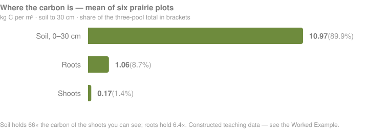
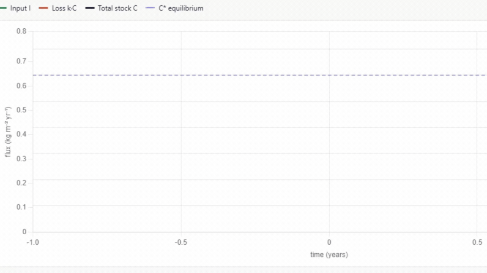
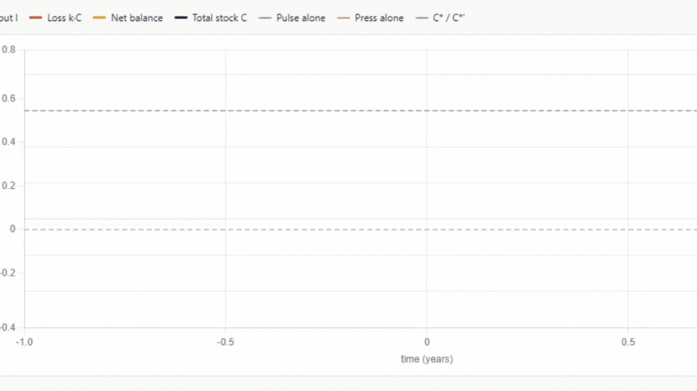

  

---

[← Back to main guide](../README.md) · Next: [2 — Project Planning →](../02_Project_Planning/)

---

# Part 1 — Background

*What ecosystem carbon is, where it sits in a grassland, and how it is measured.*

**Quick links:** [Measuring Carbon in Vegetation (Non-Tree)](../../_Shared/Vegetation-FINAL-Eng-2026.pdf) · [Measuring Carbon in Non-Peat Soils](../../_Shared/Non-peat-FINAL-Eng-2026.pdf) · [Laboratory Analysis](../../_Shared/Lab-Guide-Eng-2026.pdf)

| # | Section |
|---|---|
| 1 | [What is ecosystem carbon?](#1--what-is-ecosystem-carbon) |
| 2 | [What is grassland carbon?](#2--what-is-grassland-carbon) |
| 3 | [Where the carbon is, and why](#3--where-the-carbon-is-and-why) |
| 4 | [How carbon is measured](#4--how-carbon-is-measured) |
| 5 | [How deep to sample](#5--how-deep-to-sample) |
| 6 | [A standing crop is not a stock](#6--a-standing-crop-is-not-a-stock) |
| 7 | [Carbon accumulation and disturbance](#7--carbon-accumulation-and-disturbance) |
| 8 | [The measurement, step by step](#8--the-measurement-step-by-step) |

---

## 1 · What is ecosystem carbon?

Carbon is the element living things are built from, and its movement between the land, the ocean
and the atmosphere is what sets the Earth's climate.

<table>
<tr>
<td width="58%">

</td>
<td width="42%">

Carbon is both the **building block of life** and a **key regulator of the Earth's climate
system**.

</td>
</tr>
<tr>
<td width="58%">

</td>
<td width="42%">

When we talk about **ecosystem carbon** specifically, we mean the total amount of carbon stored in
the **plants and soils** of an ecosystem.

</td>
</tr>
<tr>
<td width="58%">

</td>
<td width="42%">

There are many reasons to measure carbon, depending on your project and community goals. In
[Part 2 — Project Planning](../02_Project_Planning/) we work towards aligning your carbon
measurement project with those goals.

</td>
</tr>
</table>

### Two words you will see throughout

**Sequestration** is the *process* — plants pulling CO₂ from the atmosphere. It is a **rate**,
measured per year.

**Storage** is the *amount* held now. It is a **stock**, measured at a point in time.

Parts 2 to 4 measure **storage**. [Part 5](../05_Monitoring/) is about measuring it over time,
which is how you get at change.

---

## 2 · What is grassland carbon?

<table>
<tr>
<td width="58%">

</td>
<td width="42%">

**Grassland carbon** is the organic carbon held in a grassland at a point in time, including in the
soil, in the living and dead roots threading through it, and in the shoots, forbs and shrubs above.

</td>
</tr>
<tr>
<td width="58%">

</td>
<td width="42%">

Native grasses especially put a large share of what they fix into **roots**.

</td>
</tr>
<tr>
<td width="58%">

</td>
<td width="42%">

Those roots input organic matter directly into the soil **at depth**, throughout the whole profile,
rather than dropping it on the surface and letting it work down.

The result is a soil carbon store built from the inside out.

</td>
</tr>
</table>

---

## 3 · Where the carbon is, and why

<table>
<tr>
<td width="50%">

</td>
<td width="50%">

</td>
</tr>
</table>

A simplified picture of how carbon moves through a grassland: the plants absorb CO₂ from the
atmosphere and use it to grow shoots above and roots below. Those plant remains are then broken
down by **soil microbes**. Some of that carbon returns to the atmosphere; the rest stays, and a
large share of what stays is the microbes' own remains — **microbial necromass**, which is a major
building block of stable soil organic matter. So the soil helps feed the plants, and the plants in
turn feed the soil.

In a grassland, root biomass commonly exceeds shoot biomass several times over — the reverse of a
forest, where roots are a fraction of above-ground mass.

A crew measuring only what they can see is measuring the smallest of three pools, and the least of
the living biomass.

See also [*Global patterns of grassland carbon*](https://www.nature.com/articles/s43247-024-01795-9)
(Communications Earth & Environment, 2024).

<table>
<tr>
<td width="55%">

</td>
<td width="45%">

Carbon in a grassland sits in three **pools**, and they are very unequal. The chart below is the
mean of the six prairie plots in this workshop's [worked example](../Worked_Example/): the soil
holds about **66 times** the carbon of the shoots you can see.

Soil dominance is not surprising — it is true in forests too. What is distinctive is the middle
row: roots are a small share of total carbon but **most of the living biomass**.

</td>
</tr>
</table>

  

| Pool | Share of total | How fast it changes |
|---|---|---|
| **Soil** | The majority | Slowly — decades to centuries |
| **Roots** | Small share of carbon, but **most of the living biomass** | Fast — much turns over yearly |
| **Shoots** | Smallest | **Within a single season** |

> 📊 **[REFERENCE NEEDED]** — a citable Canadian figure and range for the root:shoot relationship,
> to replace "several times over" with a published number. The chart above is this workshop's own
> constructed teaching data, not a literature value. Logged in [`TODO.md`](../TODO.md).

---

## 4 · How carbon is measured

Vegetation is clipped, weighed and dried. Soil carbon needs a sample of known **volume**, and there
are three ways to get one.

<table>
<tr>
<td width="58%">

</td>
<td width="42%">

**1 · Coring** — a tube driven into the ground, recovering an intact column. The usual choice:
clean depth control, a known volume, and the roots come up with the soil.

**2 · Soil pits** — a pit dug to expose the profile face, sampled horizon by horizon with a ring.
Slower and more destructive, but it works where a corer will not go, and you can see the horizons.

**3 · Dig and fill** — a frame of known area excavated to bedrock, then the hole refilled. The
option for very thin soils, where there is no column to core.

</td>
</tr>
</table>

All three are covered step by step in [Part 3 — Field Methods](../03_Field_Methods/#3-collect-the-soil-and-root-core).

---

## 5 · How deep to sample

<table>
<tr>
<td width="55%">

**Sample the whole profile** — from the surface down to the parent material, or to refusal. Not a
fixed 30 cm window.

A fixed depth does not hold a fixed *mass* of soil. As bulk density changes, a 30 cm window holds a
different amount of material from one survey to the next, so you are not comparing like with like.
The error also runs the wrong way: a disturbance that **compacts** the top 30 cm raises bulk
density there and so **raises the apparent stock**, at the same time as it releases carbon from the
profile as a whole.

**30 cm and 1 m are reporting conventions** — IPCC defaults and what most of the literature uses,
so they are how your site gets compared with another. Report them alongside the full profile, not
instead of it.

</td>
<td width="45%">

> 📸 **[IMAGE / SLIDE]** — a full soil profile beside a 30 cm core, showing how much sits below the
> conventional reporting depth.

The correction for the bulk-density problem is **equivalent soil mass** — comparing a fixed *mass*
of soil rather than a fixed depth. It is worked through on a real profile in
[Part 5, Step 4](../05_Monitoring/#step-4--equivalent-soil-mass), and it is why cores have to go
deeper than your reporting depth: the reference mass usually sits below 30 cm.

</td>
</tr>
</table>

---

## 6 · A standing crop is not a stock

<table>
<tr>
<td width="55%">

**Soil carbon is a stock.** It accumulated over centuries and will still be there next year.

**Herbaceous above-ground biomass is a standing crop.** It grows from nothing each spring, peaks,
senesces and is gone. Measure it in May and again in August and the numbers differ several-fold
with **nothing having changed about the site**.

Adding the two in one column implies a comparability that does not exist.

</td>
<td width="45%">

> [!WARNING]
> - **Sample at peak growing season.** The
>   [Vegetation guide](../../_Shared/Vegetation-FINAL-Eng-2026.pdf) says so, because peak is the
>   only phenological point that is *repeatable* between sites and years.
> - **Record the date**, always. A clip-and-weigh without a date is uninterpretable.
> - **Report shoot biomass separately**, never buried inside a total.
> - **Never compare** a spring harvest with a late-summer one.
>
> Root biomass varies seasonally too, though less violently. Record the date for roots as well.

</td>
</tr>
</table>

---

## 7 · Carbon accumulation and disturbance

Carbon entering an ecosystem is countered by decomposition and by material carried out of it. The
more that accumulates, the more is lost each year, until the two converge and the ecosystem reaches
a balance — its **carbon equilibrium state**, or **net ecosystem carbon balance**.

We can show this as a graph: carbon entering the ecosystem (green), carbon lost (red), and the net
balance of the two (black).

<table>
<tr>
<td width="60%">

</td>
<td width="40%">

A baseline ecosystem carbon curve. As sequestration (carbon in) and loss (carbon out) converge, the
amount stored levels off at a peak, or equilibrium — the dashed line.

</td>
</tr>
<tr>
<td width="60%">

</td>
<td width="40%">

The same ecosystem, with a disturbance that causes a loss of carbon and then a recovery.

</td>
</tr>
<tr>
<td width="60%">

</td>
<td width="40%">

Where multiple overlapping disturbances occur, the ecosystem can keep degrading, becoming a net
emitter and losing the carbon it had stored.

**Pulse** disturbances, such as fire or breaking sod, hit abruptly. **Press** disturbances, such as
sustained heavy grazing or an invasion, act slowly over long periods. Acting together, they can
collapse the ecosystem.

</td>
</tr>
</table>

**👉 Explore it interactively:** [cathald.github.io/CarbonAccumulationVisualizer](https://cathald.github.io/CarbonAccumulationVisualizer/)

### Disturbances in grasslands

Grassland carbon is old, deep and slow to rebuild. Most of the ways it leaves are fast.

| Disturbance | Pulse or press | What it does | Timescale |
|---|---|---|---|
| **Conversion to cropland** | **Pulse, then press** | Breaking sod is the pulse; continued cultivation is the press. Tillage breaks aggregates and exposes protected organic matter, and a deep perennial root system is replaced by a shallow annual one | **Years to decades.** The single largest loss pathway |
| **Overgrazing** | **Press** | Reduces root allocation and cover, compacts the surface, can shift composition to shallower-rooted species | Decades |
| **Well-managed grazing** | **Press** | Can maintain or build carbon. **Grazing is not inherently a loss** — intensity, timing and rest determine the sign | Decades |
| **Fire** | **Pulse** | Removes standing biomass; soil carbon is largely protected below the surface | Immediate above ground, small below |
| **Fire suppression** *(savannah, parkland)* | **Press** | The system closes to woodland. Carbon may rise above ground while the grassland is lost | Decades |
| **Drought** | **Pulse**, becoming **press** | One dry year reduces production; repeated drought shifts allocation and composition | Years, compounding |
| **Invasion** | **Press** | Shallow-rooted invasives replace deep-rooted natives — a loss of **deep** carbon input a surface survey will not see | Decades |

---

## 8 · The measurement, step by step

| # | Step | Where |
|---|---|---|
| 1 | **Divide the site into meaningfully distinct areas** — restoration age, management, history | [Part 2](../02_Project_Planning/#step-2--stratify-your-site) |
| 2 | **Core the soil**, full profile to refusal, in increments | [Part 3](../03_Field_Methods/#3-collect-the-soil-and-root-core) |
| 3 | **Separate the roots** from the soil sample, by diameter class and depth | [Part 3](../03_Field_Methods/#5-separate-the-roots-and-finish-the-records) |
| 4 | **Clip the standing vegetation at peak season**, and measure shrubs 0.5–2 m | [Part 3](../03_Field_Methods/#2-measure-the-vegetation) |
| 5 | **Measure any tree over 2 m** | [Forests Part 3A](../../Forests/03_Field_Methods/3A_Trees.md) |
| 6 | **Multiply up, add an interval**, and say what you left out | [Part 4](../04_Data_Interpretation/) |
| 7 | **Optionally, come back and do it again** | [Part 5](../05_Monitoring/) |

> [!TIP]
> **Step 7 changes steps 1 and 2.** Detecting *change* is a harder statistical problem than
> estimating a stock once, and it needs decisions made up front — permanent plots you can relocate,
> and enough of them. If monitoring is anywhere in your objectives, read
> [Part 5](../05_Monitoring/) **before** you finalise Part 2.

### Know your region before you plan

Two things to establish before writing a sampling plan:

- **How deep can you actually core?** Interior BC sites may hit bedrock at 20 cm; prairie sites may
  take you to a metre. An afternoon with a probe and an auger settles it.
- **What is the management history, and who knows it?** Usually the landholder. That conversation
  is part of the sampling design, not a courtesy.

> 🔗 **[REGIONAL PROTOCOL NEEDED]** — the Forests workshop pairs with a regional protocol
> ([Southern Ontario – St. Lawrence](../../Forests/01_Background/SO-StLawrence-Eng-2026.pdf)).
> No grassland equivalent is in this folder. If one exists in the series it belongs here.

---

## In the next section

**Project Planning** — setting the precision threshold that decides how many cores you need,
dividing the site into meaningfully distinct areas, and the decisions that cannot be made after the
field season.

---

## In this section

- `images/` — section banners, the carbon-pool chart, and the accumulation animations.
- [`_references/`](../_references/) — papers cited by this workshop.

> ✍️ **[SLIDE DECK NEEDED]** — the workshop presentation for Part 1, as `.pptx` and `.pdf`.
> 🔗 **[VIDEO NEEDED]** — the WWF vegetation video playlist URL.

---

[← Back to main guide](../README.md) · Next: [2 — Project Planning →](../02_Project_Planning/)
