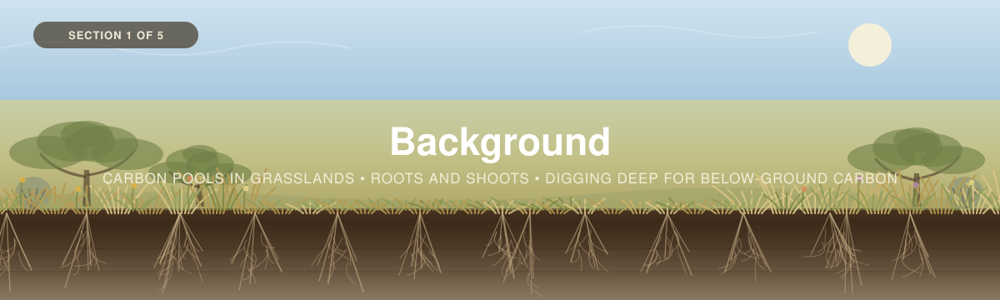
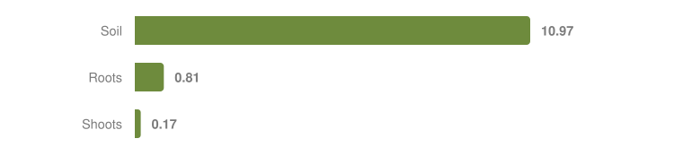
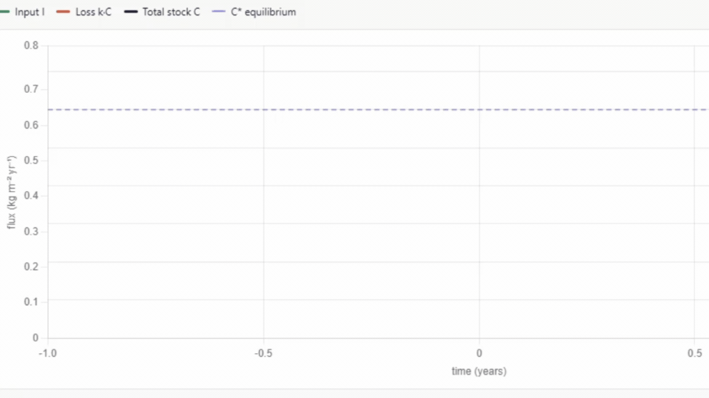
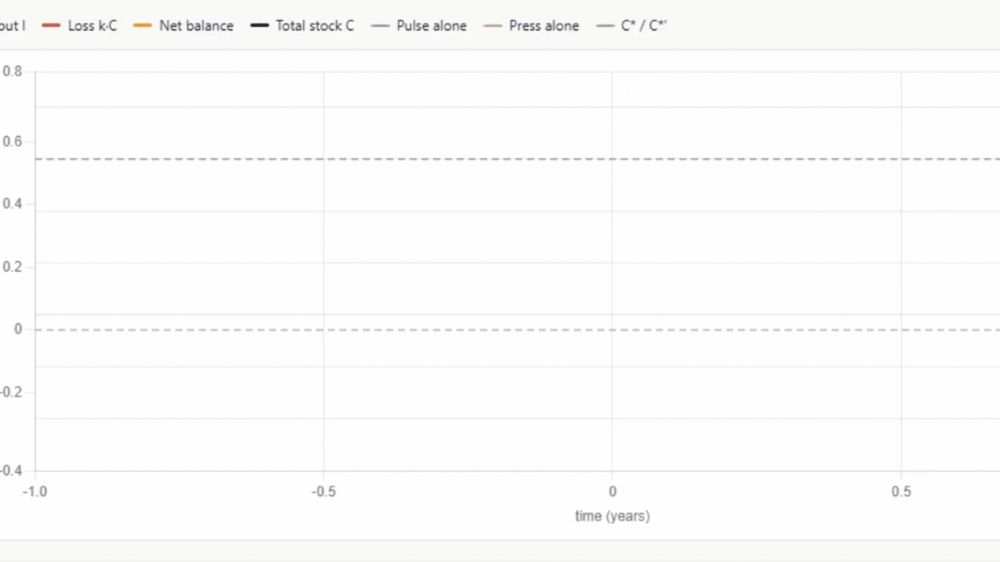
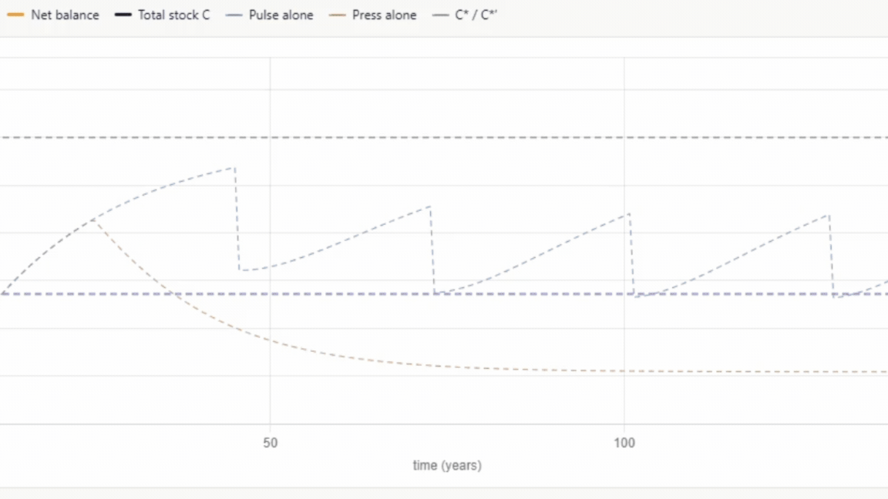

  

---

[← Back to main guide](../README.md) · Next: [2 — Project Planning →](../02_Project_Planning/)

---

# Part 1 — Background

*What ecosystem carbon is, how it cycles in grasslands, and how it is measured.*

**Quick links:** 🧩 For Claude - link to ppt here - Grasslands/CarbonPPT_Grasslands_Generic.pdf ** · [Measuring Carbon in Vegetation (Non-Tree)](../../_Shared/Vegetation-FINAL-Eng-2026.pdf) · [Measuring Carbon in Non-Peat Soils](../../_Shared/Non-peat-FINAL-Eng-2026.pdf) · [Laboratory Analysis](../../_Shared/Lab-Guide-Eng-2026.pdf)

> 🧩 **[PLACEHOLDER — SLIDE DECK]** Add the Part 1 `.pptx` and `.pdf` links here after the files are uploaded.

---

## What is ecosystem carbon?

Carbon is the element living things are built from, and its movement among the land, ocean, and atmosphere is one of the processes that shapes Earth's climate.

<table>
<tr>
<td width="58%">

</td>
<td width="42%">

Carbon is both a **building block of life** and a **key part of the Earth's climate system**.

</td>
</tr>
<tr>
<td width="58%">

</td>
<td width="42%">

When we talk about **ecosystem carbon**, we mean the carbon stored in the living and dead material and soils of an ecosystem at a defined time.

This workshop focuses on the pools that can be measured consistently in grasslands: soil, roots, shoots, shrubs, and trees where they occur.

</td>
</tr>
<tr>
<td width="58%">

</td>
<td width="42%">

Projects measure carbon for different reasons: to establish a baseline, compare management or restoration treatments, document change, or support a wider ecological assessment.

In [Part 2 — Project Planning](../02_Project_Planning/), the sampling design is aligned with those project and community goals.

</td>
</tr>
</table>

### Two words you will see throughout

**Sequestration** is a **process and rate**: carbon entering an ecosystem over time, commonly reported per year.

**Storage** is an **amount or stock**: carbon held in an ecosystem at a defined time.

Parts 2–4 focus on measuring **stocks**. [Part 5 — Monitoring](../05_Monitoring/) compares measurements over time to estimate change.

---

## Grasslands and their carbon pools

Grassland carbon is distributed among the soil, and plant roots and shoots. This includes any forbs, shrubs, standing dead material, litter, and sometimes trees.

<table>
<tr>
<td width="58%">

</td>
<td width="42%">

**Grassland carbon stock** is the organic carbon held in the ecosystem at a point in time, including carbon in soil, living and dead roots, and above-ground vegetation.

</td>
</tr>
</table>

  
  &nbsp;&nbsp;
  

Many grassland plants allocate a substantial share of production below ground, and in many grasslands below-ground living biomass exceeds the shoots visible above ground. A carbon project that measures only above-ground vegetation therefore measures only part of the living biomass, and a small part of the ecosystem carbon this workshop considers.

Root amount and distribution vary among species, sites, seasons, and management histories.

### Where the carbon is, and why

(For Claude - Can you add this image to a 1 by 1 table with the text below on the right and the image on tehe left)

  

Plants take up carbon dioxide from the atmosphere through photosynthesis and use it to build its shoots and roots. Carbon reaches the soil through litter from the surface, and roots, which deposit organic inputs directly into the soil. Decomposers transform this organic material in multiple ways; some carbon returns to the atmosphere via repsiration; some remains in living organisms, particulate material, mineral-associated organic matter, and other soil fractions. Microbial products and remains can make an important contribution to the part that persists, and how much is retained depends on climate, soil properties, vegetation, disturbance, management, and time.

Because roots deliver carbon below the surface, a shallow sample can miss part of the distribution. That is why actual rooting depth matters when the project chooses sampling depths — see [How deep should the project sample?](#how-deep-should-the-project-sample).

  

| Pool | Role in this workshop | How quickly it may vary |
|---|---|---|
| **Soil** | Usually the largest measured stock | Often changes slowly relative to seasonal biomass, but rates vary by depth, site, and disturbance. |
| **Roots** | A smaller carbon pool but potentially a large share of living biomass | Can vary seasonally and spatially. |
| **Shoots** | A standing crop measured at the sampling date | Can change within a season through growth, senescence, grazing, mowing, or fire. |

(For claude - Edit this section below as a drop down menu for "Extra info"
### Differences in carbon stock relate to grassland type and stewardship

A carbon stock reflects the plant community growing on it,. [Maxwell et al. (2024)](https://www.nature.com/articles/s43247-024-01795-9) measured annual grasses and the wildfires they promote. They sampled all four combinations of burned or unburned and invaded or uninvaded land, to 1 m depth, the findings show:

<table>
<tr>
<td width="55%">

</td>
<td width="45%">

**Carbon varies within a site**

Each site is a mosaic of microsites: under shrubs, under perennial bunchgrasses, under annual grasses, and bare soil. Before sampling, the authors predicted carbon would rank shrub > bunchgrass > annual grass > bare soil. They sampled each microsite and weighted its stock by how much of the site it covered.

Where cores land matters. Treating microsites as strata, weighted by their area, is the same idea as the stratified design in [Part 2](../02_Project_Planning/).

</td>
</tr>
<tr>
<td width="55%">

</td>
<td width="45%">

**Invasion and fire roughly halved soil carbon**

Invaded land had 55% less above-ground biomass and burned land 93% less. Both held about half the soil carbon of intact shrubland: a loss of 42–49% from about 11.3 kg C/m² (113 Mg C/ha) to 1 m. Burning and invasion together lost about the same as either alone, so the authors propose soil carbon had fallen to a "floor".

Above-ground biomass did not predict soil carbon. Fire removed almost all of the biomass but about the same share of soil carbon as invasion did. Measure the soil; do not infer it from the vegetation.

</td>
</tr>
<tr>
<td width="55%">

</td>
<td width="45%">

**Tipping into a different state**

Each cup is an ecosystem state, shown with its soil carbon and how stable that carbon is. The height of the hill between cups is how severe a disturbance, or how intensive a restoration, it takes to move from one state to another. Green arrows mark transitions where natural recovery is likely; red arrows mark those where it is not, and where intervention matters most.

Returning a burned and invaded site to high-carbon shrubland takes more than returning an invaded but unburned one. The authors conclude that protecting intact perennial communities may be more achievable than building new soil carbon.

</td>
</tr>
</table>

Figures 1, 2 and 4 from Maxwell, T.M., Quicke, H.E., Price, S.J. & Germino, M.J. (2024). Annual grass invasions and wildfire deplete ecosystem carbon storage by >50% to resistant base levels. *Communications Earth & Environment* 5, 669. [doi:10.1038/s43247-024-01795-9](https://www.nature.com/articles/s43247-024-01795-9). Licensed under [CC BY 4.0](https://creativecommons.org/licenses/by/4.0/).

---

## Carbon accumulation and equilibrium

Carbon stocks change through the balance of inputs and outputs. Plants add carbon through production and transfers to the soil. Respiration, decomposition, erosion, fire, and other processes can remove or redistribute it.

As a simplified model, an ecosystem may approach a relatively stable long-term stock when average inputs and outputs become similar, called the ecosystems **carbon equilibrium**. In addition, we can say the **Net ecosystem carbon balance** describes the net change over a defined period and system boundary.

The graphs below preserve the accumulation sequence used in the workshop presentation: carbon entering the ecosystem in green, carbon leaving in red, and the resulting stock or balance in black.

<table>
<tr>
<td width="60%">

</td>
<td width="40%">

A simplified baseline curve. As annual inputs and losses approach one another, the stored amount levels toward the dashed equilibrium line, signalling the ecosystem has reached in **Net ecosystem carbon balance**

</td>
</tr>
<tr>
<td width="60%">

</td>
<td width="40%">

The same teaching model with a disturbance that causes a carbon loss followed by recovery, a sign of a healthy or **resilient ecosystem**

</td>
</tr>
<tr>
<td width="60%">

</td>
<td width="40%">

Overlapping disturbances can prevent recovery and move the ecosystem toward a lower carbon state.

**Pulse disturbances** are forces that act abruptly. **Press disturbances** act continuously or repeatedly over longer periods. These can overlap, often referred to as **Multiple Stressors** or **Cumulative effects**,  

</td>
</tr>
</table>

Disturbance is a natural and essential component of many Canadian ecosystems and is not inherently negative. In grasslands, for example, periodic disturbances such as fire, grazing, drought, and flooding have historically shaped ecosystem structure and function. Similarly, many forest species have evolved adaptations to recurring disturbances, including serotinous species whose seeds are released in response to fire. The frequency and intensity of disturbance events influence ecosystem health, biodiversity, and long-term resilience, and many species are adapted to specific disturbance regimes.

Carbon dynamics provide a useful indicator of these responses, as changes in carbon storage, sequestration, and fluxes can reveal how ecosystems are affected by disturbance and subsequent recovery. Monitoring carbon responses can therefore help identify environmental stressors, assess ecosystem resilience, and evaluate whether ecosystems are maintaining their capacity to recover and function under changing disturbance regimes.

---

## Interactive: Ecosystem Carbon Accumulation Visualizer

Explore how the simplified inputs, losses, disturbance, and recovery assumptions affect stored carbon over time:

**👉 [cathald.github.io/CarbonAccumulationVisualizer](https://cathald.github.io/CarbonAccumulationVisualizer/)**

Use the visualizer to ask:

- What changes when a disturbance is brief versus sustained?
- How does recovery rate affect the time required to return toward the earlier stock?
- What happens when pulse and press disturbances overlap?
- Which parts of the graph represent assumptions rather than field measurements?

> [!NOTE]
> The visualizer is a conceptual teaching tool, not a calibrated prediction for a specific grassland. Record the assumptions used in any workshop exercise.

---

## So how do you measure grassland carbon?

For each of the carbon pools (Above ground vegetation, below-ground-vegetation, and soil, we weill collect samples, which are small portions of the ecosystem that we will use to characterize the larger ecosystem

Samples are collected in **Plots**, which we will see in Section 3 - vary in size directly related to the size of the vegetation we are collecting.

### Vegetation

### Three ways to collect a defined soil sample

<table>
<tr>
<td width="58%">

</td>
<td width="42%">

**1 · Coring** — a tube collects a column with known internal area and measured depth. It supports depth control and may collect roots with the soil.

**2 · Soil pits and rings** — a pit exposes the profile and known-volume rings sample selected depths or horizons. It is slower and more destructive but useful where coring is unsuitable.

**3 · Known-area excavation** — a frame defines an area excavated to bedrock or another boundary. It may be useful in very shallow soils but requires careful control of volume and losses.

</td>
</tr>
</table>

All three require an explicit bulk-volume or sampled-area calculation, actual depths, and a documented treatment of coarse fragments and roots. The field procedures are developed in [Part 3 — Field Methods](../03_Field_Methods/#3-collect-soil).

### The project workflow

| # | Step | Where |
|---|---|---|
| 1 | Define the question, boundary, strata, pools, precision, and sample count. | [Part 2 — Project Planning](../02_Project_Planning/) |
| 2 | Set up plots and measure vegetation before destructive work. | [Part 3 — Field Methods](../03_Field_Methods/#2-measure-vegetation) |
| 3 | Collect soil/root samples to the selected depths and record known volumes. | [Part 3 — Field Methods](../03_Field_Methods/#3-collect-soil) |
| 4 | Section, label, preserve, and submit samples using a documented laboratory method. | [Part 3 — Field Methods](../03_Field_Methods/#4-label-cool-and-reconcile-samples) |
| 5 | Calculate pool-specific stocks, uncertainty, and exclusions. | [Part 4 — Data Interpretation](../04_Data_Interpretation/) |
| 6 | Repeat with a monitoring design when the objective is change through time. | [Part 5 — Monitoring](../05_Monitoring/) |

> [!TIP]
> Monitoring changes the design before the first field visit. Permanent plots, relocation, destructive-sample offsets, equivalent-soil-mass requirements, and the number of plots must be planned in advance. If monitoring is an objective, read [Part 5](../05_Monitoring/) before finalizing Part 2.

---

## In the next section

**Part 2 — Project Planning** turns the project question into a sampling plan. It defines the study area and strata, selects carbon pools and depths, sets precision targets, estimates how many samples are needed, and generates the locations the field team will visit.

**Next: [Part 2 — Project Planning →](../02_Project_Planning/)**

---

## In this section

- `images/banner_background.svg` — section banner.
- The existing slide images embedded throughout this page — retained beside their original concepts.
- `images/carbon_pools.svg` — teaching-data comparison of soil, root, and shoot pools, soil and roots both to 30 cm.
- `images/ecosystem_carbon_comparison.svg` — worked-example grassland beside national means from Sothe et al. (2022), grouped by pool and depth.
- `images/soil_profile_vs_30cm.svg` — teaching-data depth profile showing what a 30 cm core leaves behind.
- `images/accumulation_baseline.gif` — baseline accumulation animation.
- `images/accumulation_pulse.gif` — disturbance-and-recovery animation.
- `images/accumulation_collapse.gif` — overlapping-disturbance animation.
- [`_references/`](../_references/) — papers cited by the workshop.

> 🧩 **[PLACEHOLDER — SLIDE DECK]** Add the completed Part 1 `.pptx` and `.pdf` here after upload. For claude 0 link to ppt - Grasslands/CarbonPPT_Grasslands_Generic.pdf

For Claude:

Link to carbon library - https://wwf.ca/carbon-measurement/

Link to videos -

Measuring carbon in non-tree vegetation - https://www.youtube.com/watch?v=Un5PZrs0BWU

Measuring carbon in trees - https://youtu.be/OWsjbQJDe8A?si=N7pgIj-CM4XyBtDH

---

[← Back to main guide](../README.md) · Next: [2 — Project Planning →](../02_Project_Planning/)
