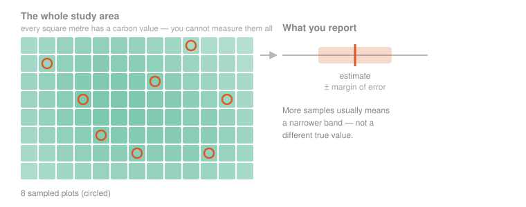
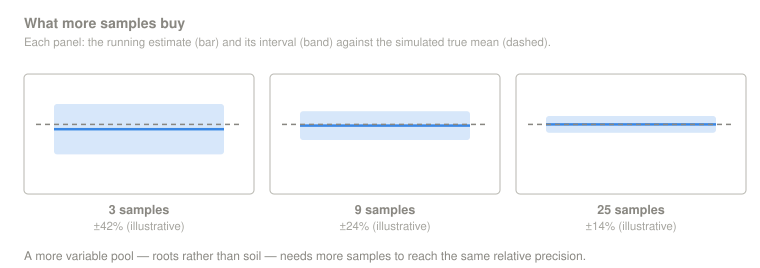
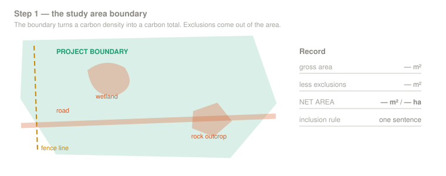
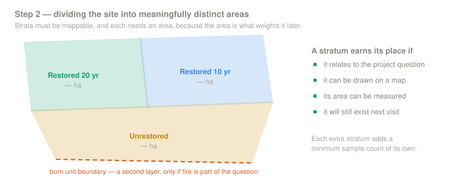
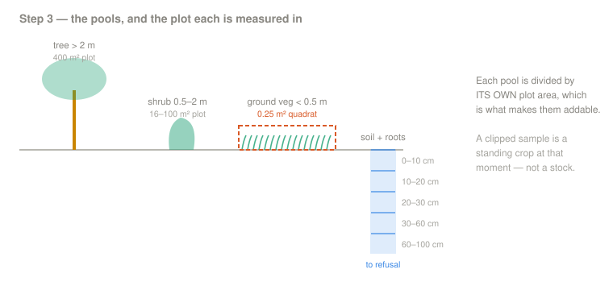
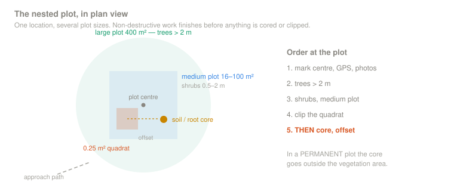
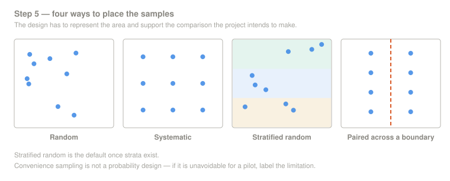
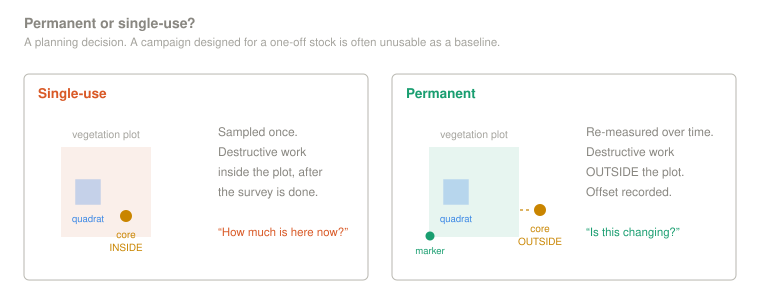

<p align="center">
  
</p>

---

[← 1 — Background](../01_Background/) · [Back to main guide](../README.md) · Next: [3 — Field Methods →](../03_Field_Methods/)

---

# Part 2 — Project Planning

## From a carbon question to a sampling design

**Quick links:** [Sampling Design Guide](../../_Shared/Sampling-Design-Eng-2026.pdf) · **Terrestrial Carbon Planning Tool for Grasslands** *(link to be added)* · [Non-spatial Planning Spreadsheet](Sampling%20Design%20Tools/grassland-sample-allocation.xlsx) · [Vegetation Field Guide](../../_Shared/Vegetation-FINAL-Eng-2026.pdf) · [Non-Peat Soils Field Guide](../../_Shared/Non-peat-FINAL-Eng-2026.pdf) · [Appendix A — sampling logic](#appendix-a--a-brief-lesson-in-sampling-logic)

> 🧩 **[PLACEHOLDER — TOOL LINK]** Add the final link to the Terrestrial Carbon Planning Tool for Grasslands when it is ready. Confirm the spreadsheet download and add a Google Sheets copy if one will be maintained.

---

**Before collecting soil cores**, four questions are worth addressing:

1. **What do I want to know?** Am I establishing a baseline, comparing grazing or restoration treatments, tracking recovery, or doing some combination of these?
2. **Where does that question apply?** The whole property, one pasture, a restoration unit, or the area burned in a particular year?
3. **How much data do I need?** How precise does the result need to be, how confident do I need to be, and how many samples can the team process?
4. **Where should the samples be collected?** Which locations will represent the study area without introducing avoidable bias?

Answering these questions is what a **sampling design** aims to achieve. It turns a carbon question into a field plan: a boundary, a set of strata, a list of carbon pools, a number of samples, and a set of sampling coordinates.

This section covers five steps.

| # | Step | Answers |
|---|---|---|
| 1 | **[Define the study area](#step-1--define-your-study-area)** | *Where, roughly, am I working?* |
| 2 | **[Stratify the site](#step-2--stratify-your-site)** | *Does it contain distinct management or ecological areas?* |
| 3 | **[Choose measurements and configure the nested plot](#step-3--choose-measurements-and-configure-the-nested-plot)** | *Which pools and plot sizes does the project need?* |
| 4 | **[Determine how many plots and samples](#step-4--decide-how-many-plots-and-samples)** | *How much field and laboratory sampling is required?* |
| 5 | **[Place and finalize the plots](#step-5--place-and-finalize-the-plots)** | *Where do plots go, and will they be permanent or single-use?* |

> The methods here follow WWF-Canada's [Sampling Design Guide](../../_Shared/Sampling-Design-Eng-2026.pdf), [Vegetation Field Guide](../../_Shared/Vegetation-FINAL-Eng-2026.pdf), and [Non-Peat Soils Field Guide](../../_Shared/Non-peat-FINAL-Eng-2026.pdf). Ecosystem-specific defaults and examples should be confirmed against the sources listed in the project bibliography.

### What changes in grasslands

If you have worked through another workshop in this series, most of the planning process will be familiar. Three decisions need special attention here.

1. **Management and land-use history are often among the strongest practical variables to map.** Restoration age, cultivation, grazing, fire, and seeding may define more useful strata than vegetation appearance alone.
2. **Soil and roots commonly require different sample sizes at the same relative precision.** Root biomass is often more spatially variable, and root washing can dominate laboratory time.
3. **A variability prior should come from a pilot or defensible comparable data.** A coarse modelled map may be useful for scoping, but its pixel-to-pixel variation should not be treated as the variation a field crew will encounter between cores.

**Two planning routes** are available. They use the same decisions and should produce the same documented planning record.

<table>
<tr>
<td width="50%">

**🗺 Terrestrial Carbon Planning Tool for Grasslands**  
The primary spatial workflow. Draw or upload the boundary, add strata, select pools, calculate the allocation, configure the nested plot, generate plot centres, and export the field plan.

*Used throughout Steps 1–5.*

> 🧩 **[PLACEHOLDER — TOOL PREVIEW]** Add a launch button and overview screenshot when the tool is ready.

</td>
<td width="50%">

**📄 [Non-spatial Planning Spreadsheet](Sampling%20Design%20Tools/grassland-sample-allocation.xlsx)**  
An alternative for teams that prefer to calculate plot and sample requirements without using a map-based interface. Enter the same project assumptions, then complete spatial placement separately in the GIS used by the project.

*Used primarily in Step 4.*

> 🧩 **[PLACEHOLDER — SPREADSHEET SCREENSHOT]** Add a screenshot showing the project inputs, soil and root targets, per-stratum allocation, and assumptions summary.

</td>
</tr>
</table>

The optional **[Sample Size Explorer](Sampling%20Design%20Tools/index.html)** demonstrates how estimates and uncertainty respond as samples accumulate. It is a learning aid rather than a required planning step.

> [!NOTE]
> A spreadsheet calculation is **non-spatial**: it can determine how many plots are required and how many belong in each stratum, but it does not decide where the plot centres go. Teams using the spreadsheet must still complete Steps 1, 2 and 5 with the planning tool or a documented GIS workflow.

If you want to know how the calculator returns its values, [Appendix A](#appendix-a--a-brief-lesson-in-sampling-logic) explains the sampling logic and how to check achieved precision after fieldwork.

---

## Background: What sampling is, and why it works

Measuring every square metre of an ecosystem is rarely feasible. Instead, we measure a **small portion** and use it to estimate the whole. Because an estimate built from a portion will not be exactly right every time, we also report its uncertainty. This is the basis of **probability-based sampling**.

<p align="center">
  
</p>

<table>
<tr>
<td width="60%">

**Sampling** means taking a small portion of something to make an informed estimate of the whole.

A **sampling design** is the framework for deciding what and where to sample, then combining those measurements into an estimate for the full study area.

</td>
<td width="40%">

The more independent, representative samples you collect, the more precise the estimate will generally become.

</td>
</tr>
</table>

A carbon result is usually reported in three parts:

| Component | Symbol | What it tells you |
|---|---|---|
| **Estimate** | $\bar{x}$ | The average carbon value across sampled plots. |
| **Confidence level** | $1-\alpha$ | How often intervals built by this procedure would contain the true value over repeated sampling. |
| **Relative margin of error** | $E$ | The distance from the estimate to the edge of the interval, expressed relative to the mean—for example, ±20%. |

Put together, a result might read: *"Mean soil carbon = 100 ±20 units at 90% confidence."*

### Seeing it on a map

<table>
<tr>
<td width="55%">

**🔬 [Open the Sample Size Explorer](Sampling%20Design%20Tools/index.html)**

Each sample reveals one small part of a simulated carbon surface. With only a few samples, the estimate may be far from the simulated true mean and its interval will be wide. As samples accumulate, the estimate usually stabilizes and the interval narrows.

Switch to **compare both** and the reason soil and roots are sized separately becomes visible: at the same sample size, the more variable pool carries a much wider band.

</td>
<td width="45%">

The explorer also shows something the arithmetic alone does not. It reports whether the interval actually **contains** the simulated true mean — and sometimes it does not, even when the precision target is met.

That is not a bug. At 90% confidence it should happen about one time in ten. Hitting a precision target is not the same as being right.

</td>
</tr>
</table>

**Static fallback**, for print or where motion and scripting are unavailable:

<p align="center">
  
</p>

> **Visualization note:** The explorer is an interactive HTML page rather than an autoplay GIF, and the lesson still works with motion disabled — the static panels above and the data table inside the page carry the same argument.

### The takeaway

- Sampling estimates what is impractical to measure completely.
- A sampling design lets you state how uncertain that estimate is.
- The calculation also runs **backwards**: set the precision and confidence you need, then estimate how many samples are required. That is Step 4.
- Comparisons between treatments, restoration ages, or years need each group to be represented deliberately in the design.

---

# Implementing a sampling design

<details>
<summary><b>📊 Meet the team at the Black Oak savannah</b> &nbsp;·&nbsp; <i>the worked example, in brief</i></summary>

<br>

This workshop follows an anonymized or hypothetical team planning a grassland carbon survey in a Black Oak savannah restoration landscape.

They want to answer two questions:

**A)** What is the current soil carbon stock across the project area?

**B)** Do restoration age and fire history correspond to differences that should be monitored over time?

They expect to measure soil, roots, ground vegetation, shrubs, and scattered trees. Because root biomass is more variable and expensive to process, they will set separate soil and root precision targets. They also want the option to revisit the site, so permanent-plot requirements must be decided before fieldwork.

> 🧩 **[PLACEHOLDER — WORKED EXAMPLE]** Create `../Worked_Example/02_Project_Planning.md`. If the underlying project is private, use explicitly illustrative areas, variability values, and sample counts. Do not publish private site coordinates.

</details>

## Step 1 — Define your study area

*Where, roughly, am I working?*

Every carbon value derived from a core is first expressed per unit area. The boundary defined here is what turns a carbon **density** into a carbon **total**. It also defines the area to which the estimate applies.

<p align="center">
  
</p>

The boundary may be a polygon drawn on a map or an existing management unit. What matters is that the inclusion rule is explicit and the area can be calculated. Record the area in **m²** for the planning tools and in **hectares** for reporting.

Three grassland-specific cautions:

- **Management boundaries may be ecological boundaries.** A fence can separate grazing histories, seeding, burns, or restoration treatments. If crossing it would mix meaningfully different populations, treat the areas separately in Step 2.
- **Exclude what is outside the target ecosystem.** Wetland inclusions, roads, dugouts, rock outcrops, and shelterbelts should not be silently averaged into a grassland estimate.
- **Define native and seeded grassland explicitly.** Record the rule or evidence used to distinguish them rather than relying on appearance alone.

<details>
<summary><b>📊 Worked example</b> &nbsp;·&nbsp; <i>how the Black Oak team defined its area</i></summary>

<br>

> 🧩 **[PLACEHOLDER — EXAMPLE DATA]** Add an illustrative site area, the boundary rule, exclusions, and whether each included unit is native, seeded, or restored. Link to the full worked example.

</details>

### 🛠 Your turn

<table>
<tr>
<td width="45%">

> 🧩 **[PLACEHOLDER — TOOL SCREENSHOT]** Add `images/step1_tool_boundary.webp`: drawing or uploading a study boundary, marking exclusions, and displaying net area.

</td>
<td width="55%">

**In the Terrestrial Carbon Planning Tool:**

1. Draw or upload the project boundary.
2. Mark areas that are not part of the target ecosystem.
3. Confirm the net area in m² and hectares.
4. Write one sentence stating the inclusion rule.
5. Save the boundary and a static reference map.

**Spreadsheet route:** record the same boundary and area in the spreadsheet, then save the actual polygon in QGIS, ArcGIS, Earth Engine, or the GIS used by the project.

</td>
</tr>
</table>

The [`grassland-boundary-template.geojson`](templates/grassland-boundary-template.geojson) provides a manual starting point if the planning tool is unavailable.

> [!WARNING]
> **Do not read an area directly from coordinates in degrees.** Calculate area in an appropriate metre-based projected coordinate system.

> [!TIP]
> **✅ Before moving on, you should have:**
> - A boundary polygon or clearly sketched area
> - Its total area in m² and hectares
> - A written inclusion/exclusion rule
> - Internal exclusions removed from the calculated area

---

## Step 2 — Stratify your site

*Does the site contain distinct management or ecological areas?*

**Stratification** divides the study area into meaningful sub-areas, called **strata**, so that samples from one area are used to describe that area. A uniform site may not need stratification. If the project intends to compare management units, restoration ages, or burn histories, those groups must exist in the design before fieldwork.

<p align="center">
  
</p>

Stratification can reduce within-group variation and makes planned comparisons possible. A useful stratum is linked to the project question, can be mapped, and has an area that can be used when combining results.

Do not create strata simply because a map layer is available. Each one adds field and analytical requirements.

### What counts as meaningfully distinct?

| Divide by | Possible strata | Why it may matter |
|---|---|---|
| **Restoration age** | Recently restored · 10 years · 20 years · unrestored | Creates an explicitly qualified chronosequence comparison. |
| **Land-use history** | Never cultivated · cultivated and reseeded · long-term pasture | Cultivation and reseeding may change roots, soil structure, and carbon distribution. |
| **Grazing regime** | Ungrazed · season-long · rotational · heavily stocked | May affect plant allocation, surface cover, and compaction. |
| **Management unit** | Pasture, stewardship unit, treatment block | Aligns estimates with decisions the project can act on. |
| **Fire history** | Recently burned · years since burn · long unburned | Important where fire structures savannah or parkland vegetation. |
| **Seeded/native status** | Native sward · tame or introduced species | May correspond to different root distributions and management histories. |
| **Soil or texture class** | Mapped soil polygons | May influence carbon storage and coarse-fragment corrections. |
| **Slope position** | Upper · midslope · lower · depression | May correspond to moisture and material redistribution. |

> 📚 **[CITATIONS NEEDED]** Add full references supporting the expected effects of cultivation, grazing, fire, species composition, soil texture, and slope position. Treat the table as a set of candidate variables, not universal rules.

> [!TIP]
> A restoration chronosequence substitutes **space for time**. Age classes must be comparable in other important respects, and remaining differences should be documented. Repeated measurement of the same place is covered in [Part 5 — Monitoring](../05_Monitoring/).

### The conversation is part of the method

Management history is often held by the people who work on the land rather than in a spatial dataset. Budget time to record grazing regime and stocking, cultivation and seeding, burn years, restoration treatments, droughts, wildfire, and unusual disturbances.

The calculator's `1. Plot & Site Log` carries `Management`, `Grazing regime`, `Years since fire`, `Cultivation history`, `Restoration year` and `Native or seeded` fields for exactly this. **They are descriptive.** Nothing in the workbook computes from them — they are there so that when an interval comes out wide, you can post-stratify on something you actually recorded.

### Savannah and parkland: fire may define a stratum

Where fire is part of the management or restoration question, time since burn should be considered during stratification rather than added as an afterthought. Recently burned and long-unburned units may differ in standing biomass, litter, shrub encroachment, and potentially surface soil properties.

> 📚 **[CITATION NEEDED]** Add ecosystem-appropriate evidence before making a quantitative claim about the direction or size of fire effects on soil carbon.

<details>
<summary><b>📊 Worked example</b> &nbsp;·&nbsp; <i>how the Black Oak team divided the site</i></summary>

<br>

> 🧩 **[PLACEHOLDER — EXAMPLE DATA]** For each stratum, add its mapped rule, area in m², restoration and burn history, expected source of variation, and whether it is a reporting unit, comparison unit, or both.

</details>

### 🛠 Your turn

<table>
<tr>
<td width="45%">

> 🧩 **[PLACEHOLDER — TOOL SCREENSHOT]** Add `images/step2_tool_strata.webp`: the boundary divided into named grassland strata with the area of each displayed.

</td>
<td width="55%">

**In the Terrestrial Carbon Planning Tool:**

1. Start with the boundary from Step 1.
2. Add only divisions that answer the project question or are expected to materially affect carbon estimates.
3. Give each stratum an objective name and mapped rule.
4. Confirm its area.
5. Record whether it is a reporting unit, a comparison group, or both.
6. Add management history that cannot be seen on the map.

**Spreadsheet route:** enter one row per stratum with its name, area, rule, and management notes.

</td>
</tr>
</table>

Do not create strata simply because a map layer is available. Every additional stratum creates field, analytical, and reporting requirements.

> [!TIP]
> **✅ Before moving on, you should have:**
> - One defensible study area or a set of clearly mapped strata
> - A name, rule, and area in m² for every stratum
> - The management history behind each stratum
> - A note explaining which comparisons the strata are intended to support

---

## Step 3 — Choose measurements and configure the nested plot

*Which pools and plot sizes does the project need?*

Carbon is stored in several pools. A **stock** is the amount stored at a defined place and time. **Living biomass** is the mass of living plant material. A clipped above-ground sample is a **standing crop** measured at that moment, not the total long-term carbon stock of the site.

<p align="center">
  
</p>

Soil is expected to contain the largest long-lived carbon pool in most grassland projects, but roots, shoots, shrubs, and scattered trees may be required by the project question. Choose each pool deliberately — every additional pool adds field, laboratory, and analytical work.

| Pool | Field/lab implication | Planning recommendation |
|---|---|---|
| **Soil** | Coring, bulk density, depth increments, laboratory carbon analysis | ✅ Include in a soil-carbon project. |
| **Roots** | Collected with soil cores; washing and processing can be intensive | ✅ Include when below-ground living biomass is part of the question; set its own precision target. |
| **Shoots** | Clip-and-weigh or other vegetation method | ✅ Often useful, but report it as a time-specific standing crop. |
| **Shrubs** | Medium-plot measurements and appropriate allometry | ⬜ Include where present and relevant. |
| **Trees** | Tree plot, species, DBH, height, and allometric estimates | ✅ Include any tree taller than 2 m that falls within the agreed protocol. |
| **Litter** | Requires a separate collection and processing protocol | ⬜ Outside the current method unless a documented protocol is added. |

> 📚 **[CITATIONS NEEDED]** Support the relative importance and expected variability of the pools with grassland-appropriate sources. Avoid presenting qualitative rankings as universal across all grasslands.

### Are there trees?

Measure any tree taller than **2 m** using the [Forests large-plot method](../../Forests/03_Field_Methods/3A_Trees.md), then carry the result into this workshop's vegetation data workflow. The medium plot covers woody stems from **0.5–2 m**, so the 2 m handoff prevents gaps and double counting.

There is no separate tree-cover threshold in this draft method. The decision is whether trees taller than 2 m are present and in scope.

### Decide your sampling depth now, not later

The working recommendation is to sample the **full profile to parent material or refusal**, then calculate standard reporting windows from the same core. Record depth reached as data.

| Basis | What it is | Role |
|---|---|---|
| **Full profile** | Surface to parent material or refusal | Primary measurement in this workshop. |
| **0–30 cm** | Fixed upper-soil window | Common reporting window for comparison with other studies and inventories. |
| **0–1 m** | Deeper fixed window | Additional comparison window where the profile and equipment allow it. |

A proposed increment sequence is **0–10, 10–20, 20–30, 30–60, and 60–100 cm**, followed by documented deeper increments where possible.

> 📚 **[METHOD REVIEW NEEDED]** Confirm the depth recommendation, reporting windows, increments, and compaction rationale against the final field guides and cited grassland literature before publication.

### Build the nested plot

When several carbon pools are measured, use an **integrated—or nested—plot design**. The vegetation plots share one centre mark, allowing every measurement to be tied to the same location without using the same footprint for every vegetation layer.

| Plot component | Working workshop configuration | Measures |
|---|---:|---|
| **Large plot** *(where trees occur)* | 400 m² | Trees taller than 2 m |
| **Medium plot** | 25 m² default; document another approved size within the field-guide range | Shrubs and vegetation approximately 0.5–2 m |
| **Small plot** | 0.25 m² workshop quadrat; document any approved alternative | Ground vegetation below 0.5 m |
| **Soil/root sampling point** | Recorded point or offset | Soil and roots by depth increment |

<p align="center">
  
</p>

The planning tool should build the layout from the pools selected:

| Selected pools | Tool-generated configuration |
|---|---|
| Ground vegetation only | Small plot |
| Shrubs plus ground vegetation | Medium + small nested plots |
| Trees, shrubs and ground vegetation | Large + medium + small nested plots |
| Vegetation plus soil or roots | Appropriate nested vegetation plots plus a defined core location |

> 🧩 **[PLACEHOLDER — TOOL SCREENSHOT]** Add `images/step3_tool_plot_design.webp`: pool selection beside the nested-plot layout generated by the tool.

> [!IMPORTANT]
> Plot type is finalized in Step 5. A soil core or vegetation clipping may be collected inside a single-use plot after non-destructive measurements, but destructive sampling must be placed outside a permanent vegetation plot.

<details>
<summary><b>📊 Worked example</b> &nbsp;·&nbsp; <i>what the Black Oak team chose to measure</i></summary>

<br>

> 🧩 **[PLACEHOLDER — EXAMPLE DATA]** Add the chosen pools, reasons for inclusion and exclusion, tree decision, full-profile target, reporting windows, and depth increments.

</details>

### 🛠 Your turn

**In the Terrestrial Carbon Planning Tool:**

1. Select every carbon pool that is in scope.
2. Confirm the field and laboratory method for each pool.
3. Record the target soil depth, reporting windows, and depth increments.
4. Accept or revise the suggested plot sizes using an approved field protocol.
5. Review the generated nested-plot diagram.
6. Record the order of work so non-destructive measurements occur first.

Complete the decision table in the tool or the [planning worksheet](templates/project-planning-worksheet.md):

| Pool | Include? | Field/lab method | Plot component | Precision target | Reason |
|---|---|---|---|---|---|
| Soil | | | | | |
| Roots | | | | | |
| Ground vegetation | | | | | |
| Shrubs | | | | | |
| Trees >2 m | | | | | |

> [!TIP]
> **✅ Before moving on, you should have:**
> - A pool list with a reason for every inclusion and exclusion
> - A yes/no decision on trees taller than 2 m
> - A target depth, reporting windows, and depth increments
> - A field and laboratory method for every included pool

---

## Step 4 — Decide how many plots and samples

*How much field and laboratory sampling is required?*

Too few samples may leave the estimate too uncertain to support a decision. Too many consume field and laboratory resources that could be used elsewhere. The aim is to calculate a defensible starting sample size and record every assumption used.

| You provide | Meaning |
|---|---|
| **Area** (m²) | The area of each stratum from Step 2. |
| **Relative margin of error** ($E$) | How precise the estimate needs to be. |
| **Confidence level** | How reliable the interval-building procedure needs to be. |
| **Variability prior** | How variable the measured pool is expected to be between samples. |

### Where the prior comes from

The prior should describe the variability the field crew expects to encounter between samples—not only the broad regional pattern.

| Preference | Source | Use when |
|---|---|---|
| **1** | A pilot survey: mean and standard deviation from the site's own samples | Best option when a pilot is feasible. |
| **2** | Published data from a comparable grassland, management history, depth, and method | No site data are available, but a defensible analogue exists. |
| **3** | AAFC/CanSIS or another soil map; SoilGrids as a fallback | Early scoping only, with an explicit uncertainty warning. |

> [!WARNING]
> A modelled map's pixel-to-pixel variability is not necessarily the variability between field cores. Model smoothing, resolution, depth definitions, and training data can all narrow the apparent spread. Use mapped values cautiously and replace them with a pilot when possible.

> 🧩 **[PLACEHOLDER — DATA]** Add a documented regional prior table with source, ecosystem, management context, depth, analytical method, mean, SD, CV, and suitability notes. Do not hide a generic default inside the calculator.

*The calculator leaves the prior cells **orange and empty** for this reason. Nothing downstream computes until you supply one and say where it came from.*

### Soil and roots need separate decisions

Root biomass is often more spatially variable than soil carbon because living roots cluster around individual plants and tussocks. Since planned sample size scales approximately with the square of the coefficient of variation, using one precision target for both pools can make root processing dominate the project.

The values below are **illustrative calculator inputs**, not universal grassland defaults.

| Pool | Illustrative CV | Illustrative samples for ±20% at 90% confidence |
|---|---:|---:|
| Soil carbon — relatively uniform | 0.20 | 5 |
| Soil carbon — moderate variation | 0.30 | 9 |
| Soil carbon — higher variation | 0.40 | 13 |
| Roots — lower illustrative variation | 0.50 | 19 |
| Roots — moderate illustrative variation | 0.70 | 36 |
| Roots — high illustrative variation | 1.00 | 70 |

> 📚 **[CITATIONS NEEDED]** Replace or qualify these CV ranges using appropriate grassland studies. The *arithmetic* is generated by the calculator's `4. Sensitivity` tab; the *CV values it is run at* still need grassland sources.

### Set a target for each pool

Separate precision targets may produce a more realistic design:

| Illustrative design | Soil target | Root target | Approximate field samples |
|---|---:|---:|---:|
| Same target for both | ±20% | ±20% | 36 |
| **Different pool targets** | ±20% | ±40% | 11 |
| Tighter root estimate | ±20% | ±30% | 17 |

*Illustrative only: soil CV 0.30, root CV 0.70, 90% confidence, with the small-sample adjustment. The field count is whichever pool needs more, before per-stratum rounding and minimums.*

A wider root interval is not automatically a failure. It may be an honest description of a variable pool. State the target and the achieved result separately for each pool.

### Consider root subsampling

Because soil and roots can come from the same core, the team may analyze soil carbon from every core and wash roots from a random subset. Choose that subset randomly—not according to which samples look interesting—and report the root sample size explicitly.

<details>
<summary><b>📊 Worked example</b> &nbsp;·&nbsp; <i>what the Black Oak team calculated</i></summary>

<br>

> 🧩 **[PLACEHOLDER — EXAMPLE DATA]** Show area per stratum, confidence level, soil and root CV with sources, separate precision targets, calculated sample sizes, the applied minimum/rounding rule, final field count, and root subsample count. Label invented values **illustrative**.

</details>

### 🛠 Your turn

Use either route below. Both require the same assumptions and should leave the same decision record.

<table>
<tr>
<td width="50%">

**🗺 Spatial planning tool**

Use the **Terrestrial Carbon Planning Tool for Grasslands** when you want the allocation connected directly to the mapped study area and strata.

Enter:

- precision and confidence targets;
- a variability prior for each pool and its source;
- any operational minimum per stratum;
- whether roots will be processed from every core or a random subset.

The tool should return the number of plot centres, the pool-specific sample targets, and the allocation by stratum.

> 🧩 **[PLACEHOLDER — TOOL SCREENSHOT]** Add `images/step4_spatial_calculator.webp`: calculation inputs and the mapped allocation.

</td>
<td width="50%">

**📄 [Non-spatial Planning Spreadsheet](Sampling%20Design%20Tools/grassland-sample-allocation.xlsx)**

Use the spreadsheet when the team prefers a table-based calculation or does not yet have mapped boundaries available in the planning tool.

The spreadsheet should contain:

- **Design** — confidence, precision and variability by pool;
- **Strata** — names and areas;
- **Results** — plot count, pool-specific sample count, per-stratum allocation and assumptions statement;
- **Sensitivity** — the effect of changing one assumption at a time.

> 🧩 **[PLACEHOLDER — SPREADSHEET SCREENSHOT]** Add `images/step4_spreadsheet_planner.webp`: input cells, soil and root results, and the assumptions summary.

</td>
</tr>
</table>

> [!IMPORTANT]
> Keep the units distinct. The tool must report the number of **plot centres**, **soil cores**, **vegetation measurements**, and **root samples or subsamples** separately. One nested plot can produce several measurements, but not every pool must have the same laboratory sample count.

> [!TIP]
> **✅ Before moving on, you should have:**
> - A relative margin-of-error target and confidence level for each pool
> - A variability prior for each pool and a record of its source
> - A calculated sample size for each pool
> - A final field count after rounding and minimum rules
> - A random root-subsampling plan, if used

> [!NOTE]
> The draft statistical minimum is **3 samples per stratum**, with **5 preferred where feasible**. The eelgrass workshop uses a five-sample operational minimum. Resolve and document the series-wide rule before publication; do not imply that the statistical and operational minimums are the same thing. The calculator exposes this as an orange input rather than fixing it.

---

## Step 5 — Place and finalize the plots

*Where do the plots go, and will they be permanent or single-use?*

<p align="center">
  
</p>

The spatial design should represent the target area while supporting the comparison the project intends to make. Accessibility may constrain fieldwork, but convenience should not quietly replace a probability-based design.

| Strategy | When to use it |
|---|---|
| **Random** | A reasonably uniform area with no planned internal comparison |
| **Systematic grid** | A large or uniform area where even coverage is useful; verify that spacing does not align with furrows, treatment strips, or another repeating feature |
| **Stratified-random** | **Default when strata exist:** allocate plots, then randomize locations within each stratum |
| **Paired across a boundary** | The boundary itself is the comparison, such as grazed versus ungrazed or burned versus unburned; use an analysis designed for pairing |
| **Convenience/practical** | A preliminary or capacity-limited assessment whose limitations will be stated clearly |

### 5A — Generate the plot centres

In the planning tool, use the Step 4 plot count and allocation to generate candidate coordinates. Record the random seed and keep inaccessible candidates in the audit record when replacements are generated.

Teams using the non-spatial spreadsheet must complete this stage in the Terrestrial Carbon Planning Tool or another documented GIS workflow.

Grassland cautions:

- Do not align a systematic grid with cultivation furrows, fence lines, pipeline corridors, or treatment strips.
- Do not move an inaccessible point to a convenient nearby location without applying a documented replacement rule.
- Finish non-destructive vegetation measurements before coring or clipping disturbs the location.

### 5B — Decide between permanent and single-use plots

This is a planning decision, not one to leave to the field crew.

<p align="center">
  
</p>

| | **Single-use plot** | **Permanent plot** |
|---|---|---|
| **Use when** | The location will be measured once | The same vegetation will be measured again |
| **Marker** | Temporary centre marker and recorded GPS position | Relocatable centre marker, GPS, photographs, bearings and distances from stable features |
| **Non-destructive work** | Complete first | Repeat using the same plot boundary and protocol |
| **Destructive work** | May occur inside the plot after all non-destructive measurements | Must occur outside the protected vegetation plot |
| **Records** | Plot ID, coordinates, layout and collected samples | Plot ID, coordinates, layout, marker description, photographs and every destructive-sample offset |

A project does not have to use only one type. For example, it may combine **permanent nested vegetation plots** with separately located **single-use soil or clipping points**. The important requirement is that the relationship between them is fixed and recorded.

### 5C — Record destructive-sampling offsets

For every permanent plot, define the direction and distance used for soil cores, root cores, or vegetation clipping. If several monitoring rounds are planned, reserve separate destructive-sampling positions so later visits do not resample previously disturbed ground.

> 🧩 **[PLACEHOLDER — TOOL DECISION]** Add the permanent/single-use decision tree and an offset planner to the tool. It should warn whenever destructive sampling is placed inside a permanent vegetation plot.

### 🛠 Your turn

<table>
<tr>
<td width="45%">

> 🧩 **[PLACEHOLDER — TOOL SCREENSHOT]** Add `images/step5_tool_export.webp`: generated plot centres, permanent/single-use designations, destructive-sampling offsets, and the export panel.

</td>
<td width="55%">

**In the Terrestrial Carbon Planning Tool:**

1. Choose and justify the sampling strategy.
2. Generate the allocated plot centres.
3. Review access and safety constraints using a documented replacement rule.
4. Assign each plot as permanent or single-use.
5. Apply the nested layout from Step 3.
6. Record destructive-sampling offsets.
7. Export the field package.

The export should include CSV, GeoJSON or KML, a printable map, plot identifiers, stratum assignments, plot type, layout dimensions, offsets, replacements, and the random seed.

</td>
</tr>
</table>

<details>
<summary><b>📊 Worked example</b> &nbsp;·&nbsp; <i>how the Black Oak plots were finalized</i></summary>

<br>

> 🧩 **[PLACEHOLDER — EXAMPLE DATA]** Show the allocation by stratum, anonymized plot map, nested layout, permanent and single-use components, core-offset rule, replacement rule, and exported field package.

</details>

> [!TIP]
> **✅ Before moving on, you should have:**
> - A sampling strategy chosen and justified
> - A per-stratum plot allocation
> - A coordinate list and field map
> - A nested layout for every plot type
> - Permanent and single-use designations
> - A destructive-sampling offset plan
> - A reproducible record of the random seed and replacements

---

## ✅ Sampling design complete

Before heading into the field, confirm that the spatial tool—or the combination of the non-spatial spreadsheet and a documented GIS workflow—has produced the complete planning package:

```text
☐ Study-area boundary, exclusions and net area       → Step 1
☐ Strata identified or explicitly ruled out          → Step 2
☐ Carbon pools, depths and nested layout selected    → Step 3
☐ Plot and pool-specific sample counts calculated    → Step 4
☐ Plot centres generated and assigned                → Step 5
☐ Permanent/single-use status recorded               → Step 5
☐ Destructive-sampling offsets documented            → Step 5
☐ Map, coordinates, identifiers and field sheets     → Field package
```

Then confirm the grassland-specific decisions:

| | Readiness item |
|---|---|
| ☐ | Management, restoration, cultivation, grazing, and fire history recorded where relevant |
| ☐ | Trees taller than 2 m confirmed as present/in scope or absent/out of scope |
| ☐ | Soil and root targets recorded separately |
| ☐ | Root subsampling plan recorded, if used |
| ☐ | Permanent vegetation areas protected from destructive sampling |
| ☐ | Replacement locations and the random seed retained |
| ☐ | Sampling season chosen and justified for vegetation measurements |

The same decisions should be stored in the exported tool summary or the
**[`templates/project-planning-worksheet.md`](templates/project-planning-worksheet.md)**.

<details>
<summary><b>📊 The Black Oak plan at a glance</b></summary>

<br>

| Step | Decision |
|---|---|
| 1 — Study area | 🧩 **[PLACEHOLDER]** Area, boundary rule, and exclusions |
| 2 — Stratify | 🧩 **[PLACEHOLDER]** Restoration and fire-history strata |
| 3 — Pools | 🧩 **[PLACEHOLDER]** Soil, roots, vegetation, shrubs, and trees in scope |
| 4 — Sample size | 🧩 **[PLACEHOLDER]** Separate soil/root targets and final field count |
| 5 — Locations | 🧩 **[PLACEHOLDER]** Allocation, coordinate method, plot layout, and permanent-plot decision |

**→ [Read the full planning walkthrough](../Worked_Example/02_Project_Planning.md)**

</details>

You now have what the field team needs: a boundary, strata or a documented decision not to stratify, selected carbon pools and depths, sample counts, plot coordinates, and a plot layout.

What remains is the fieldwork itself. **Part 3** covers equipment, plot setup, vegetation measurements, soil and root cores, field records, and sample handling.

**Next: [Part 3 — Field Methods →](../03_Field_Methods/)**

---

# Appendix A — A brief lesson in sampling logic

*The calculations behind the planning workflow*

Steps 1–5 do not require the full derivation. Use this appendix when you need to explain or audit a sample-size decision.

| Section | Topic | Used in |
|---|---|---|
| [A1](#a1--what-an-estimate-actually-is) | What an estimate actually is | Background |
| [A2](#a2--working-backwards-from-precision-to-sample-size) | Working backwards from precision | Step 4 |
| [A3](#a3--finite-population-correction) | Finite-population correction | Step 4 |
| [A4](#a4--what-drives-sample-size) | What drives sample size | Step 4 |
| [A5](#a5--the-proportion-form) | Estimating a proportion | Step 4 |
| [A6](#a6--symbol-crosswalk) | Symbol crosswalk | Step 4 |
| [A7](#a7--allocation-across-strata) | Allocation across strata | Step 5 |
| [A8](#a8--after-the-campaign-did-you-hit-the-target) | Achieved precision | Step 4 |
| [A9](#a9--normal-planning-and-small-sample-intervals) | Normal planning and small samples | Step 4 |
| [A10](#a10--why-roots-may-need-more-samples) | Why roots may need more samples | Step 4 |

> 📚 **[STATISTICAL REVIEW NEEDED]** Validate the notation, formulas, assumptions, and examples against the final calculator and cited statistical guidance before publication.

### A1 — What an estimate actually is

The sample mean, $\bar{x}$, estimates the study population's mean. Its estimated standard error is:

$$SE = \frac{s}{\sqrt{n}}$$

where $s$ is the sample standard deviation and $n$ is the number of independent samples.

The square-root relationship drives sampling economics: under the simple assumptions used here, achieving roughly twice the precision requires about four times as many samples.

If $E$ is a **relative** margin of error, a normal-approximation planning relationship can be written:

$$E\bar{x} = z\frac{s}{\sqrt{n}}$$

The multiplier $z$ depends on the chosen confidence level.

### A2 — Working backwards from precision to sample size

Rearranging the planning relationship gives:

$$n = \left(\frac{z\,CV}{E}\right)^2, \qquad CV = \frac{s}{\bar{x}}$$

Using the coefficient of variation makes the relationship scale-free. The result depends on relative variability rather than whether carbon is reported in kg C/m² or Mg C/ha.

This approximation assumes independent samples, a defensible variability prior, and a design compatible with the intended analysis. It is a planning starting point, not a substitute for a design-specific analysis.

### A3 — Finite-population correction

When a finite population of possible sampling units is defined, a finite-population correction may be written:

$$n \geq \frac{z^2 N CV^2}{(N-1)E^2 + z^2 CV^2}$$

where $N$ is the number of possible sampling units under the chosen plot footprint.

For large $N$, the result approaches the simpler expression in A2. The practical importance of this correction depends on how the sampling unit and population are defined.

> 📚 **[METHOD REVIEW NEEDED]** Confirm that the chosen definition of $N$ is appropriate for point cores and nested grassland plots before using area ÷ plot footprint as a universal population count. **The calculator does not apply this correction** — it uses the A2 form, which is the conservative choice while the definition of $N$ is unresolved.

### A4 — What drives sample size

In the simple planning relationship:

- halving relative margin of error increases sample size substantially because $E$ is squared;
- doubling the CV increases sample size substantially because $CV$ is squared;
- raising confidence increases $z$ and therefore sample size;
- increasing area alone may have little effect once the number of possible sampling units is large.

**Precision and variability usually matter more than total area.** The project controls the target precision and confidence level, but it does not control the site's true variability. That is why a pilot can be valuable.

One knob at a time, from the calculator's `4. Sensitivity` tab:

| Change | From | To | Samples |
|---|---|---|---:|
| Baseline — soil, CV 0.30, ±20%, 90% | | | **9** |
| Variability | CV 0.30 | CV 0.70 | **36** |
| Precision | ±20% | ±30% *(roots, CV 0.70)* | **17** |
| Precision | ±20% | ±40% *(roots, CV 0.70)* | **11** |
| Confidence | 90% | 95% *(soil, CV 0.30)* | **12** |

*Regenerated by `_source/build_grass_alloc.py`. Do not edit these by hand in both places — re-run the script.*

### A5 — The proportion form

Some questions concern a proportion—for example, the fraction of plots with a particular condition. One finite-population planning form is:

$$n \geq \frac{z^2 Npq}{(N-1)E^2 + z^2pq}, \qquad q = 1-p$$

When no prior proportion is available, $p=0.5$ is often used because it maximizes $pq$ and produces a conservative starting sample size for an absolute margin-of-error formulation.

> 📚 **[METHOD REVIEW NEEDED]** Confirm whether $E$ is absolute or relative in the selected reference and calculator. Do not mix the two formulations.

### A6 — Symbol crosswalk

| This guide | Common alternative | Meaning |
|---|---|---|
| $z$ | $Z_{\alpha/2}$ | Normal multiplier set by confidence level. |
| $E$ | $e$ or $e_{rel}$ | Target margin of error; label absolute versus relative explicitly. |
| $s$ | $SD$ | Expected or observed standard deviation. |
| $CV$ | $CV$ | Coefficient of variation. |
| $N$ | $N$ | Number of possible sampling units. |
| $n$ | $n$ | Number of samples or plots. |

> 📚 **[REFERENCE CHECK NEEDED]** Cross-check notation against the exact edition of the UNFCCC A6.4 Sampling and Surveys tool or other referenced calculator before stating that formulas are identical.

### A7 — Allocation across strata

A simple area-proportional allocation is:

$$n_h = \frac{A_h}{A}\,n$$

where $A_h$ is the area of stratum $h$, $A$ is total study area, and $n_h$ is that stratum's allocation.

Round using a documented rule and apply the chosen minimum per stratum. Both push the total above $n$, which is expected: rounding down or allowing a two-sample stratum would leave that stratum without an estimable variance.

Area-proportional allocation is not always optimal. When variability and processing cost differ among strata, a design such as Neyman or cost-adjusted allocation may be more appropriate. **The calculator implements the area-proportional case only.**

### A8 — After the campaign: did you hit the target?

Planning uses expected variability. After sampling, calculate achieved relative margin of error using the observed mean and standard deviation:

$$RME = \frac{t\,SE}{\bar{x}}, \qquad SE = \frac{s}{\sqrt{n}}$$

Use the multiplier and degrees of freedom appropriate to the actual design and analysis. Report achieved precision separately for soil and roots.

If the target is missed:

1. Check raw data, units, depths, bulk density, and laboratory records.
2. Investigate documented sources of heterogeneity without inventing post hoc groups.
3. Add samples using the observed variability and a pre-defined rule where feasible.
4. Otherwise report the achieved interval honestly and explain the limitation.

The [planning worksheet](templates/project-planning-worksheet.md) has a section for this, so the
plan and the outcome sit on the same page.

### A9 — Normal planning and small-sample intervals

The basic planning equation uses a normal multiplier, $z$. After sampling, when variability is estimated from a small sample, a Student's $t$ multiplier is generally larger. The difference shrinks as sample size increases.

The calculator applies a small-sample adjustment during planning. The algorithm is a fixed-point iteration:

$$n_0 = \left\lceil \left(\frac{z\,CV}{E}\right)^2 \right\rceil, \qquad n_{k+1} = \left\lceil \left(\frac{t_{n_k-1}\,CV}{E}\right)^2 \right\rceil$$

repeated until the value stops moving. Where it settles into a two-cycle rather than a fixed point — alternating between $n$ and $n+1$ — the larger is taken. The workbook unrolls six passes across hidden columns, which converges in three or four for every case quoted here, and avoids circular references or macros.

In the illustrative CV examples above the adjustment happened to add two samples in every case; that is a property of those displayed scenarios, not a universal rule. Both the plain and the adjusted figure appear on the `3. Result` tab so the adjustment is never invisible.

Report the design transparently, for example:

> "The initial planning value was calculated at 90% confidence and ±20% relative precision using a CV of 0.30 from the pilot. The field target was then increased using the documented small-sample rule."

### A10 — Why roots may need more samples

Soil carbon integrates inputs and redistribution over time. Living root biomass reflects the current spatial pattern of plants and can vary sharply over short distances. Where the root CV is greater than the soil CV, equal relative precision requires more root samples because:

$$\frac{n_{roots}}{n_{soil}} \approx \left(\frac{CV_{roots}}{CV_{soil}}\right)^2$$

Three planning responses are available:

| Option | Mechanism | Trade-off |
|---|---|---|
| **Separate precision targets** | Set a tighter target for soil and a wider target for roots. | Wider but explicit root interval. |
| **Root subsampling** | Analyze soil from all cores and roots from a random subset. | Root estimate rests on fewer samples. |
| **Change the sampling unit** | Consider a larger-diameter core or a documented composite. | More material per sample or loss of within-plot information. |

Compositing may reduce variation among analytical samples but removes information about variation among the components. Decide whether that trade-off is compatible with future monitoring before adopting it.

> [!IMPORTANT]
> State both the target and achieved precision for each pool. A wide, honest interval is more useful than a narrow claim the data do not support.

> [!NOTE]
> Ask a statistician or experienced sampling designer for help with paired/repeated designs, chronosequences, unequal-variance comparisons, spatial autocorrelation, detectable-change studies, or any design in which the final analysis differs from a simple mean.

---

## In this section

| File | Purpose | Status |
|---|---|---|
| `README.md` | Part 2 lesson | This revised draft |
| [`images/banner_planning.svg`](images/banner_planning.svg) | Grassland planning banner | ✅ Built |
| [`images/sampling_explainer.svg`](images/sampling_explainer.svg) | Probability-based sampling explainer | ✅ Built |
| [`images/sample_size_explorer_static.svg`](images/sample_size_explorer_static.svg) | Static visualization fallback | ✅ Built |
| [`images/step1_grassland_boundary.svg`](images/step1_grassland_boundary.svg) | Boundary and exclusions | ✅ Built |
| [`images/step2_stratification.svg`](images/step2_stratification.svg) | Management/restoration strata | ✅ Built |
| [`images/step3_carbon_pools.svg`](images/step3_carbon_pools.svg) | Pools and depth diagram | ✅ Built |
| [`images/step5_sampling_strategies.svg`](images/step5_sampling_strategies.svg) | Sampling strategy comparison | ✅ Built |
| [`images/step5_nested_plot_layout.svg`](images/step5_nested_plot_layout.svg) | Nested plot layout | ✅ Built |
| [`images/permanent_vs_single_use.svg`](images/permanent_vs_single_use.svg) | Permanent/single-use comparison | ✅ Built |
| `images/step1_tool_boundary.webp` | Planning-tool boundary screen | 🧩 Placeholder |
| `images/step2_tool_strata.webp` | Planning-tool stratification screen | 🧩 Placeholder |
| `images/step3_tool_plot_design.webp` | Pool selection and generated nested layout | 🧩 Placeholder |
| `images/step4_spatial_calculator.webp` | Spatial-tool allocation results | 🧩 Placeholder |
| `images/step4_spreadsheet_planner.webp` | Non-spatial spreadsheet inputs and results | 🧩 Placeholder |
| `images/step5_tool_export.webp` | Final plot map and export panel | 🧩 Placeholder |
| [`Sampling Design Tools/grassland-sample-allocation.xlsx`](Sampling%20Design%20Tools/grassland-sample-allocation.xlsx) | Non-spatial planning spreadsheet | ✅ Built |
| [`Sampling Design Tools/index.html`](Sampling%20Design%20Tools/index.html) | Optional Sample Size Explorer | ✅ Built |
| `Sampling Design Tools/` — Terrestrial Carbon Planning Tool for Grasslands | Spatial Steps 1–5 workflow and field-package export | 🧩 Placeholder |
| [`templates/grassland-boundary-template.geojson`](templates/grassland-boundary-template.geojson) | Boundary/strata template | ✅ Built |
| [`templates/project-planning-worksheet.md`](templates/project-planning-worksheet.md) | Participant decision record | ✅ Built |
| `../Worked_Example/02_Project_Planning.md` | Complete Black Oak planning example | 🧩 Placeholder |

---

[← 1 — Background](../01_Background/) · [Back to main guide](../README.md) · Next: [3 — Field Methods →](../03_Field_Methods/)
