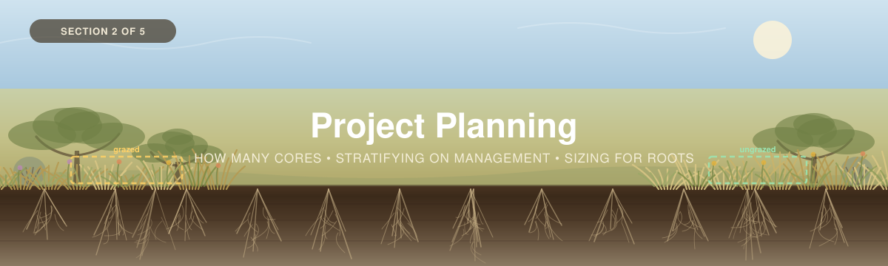

<p align="center">
  
</p>

---

[← 1 — Background](../01_Background/) · [Back to main guide](../README.md) · Next: [3 — Field Methods →](../03_Field_Methods/)

---

# Part 2 — Project Planning

## From a carbon question to a sampling design

**Quick links:** [Sampling Design Guide](../../_Shared/Sampling-Design-Eng-2026.pdf) · [Vegetation (Non-Tree)](../../_Shared/Vegetation-FINAL-Eng-2026.pdf) · [Non-Peat Soils](../../_Shared/Non-peat-FINAL-Eng-2026.pdf) · [Sampling design tools](Sampling%20Design%20Tools/) · [Appendix A](#appendix-a--a-brief-lesson-in-sampling-logic)

---

## There is only one question on this page

Everything in this section answers one thing:

> **How many cores do we need before the number we report is good enough to act on?**

"Good enough" is not a feeling — it is a **threshold you set in advance**: how close to the truth
the estimate has to be, and how sure you need to be that it is that close. Fix those two numbers
and the arithmetic returns a sample size. That is the whole of [Step 4](#step-4--decide-how-many-cores),
and [Appendix A](#appendix-a--a-brief-lesson-in-sampling-logic) shows the working.

**Almost every question a grassland project asks is downstream of that one.** Once you can
estimate a carbon stock to a defined precision, you can:

| Because you can do this… | …you can answer this |
|---|---|
| Estimate the stock of **one area** to a stated precision | *How much carbon is here, and how confident are we?* |
| Estimate it separately for **two or more areas** | *Does the stewardship area differ from the one next door?* |
| Do the same across **restoration ages** | *Is carbon accumulating as the restoration matures?* |
| Do the same at the **same place, twice** | *Is it changing over time?* — [Part 5](../05_Monitoring/) |

The comparisons are not a different method. They are what you get **as a consequence** of having
sized the campaign properly in the first place. A design that cannot pin down one number cannot
tell two numbers apart either — comparing areas needs *more* precision than describing one, not
less.

**So the four questions to answer before establishing any plots are:**

1. **What do I want to know?** A baseline stock, a comparison between grazing regimes, whether a
   restoration is working?
2. **Where does that question apply?** The whole property, one pasture, the burned unit?
3. **What precision do I need, and how many cores does that take?** And can we process them?
4. **Where should the cores go?**

This section covers the five steps of a sampling design.

| # | Step | Answers |
|---|------|---------|
| 1 | **[Define the study area](#step-1--define-your-study-area)** | *Where am I working?* |
| 2 | **[Divide it into meaningfully distinct areas](#step-2--divide-the-site-into-meaningfully-distinct-areas)** | *Is this one place, or several?* |
| 3 | **[Choose the pools](#step-3--choose-which-pools-to-measure)** | *Soil, roots, shoots, shrubs, trees — which?* |
| 4 | **[Decide how many cores](#step-4--decide-how-many-cores)** | *How many to reach the threshold — and why do roots need more?* |
| 5 | **[Decide where they go](#step-5--decide-where-the-cores-go)** | *Exactly where, and how is each plot laid out?* |

### Three differences from the other two workshops

If you have worked through [Forests](../../Forests/02_Project_Planning/) or
[Wetlands](../../Wetlands/02_Project_Planning/), most of this will be familiar. Three things
genuinely change.

1. **You divide the site on management and history, not on vegetation.** In a forest you
   stratify on stand type; in a peatland on wetland type and landscape position. In a grassland
   the dominant variable is **what people have done to it** — restoration age, cultivation
   history, grazing, fire, seeding.
2. **Roots and soil need different sample sizes**, and the gap is large.
   [Step 4](#step-4--decide-how-many-cores) is mostly about that.
3. **The cheap-prior trick from Wetlands does not transfer.** There, peat depth predicted carbon
   variability well enough to size a campaign from a probe survey. Grassland soil depth is far
   less variable, so it carries much less information about carbon. Your prior has to come from a
   pilot or from published values.

> [!WARNING]
> **The sampling tool in this folder is a placeholder.** No grassland-specific Earth Engine tool
> exists yet. The [Forests tool](Sampling%20Design%20Tools/) is copied in because its statistics
> core is ecosystem-free, but **its priors are forest values and its plot size is 400 m²**, and it
> has **no concept of sizing two pools separately**. Read
> [`Sampling Design Tools/README.md`](Sampling%20Design%20Tools/) before opening it.
>
> You do not need the tool. Everything it computes is set out longhand in
> [Appendix A](#appendix-a--a-brief-lesson-in-sampling-logic).

---

## Step 1 — Define your study area

Draw the boundary your estimate will apply to, and get its **area in m²**. Every scaling step in
[Part 4](../04_Data_Interpretation/) multiplies by this number.

Three grassland-specific cautions:

- **Management boundaries are usually the real boundaries.** A fence line is often a sharper
  ecological edge than anything in the soil. If your study area crosses one, it is at least two
  strata — see [Step 2](#step-2--divide-the-site-into-meaningfully-distinct-areas).
- **Exclude what is not grassland.** Wetland inclusions, rock outcrop, roads, dugouts, shelterbelts.
  Averaging them in silently is a real error, and in interior BC and parkland these inclusions can
  be a substantial fraction of a quarter section.
- **Say whether you mean native or seeded.** "Grassland" covers intact native prairie and a
  five-year-old tame pasture, and they differ in exactly the thing this workshop measures — rooting
  depth. Write down which you mean and how you told them apart.

> [!TIP]
> **✅ Before moving on:** a boundary you can defend, the **rule** you used to draw it, its area in
> m², and internal exclusions removed from that area.

---

## Step 2 — Divide the site into meaningfully distinct areas

*Is this one place, or several?*

**Stratification** is a technical word for something plain: **dividing the study area into parts
that are meaningfully different from each other, and sampling each part separately.** Each part is
a **stratum**.

It is the single highest-return decision on this page, for two reasons.

**It buys precision for free.** Cores scattered across a site that is really two sites carry all
the variation *between* those two places into your interval. Split them first and each estimate
only has to cope with the variation *within* one place, which is smaller — so the same number of
cores buys a tighter answer. Bilotto et al. (2024) put a number on this for pasture soil carbon:
a stratified design needed fewer samples than a random one to detect the same 5% difference
([`_references/`](../_references/) — and read the note there on what does and does not transfer
from New Zealand hill pasture).

**It is what makes comparison possible at all.** If you want to say *"the restored area holds more
carbon than the unrestored one,"* the two areas have to be separate strata **before** you go to the
field. You cannot recover the comparison afterwards from cores that were scattered across both.

### What counts as meaningfully distinct

Anything that changes how much carbon the ground holds, **and that you can draw on a map**.

| Divide by | Typical strata | Why it works |
|---|---|---|
| **Restoration age** | Restored 20 years ago · 10 years ago · within the last year or two · never restored | A chronosequence: each age class is its own population, and comparing them is how you see whether carbon is accumulating. **The clearest case for stratifying** |
| **Land-use history** | Never cultivated · cultivated and reseeded · long-term tame pasture | **The largest single carbon difference you will find.** Cultivation resets the deep root system |
| **Grazing regime** | Ungrazed · season-long · rotational · heavily stocked | Changes root allocation, surface cover and compaction |
| **Stewardship or management unit** | Whatever your programme actually manages as a unit | If a boundary means something to the people running the place, it usually means something to the soil |
| **Fire history** | Years since burn; burned vs unburned units | Essential in savannah and parkland. A recently burned unit is a different population |
| **Seeded vs native** | Native sward · tame/introduced species | Rooting depth differs, so the depth distribution of carbon differs |
| **Soil type / texture** | From soil survey polygons | Sets the carbon-holding capacity and the coarse-fragment problem |
| **Slope position** | Upper · mid · lower slope · depression | Water and eroded material both accumulate downslope. Bilotto et al. found slope class worth stratifying on in hill country |

> [!TIP]
> **The restoration chronosequence is the pattern most projects want.** Three or four age classes,
> each its own stratum, each with enough cores to stand on its own — then the comparison between
> them falls out of the same fieldwork that produced the site total. Note that it substitutes
> *space for time*: you are comparing different places of different ages, not one place watched as
> it aged, so the age classes must be alike in everything but age. Where they are not, say so.
> Watching one place age is [Part 5](../05_Monitoring/).

<details>
<summary><b>📊 Worked example</b> &nbsp;·&nbsp; <i>dividing up a Black Oak savannah</i></summary>

<br>

> ✍️ **[TO ADD — Cathal]** — the oak savannah example.
>
> What this block should carry, to do the same job as the worked examples in the other two
> workshops: **the question** the project was asked; **how the site was divided** and on what
> (restoration age, burn history, canopy, soil); **the area of each part**; **how many cores** each
> got and what precision that was aiming at; and **what the division turned out to buy** — the
> within-stratum spread against the pooled spread.
>
> Written as inspiration rather than reproduced, since the underlying project is private.

</details>

> [!NOTE]
> **Stratify on something you can map, because you need its area to weight it.** "The part that
> looks better" is not a stratum. "North of the cross-fence, rotationally grazed since 2015" is —
> and its area comes off the same map you drew in Step 1.

### The conversation is part of the method

Management history is rarely in a dataset. It is in the head of the person who runs the place.

**Budget time for that conversation and write down what you learn** — grazing regime and stocking,
burn years, cultivation history and when it stopped, seeding, and anything unusual (a drought
year, a wildfire, a pipeline right-of-way). A stock measurement with no management context cannot
distinguish a site that is gaining carbon from one that is losing it.

> 🟠 **[FILL ME IN]** — the calculator's `1. Plot & Site Log` has `Management`, `Grazing regime`,
> `Years since fire` and `Native or seeded` columns for exactly this. They drive nothing
> automatically; they are there so that when your interval comes out wide, you can post-stratify.

### Savannah and parkland: fire is a stratum, not context

In a fire-maintained system, **time since burn is a first-class stratification variable.** A unit
burned last year and one unburned for fifteen differ in standing biomass, in litter, in shrub
encroachment, and possibly in surface soil carbon. Pooling them produces a mean that describes
neither.

If your restoration or fire-management programme is the *reason* for the survey, this is not
optional — it is the design.

> [!TIP]
> **✅ Before moving on:** strata **drawn and named**, the **area of each in m²**, and the
> management history behind each one written down.

---

## Step 3 — Choose which pools to measure

| Pool | Share of the total | Cost | Recommendation |
|---|---|---|---|
| **Soil** | The overwhelming majority | Coring + lab | ✅ **Always.** This is the project |
| **Roots** | Small share of carbon, **most of the living biomass** | Coring is shared with soil; **washing is the cost** | ✅ **Yes** — see the budget discussion in [Step 4](#step-4--decide-how-many-cores) |
| **Shoots** (clip-and-weigh) | Smallest | Cheap in the field, cheap in the lab | ✅ Usually. But it is a **standing crop**, not a stock |
| **Shrubs** (medium plot) | Small, larger in parkland and encroaching sites | Non-destructive allometrics | ⬜ Where present |
| **Trees** | Real in savannah and parkland | One plot visit | ✅ **Any tree over 2 m** — see below |
| **Litter** | Modest | Separate protocol | ❌ Not covered — a genuine gap, shared with the other two workshops |

### Are there trees?

**Any tree over 2 m tall** is measured with the
[Forests large plot and calculator](../../Forests/03_Field_Methods/3A_Trees.md) — species, DBH,
height, and the same allometric equations — and carried across into this workshop's
`4. Vegetation Data` tab.

There is no cover threshold to decide. The **medium plot** here covers woody stems **0.5–2 m**, so
2 m is a clean handoff: nothing falls between the two protocols, and nothing is counted twice. In
a savannah or parkland with scattered open-grown trees, that means running a 400 m² large plot
alongside the rest of the nested design — see [5B](#5b--how-each-plot-is-laid-out).

### Decide your sampling depth now, not later

**The default is the full profile: surface to parent material, or to refusal.** Not a fixed 30 cm.

The reasoning is in [Part 1](../README.md#measuring-carbon-stocks-in-grasslands--part-2-soil-organic-carbon), and it matters most for
exactly the projects this section is aimed at. A fixed depth does not hold a fixed *mass* of soil.
Compaction — from grazing, from machinery, from a disturbance you are trying to detect — raises
bulk density in the top 30 cm, which raises the **apparent** stock in that window while the
profile as a whole is losing carbon. A comparison between two management units, or between two
visits, can therefore point the wrong way.

| Basis | What it is | Role |
|---|---|---|
| **Full profile** | Surface to parent material, or to refusal | ✅ **The measurement.** Record the depth reached as data — it is a result, not a failure |
| **0–30 cm** | A fixed window within it | A **reporting convention.** The IPCC default and what most grassland literature uses, so it is how your number is compared with someone else's |
| **0–1 m** | A deeper fixed window | The other common convention, used for comparison across larger spatial scales |

Sample in increments so that all three come out of the same core: **0–10, 10–20, 20–30, then
30–60, 60–100, and on to refusal.** The calculator sums whichever window you ask for, and reports
the full profile alongside it.

> [!TIP]
> **✅ Before moving on:** a pool list with a reason for each inclusion *and* exclusion; a yes/no
> on trees; and your depth increments written down, with the intended depth of refusal.

---

## Step 4 — Decide how many cores

*How many, and why do roots need more?*

You provide four things and the calculation returns a number of cores:

| You provide | Meaning |
|---|---|
| **Area** (m²) | Per stratum, from Step 2 |
| **Margin of error** ($E$) | How precise the estimate must be |
| **Confidence level** | How reliable that interval has to be |
| **A variability prior** | How patchy the thing you are measuring is |

### Where the prior comes from

Grassland has no equivalent of the peat-depth trick. Soil depth does not predict carbon
variability well enough to size a campaign from a probe survey, so the prior has to be measured or
borrowed.

| | Source | Use when |
|---|---|---|
| **1** | **A pilot survey** — mean and SD from a handful of your own cores | **The best option.** Local variability is what actually drives sample size |
| **2** | **Published values for comparable grassland** under comparable management | No field data yet |
| **3** | **AAFC / CanSIS** soil-landscape carbon data, or **SoilGrids 250 m** as a fallback | Scoping only |

> [!WARNING]
> **A map's variability is not a field crew's variability.** The SD you read off a 250 m modelled
> map is the spread between **pixels of a smoothed statistical model**. The SD your crew will meet
> is the spread between **cores in real, patchy grassland**, and it is substantially larger.
>
> Take the map's mean at face value. **Do not take its CV at face value** — inflate it, or better,
> run a pilot. The same warning applies in both other workshops.

> 🟠 **[FILL ME IN]** — a regional SOC prior (mean and CV) and its source, in the calculator's
> `Fill Me In` tab. There is a working default so the workbook computes from the moment you open
> it, and a flag that stays lit until you replace it.

### ⚠ Roots need far more cores than soil does

This is the finding that shapes a grassland campaign, and it falls straight out of the arithmetic.

**Soil carbon is relatively uniform** — typical CV **0.2–0.4**. **Root biomass is not** — typical
CV **0.5–1.0 or higher** — because roots cluster around individual plants and tussocks rather than
spreading evenly.

Since sample size scales with $CV^2$, that difference is not small. At **90% confidence and a
±20% target**, with the *t*-correction applied ([A9](#a9--plan-with-z-floor-it-with-t)):

| Pool | Typical CV | Cores for ±20% |
|---|---|---|
| **Soil carbon** — uniform site | 0.20 | **5** |
| **Soil carbon** — typical | 0.30 | **9** |
| **Soil carbon** — patchy | 0.40 | **13** |
| **Roots** — low end | 0.50 | **19** |
| **Roots** — typical | 0.70 | **36** |
| **Roots** — high end | 1.00 | **70** |

**At the same target, roots need roughly four to five times the cores soil does.** Soil at CV 0.30
needs 9; roots at CV 0.70 need 36.

Combined with the fact that **root washing is days of lab work, not hours**, sizing both pools at
±20% will sink most projects.

### So set a different target for each pool

The way out is not to sample less — it is to **stop pretending both pools need the same
precision.**

| Design | Soil | Roots | Cores to field |
|---|---|---|---|
| Same target for both | ±20% (9) | ±20% (36) | **36** ❌ |
| **Per-pool targets** | ±20% (9) | **±40%** (11) | **11** ✅ |
| Tighter roots | ±20% (9) | ±30% (17) | **17** |
| Looser overall | ±25% (6) | ±50% (8) | **8** |

**±40% on a root estimate is not a failure.** It is an honest interval on a pool that is
genuinely patchy, reported as such — and it is far better than a ±20% claim you did not earn.

### The subsample option

Because soil and roots come from **the same core**, you have a second lever: run soil carbon on
every core, and **wash only a subset for roots**.

| Cores taken | Soil precision | Cores washed | Root precision |
|---|---|---|---|
| 10 | ±17% | 5 | ±67% |
| 10 | ±17% | 8 | ±47% |
| 15 | ±14% | 8 | ±47% |
| 20 | ±12% | 10 | ±41% |

*Soil at CV 0.30, roots at CV 0.70, 90% confidence.*

**Choose the washed subset at random**, not by which cores looked interesting. And say plainly in
your reporting that the root estimate rests on a subsample of *n*, not on the full campaign.

> [!TIP]
> **✅ Before moving on:**
> - A **target margin and confidence level**, **per pool** — they should not be the same
> - A **variability prior** per stratum per pool, and where it came from
> - A **core count**, and if you are subsampling for roots, how many and chosen how
> - A minimum of **3 cores in any stratum**, whatever the formula says — with fewer you cannot
>   estimate variance at all

---

## Step 5 — Decide where the cores go

### 5A — Where the plot centres go

| Approach | When |
|---|---|
| **Stratified random** | **Default.** Randomise within each stratum from Step 2 |
| **Systematic grid** | Large or uniform sites. Check the grid pitch is not aligned with a real periodicity — old cultivation furrows, pipeline corridors |
| **Paired across a boundary** | When the *question* is the boundary — grazed vs ungrazed across a fence, burned vs unburned. See [Part 5](../05_Monitoring/) |
| **Purely judgemental** | ❌ Avoid. "Where it looked representative" cannot be defended afterwards |

Allocate across strata **proportionally to area**, round each stratum **up**, and raise any
stratum below 3 to 3 — see [A7](#a7--proportional-allocation-across-strata).

### 5B — How each plot is laid out

The plot sizes come from the
[Vegetation guide](../../_Shared/Vegetation-FINAL-Eng-2026.pdf):

| Plot | Size | Holds |
|---|---|---|
| **Large** *(savannah, parkland only)* | 400 m² | Trees — [Forests 3A](../../Forests/03_Field_Methods/3A_Trees.md) |
| **Medium** | **16–100 m²** | Plants **0.5–2 m** — shrubs, tall grasses |
| **Small** | **0.25 m²** (or 1 m²) | Ground vegetation **below 0.5 m** — clip-and-weigh |
| **Soil core** | A point within the plot | Soil **and roots**, by depth increment |

The guide's small plot is **0.25 m²** — a quadrat, or a circle of radius **0.28 m**.

**The ordering rule is absolute:** all vegetation work finishes before any coring. Coring is
destructive, and a corer hole in a quadrat you have not yet clipped is a lost plot.

### 5C — Where the core goes within the plot

**Offset the core from the clipped quadrat**, not through it. You need the quadrat intact for the
above-ground measurement, and you need the core to sample soil that has not been trampled by the
clipping.

Record the offset. For **permanent plots** you intend to re-measure — which is most monitoring
work — the offset matters more, because the next visit must avoid last visit's holes. See
[Part 5](../05_Monitoring/).

### 5D — Permanent or single-use plots?

The [Sampling Design guide](../../_Shared/Sampling-Design-Eng-2026.pdf) (p.7–8) splits plots into
two kinds, and **this is a design decision, not a field one.** Make it now: a campaign designed for
a one-off stock is often unusable as a baseline later.

<table>
<tr>
<td width="50%">

**Single-use**

Sampled **once**. Destructive sampling — coring, clipping — happens *inside* the plot, after all
non-destructive work is finished.

Right when the question is *"how much carbon is here now?"* and there is no plan to return.

</td>
<td width="50%">

**Permanent**

Sampled **repeatedly over time**, re-measuring the same vegetation each visit with
**non-destructive** methods.

Right when the question is *"is this changing?"* — restoration monitoring, management trials,
soil-health baselines.

</td>
</tr>
</table>

> [!IMPORTANT]
> **In a permanent plot, destructive sampling goes outside the plot.** Coring and clipping destroy
> exactly the thing the next visit needs to re-measure. The
> [Non-Peat Soils guide](../../_Shared/Non-peat-FINAL-Eng-2026.pdf) is explicit: keep soil cores
> and other destructive sampling **outside** the areas where non-destructive surveying takes place.
> Setup steps for both kinds are in *Measuring Carbon in Trees*
> ([`Forests/03_Field_Methods/`](../../Forests/03_Field_Methods/Trees-FINAL-Eng-2026.pdf), p.10).

If you are going permanent, four things reach back into this step:

| Requirement | Why |
|---|---|
| **Relocatable markers** | Grassland has nothing to tag. Driven rod with a GPS fix, buried magnet, bearing and distance from two features, photographs |
| **A recorded core offset** | The next visit must avoid this visit's holes — see [5C](#5c--where-the-core-goes-within-the-plot) |
| **More plots than a one-off stock needs** | You are estimating a *difference* between two uncertain numbers. [Part 5](../05_Monitoring/) sizes it |
| **Bulk density measured every time** | Compaction changes it, and a fixed-depth comparison then compares different *masses* of soil — the reason [Step 3](#decide-your-sampling-depth-now-not-later) samples the full profile |

> [!TIP]
> **✅ Before moving on:** plot coordinates per stratum, plot sizes chosen, the core-offset rule,
> and **permanent or single-use** written down.

> 📸 **[SCREENSHOT NEEDED]** — the permanent vs single-use plot pages from the Sampling Design
> guide (p.7–8) and the setup steps from the Trees guide (p.10).

---

## ✅ Sampling design complete

| | Item |
|---|---|
| ☐ | A **boundary**, its area, and the rule used to draw it |
| ☐ | **Strata** named with areas, and the **management history** behind each |
| ☐ | A **pool list**, and the tree-cover threshold if trees are in scope |
| ☐ | A **reporting depth** — 30 cm floor, plus whatever deeper you can reach |
| ☐ | **Per-pool precision targets** — soil and roots should differ |
| ☐ | A **variability prior** per pool, and where it came from |
| ☐ | A **core count**, and the root subsample plan if you are using one |
| ☐ | **Plot coordinates** and layout |
| ☐ | A decision on **permanent plots** |
| ☐ | The **season** you will sample — peak growing season for shoots |

Next: [Part 3 — Field Methods](../03_Field_Methods/).

---

# Appendix A — A brief lesson in sampling logic

*and the derivations that drive this work*

Steps 1–5 don't require any of this. But if you want to know why the numbers come out the way
they do, or you need to defend a core count to a reviewer, it's here.

| | | Used in |
|---|---|---|
| [A1](#a1--what-an-estimate-actually-is) | What an estimate actually is | Background |
| [A2](#a2--working-backwards-from-precision-to-sample-size) | Working backwards: precision to sample size | Step 4 |
| [A3](#a3--cochrans-correction-why-big-areas-stop-needing-more-plots) | Cochran's correction | Step 4 |
| [A4](#a4--what-actually-drives-sample-size) | What actually drives sample size | Step 4 |
| [A5](#a5--the-proportion-form) | The proportion form | Step 4 |
| [A6](#a6--symbol-crosswalk-to-the-unfccc-a64-tool) | Symbol crosswalk to the UNFCCC A6.4 tool | Step 4 |
| [A7](#a7--proportional-allocation-across-strata) | Proportional allocation across strata | Step 5 |
| [A8](#a8--after-the-campaign-did-you-hit-your-target) | After the campaign: did you hit your target? | Step 4 |
| [A9](#a9--plan-with-z-floor-it-with-t) | Plan with $z$, floor it with $t$ | Step 4 |
| [**A10**](#a10--why-roots-need-more-cores-than-soil) | **Why roots need more cores than soil** — *new in this workshop* | Step 4 |

---

### A1 — What an estimate actually is

You core a subset of plots and average them. That average, $\bar{x}$, estimates the site's true
mean. How far off might it be? That depends on how much the plots differ from each other (the
standard deviation, $s$) and how many you took ($n$):

$$SE = \frac{s}{\sqrt{n}}$$

The $\sqrt{n}$ is the whole story of sampling economics. **Four times the cores buys twice the
precision** — never four times.

The **margin of error** scales that by a multiplier set by your confidence level:

$$E \cdot \bar{x} = z\,\frac{s}{\sqrt{n}}$$

where $z = 1.282$ at 80% confidence, $1.645$ at 90%, and $1.96$ at 95%.

---

### A2 — Working backwards: from precision to sample size

Run A1 in reverse:

$$n = \left(\frac{z \cdot CV}{E}\right)^{2}, \qquad CV = \frac{s}{\bar{x}}$$

Expressing variability as a **coefficient of variation** makes the result **scale-free** — it no
longer matters whether carbon is in kg C/m² or t C/ha.

**Notice what is squared: $z$, $CV$ and $E$.** That single fact explains
[A4](#a4--what-actually-drives-sample-size), and it is the whole reason roots are expensive
([A10](#a10--why-roots-need-more-cores-than-soil)).

---

### A3 — Cochran's correction: why big areas stop needing more plots

A 10 ha stratum at 100 m² per plot holds 1,000 possible plot locations. Cochran's
**finite-population correction** gives you credit for covering some of them:

$$n \geq \frac{z^2\, N\, CV^2}{(N-1)\,E^2 + z^2\, CV^2}$$

where $N$ = stratum area ÷ plot footprint.

At grassland plot sizes the correction fades almost immediately. At $CV$ = 0.35, ±20%, 90%:

| Stratum area | $N$ | $n$ |
|---|---|---|
| 0.5 ha | 50 | 8 |
| 1 ha | 100 | 8 |
| **10 ha** | **1,000** | **9** |
| 100 ha | 10,000 | 9 |
| infinite | ∞ | 9 |

**One core of difference across a 200-fold range of area.** Use the simple form from
[A2](#a2--working-backwards-from-precision-to-sample-size).

**And the corollary worth telling a funder: a bigger pasture is not a more expensive survey.**
You are estimating a *mean*, and that depends on variability, not on the size of the field.

---

### A4 — What actually drives sample size

*If you read one appendix section, read this one.*

Anchored on a **10 ha stratum**, **±20%**, **90% confidence**, $CV$ = 0.35 → **9 cores**. One knob
turned at a time:

```
                                              cores needed (from 9)
  Precision      ±20% → ±10%     ████████████████████████  33
  Variability    CV 0.35 → 0.70  ████████████████████████  33
  Confidence     90% → 95%       █████████                 12
  Study area     10 ha → 100 ha  ██████                     9
```

| Knob | Turn it… | Effect | Why |
|---|---|---|---|
| **Margin of error, $E$** | ±20% → ±10% | **3.7× more** | $E$ is squared |
| **Variability, $CV$** | 0.35 → 0.70 | **3.7× more** | also squared |
| **Confidence** | 90% → 95% | **~33% more** | $z$ is squared, but 1.645 → 1.96 is a small step |
| **Study area** | 10 ha → 100 ha | **none** | see [A3](#a3--cochrans-correction-why-big-areas-stop-needing-more-plots) |

**Precision is expensive; confidence is cheap.** If the budget is fixed, loosening $E$ buys back
far more cores than dropping confidence — and a wider interval at 95% is usually easier to defend
than a tight one at 90%.

**And $CV$ is the input you do not control.** Which is exactly why soil and roots cannot share a
sample size.

---

### A5 — The proportion form

Some questions are about a **proportion** — what fraction of the pasture is still native sward,
what percentage of cores reached 30 cm without refusal:

$$n \geq \frac{z^2\, N\, p\,q}{(N-1)\,E^2 p^2 + z^2\, p\, q}, \qquad q = 1-p$$

**Use $p = 0.5$ when you have no prior** — it returns the largest, most conservative $n$.

---

### A6 — Symbol crosswalk to the UNFCCC A6.4 tool

| This guide | UNFCCC tool | Meaning |
|---|---|---|
| $z$ | $Z_{\alpha/2}$ | multiplier set by confidence level |
| $E$ | $e_{abs}$ | target **relative** precision |
| $s$ | $SD$ | expected standard deviation |
| $CV$ | $CV$ | coefficient of variation |
| $N$ | $N$ | population size |
| $n$ | $n$ | plots to establish |

> The formula is identical. The tools differ only in how $N$ is obtained — area ÷ plot size, versus
> a population count — and at grassland plot sizes that difference vanishes
> ([A3](#a3--cochrans-correction-why-big-areas-stop-needing-more-plots)).
>
> **None of them apply the $t$-correction in [A9](#a9--plan-with-z-floor-it-with-t)**, and none of
> them size two pools separately.

---

### A7 — Proportional allocation across strata

Each stratum gets a share of $n$ proportional to its area:

$$n_h = \frac{g_h}{N}\times n$$

Then three rules: round each $n_h$ **up**; raise any stratum below **3** to 3; prefer 5 where you
can afford it.

> **Proportional allocation is not always right.** It allocates on **area**. Where one stratum is
> far more variable than another — a heavily grazed unit against an ungrazed exclosure — allocating
> on $\text{area} \times CV$ (**Neyman allocation**) puts cores where the uncertainty is. Check
> each stratum's own required $n$, not just its share.

---

### A8 — After the campaign: did you hit your target?

Planning uses *expected* variability. Check the **achieved** precision against the target:

$$\text{RME} = \frac{t \cdot SE}{\bar{x}}, \qquad SE = \frac{s}{\sqrt{n}}$$

With small $n$, use $t$ rather than $z$: at $n$ = 3 and 90% confidence, $t = 2.92$ against
$z = 1.645$.

**The calculator's [Site Summary](../04_Data_Interpretation/) does this automatically** and prints
`MET` or `NOT MET` — **separately for soil and for roots**, against their separate targets.

**If you miss:**

1. **Scrutinise the raw data** — a core that hit refusal early, a root sample that was not
   ash-corrected, a mis-recorded depth.
2. **Post-stratify.** Check **management** first — this is what the grazing and fire columns on the
   plot log are for.
3. **Add cores**, guided by each pool's own CV rather than evenly.
4. **As a last resort**, report the conservative bound.

---

### A9 — Plan with $z$, floor it with $t$

Cochran's formula uses $z$, the multiplier for a **known** population standard deviation. You never
know it — you estimate it from the same cores you are averaging, so the honest multiplier is
**Student's $t$**. At small $n$ that is a large difference:

| $n$ | $t$ (90%) | $z$ | $t/z$ |
|---|---|---|---|
| 3 | 2.920 | 1.645 | **1.78 ×** |
| 5 | 2.132 | 1.645 | 1.30 × |
| 10 | 1.833 | 1.645 | 1.11 × |
| 20 | 1.729 | 1.645 | 1.05 × |

**At ±20% and 90% confidence:**

| $CV$ | Cochran $n$ | $t$-floor | Extra |
|---|---|---|---|
| 0.20 | 3 | **5** | +2 |
| 0.30 | 7 | **9** | +2 |
| 0.40 | 11 | **13** | +2 |
| 0.50 | 17 | **19** | +2 |
| 0.70 | 34 | **36** | +2 |
| 1.00 | 68 | **70** | +2 |

**The correction costs two cores, at every variability level.** It is not a reason to redesign a
campaign; it is a reason not to field the bare Cochran minimum.

**Report both:**

> *"Design n = 9 cores per stratum (Cochran, 90% confidence, ±20% target, CV = 0.30 from a pilot).
> Fielded n = 11 to account for the t-multiplier at small sample size."*

That sentence is auditable against the standard tools and honest about what they omit. The same
appendix appears in the [Wetlands workshop](../../Wetlands/02_Project_Planning/README.md#a9--plan-with-z-floor-it-with-t).

---

### A10 — Why roots need more cores than soil

*New in this workshop, and the reason a grassland campaign is shaped differently from a forest or
peatland one.*

**The mechanism.** Soil carbon at a site is the integrated product of centuries of inputs, mixed
and redistributed. It is **spatially smoothed**. Root biomass is the standing mass of individual
living plants — it is **high under a tussock and near zero between tussocks**, at a scale of
centimetres.

So the two pools have genuinely different coefficients of variation:

| Pool | Typical CV | Why |
|---|---|---|
| **Soil carbon** | **0.2–0.4** | Centuries of mixing |
| **Root biomass** | **0.5–1.0+** | The plants are discrete objects |

**And $n$ scales with $CV^2$.** Doubling the CV quadruples the cores. From
[A2](#a2--working-backwards-from-precision-to-sample-size):

$$\frac{n_{\text{roots}}}{n_{\text{soil}}} = \left(\frac{CV_{\text{roots}}}{CV_{\text{soil}}}\right)^{2}$$

At $CV_{\text{soil}} = 0.30$ and $CV_{\text{roots}} = 0.70$, that ratio is $(0.70/0.30)^2 \approx
5.4$ — and after the $t$-floor, **9 cores against 36**.

#### What to do about it

**Not** field 36 cores and wash them all. Three better options, in the order most projects should
consider them:

| Option | Mechanism | Trade |
|---|---|---|
| **1 · Per-pool targets** ⭐ | Soil ±20%, roots ±40% → **11 cores** | A wider but honest root interval. **The recommended default** |
| **2 · Subsample for roots** | All cores for soil, a random subset washed | Root estimate rests on fewer samples — say so |
| **3 · Reduce root CV by design** | Larger-diameter cores, or composite several cores per plot | Compositing loses within-plot variance information |

> [!IMPORTANT]
> **A ±40% root interval is not a failure.** It is an honest interval on a genuinely patchy pool.
> The alternative is not a better number — it is a ±20% claim that the data does not support.
>
> What matters is that you **state the target and the achievement, per pool.** The calculator does
> this automatically.

#### On option 3, briefly

A **larger core diameter** averages over more of the tussock/gap pattern, which genuinely reduces
CV — and it also increases washing time per core. There is a real optimum here, and it depends on
your tussock spacing.

**Compositing** several cores per plot into one sample reduces the CV *between plots* but discards
the variance *within* them. That is fine if you only want a mean, and a problem if you want to
understand the pattern — or if you later want to use the data for [monitoring](../05_Monitoring/),
where within-plot variance is what determines whether you can detect change.

---

## In this section

- [`Sampling Design Tools/`](Sampling%20Design%20Tools/) — **placeholders.** The Forests tool as
  an interim stand-in, with a README setting out what transfers and what does not.

> 📸 **[SCREENSHOTS NEEDED]** — a stratified grassland in the GEE tool; the sample-size output
> with two pools sized separately.
>
> ✍️ **[SLIDE DECK NEEDED]** — the workshop presentation for Part 2.
>
> 🛠 **[TOOL NEEDED]** — a grassland sampling-design tool: grassland priors, the right plot sizes,
> stratification on management and fire, **separate sizing for soil and roots**, and the
> [$t$-floor](#a9--plan-with-z-floor-it-with-t) reported beside the Cochran figure.

---

[← 1 — Background](../01_Background/) · [Back to main guide](../README.md) · Next: [3 — Field Methods →](../03_Field_Methods/)
