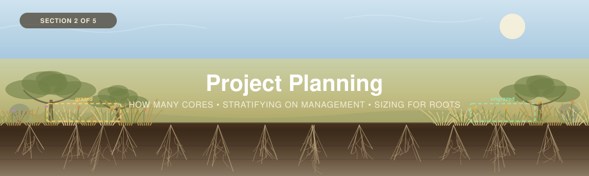
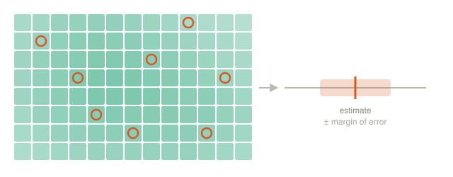
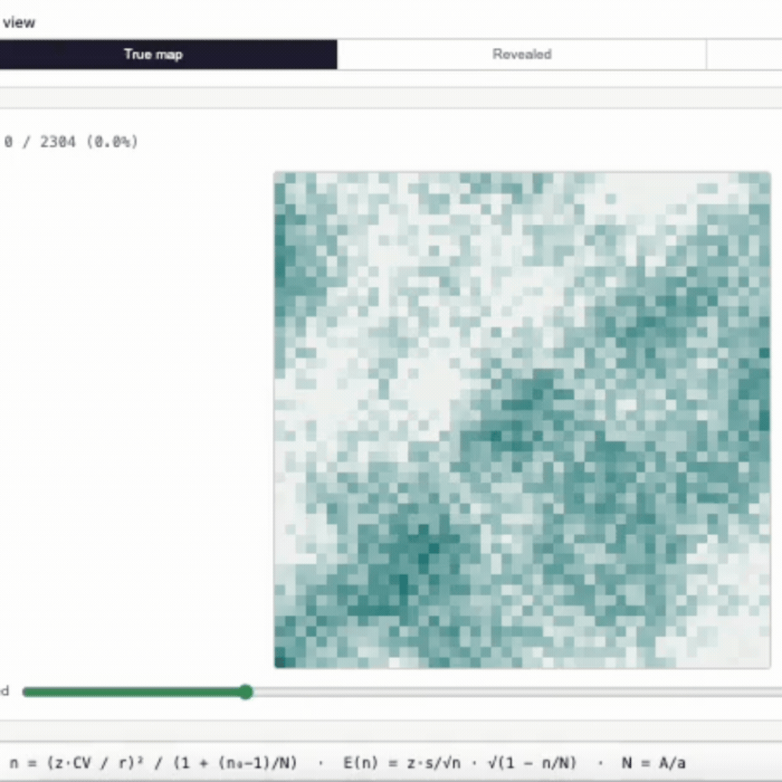
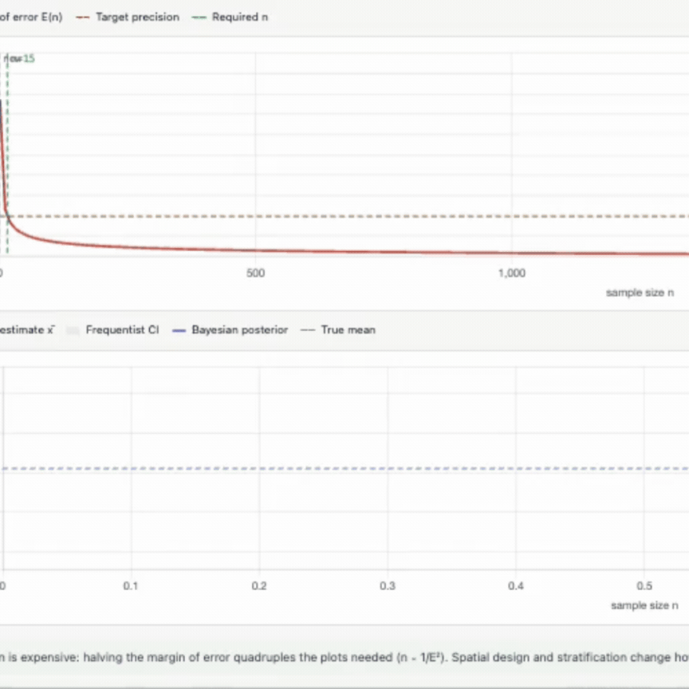
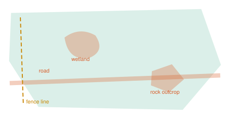
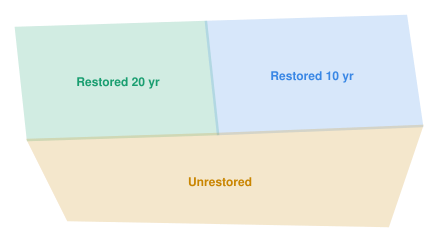
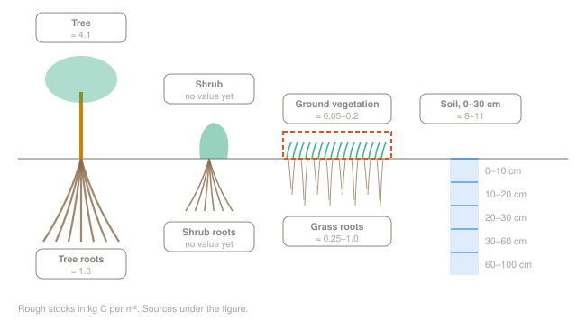
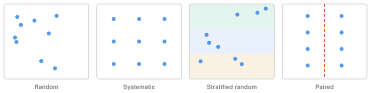
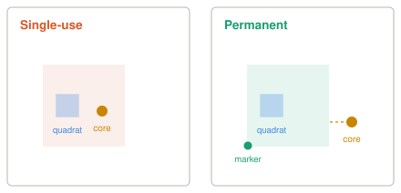

<p align="center">
  
</p>

---

[← 1 — Background](../01_Background/) · [Back to main guide](../README.md) · Next: [3 — Field Methods →](../03_Field_Methods/)

---

# Part 2 — Project Planning

## From a carbon question to a sampling design

**Quick links:** [Sampling Design Guide](../../_Shared/Sampling-Design-Eng-2026.pdf) · **Terrestrial Carbon Planning Tool for Grasslands** *(link to be added)* · [Non-spatial Planning Spreadsheet](Sampling%20Design%20Tools/grassland-sample-allocation.xlsx) · [Vegetation Field Guide](../../_Shared/Vegetation-FINAL-Eng-2026.pdf) · [Non-Peat Soils Field Guide](../../_Shared/Non-peat-FINAL-Eng-2026.pdf) · [Appendix A](#appendix-a--a-brief-lesson-in-sampling-logic)

> 🧩 **[PLACEHOLDER — TOOL LINK]** for claude - link to tool here - https://ski.users.earthengine.app/

---

**Before collecting soil cores**, four questions are worth addressing:

1. **What do I want to know?** Am I establishing a baseline, comparing management or restoration areas, tracking recovery, or doing some combination of these?
2. **Where does that question apply?** The whole study area, one area, a restoration plot, or the area disturbed in a particular year?
3. **How much data do I need?** How precise does the result need to be, how confident do I need to be, and how many samples can we collect and analyse?
4. **Where should the samples be collected?** Which locations should we establish plots and collect the samples?

Answering these questions is what a **sampling design** aims to achieve. It turns a carbon question into a field plan: a study area boundary, a set of unique sites, identified carbon pools, a number of samples, and a set of sampling plot coordinates.


> Note: The methods here follow WWF-Canada's [Sampling Design Guide](../../_Shared/Sampling-Design-Eng-2026.pdf), [Vegetation Field Guide](../../_Shared/Vegetation-FINAL-Eng-2026.pdf), and [Non-Peat Soils Field Guide](../../_Shared/Non-peat-FINAL-Eng-2026.pdf).

Two accompanying tools appear throughout:

<table>
<tr>
<td width="50%">

**🗺 Terrestrial Carbon Planning Tool for Grasslands**  (for claude add hyper link to to link here - https://ski.users.earthengine.app/)
Draw or upload the boundary, add strata (optional), select pools, calculate the minimum sample allocation, generate plot coordinates using different methods, and export.


</td>
<td width="50%">

**📄 [Non-spatial Planning Spreadsheet](Sampling%20Design%20Tools/grassland-sample-allocation.xlsx)**  
An alternative for teams that prefer to calculate plot and sample requirements without using a map-based interface. Enter the same study area variables, such as study area size, precision, accuracy, and a minimum sample size estimate is suggested.

<p align="center">
  <a href="Sampling%20Design%20Tools/grassland-sample-allocation.xlsx"></a>
</p>


</td>
</tr>
</table>

If you want to know how the calculator returns the number it does and dive deeper into the methods behind the tools, look to [Appendix A](#appendix-a--a-brief-lesson-in-sampling-logic) at the bottom of this page, where we go through how sample size is estimated before sampling, and how to check whether the sampling met your goals afterwards.

Together, the tools support five steps:

| # | Step | Answers |
|---|---|---|
| 1 | **[Define the study area](#step-1--define-your-study-area)** | *Where, roughly, am I working?* |
| 2 | **[Stratify the study area](#step-2--stratify-your-study-area-optional)** *(optional)* | *Does it contain distinct stewardship areas or environmentally distinct sites?* |
| 3 | **[Choose measurements and plot design](#step-3--choose-measurements-and-configure-the-nested-plot)** | *Which pools and plot sizes does the project need?* |
| 4 | **[Determine how many plots and samples](#step-4--decide-how-many-plots-and-samples)** | *How much field and laboratory sampling is required?* |
| 5 | **[Place and finalize the plots](#step-5--place-and-finalize-the-plots)** | *Where do plots go, and will they be permanent or single-use?* |


---

## Background: What sampling is, and why it works

Measuring every square metre of an ecosystem is rarely feasible. Instead, we measure a **small portion** and use it to estimate the whole. Because an estimate built from a portion will not be exactly right every time, we also report its uncertainty. This is the basis of **probability-based sampling**.

<table>
<tr>
<td width="60%">


</td>
<td width="40%">

**Sampling** = taking a small portion of a thing to make an informed estimate of the whole.

A **sampling design** is the framework for choosing what and where to sample by dividing the study area into sites and plots, measuring those, and combining them into an estimate for the full area.

</td>
</tr>
</table>

 Therefore, a carbon result using this method is usually reported in three parts:

| Component | Symbol | What it tells you |
|---|---|---|
| **The Estimate** | $\bar{x}$ | The average carbon value measured across sampled plots. |
| **A Relative margin of error** | $E$ | The distance from the estimate to the edge of the interval, expressed relative to the mean—for example, ±20%. |
| **A Confidence level** | $1-\alpha$ | How often intervals built by this procedure would contain the true value over repeated sampling. |

Put together, a result might read: *"Mean soil carbon = 100 ±20 units at 90% confidence."*

### Seeing it on a map

To visualize how this works, imagine you have an area of land you are interested in measuring carbon, your **study area**. The study area can be sectioned into possible **plot locations**, which are the squares below. A **sample** or small portion of this squares will be measured for carbon. To estimate the entire **study area**, the average of all of samples will be calculated, (The orange line) along with how a range in which 90% of the samples will fall within (the light orange box around the mean), with an expected degree of error, which tells us if we were to run this over again, how likely would the mean fall within the orgaone box.

<p align="center">
  
</p>

To help experiment with how the different inputs affect sampling, please see this  **[Sample Size Visualization Tool](https://blue-carbon-hub.projects.earthengine.app/)**.

<table>
<tr>
<td width="35%">



</td>
<td width="65%">

The bottom-left map is a hypothetical carbon map, where each square is the carbon value at that location. Switch between the **True value** and the **Revealed** view to watch the map uncover itself one sample at a time.

</td>
</tr>
</table>

<table>
<tr>
<td width="35%">



</td>
<td width="65%">

On the right, we see how each sample on the map is combined together to estimate the **true value** (dashed blue line). With a few samples the estimate is off and the error range (purple) is wide. As samples accumulate, it narrows.

**That purple band is your margin of error** — watch it shrink as the number of samples grows.

</td>
</tr>
</table>

### The takeaway

- Sampling estimates what's impractical to measure directly.
- The same process that produces an estimate can also tell you whether differences *within* or *between* sites are statistically significant.
- And it runs **backwards**: fix the precision you want, and it returns the number of cores needed to get there. That's Step 4, see [Appendix A2](#a2--working-backwards-from-precision-to-sample-size).

---

## Part 2 - Implementing a sampling design

<details>
<summary><b>📊 Meet the team at the Northern Oak Savannah</b> &nbsp;·&nbsp; <i>the worked example, in brief</i></summary>

<br>

As we cover the 5 steps for designing a carbon sampling project, we will show a hypothetical team, the Northern Oak team, as they plan a grassland carbon survey across their savannah grasslands. Their land includes sites both before and after restoration.

The team wants to answer two questions:

**A)** What is the current soil carbon stock across the project area?

**B)** Do restoration age and disturbance history correspond to differences that should be monitored over time?

They expect to measure soil, roots, ground vegetation, shrubs, and scattered trees. Because root biomass is more variable and expensive to process, they will set separate soil and root targets. They also want the option to revisit the site, so permanent-plot requirements must be decided before fieldwork.

 **[PLACEHOLDER — INSERT WORKED EXAMPLE]** 

</details>

# Step 1 — Define your study area

*Where, roughly, am I working?*

Every carbon value derived from a plot is first expressed per unit area (typically as kg/m^2 or tonnes/hectare). The boundary defined here is what turns this carbon **density** into a carbon **total**. It also defines the area size, which informs the sample allocation in step 4..

<p align="center">
  
</p>

The boundary may be a polygon drawn on a map or an existing boundary shapefile, geojson, or GEE geometry asset. Record the area in **m²** for further planning.

<details>
<summary><b>📊 Worked example</b> &nbsp;·&nbsp; <i>how the Northern Oak team defined its area</i></summary>

<br>


> 🧩 **[PLACEHOLDER — EXAMPLE DATA]** Add an illustrative site area, the boundary rule, exclusions, and whether each included unit is native, seeded, or restored. Link to the full worked example.

</details>

### 🛠 Your turn

<table>
<tr>
<td width="45%">


</td>
<td width="55%">

**In the Terrestrial Carbon Planning Tool:**

1. Draw or upload the project boundary. Use the geometry tools at the top left of the map to draw the area, or upload a Google Earth Engine asset.
2. Select **Measure this site** to get the area in square metres (m²).

</td>
</tr>
</table>


> [!TIP]
> **✅ Before moving on, you should have:**
> - A boundary polygon or clearly sketched area
> - Its total area in m² and hectares

---

## Step 2 — Stratify your study area (optional)

*Does the study area contain distinct areas you want to compare?*

This step is **optional**. You can skip it if the study area is fairly uniform and you do not plan to compare parts of it. If you skip it, use the whole study area in the following steps.

**Stratification** divides the study area into sub-areas, called **sites** or **strata**. If the project intends to compare management units, restoration ages, or burn histories, for example, it is important to ensure that enough samples are collected in each stratum.

Stratification can reduce within-group variation and makes planned comparisons possible. A useful stratum is linked to the project question, can be mapped, and has an area that can be used when combining results.

<p align="center">
  
</p>


[Part 5 — Monitoring](../05_Monitoring/) has more detail on monitoring carbon over time and comparing age classes.

<details>
<summary><b>📊 Worked example</b> &nbsp;·&nbsp; <i>how the Northern Oak team divided the study area</i></summary>

<br>

The team divided their study area into three sites:

- **Site 1** is a natural reference site where no disturbance has occurred.
- **Site 2** was restored 15 years ago.
- **Site 3** was recently restored.

The team will use the data from each site to calculate the carbon stock for each site separately.


</details>

### 🛠 Your turn

**In the Terrestrial Carbon Planning Tool:**

Start with the boundary from Step 1. If your new areas fall outside it, re-draw the boundary first. Then choose one of two ways to stratify.

(For claude - put these into a 2 by 2 table, with the images on the left and the text on the right. the images should be small to medium in size, so a bit smaller than thye are now)

**Option 1 — Manually.** Draw each stratum and give it a name. The tool assigns each a unique colour and treats it as distinct.


**Option 2 — Automatically.** Use pre-defined land cover classes, or group areas based on satellite imagery.


> [!TIP]
> **✅ Before moving on, you should have:**
> - One larger study area
> - Optionally, a set of mapped sub-areas (strata). If you did not stratify, the whole study area is treated as one stratum.
> - A name and an area in m² for every stratum

---

## Step 3 — Select the carbon pools and plot designs

*Which pools, plot sizes and plot types does the project need?*

As we learned in the [background](../01_Background/#grasslands-and-their-carbon-pools), carbon is stored in several pools, including above-ground plant biomass (called shoots), below-ground plant biomass (called roots), and soils. A **stock** is the amount stored at a defined place and time.

(for claude - Update this figure to halve roots under each of the plants. And beside every pool, add a rought estiamte for grassland stock (for example beside trees add a small text bubble with AGBtree = 4.5 kg/m^2), (AGBshrub = 1.2), etc. I just made up these numbers but rpelace with actual values from canadian literatture). there should be 1 carbon stock value for tree, tree roots, shrub shrub roots,, ground vegetation, ground vegetation roots, soil, )

<p align="center">
  
</p>

Soil is expected to contain the largest long-lived carbon pool in most grassland projects, but roots, shoots, shrubs, and scattered trees may also be of interest.

**Choosing soil sampling depth.** Choose a target sampling depth from the actual rooting depth and the project question, since a shallow core can miss part of the carbon (see the [background](../01_Background/#where-the-carbon-is-and-why)).

<details>
<summary><b>Overview of field and lab methods for each carbon pool</b></summary>

<br>

| Pool | Field method | Lab method | Planning recommendation |
|---|---|---|---|
| **Soil** | Soil cores (or a pit with bulk-density rings), sectioned by depth increment. Record core length and the depth of the hole, so compaction can be checked. | Dry at 65 °C to stable mass to get dry bulk density. Measure carbon content by loss-on-ignition (LOI550) or a CHN elemental analyzer. Where soils may contain carbonate, pair LOI with CHN total carbon (Lab Guide). | ✅ Include in a soil-carbon project. |
| **Roots** | Collected with the soil cores, using the project's root/soil boundary rule. | Wash roots from the soil over a sieve, dry, weigh, and convert to carbon. Processing is intensive. Record the sieve mesh, drying temperature, and carbon fraction ([Part 4](../04_Data_Interpretation/)). | ✅ Include when below-ground living biomass is part of the question; set its own precision target. |
| **Shoots** | Clip-and-weigh in the small plot (0.25 m²), bagging each clipping separately. | Oven-dry at 50–80 °C for 48–72 h, weigh, and convert dry biomass to carbon (Vegetation Guide). | ✅ Often useful, but report it as a time-specific standing crop. |
| **Shrubs** | Medium plot: record species and measure each shrub's volume. | No lab work. Biomass comes from a shrub-volume allometric equation, then converts to carbon (Vegetation Guide). | ⬜ Include where present and relevant. |
| **Trees** | Large plot: record species, DBH, and height for each tree over 2 m. | No lab work. Biomass comes from allometric equations, then converts to carbon. | ✅ Include any tree taller than 2 m that falls within the agreed protocol. |
| **Litter** | Needs a separate collection protocol. | Needs a separate processing protocol. | ⬜ Outside the current method unless a documented protocol is added. |
| **Dissolved organic carbon (DOC)** | Water samples from the water table (for example from a well or piezometer). Not collected by soil coring. | Filter (commonly 0.45 µm), keep cool, and analyse on a total organic carbon analyzer. Reported as a concentration (mg C/L). | ⬜ Optional and **outside the workshop method**. Relevant mainly where there is a shallow water table, such as wet meadows and riparian areas. Not included in the stock totals or the sample-size calculation. |

</details>


### Are there trees?

If there are trees in your plots you are interested in measuring, please refer to the [Forests large-plot method](../../Forests/03_Field_Methods/3A_Trees.md), then carry the result into this workshop's vegetation data workflow. The medium plot covers woody stems from **0.5–2 m**.

### Build the nested plot

When several carbon pools are measured, use an **integrated—or nested—plot design**. The vegetation plots share one centre mark, allowing every measurement to be tied to the same location without using the same footprint for every vegetation layer.

(for claude make this image a bit smaller)


The figure shows a 20 × 20 m large plot (400 m²) for trees taller than 2 m, a 10 × 10 m medium plot (100 m²) for shrubs and vegetation 0.5–2 m, and a 1 × 1 m small plot for ground vegetation below 0.5 m.
(for claude - this sentence above and this list belwo are redundnact, fold into 1 list. Keep it in same style as list below)
- **Large plot** (where trees occur): 400 m².
- **Medium plot:** 25 m² by default. Document any other approved size within the guide's 16–100 m² range (the figure shows the 100 m² upper end).
- **Small plot:** 0.25 m² quadrat. Document any approved alternative within the guide's 0.25–1 m² range.
- **Soil/root sampling point:** a recorded point or offset, sampled by depth increment.

<details>
<summary><b>📊 Worked example</b> &nbsp;·&nbsp; <i>what the Northern Oak team chose to measure</i></summary>

<br>

> 🧩 **[PLACEHOLDER — EXAMPLE DATA]** Add the chosen pools, reasons for inclusion and exclusion, tree decision, full-profile target, reporting windows, and depth increments.

</details>

### 🛠 Your turn

Use this decision tree from the WWF-Canada Sampling Design guide to choose the plot design. It answers three things: which carbon pools are measured together, whether single-use or permanent plots are best, and whether an integrated plot design is best or the pools should be kept separate.

<table>
<tr>
<td width="50%">


<sub>Source: WWF-Canada (2025), *Carbon Measurement: Sampling Design*, p. 18, reproduced with permission.</sub>

</td>
<td width="50%">

**Quick notes**

**Single-use or permanent? (Q1 and Q1.2)**

- Will you return to sample this plot again? **Yes → permanent. No → single-use.**
- Destructive sampling (soil cores, clipping) only changes *where* you sample. In a permanent plot, take destructive samples **outside** the plot boundary. In a single-use plot you may sample inside it.
- Complete non-destructive measurements first.

**Integrated or separate? (Q2)**

- Measuring **more than one pool** (trees, non-tree vegetation, soil)? **Yes → integrated (nested) plot**, with all plots sharing one centre.
- Measuring **only one pool**? Use a separate plot: a **tree plot**, a **non-tree vegetation plot**, or a **soil plot**.

**For a grassland project**

- Soil, roots and shoots are usually measured together, so an **integrated plot** is usually best.
- Roots come from the soil cores, so they do not need their own plot.
- Plot placement and the permanent/single-use decision are finalized in [Step 5](#step-5--place-and-finalize-the-plots).

</td>
</tr>
</table>

Complete the decision table in the tool or the [planning worksheet](templates/project-planning-worksheet.md):

> [!TIP]
> **✅ Before moving on, you should have:**
> - A list of the carbon pools you will measure
> - The type of plot you will be setting up

---

## Step 4 — Decide how many plots and samples

*How much sampling is required?*

This step covers a method for estimating the minimum number of samples to collect in order to meet certain level of statistical accuracy. Remember from above, we are trying to get the orange line (carbon estimate, within that orange block with a level of accuracy of at least 20% margin of error

In order to obtain this estimate, we can use one of two decision support tools from above:
Two accompanying tools appear throughout:

<table>
<tr>
<td width="50%">

**🗺 Terrestrial Carbon Planning Tool for Grasslands**  (for claude add hyper link to to link here - https://ski.users.earthengine.app/)
Draw or upload the boundary, add strata (optional), select pools, calculate the minimum sample allocation, generate plot coordinates using different methods, and export.


</td>
<td width="50%">

**📄 [Non-spatial Planning Spreadsheet](Sampling%20Design%20Tools/grassland-sample-allocation.xlsx)**  
An alternative for teams that prefer to calculate plot and sample requirements without using a map-based interface. Enter the same study area variables, such as study area size, precision, accuracy, and a minimum sample size estimate is suggested.

<p align="center">
  <a href="Sampling%20Design%20Tools/grassland-sample-allocation.xlsx"></a>
</p>


</td>
</tr>
</table>

No matter which tool you decide to use, they both require the following information about your study area:
| Variable | Meaning |
|---|---|
| **Area** (m²) | The area of each stratum from Step 2, or of the whole study area if you did not stratify. |
| **Relative margin of error** ($E$) | How precise the estimate needs to be. |
| **Confidence level** | How reliable the interval-building procedure needs to be. |
| **Estimated prior mean** | What is the best guess for the carbon stock? |
| **Estimated prior standard deviation** | How much does the carbon stock vary across your area? |

### Where the prior comes from

The prior should describe the variability the field crew expects to encounter between samples—not only the broad regional pattern.

| Preference | Source | Use when |
|---|---|---|
| **1** | A pilot survey: mean and standard deviation from the site's own samples | Best option when a pilot is feasible. |
| **2** | Published data from a comparable grassland, management history, depth, and method | No site data are available, but a defensible analogue exists. |
| **3** | AAFC/CanSIS or another soil map; SoilGrids as a fallback | Early scoping only, with an explicit uncertainty warning. |


(for claude - in teh field methods we will only suggest root subsampling from soil cores, add this sentence below as a note)

Because soil and roots can come from the same core, the team may analyze soil carbon from every core and wash roots from a random subset. Choose that subset randomly—not according to which samples look interesting—and report the root sample size explicitly.)

### Setting a target precision for each pool

Separate precision targets may produce a more realistic design:

| Illustrative design | Soil target | Root target | Approximate field samples |
|---|---:|---:|---:|
| Same target for both | ±20% | ±20% | 36 |
| **Different pool targets** | ±20% | ±40% | 11 |
| Tighter root estimate | ±20% | ±30% | 17 |


<details>
<summary><b>📊 Worked example</b> &nbsp;·&nbsp; <i>what the Northern Oak team calculated</i></summary>

<br>

</details>

### 🛠 Your turn

Use either route below. Both require the same assumptions and should leave the same decision record.

<table>
<tr>
<td width="50%">

**🗺 Spatial planning tool**

Use the **Terrestrial Carbon Planning Tool for Grasslands** when you want the allocation connected directly to the mapped study area and strata.

Enter:

- precision and confidence targets;
- a variability prior for each pool and its source;
- any operational minimum per stratum;
- whether roots will be processed from every core or a random subset.

The tool should return the number of plot centres, the pool-specific sample targets, and the allocation by stratum.

> 🧩 **[PLACEHOLDER — TOOL SCREENSHOT]** Add `images/step4_spatial_calculator.webp`: calculation inputs and the mapped allocation.

</td>
<td width="50%">

**📄 [Non-spatial Planning Spreadsheet](Sampling%20Design%20Tools/grassland-sample-allocation.xlsx)**

Use the spreadsheet when the team prefers a table-based calculation or does not yet have mapped boundaries available in the planning tool.

The spreadsheet should contain:

- **Design** — confidence, precision and variability by pool;
- **Strata** — names and areas;
- **Results** — plot count, pool-specific sample count, per-stratum allocation and assumptions statement;
- **Sensitivity** — the effect of changing one assumption at a time.

> 🧩 **[PLACEHOLDER — SPREADSHEET SCREENSHOT]** Add `images/step4_spreadsheet_planner.webp`: input cells, soil and root results, and the assumptions summary.

</td>
</tr>
</table>


> [!TIP]
> **✅ Before moving on, you should have:**
> - A calculated sample size estimate based on study area size, precision, and margin of error

(For claude - add in a note here referencing the appendix - the appendix shoudl note there are several methods for estimating sample size, one of them being "minimal detectible deifference)

---

## Step 5 — Place and finalize the plots

*Where do the plots go*

There are several methods for distributing these plots across your study area, called **Sampling Strategies**

<p align="center">
  
</p>

Below are list of a couple useful strategies for sampling, each with there benefits and trade-offs. The table aims to describe different reasons why or why not a certain layout aligns with your project:
| Strategy | When to use it |
|---|---|
| **Random** | A reasonably uniform area with no planned internal comparison |
| **Systematic grid** | A large or uniform area where even coverage is useful; verify that spacing does not align with furrows, treatment strips, or another repeating feature |
| **Stratified-random** | **Default when strata exist:** allocate plots, then randomize locations within each stratum |
| **Paired across a boundary** | The boundary itself is the comparison, such as grazed versus ungrazed or burned versus unburned; use an analysis designed for pairing |
| **Convenience/practical** | A preliminary or capacity-limited assessment whose limitations will be stated clearly |

There are many GIS tools that are available to implement this step, including our (insert hypoer link to the grasslands planning tool here)

### Step 5 of the planning tool:

In the planning tool, use the Step 4 plot sample size estimator to inform how many plots are requires to meet your goals.
Then use step 5 to distribute them based on your desired method:

(Note to self Show different sample distributions from the same stratified area)

(For claude im moving this below)

### 🛠 Your turn

<table>
<tr>
<td width="45%">

> 🧩 **[PLACEHOLDER — TOOL SCREENSHOT]** Add `images/step5_tool_export.webp`: generated plot centres, permanent/single-use designations, destructive-sampling offsets, and the export panel.

</td>
<td width="55%">

**In the Terrestrial Carbon Planning Tool:**

1. Choose and justify the sampling strategy.
2. Generate the allocated plot centres.
3. Review access and safety constraints using a documented replacement rule.
4. Assign each plot as permanent or single-use.
5. Apply the nested layout from Step 3.
6. Record destructive-sampling offsets.
7. Export the field package.

The export should include CSV, GeoJSON or KML, a printable map, plot identifiers, stratum assignments, plot type, layout dimensions, offsets, replacements, and the random seed.

</td>
</tr>
</table>

<details>
<summary><b>📊 Worked example</b> &nbsp;·&nbsp; <i>how the Northern Oak plots were finalized</i></summary>

<br>

> 🧩 **[PLACEHOLDER — EXAMPLE DATA]** Show the allocation by stratum, anonymized plot map, nested layout, permanent and single-use components, core-offset rule, replacement rule, and exported field package.

</details>

### 5B — Decide between permanent and single-use plots

This is a planning decision, not one to leave to the field crew.

<p align="center">
  
</p>

| | **Single-use plot** | **Permanent plot** |
|---|---|---|
| **Use when** | The location will be measured once | The same vegetation will be measured again |
| **Marker** | Temporary centre marker and recorded GPS position | Relocatable centre marker, GPS, photographs, bearings and distances from stable features |
| **Non-destructive work** | Complete first | Repeat using the same plot boundary and protocol |
| **Destructive work** | May occur inside the plot after all non-destructive measurements | Must occur outside the protected vegetation plot |
| **Records** | Plot ID, coordinates, layout and collected samples | Plot ID, coordinates, layout, marker description, photographs and every destructive-sample offset |

A project does not have to use only one type. For example, it may combine **permanent nested vegetation plots** with separately located **single-use soil or clipping points**. The important requirement is that the relationship between them is fixed and recorded.

> [!TIP]
> **✅ Before moving on, you should have:**
> - A sampling strategy chosen and justified
> - A per-stratum plot allocation
> - A coordinate list and field map
> - A nested layout for every plot type
> - Permanent and single-use designations
> - A destructive-sampling offset plan
> - A reproducible record of the random seed and replacements

---

## ✅ Sampling design complete

Before heading into the field, confirm that the spatial tool—or the combination of the non-spatial spreadsheet and a documented GIS workflow—has produced the complete planning package:

```text
☐ Study-area boundary, exclusions and net area       → Step 1
☐ Strata identified, or stratification skipped       → Step 2 (optional)
☐ Carbon pools, depths and nested layout selected    → Step 3
☐ Plot and pool-specific sample counts calculated    → Step 4
☐ Plot centres generated and assigned                → Step 5
☐ Permanent/single-use status recorded               → Step 5
☐ Destructive-sampling offsets documented            → Step 5
☐ Map, coordinates, identifiers and field sheets     → Field package
```

Then confirm the grassland-specific decisions:

| | Readiness item |
|---|---|
| ☐ | Management, restoration, cultivation, grazing, and fire history recorded where relevant |
| ☐ | Trees taller than 2 m confirmed as present/in scope or absent/out of scope |
| ☐ | Soil and root targets recorded separately |
| ☐ | Root subsampling plan recorded, if used |
| ☐ | Permanent vegetation areas protected from destructive sampling |
| ☐ | Replacement locations and the random seed retained |
| ☐ | Sampling season chosen and justified for vegetation measurements |

The same decisions should be stored in the exported tool summary or the
**[`templates/project-planning-worksheet.md`](templates/project-planning-worksheet.md)**.

<details>
<summary><b>📊 The Northern Oak plan at a glance</b></summary>

<br>

| Step | Decision |
|---|---|
| 1 — Study area | 🧩 **[PLACEHOLDER]** Area, boundary rule, and exclusions |
| 2 — Stratify *(optional)* | 🧩 **[PLACEHOLDER]** Reference, 15-year-restored, and recently restored strata |
| 3 — Pools | 🧩 **[PLACEHOLDER]** Soil, roots, vegetation, shrubs, and trees in scope |
| 4 — Sample size | 🧩 **[PLACEHOLDER]** Separate soil/root targets and final field count |
| 5 — Locations | 🧩 **[PLACEHOLDER]** Allocation, coordinate method, plot layout, and permanent-plot decision |

**→ [Read the full planning walkthrough](../Worked_Example/02_Project_Planning.md)**

</details>

You now have what the field team needs: a boundary, strata (or a documented decision not to stratify), selected carbon pools and depths, sample counts, plot coordinates, and a plot layout.

What remains is the fieldwork itself. **Part 3** covers equipment, plot setup, vegetation measurements, soil and root cores, field records, and sample handling.

**Next: [Part 3 — Field Methods →](../03_Field_Methods/)**

---

## Appendix A — A brief lesson in sampling logic

*The calculations behind the planning workflow*

Steps 1–5 do not require the full derivation. Use this appendix when you need to explain or audit a sample-size decision.

| Section | Topic | Used in |
|---|---|---|
| [A1](#a1--what-an-estimate-actually-is) | What an estimate actually is | Background |
| [A2](#a2--working-backwards-from-precision-to-sample-size) | Working backwards from precision | Step 4 |
| [A3](#a3--finite-population-correction) | Finite-population correction | Step 4 |
| [A4](#a4--what-drives-sample-size) | What drives sample size | Step 4 |
| [A5](#a5--the-proportion-form) | Estimating a proportion | Step 4 |
| [A6](#a6--symbol-crosswalk) | Symbol crosswalk | Step 4 |
| [A7](#a7--allocation-across-strata) | Allocation across strata | Step 5 |
| [A8](#a8--after-the-campaign-did-you-hit-the-target) | Achieved precision | Step 4 |
| [A9](#a9--normal-planning-and-small-sample-intervals) | Normal planning and small samples | Step 4 |
| [A10](#a10--why-roots-may-need-more-samples) | Why roots may need more samples | Step 4 |

> 📚 **[STATISTICAL REVIEW NEEDED]** Validate the notation, formulas, assumptions, and examples against the final calculator and cited statistical guidance before publication.

### A1 — What an estimate actually is

The sample mean, $\bar{x}$, estimates the study population's mean. Its estimated standard error is:

$$SE = \frac{s}{\sqrt{n}}$$

where $s$ is the sample standard deviation and $n$ is the number of independent samples.

The square-root relationship drives sampling economics: under the simple assumptions used here, achieving roughly twice the precision requires about four times as many samples.

If $E$ is a **relative** margin of error, a normal-approximation planning relationship can be written:

$$E\bar{x} = z\frac{s}{\sqrt{n}}$$

The multiplier $z$ depends on the chosen confidence level.

### A2 — Working backwards from precision to sample size

Rearranging the planning relationship gives:

$$n = \left(\frac{z\,CV}{E}\right)^2, \qquad CV = \frac{s}{\bar{x}}$$

Using the coefficient of variation makes the relationship scale-free. The result depends on relative variability rather than whether carbon is reported in kg C/m² or Mg C/ha.

This approximation assumes independent samples, a defensible variability prior, and a design compatible with the intended analysis. It is a planning starting point, not a substitute for a design-specific analysis.

### A3 — Finite-population correction

When a finite population of possible sampling units is defined, a finite-population correction may be written:

$$n \geq \frac{z^2 N CV^2}{(N-1)E^2 + z^2 CV^2}$$

where $N$ is the number of possible sampling units under the chosen plot footprint.

For large $N$, the result approaches the simpler expression in A2. The practical importance of this correction depends on how the sampling unit and population are defined.

> 📚 **[METHOD REVIEW NEEDED]** Confirm that the chosen definition of $N$ is appropriate for point cores and nested grassland plots before using area ÷ plot footprint as a universal population count. **The calculator does not apply this correction** — it uses the A2 form, which is the conservative choice while the definition of $N$ is unresolved.

### A4 — What drives sample size

In the simple planning relationship:

- halving relative margin of error increases sample size substantially because $E$ is squared;
- doubling the CV increases sample size substantially because $CV$ is squared;
- raising confidence increases $z$ and therefore sample size;
- increasing area alone may have little effect once the number of possible sampling units is large.

**Precision and variability usually matter more than total area.** The project controls the target precision and confidence level, but it does not control the site's true variability. That is why a pilot can be valuable.

One knob at a time, from the calculator's `4. Sensitivity` tab:

| Change | From | To | Samples |
|---|---|---|---:|
| Baseline — soil, CV 0.30, ±20%, 90% | | | **9** |
| Variability | CV 0.30 | CV 0.70 | **36** |
| Precision | ±20% | ±30% *(roots, CV 0.70)* | **17** |
| Precision | ±20% | ±40% *(roots, CV 0.70)* | **11** |
| Confidence | 90% | 95% *(soil, CV 0.30)* | **12** |

*Regenerated by `_source/build_grass_alloc.py`. Do not edit these by hand in both places — re-run the script.*

### A5 — The proportion form

Some questions concern a proportion—for example, the fraction of plots with a particular condition. One finite-population planning form is:

$$n \geq \frac{z^2 Npq}{(N-1)E^2 + z^2pq}, \qquad q = 1-p$$

When no prior proportion is available, $p=0.5$ is often used because it maximizes $pq$ and produces a conservative starting sample size for an absolute margin-of-error formulation.

> 📚 **[METHOD REVIEW NEEDED]** Confirm whether $E$ is absolute or relative in the selected reference and calculator. Do not mix the two formulations.

### A6 — Symbol crosswalk

| This guide | Common alternative | Meaning |
|---|---|---|
| $z$ | $Z_{\alpha/2}$ | Normal multiplier set by confidence level. |
| $E$ | $e$ or $e_{rel}$ | Target margin of error; label absolute versus relative explicitly. |
| $s$ | $SD$ | Expected or observed standard deviation. |
| $CV$ | $CV$ | Coefficient of variation. |
| $N$ | $N$ | Number of possible sampling units. |
| $n$ | $n$ | Number of samples or plots. |

> 📚 **[REFERENCE CHECK NEEDED]** Cross-check notation against the exact edition of the UNFCCC A6.4 Sampling and Surveys tool or other referenced calculator before stating that formulas are identical.

### A7 — Allocation across strata

A simple area-proportional allocation is:

$$n_h = \frac{A_h}{A}\,n$$

where $A_h$ is the area of stratum $h$, $A$ is total study area, and $n_h$ is that stratum's allocation.

Round using a documented rule and apply the chosen minimum per stratum. Both push the total above $n$, which is expected: rounding down or allowing a two-sample stratum would leave that stratum without an estimable variance.

Area-proportional allocation is not always optimal. When variability and processing cost differ among strata, a design such as Neyman or cost-adjusted allocation may be more appropriate. **The calculator implements the area-proportional case only.**

### A8 — After the campaign: did you hit the target?

Planning uses expected variability. After sampling, calculate achieved relative margin of error using the observed mean and standard deviation:

$$RME = \frac{t\,SE}{\bar{x}}, \qquad SE = \frac{s}{\sqrt{n}}$$

Use the multiplier and degrees of freedom appropriate to the actual design and analysis. Report achieved precision separately for soil and roots.

If the target is missed:

1. Check raw data, units, depths, bulk density, and laboratory records.
2. Investigate documented sources of heterogeneity without inventing post hoc groups.
3. Add samples using the observed variability and a pre-defined rule where feasible.
4. Otherwise report the achieved interval honestly and explain the limitation.

The [planning worksheet](templates/project-planning-worksheet.md) has a section for this, so the
plan and the outcome sit on the same page.

### A9 — Normal planning and small-sample intervals

The basic planning equation uses a normal multiplier, $z$. After sampling, when variability is estimated from a small sample, a Student's $t$ multiplier is generally larger. The difference shrinks as sample size increases.

The calculator applies a small-sample adjustment during planning. The algorithm is a fixed-point iteration:

$$n_0 = \left\lceil \left(\frac{z\,CV}{E}\right)^2 \right\rceil, \qquad n_{k+1} = \left\lceil \left(\frac{t_{n_k-1}\,CV}{E}\right)^2 \right\rceil$$

repeated until the value stops moving. Where it settles into a two-cycle rather than a fixed point — alternating between $n$ and $n+1$ — the larger is taken. The workbook unrolls six passes across hidden columns, which converges in three or four for every case quoted here, and avoids circular references or macros.

In the illustrative CV examples above the adjustment happened to add two samples in every case; that is a property of those displayed scenarios, not a universal rule. Both the plain and the adjusted figure appear on the `3. Result` tab so the adjustment is never invisible.

Report the design transparently, for example:

> "The initial planning value was calculated at 90% confidence and ±20% relative precision using a CV of 0.30 from the pilot. The field target was then increased using the documented small-sample rule."

### A10 — Why roots may need more samples

Soil carbon integrates inputs and redistribution over time. Living root biomass reflects the current spatial pattern of plants and can vary sharply over short distances. Where the root CV is greater than the soil CV, equal relative precision requires more root samples because:

$$\frac{n_{roots}}{n_{soil}} \approx \left(\frac{CV_{roots}}{CV_{soil}}\right)^2$$

Three planning responses are available:

| Option | Mechanism | Trade-off |
|---|---|---|
| **Separate precision targets** | Set a tighter target for soil and a wider target for roots. | Wider but explicit root interval. |
| **Root subsampling** | Analyze soil from all cores and roots from a random subset. | Root estimate rests on fewer samples. |
| **Change the sampling unit** | Consider a larger-diameter core or a documented composite. | More material per sample or loss of within-plot information. |

Compositing may reduce variation among analytical samples but removes information about variation among the components. Decide whether that trade-off is compatible with future monitoring before adopting it.

> [!IMPORTANT]
> State both the target and achieved precision for each pool. A wide, honest interval is more useful than a narrow claim the data do not support.

> [!NOTE]
> Ask a statistician or experienced sampling designer for help with paired/repeated designs, chronosequences, unequal-variance comparisons, spatial autocorrelation, detectable-change studies, or any design in which the final analysis differs from a simple mean.

---

## In this section

| File | Purpose | Status |
|---|---|---|
| `README.md` | Part 2 lesson | This revised draft |
| [`images/banner_planning.svg`](images/banner_planning.svg) | Grassland planning banner | ✅ Built |
| [`images/sampling_explainer.svg`](images/sampling_explainer.svg) | Probability-based sampling explainer | ✅ Built |
| [`images/sample_viz_reveal.gif`](images/sample_viz_reveal.gif), [`images/sample_viz_converge.gif`](images/sample_viz_converge.gif) | Sample Size Visualization Tool clips, from the eelgrass workshop | ✅ Copied |
| [`images/sample_size_explorer_static.svg`](images/sample_size_explorer_static.svg) | Static fallback for the Sample Size Explorer | Kept; not used on this page |
| [`images/step1_grassland_boundary.svg`](images/step1_grassland_boundary.svg) | Boundary and exclusions | ✅ Built |
| [`images/step2_stratification.svg`](images/step2_stratification.svg) | Management/restoration strata | ✅ Built |
| [`images/step3_carbon_pools.svg`](images/step3_carbon_pools.svg) | Pools and depth diagram | ✅ Built |
| [`images/step5_sampling_strategies.svg`](images/step5_sampling_strategies.svg) | Sampling strategy comparison | ✅ Built |
| [`images/step5_nested_plot_layout.svg`](images/step5_nested_plot_layout.svg) | Nested plot layout | ✅ Built |
| [`images/permanent_vs_single_use.svg`](images/permanent_vs_single_use.svg) | Permanent/single-use comparison | ✅ Built |
| `images/step1_tool_boundary.webp` | Planning-tool boundary screen | 🧩 Placeholder |
| `images/step2_tool_strata.webp` | Planning-tool stratification screen | 🧩 Placeholder |
| `images/step3_tool_plot_design.webp` | Pool selection and generated nested layout | 🧩 Placeholder |
| `images/step4_spatial_calculator.webp` | Spatial-tool allocation results | 🧩 Placeholder |
| `images/step4_spreadsheet_planner.webp` | Non-spatial spreadsheet inputs and results | 🧩 Placeholder |
| `images/step5_tool_export.webp` | Final plot map and export panel | 🧩 Placeholder |
| [`Sampling Design Tools/grassland-sample-allocation.xlsx`](Sampling%20Design%20Tools/grassland-sample-allocation.xlsx) | Non-spatial planning spreadsheet | ✅ Built |
| [`Sampling Design Tools/index.html`](Sampling%20Design%20Tools/index.html) | Sample Size Explorer (soil vs roots) | Kept; not used on this page |
| `Sampling Design Tools/` — Terrestrial Carbon Planning Tool for Grasslands | Spatial Steps 1–5 workflow and field-package export | 🧩 Placeholder |
| [`templates/grassland-boundary-template.geojson`](templates/grassland-boundary-template.geojson) | Boundary/strata template | ✅ Built |
| [`templates/project-planning-worksheet.md`](templates/project-planning-worksheet.md) | Participant decision record | ✅ Built |
| `../Worked_Example/02_Project_Planning.md` | Complete Northern Oak planning example | 🧩 Placeholder |

---

[← 1 — Background](../01_Background/) · [Back to main guide](../README.md) · Next: [3 — Field Methods →](../03_Field_Methods/)
