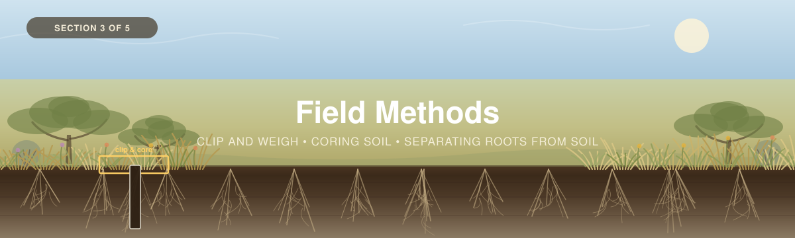
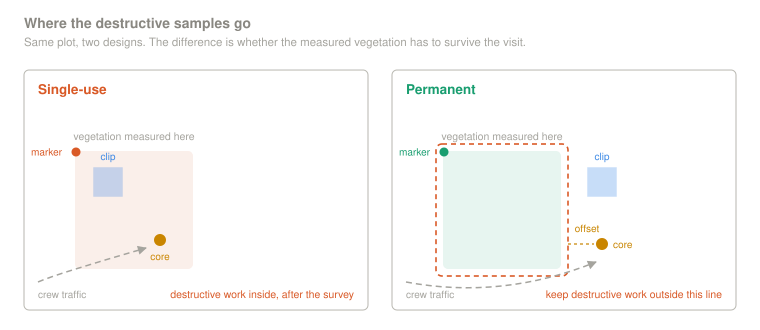
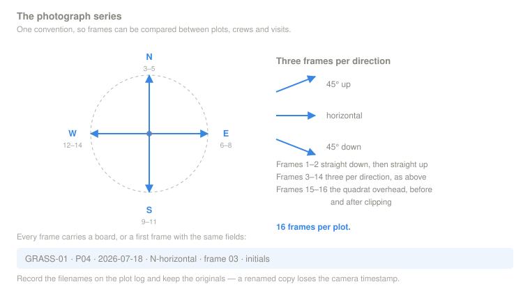
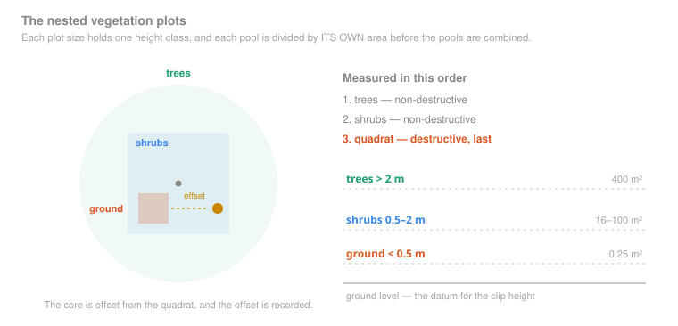
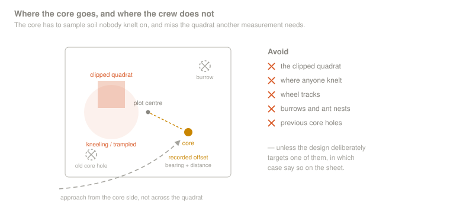
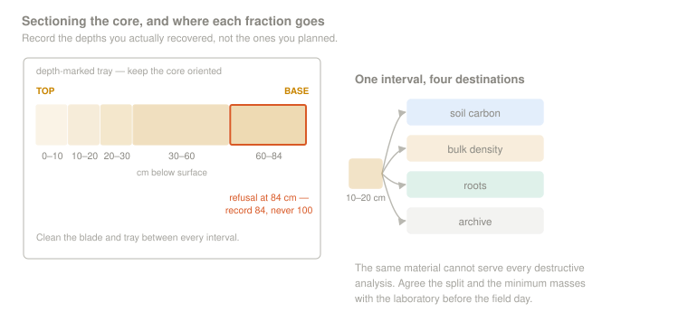
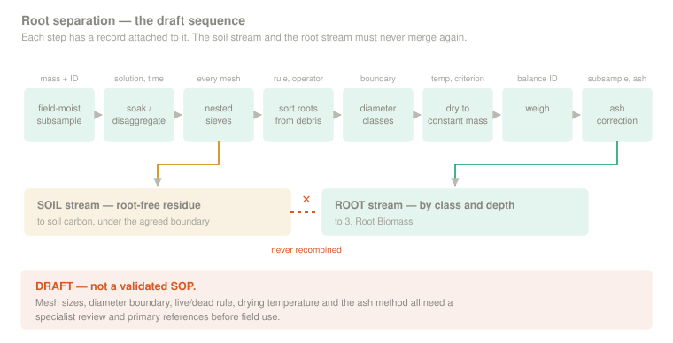

<p align="center">
  
</p>

---

# Part 3 — Field Methods

* Making observations, recording data, and collecting samples*

[← 2 — Project Planning](../02_Project_Planning/) · [Back to main guide](../README.md) · Next: [4 — Data Interpretation →](../04_Data_Interpretation/)

---

**Quick links:** [Vegetation Field Guide](../../_Shared/Vegetation-FINAL-Eng-2026.pdf) · [Non-Peat Soils Field Guide](../../_Shared/Non-peat-FINAL-Eng-2026.pdf) · [Sampling Design Guide](../../_Shared/Sampling-Design-Eng-2026.pdf) · [Laboratory Guide](../../_Shared/Lab-Guide-Eng-2026.pdf) · [Datasheets](datasheets/) · [Skill checklists](checklists/)

## Overview

Once the sampling design is set in [Part 2](../02_Project_Planning/), the field team turns that plan into measurements and labelled samples. This section covers plot setup, vegetation measurements, soil and root coring, depth increments, bulk-density records, root handling, and the field data sheets.

The work follows five stages:

| # | Stage | Answers | Primary record |
|---|---|---|---|
| 1 | **[Set up the plot and record conditions](#1-set-up-the-plot-and-record-conditions)** | *Where are we, what kind of plot is this, and what was here before we touched it?* | `1. Plot & Site Log` |
| 2 | **[Measure the vegetation](#2-measure-the-vegetation)** | *What is growing above ground?* | `4. Vegetation Data` |
| 3 | **[Collect the soil and root core](#3-collect-the-soil-and-root-core)** | *How deep did we sample, and what volume did we recover?* | `2. Soil Data` |
| 4 | **[Section, bag, and label the core](#4-section-bag-and-label-the-core)** | *Which material belongs to each depth interval?* | `2. Soil Data` |
| 5 | **[Separate the roots and finish the records](#5-separate-the-roots-and-finish-the-records)** | *How will soil and roots be kept distinct and auditable?* | `3. Root Biomass` |

### Sources for this section

- [*Measuring Carbon in Vegetation (Non-Tree)*](../../_Shared/Vegetation-FINAL-Eng-2026.pdf) (WWF-Canada, 2024)
- [*Measuring Carbon in Non-Peat Soils*](../../_Shared/Non-peat-FINAL-Eng-2026.pdf) (WWF-Canada, 2026)
- [*Carbon Measurement: Sampling Design*](../../_Shared/Sampling-Design-Eng-2026.pdf) (WWF-Canada, 2026)
- [*Supplemental Guide: Laboratory Analysis*](../../_Shared/Lab-Guide-Eng-2026.pdf) (WWF-Canada, 2026)


---


(We can move this section below and add as a drop down right before we get into the sampling)
> **Complete non-destructive vegetation measurements before coring or clipping disturbs the plot.**

Coring changes the surface and creates traffic around the sampling point. Clipping removes the vegetation another measurement may need. Plan the crew's movement so the unmeasured plot is protected.

For a **permanent plot**, keep destructive samples outside the permanent vegetation area and record their direction and distance from the marker.

```text
 1. Navigate, mark the plot, and record GPS             ──┐
 2. Lay out plot boundaries                               │
 3. Photograph the undisturbed plot                       │  non-destructive
 4. Record site, management, cover, and conditions        │
 5. Measure trees and shrubs                              ──┘
 6. Photograph and clip the small quadrat                ──┐
 7. Collect the offset soil/root core                      │  destructive
 8. Record recovery and section by depth                   │
 9. Bag, label, cool, and complete chain of custody       ──┘
```

> [!IMPORTANT]
> A single-use plot and a permanent plot do not use destructive sampling in the same place. Follow the [permanent-or-single-use design selected in Part 2](../02_Project_Planning/#permanent-or-single-use-plots) and show the destructive-sampling locations on the field map.

---

## Equipment

Before leaving, lay out the equipment and test the full workflow with the actual corer, labels, forms, coolers, and laboratory containers. Confirm the laboratory's sample mass, container, preservation, and chain-of-custody requirements before buying or pre-labelling supplies.

<table>
<tr>
<td width="33%">

**1 · Plot setup and records**

- GNSS unit and spare power
- Measuring tapes
- 0.25 m² quadrat or documented alternative
- Medium-plot markers, flags, and rope
- Permanent-plot marker and locator, if used
- Camera and photo board
- Waterproof notebook and pencils
- Printed datasheets and field map
- Pre-printed waterproof labels

</td>
<td width="33%">

**2 · Vegetation**

- Clippers or shears
- Collection bags matched to the lab method
- Cooler and ice packs
- Portable balance, if field mass is required
- Calipers and measuring tape
- DBH tape and height tool for trees
- Regional species reference
- Cleaning supplies between plots

</td>
<td width="33%">

**3 · Soil and roots**

- Corer with known internal diameter and liners
- Slide hammer or approved driving system
- Bulk-density rings where needed
- Soil probe or auger
- Clean knife, spatula, and trowel
- Depth-marked sectioning tray
- Bags/jars specified by the lab
- Caps, sleeves, cooler, and ice packs
- Equipment-cleaning and decontamination supplies

</td>
</tr>
</table>

Here are the equipment images: 


And here is the proper list - For setting up a plot:
• GPS
• Work gloves
• Soil probe
• Measuring tape
• Utility knife
• Camera
• Notebook
• Permanent markers
• Tarps
• Scissors
• Resealable bags
For taking a soil core:
• Soil corer
• Core extraction tool
• Cooler or storage box
• Tarps
• Plastic tubes
• Plastic tube end caps
• Notepad
• Permanent markers
• Measuring tape
• Duct tape
• Packing materials
• Cooler
For taking soil samples
with a soil pit:
• Shovel
• Soil sampling ring/bulk density disk
• Resealable bags
• Permanent markers
• Cooler
For taking shallow surface cores:
• Shovel/gardener shovel
• Resealable bags
• Permanent marker
• 0.25m-by-0.25m frame/mould
• Cooler

And her is another image but for vegeation


And here is another list to be made into a seperate table:


FOR SETTING UP PLOTS:
¥ Notebook and pen/pencil
¥ Large measuring tapes
¥ String or flagging tape
¥ Plastic measuring tape
¥ GPS
¥ Rangefinder/clinometer/Abney level/
Brunton compass
¥ Altimeter
¥ Resealable bags
¥ Permanent marker
FOR MEASURING MEDIUM VEGETATION:
¥ Notebook and pen/pencil
¥ DBH tape
¥ Measuring tapes
FOR MEASURING SMALL VEGETATION:
¥ Notebook and pen/pencil
¥ Clippers
¥ 1-by-1m quadrat
¥ 0.5-by-0.5m quadrat
¥ Resealable bags


### Before heading out to the field, check over these items:

| Check | Confirm before field |
|---|---|
| **Design** | Plot coordinates, strata, alternates, permanent/single-use status, data sheets. |
| **Identifiers** | Plot, core, depth, and sample identifiers are unique and match the datasheets. |
| **Safety** | Access permission, weather, fire restrictions, wildlife, first aid, communications, and emergency plan are reviewed. |
| **Laboratory** | Sample bags/Containers, a place for storage, any other requests from the lab. Coolers are cold, labelled, and large enough for the planned sample count. |

---

## Timing

Vegetation, roots, and soil do not have identical seasonal constraints.

| Component | Timing consideration |
|---|---|
| **Vegetation** | Sample at the phenological stage specified by the vegetation protocol—commonly peak standing biomass for a standing-crop comparison—and record the date and conditions. |
| **Roots** | Root biomass can vary seasonally; collect on the same visit as vegetation when the design intends to relate the two. |
| **Soil carbon** | Usually less seasonally variable, but frozen, saturated, very dry, or structurally unstable soils can compromise coring and bulk-density measurements. |


---

## Field methods, step by step

### 1. Set up the plot and record conditions

*Where are we, what kind of plot is this, and what was here before we touched it?*

First we'll add in this image of "Nested Plot Design" where different plot sizes are contained within each-other from the WWF- guides 


And then we'll use these images from the guides fro permanent vs single use side by side

Single use:

Single sue caption:
SINGLE-USE
Single-use plots are effective for project areas that will be measured
once, and/or when destructive sampling techniques will be used.
In single-use plots, destructive sampling can occur within the plot
but should only be carried out after all non-destructive surveying
is completed. Peat sampling, for example, is a destructive sampling
technique, so vegetation surveys must be completed before peat samples
are collected.

Peramment image: 

permanent caption: - PERMANENT
Permanent plots are intended to be sampled repeatably over time, using
non-destructive sampling techniques that measure the exact same
vegetation during each field survey.

Update these:
**Single-use:** complete non-destructive work first, then place destructive measurements in the documented sampling area.

**Permanent:** protect the area that will be remeasured. Place clipping and coring outside it, and record bearing and distance from the permanent marker.




## Arriving at your pinned site:
Here you will set-up the plot

Use the Field datasheet to guide this process:


#### Complete the plot log before disturbance

Record:

Plot ID
Site ID
Study AREA:

Location - Long and Lat

Geographic variables: Canopy? Slope position? Water table? etc

Plot Notes: For example managment type, years since restoration, disturbances, etc


#### Take a photo series:

Use one series-wide convention so photographs can be compared among sites and visits. The current draft proposes:

| Sequence | Photographs |
|---|---|
| 1 | One straight down at the plot centre. |
| 2 | One straight up for canopy or sky. |
| 3–14 | For each cardinal direction: horizontal, 45° up, and 45° down. |
| Additional | Small quadrat directly overhead before and after clipping. |



Use a photo board or first frame containing plot ID, date, direction, and photographer. Preserve original files and record filenames on the plot log.

Image of 14 photo series - 


<table>
<tr>
<td width="55%">

**📋 Record it — `1. Plot & Site Log`**

I moved this section up

</td>
<td width="45%">

</td>
</tr>
</table>

> [!TIP]
> **✅ Before moving on:** the plot is marked, its location and status are recorded, the undisturbed photo series is complete, and no destructive work has begun.

---

### 2. Measure the vegetation

*What is growing above ground?*

Complete vegetation work from the least destructive measurement to the most destructive: trees, shrubs/tall vegetation, then the small clipped quadrat.



| Plot | Vegetation | Methods |
|---|---|---|
| **Large** | Trees >2 m | Species, DBH, height, and approved allometry. |
| **Medium** | Plants 0.5–2 m | Species and dimensions used by the selected allometry or a documented harvest method. |
| **Small** | Plants <0.5 m | Photograph, clip, separate required fractions, bag, dry, and weigh. |

#### Small plot — clip and weigh

Image of a small plot - 

1. Place the small quadrat at its assigned position, offset from the soil core.
2. Photograph it directly overhead before touching the vegetation.
3. Cut all plants with stems at 3 cm above the ground surface.
4. Separate the required fractions—for example, species groups and/or live versus standing dead.
5. Place every fraction in its own pre-labelled bag.
6. Photograph the quadrat after clipping from the same position.
7. Record field mass only if required, then protect samples according to the laboratory plan.
8. Dry and weigh using the documented laboratory method.


> ✅ **Built.** `4. Vegetation Data` in the [calculator](../04_Data_Interpretation/calculators/Grassland_Carbon_Calculator.xlsx) now carries three separate controlled fields
>
> Simplify the calculator to remove this, we want it to be minimal viable product form that can be modified for our partenrs - so dont have grazing or amnagment, jus the essentials, and then if our partners want things added I can do it manually, fix this or add as placegolder until the spreadsheet is uplaoded

#### Medium plot — shrubs and tall vegetation

Use a non-destructive allometric method allows for the estimation of biomass for individual plants belween 0.5 meters and 2 meters in height in plots between 16M^2 (4m by 4m) and 100 m^2 (10m by 10m)


Here are the exact instuctions and steps - Make more clear and concise - 

1. Within the medium plot, systematically identify the species and measure all individuals between 0.5m (i.e., roughly kneeheight) and 2m in height (i.e., roughly an arm’s length above the head).
a. Species identification can be done using a dichotomous key, or by using a mobile species identification application. A
dichotomous key (meaning to “divide into parts”) is a method of identifying an organism based on the species’ observable
traits. The method requires answering a series of statements with one of two options. Together, the statement answers lead
to the correct species identification.
b. It also helps to become familiar with the local plant communities before doing surveys, as species identification can
initially be tedious.
c. Some mobile applications are designed to recognize various tree attributes that can help with species identification. Some
applications are Google Lens, LeafSnap, vTree and Seek by iNaturalist. There are several online resources available to find
this information specific to the area of study.
d. Instead of identifying species in the field, the field team may instead choose to take well-documented photos of each
species (including the leaf, branching structure, bark and any buds, flowers or seeds) for later identification. Make sure
to record in a notebook a unique photo identifier (such as photo number) alongside the measurements of each plant
measured.


And here are photos - 

Dichotmous key example - 


And for short -statured trees - 
Short-statured trees: If the
species in question is a small
tree (i.e., single stem), measure
the diameter of the tree stem in
centimetres (cm) at 0.3m above
ground level using a DBH (i.e.,
“diameter at breast height”) tape.
a. Record the species and
diameter (cm) at 0.3 metres
(m) height in a notebook.
15
3. Shrubs and herbaceous plants: If the species
in question does not have a single woody
stem, but instead multiple branches emerging
together from the earth, then it is a shrub.
Instead of measuring the diameter of a shrub,
measure its volume.
a. Obtain the maximum height, length and
width of the plant in metres (m).
i. Maximum height is defined as the height
of the tallest part of the plant measured
from the ground.
ii. Length, also called the line intercept
cover, is a measure of the length
between one end of the plant to the
other, where the measurement is made
parallel to the east-west plot lines.
iii. Width runs perpendicular to length,
measuring from one end of the plant to
the other in the south-north direction.
b. These measurements are best conducted
with three field staff. Have two team
members stand on either side of the plant,
holding the measuring tape on either side
of the plant while a third team member
records the measurements in a notebook.
c. Together, length and width provide the
cross-sectional area (m2
) of the plant.
Multiply length, width and height together
to obtain the plant’s volume (m3
).
4. To convert the measurements for volume to
biomass and carbon stock for each individual
plant, refer to the mathematical equations in
the Appendix.


Imag shrt statured tree - 

and shrubs - 


#### Trees taller than 2 m

Use the [Forests tree protocol](../../Forests/03_Field_Methods/3A_Trees.md) for trees that meet the agreed handoff rule. Record species, DBH at the protocol height, height, condition, and whether the tree is open-grown.


#### Where the vegetation numbers go

```text
Trees >2 m ──► approved tree calculator ──► per-m² tree carbon ─┐
Shrubs/tall vegetation ──────────────────────────────────────────┤
Clipped small plot ──────────────────────────────────────────────┴──► 4. Vegetation Data
```

Match `Plot ID`, units, dry-mass basis, carbon fraction, and plot area exactly. Each vegetation component is divided by **its own** measured plot area before components are combined.

<table>
<tr>
<td width="55%">

**📋 Record it — `4. Vegetation Data`**

- Plot ID and plot area
- Date and phenological stage
- Species/group and live/dead fraction
- Measurement or dry mass
- Allometry source and equation ID where used
- Tree open-grown status
- Notes on grazing, mowing, fire, drought, or disturbance

</td>
<td width="45%">

Image of vegeation datasheet - 


</td>
</tr>
</table>

> [!TIP]
> **✅ Before moving on:** trees and shrubs are measured, the quadrat is photographed and clipped according to the protocol, every fraction is labelled, and vegetation work is complete.

---

### 3. Collect the soil and root core

*How deep did we sample, and what volume did we recover?*

#### Confirm depth increments


| Recommended depth increment | Purpose |
|---|---|
| **0–10 cm** | Captures the upper mineral soil and high root-density zone. |
| **10–20 cm** | Maintains resolution through the upper profile. |
| **20–30 cm** | Completes the 0–30 cm reporting window. |
| **30–60 cm** | Extends below the common shallow reporting window. |
| **60–100 cm** | Supports a deeper reporting window where the profile allows it. |
| **Below 100 cm to refusal** | Captures deeper material when required by the design and feasible. |

Image of soil datasheet - 

If refusal occurs early, record the actual depth and what caused refusal. Never enter the intended bottom depth when the recovered interval was shorter.

#### Choose the approved collection method

| Method | Strength | Limitation |
|---|---|---|
| **Intact core** | Known cross-sectional area and depth control; may support soil and root measurements. | Difficult in stony, very dry, or strongly compacted soil. |
| **Soil pit plus rings** | Exposes horizons and allows known-volume samples at selected depths. | Slow, destructive, and requires a defined-volume root method if roots are measured. |
| **Known-area excavation** | May work in very shallow soil over bedrock. | Small volumes and edge losses can increase uncertainty. |

Use the method specified in the sampling plan. If conditions force a change, record the reason and do not mix methods silently.

#### Position the core




Here are exact steps:
1) Before coring, find a flat area close
to the coring spot, lay down a
tarp and prepare all the required
equipment.
2) Gently push the corer into the soil,
keeping it as straight as possible.
a) Corers with serrated edges can
be used to cut through coring
spots with tough roots. When
coring with this tool, it’s also
important to try and reduce
compaction as much as possible.
3) The depth of each core depends
on each site, but should first be
estimated with a soil probe.
a) Once a desired soil depth is
decided, capture as much of
the soil from the soil surface to
the desired depth as possible to
obtain the best bulk density and
carbon measurements for each
soil layer.
4) With the core fully inserted, twist
and jiggle the corer to release the
bottom part of the core sample
from the base sediment.
a) If the core is stuck, dig down
from the outside of the core to
give the corer more room, or cut
with a trowel or knife.
5) Once the core is free, remove the
corer with the sample inside.
6) Keep pressure on the bottom of the
core sample to prevent the sample
from falling out of the bottom of
the corer.
7) Once fully removed, turn the corer
horizontally and place a plastic core
sleeve, cut lengthwise, around it.


) Using the core extraction tool, push
the sample from the bottom of the core
to reveal the sample through the top
of the corer. The plastic sleeve should
be adjusted to catch the sample as it
releases from the top of the core.
9) Once fully removed, place labelled end
caps on the top and bottom end of the
core. Secure it with tape. Apply a strip
of duct tape along the cut edge of the
tube.
SECTION SUMMARY: COLLECTING A SOIL CORE
¥ Find a flat area close to the coring spot, lay down a tarp and prepare the required equipment.
¥ Gently push the corer into the soil, keeping it as straight as possible.
¥ With the corer fully inserted, twist and jiggle the corer to release the bottom part of the core
sample from the base sediment.
¥ Remove the corer with the sample inside. Keep pressure on the bottom of the core sample to
prevent the sample from falling out of the bottom of the corer.
¥ Turn the corer horizontally and place a plastic core sleeve around the corer.
¥ Use a core extraction tool to push the core out of the corer into the sleeve. Place the
appropriate end caps on the top and bottom of the core tube and secure it with tape.
¥ Measure and record the core length and the depth of the hole.
¥ Label the sample and place it in a cooler.
SAMPLING
10) Measure the length of the core and the
depth of the hole that was just cored,
and record these measurements in a
notebook. The hole depth is the true
depth of the core, whereas the core
extracted length can be smaller due to
compaction. It is important to correct
for this compaction when measuring
the bulk density of the core in a lab.
11) Label the sample and place it in a cooler
for storage.
The cores can be transported to a lab for
further processing, where they will be
sectioned by soil layer type, measured to
obtained volume, weighed to obtain bulk
density and analyzed for carbon content.


And for soil pit:
The second method requires digging a
soil pit and using a horizontal punch
sampler. This method is designed
to expose the soil horizons of the
landscape and is the best method if
other properties of the soil are also
going to be measured. However, it takes
more time and effort than soil coring.
1. At the selected site, dig a hole in the
ground that is at least 0.5m wide.
a. The hole should be deep enough
to expose all the soil horizons
and should be wide enough to
easily collect samples from each
horizon.
2. Identify each soil layer by its
major soil horizon group using
the Canadian System of Soil
Classification, outlined in the
Appendix. Distinctions are made
using the colour, texture and depth
of the soil horizon.
3. In a notebook, record the soil layer,
depth increment, colour and texture
for horizon classification.
STEP-BY-STEP PROCESS TO
COLLECT SAMPLES FROM
A SOIL PIT
19
SECTION SUMMARY: COLLECTING SOIL SAMPLES
FROM A SOIL PIT
¥ At the selected site, dig a hole 0.5m wide and to the desired
sampling depth.
¥ For each soil layer, record the depth interval, colour and texture.
¥ Label resealable bags with a unique CoreID and sample depth
interval for each layer.
¥ With a soil sampling ring/bulk density disk, obtain a sample
from the middle of each of the soil layers and transfer each of the
samples to its respective labelled bag.
Note: Additional samples from each layer can be collected and
transferred to a separate bag.
¥ Place samples in a cooler.
4. Using a small mould with a known
volume, often referred to as a “soil
sampling ring” or a “bulk density
disk,” collect a sample in the middle
of each horizon for the purpose of
determining bulk density.
5. Place the sample in a labelled
resealable bag.
6. Additional samples from each layer
can be collected in a separate bag
for carbon content or other lab
analyse

and photos 
Soil coring
- 


soil pits:
**
**


#### Insert the corer (**** Replace with steps above)

1. Confirm corer ID, internal diameter, cleanliness, liner, and orientation mark.
2. Place the corer vertically at the assigned point.
3. Drive or push it using the approved system while minimizing rocking and surface loss.
4. Record penetration depth and any refusal.
5. Recover the core without losing the bottom or mixing the profile.
6. Keep the core upright and preserve its top/bottom orientation.


#### Measure recovery and possible compression

Record both:

- **Depth driven/penetration:** how far the corer entered the ground.
- **Recovered core length:** how much material is present in the tube.

```text
recovery ratio = recovered core length ÷ depth driven
```

A low recovery ratio signals loss, compression, or both; the ratio alone cannot always distinguish them. Do not silently stretch the core back to the driven length. Follow the project's acceptance, recollection, and depth-assignment rule.


#### Bulk density and coarse fragments

Bulk density must use a **known bulk volume** and a clearly defined mass fraction. Confirm the laboratory's reporting basis before sampling.

| Record | Why it matters |
|---|---|
| Corer/ring internal diameter and sampled thickness | Defines the bulk volume. |
| Dry-mass basis | Clarifies whether roots and coarse fragments are included or removed. |
| Coarse-fragment mass or volume and method | Needed when stock is expressed for the fine-earth fraction. |
| Moisture and structural condition | Helps interpret compression, smearing, and field problems. |

> [!WARNING]
> Do not apply a coarse-fragment correction twice. The correct calculation depends on whether bulk density is reported over total bulk volume or fine-earth volume and on how the carbon concentration sample was prepared. Record the laboratory definition and make one documented correction in the analysis workflow.

> ✅ **Built.** The per-row `Bulk density basis` on `2. Soil Data` is now checked against a project-level record: **`LAB_BULK_DENSITY_BASIS`** and **`LAB_METHOD_REFERENCE`** in `7. Settings` hold the basis the laboratory reports and the lab, method number and date it was confirmed on. Both appear on the `8. Fill Me In` index as pre-field configuration, and the Soil Data QC column fires twice — once if no lab basis is on file at all, and again on any row whose basis disagrees with it. The [field data sheet](datasheets/Grassland-Field-Data-Sheet.docx) and the [chain-of-custody form](datasheets/Grassland-Sample-Inventory-and-Chain-of-Custody.docx) both carry the same tick boxes, so the decision travels with the samples.

> [!IMPORTANT]
> Washing and sieving alter the soil sample and destroy its original structure. Do not treat washed root-free material as a direct bulk-density sample without a validated mass-balance method. Use the field guide's intact-core/ring procedure or another reviewed method that preserves the known original bulk volume.

<table>
<tr>
<td width="55%">

**📋 Record it — core notes**

- Plot ID and Core ID
- Core offset and method
- Corer ID and internal diameter
- Depth driven and recovered length
- Refusal depth and cause
- Moisture/condition notes
- Collection method and any deviation

</td>
<td width="45%">

> 🧩 **[PLACEHOLDER — IMAGE]** Add `images/datasheet_core_notes_completed.webp`, using fictional or anonymized data.

</td>
</tr>
</table>

> [!TIP]
> **✅ Before moving on:** the core is intact and oriented, penetration and recovery are recorded, the bulk-density method remains valid, and any deviation is documented.

---

### 4. Section, bag, and label the core

*Which material belongs to each depth interval?*



1. Place the core on a clean, depth-marked tray and preserve orientation.
2. Reconcile recovered length with the project's depth-assignment rule.
3. Cut at the approved increment boundaries using clean tools.
4. Record the **actual** top and bottom depth of every recovered interval.
5. Describe visible horizons, stones, roots, disturbances, or abrupt changes.
6. Route the required material to soil carbon, bulk density, roots, archive, or other analyses using the written subsampling plan.
7. Seal, label, cool, and record every container.

#### Use identifiers that survive separation from the datasheet

A label should contain enough information to identify the sample on its own:

```text
Project · Site/Stratum · Plot · Core · Top–Bottom depth · Fraction · Date
```

Example:

```text
GRASS-01 · NorthBurn · P04 · C1 · 10–20 cm · SOIL-C · 2026-07-18
```

Do not label a container only `#2`. Depths must run continuously, so the bottom of one interval is the top of the next unless a documented gap or loss occurred.

#### Prevent cross-contamination and sample loss

- Clean tools and the tray between intervals and cores using the project's defined sequence.
- Work from shallow to deep unless the laboratory method specifies otherwise.
- Keep soil, roots, vegetation, and archive fractions physically separated.
- Record spills, missing material, broken containers, and insufficient mass immediately.
- Use waterproof internal and external labels where the container permits.
- Maintain a cooler/sample inventory and chain-of-custody form.

#### Do not improvise the split among analyses

Before the field day, define how each depth interval is divided among:

- bulk-density determination;
- soil carbon and other chemistry;
- root separation;
- moisture correction;
- archive or repeat analysis.

The same material cannot be independently used for every destructive analysis. Minimum masses and priorities must be agreed with the laboratory.

<table>
<tr>
<td width="55%">

**📋 Record it — `2. Soil Data`**

| Field | Requirement |
|---|---|
| `Plot ID`, `Core ID` | Exact match to the plot log. |
| `Top depth`, `Bottom depth` | Actual assigned interval and units. |
| `Corer/ring dimensions` | Known-volume record. |
| `Depth driven`, `Length recovered` | Core-level recovery record. |
| `Coarse fragments` | Value, units, and method. |
| `Bulk-density basis` | Laboratory definition. |
| `Sample IDs` | Soil carbon, bulk density, roots, and archive containers. |
| `Notes` | Refusal, loss, horizon change, moisture, deviation. |

</td>
<td width="45%">

> 🧩 **[PLACEHOLDER — IMAGE]** Add `images/datasheet_soil_completed.webp`, showing a complete fictional core with continuous depths and linked container IDs.

</td>
</tr>
</table>

> [!TIP]
> **✅ Before moving on:** every recovered interval has actual depths, every container has a unique durable label, the sample split is recorded, and the cooler inventory matches the datasheet.

---

### 5. Separate the roots and finish the records

*How will soil and roots be kept distinct and auditable?*

Root separation is the method component that most clearly distinguishes this workshop from the current WWF soil and vegetation guides. It is also the component most in need of specialist review and a tested standard operating procedure.



When soil carbon and root carbon will be reported as separate pools, the preparation method must define which roots are removed from the soil-carbon sample and which remain.

The field, laboratory, calculator, and report must use the same boundary. Otherwise root carbon can be omitted or counted twice.

#### Decide the reporting boundary before sampling

Two broad approaches are possible, but neither should be adopted from this page without laboratory agreement:

| Approach | Soil-carbon sample | Root result | Reporting implication |
|---|---|---|---|
| **Root-separated soil** | Roots are removed using a defined procedure before soil carbon analysis. | Removed roots are measured separately. | Soil and root pools may be reported separately if recovery and mass-balance limitations are documented. |
| **Operational soil fraction** | The laboratory removes only roots visible under its standard preparation method; finer roots remain. | Only the separately removed root fraction is measured. | The soil result includes whatever root material remains under that operational definition. Do not add an overlapping root estimate. |

> [!IMPORTANT]
> Record the operational definition, mesh sizes, root diameter boundary, live/dead treatment, soil-carbon preparation, and which fractions are combined in the final stock. Silence is not a method.

> ✅ **Built.** The yes/no `ROOTS_REMOVED_BEFORE_SOIL_C` is gone. `7. Settings` now holds **`ROOT_SOIL_REPORTING_BOUNDARY`**, a controlled choice between the two approaches in the table above plus an explicit **`Not agreed with the lab`**, and **`ROOT_SOIL_BOUNDARY_SOURCE`** recording who agreed it, under which written method, and when. `5. Plot Summary` writes a different flag for each state: *not agreed* says the overlap is unknown rather than zero and the pools must not be added; *operational soil fraction* says they overlap and must be reported separately. The same three tick boxes and the method-reference line are on the [field data sheet](datasheets/Grassland-Field-Data-Sheet.docx) and the [chain-of-custody form](datasheets/Grassland-Sample-Inventory-and-Chain-of-Custody.docx).
>
> The default ships as **`Not agreed with the lab`** on purpose. That is the state most projects are actually in, and a workbook that quietly assumed otherwise would produce a combined figure nobody had earned.

#### Draft root-processing sequence

The following is a **development draft**, not a validated SOP:

| # | Draft action | Record needed |
|---|---|---|
| 1 | Record field-moist mass of the defined root-processing subsample. | Subsample ID and mass. |
| 2 | Soak/disaggregate using the approved water or dispersant method. | Solution, duration, and temperature. |
| 3 | Wash over the approved nested sieves. | Every mesh size and loss/deviation. |
| 4 | Recover roots and separate non-root debris. | Sorting rule and operator. |
| 5 | Apply approved diameter classes. | Boundary and measuring method. |
| 6 | Apply the approved live/dead or total-root rule. | Operational criteria and QA check. |
| 7 | Dry to constant mass at the validated temperature. | Temperature, duration, and constant-mass criterion. |
| 8 | Weigh and, if required, determine ash-free dry mass. | Balance ID, dry mass, subsample, ash mass. |
| 9 | Preserve or dispose of residual soil according to the laboratory plan. | Destination and linked sample ID. |

> 📚 **[ROOT SOP REQUIRED]** Add primary references and a laboratory-reviewed SOP covering disaggregation, mesh selection, fine-root loss, live/dead classification, diameter classes, drying temperature, ash-free dry mass, carbon conversion, QA/QC, and mass balance. Train with known samples before using the method on project material.

#### Four decisions that can change the result

1. **Mesh size:** roots smaller than the finest retained mesh may be lost. Report every mesh used.
2. **Diameter class:** define the boundary and how diameter is measured; do not assume `≤2 mm` is self-explanatory for flattened or branched roots.
3. **Live/dead classification:** visual and mechanical criteria can be operator-dependent and species-dependent. Use reference samples, duplicate sorting, or another QA procedure.
4. **Mineral contamination:** adhering mineral material can inflate dry mass. If ash-free dry mass is used, validate the combustion method and record the ash subsample.

> [!WARNING]
> Root drying and soil bulk-density drying may use different temperatures and objectives. Never move a sample between methods based on a generic temperature copied from another study; use the validated SOP and record the actual temperature and constant-mass criterion.

#### How many cores are processed for roots?

Follow the sample count or random subsample selected in [Part 2, A10 — Why roots may need more samples](../02_Project_Planning/#a10--why-roots-may-need-more-samples). If root processing uses a subset, select it using the pre-defined random rule before inspecting the samples. Record both the field core count and root-processing count.

#### Root records

| Field | Requirement |
|---|---|
| `Plot ID`, `Core ID`, depths | Exact link to the soil interval. |
| Root-processing subsample | Original mass or fraction and units. |
| Mesh sizes | All sieves used. |
| Diameter class | Operational definition. |
| Live/dead/total category | Operational definition and sorter. |
| Dry mass | Temperature and constant-mass rule. |
| Ash correction | Method, subsample, ash mass/fraction, if used. |
| Notes | Loss, contamination, uncertain classification, insufficient mass. |

> [!IMPORTANT]
> If roots are still present in the deepest recovered interval, the sampled profile may not contain the entire rooting depth. Flag the result as truncated at the sampled depth rather than treating it as a complete below-ground total.

<table>
<tr>
<td width="55%">

**📋 Record it — `3. Root Biomass`**

Record one row for every depth × operational fraction combination, linked to the original interval and laboratory batch.

The datasheet should also capture the root/soil reporting boundary and whether the root sample was part of the full set or a planned random subset.

</td>
<td width="45%">

> 🧩 **[PLACEHOLDER — IMAGE]** Add `images/datasheet_roots_completed.webp`, using fictional or anonymized data.

</td>
</tr>
</table>

> [!TIP]
> **✅ Before processing is complete:** every root result links to its original core and depth, every operational boundary is documented, losses and uncertainties are recorded, and the soil and root totals cannot overlap silently.

---

## Field data sheets and chain of custody

The field package should mirror the analysis workbook so transcription does not require reinterpretation.

<table>
<tr>
<td width="50%">

**📋 Printable field datasheets**

- [`Grassland-Field-Data-Sheet.docx`](datasheets/Grassland-Field-Data-Sheet.docx)

Required sections:

1. Plot & Site Log
2. Soil Data
3. Root Biomass
4. Vegetation Data
5. Sample/Cooler Inventory and Chain of Custody

> ✅ **Rebuilt.** The sheet is generated from the calculator — the field labels are read out of the workbook tabs rather than retyped, so the two cannot drift apart. This revision adds the three phenology fields, the root/soil boundary tick boxes with their method-reference line, the bulk-density basis with its lab and date, and a new **section 5 sample/cooler inventory** to reconcile against before leaving.

</td>
<td width="50%">

**✅ Skill checklists**

- [`Grassland_Carbon_Skill_Checklist.docx`](checklists/Grassland_Carbon_Skill_Checklist.docx)

Separate sign-offs should cover:

- plot setup and photographs;
- vegetation plots and clipping;
- corer volume and recovery measurements;
- sectioning, labels, and chain of custody;
- root separation and QA/QC.

> ✅ **Rebuilt.** Every skill now carries a *Signed off when…* line naming something the trainer can **observe on the day** — a value read off the calipers, a completed record, a decision the participant can defend — rather than "understands". Two trainers signing the same skill should now be signing the same thing.

</td>
</tr>
</table>

### Sample inventory

Before leaving the site and again at handoff, reconcile:

- number of plots visited;
- number of cores attempted, accepted, and rejected;
- number of depth intervals expected and present;
- container IDs by analysis;
- cooler number and seal, if used;
- preservation temperature and time;
- sender and receiver names, dates, and signatures.

> ✅ **Built** — [`Grassland-Sample-Inventory-and-Chain-of-Custody.docx`](datasheets/Grassland-Sample-Inventory-and-Chain-of-Custody.docx). One form per cooler: site reconciliation, containers by analysis, cold chain and seal, the two method records the samples assume (bulk-density basis and root/soil boundary), and a custody table signed at each transfer. It is deliberately separate from the field data sheet — the data sheet stays with the crew, the custody form goes with the samples, and the point of a custody record is that the two are reconciled by different people at different times.
>
> 🧩 **[PLACEHOLDER — IMAGE]** Add `images/custody_form_completed.webp`, a completed fictional example.

---

## Safety

Complete a site-specific risk assessment and follow organizational requirements. At minimum, address:

- heat, sun, dehydration, smoke, storms, and the absence of shade;
- fire restrictions, hot vehicle components, and dry vegetation;
- livestock and landholder access protocols;
- ticks, venomous snakes where present, and other wildlife;
- manual handling, sharp tools, slide hammers, pinch points, and unstable soil pits;
- lone work, communications, check-in procedures, and emergency access;
- vehicle access, gates, fences, and public-road hazards;
- biosecurity and cleaning between properties;
- laboratory hazards for dispersants, ovens, furnaces, and preserved samples.

> 🧩 **[PLACEHOLDER — SAFETY FILE]** Add a project-approved field risk assessment, emergency contact sheet, and tailgate checklist. This page is not a substitute for those documents.

---

## Common failure modes

| Symptom | Possible cause | Field response |
|---|---|---|
| Recovered core much shorter than penetration | Compression, loss, bypass, or deflection | Record both values; apply the acceptance/recollection rule. |
| Corer will not penetrate | Dry, stony, compacted, frozen, or inappropriate tool | Stop before damaging equipment; use the documented alternate method and record the change. |
| Early refusal | Bedrock, stone, root, or cemented horizon | Record actual depth and cause; do not enter the planned depth. |
| Depths do not join continuously | Transcription error, loss, or incorrect boundary assignment | Resolve in the field while the core and crew notes are available. |
| Bulk density appears implausible | Wrong diameter/units, disturbed sample, moisture or fraction error | Recheck dimensions, units, method, and sample integrity before assuming ecological variation. |
| Root mass appears implausibly high | Mineral contamination, wrong subsample factor, or unit error | Quarantine result; review washing, ash, mass, and scaling records. |
| Few fine roots recovered | Mesh too coarse, aggressive washing, season, or true low abundance | Record method and conditions; do not infer the cause without evidence. |
| Soil/root totals overlap | Reporting boundary not aligned with laboratory preparation | Stop calculation and reconstruct the operational fractions before combining pools. |
| Label cannot stand alone | Identifier design failure | Relabel immediately using plot, core, depth, fraction, and date. |
| Cooler inventory differs from datasheet | Missing, extra, or mislabelled sample | Reconcile before leaving and document any unresolved discrepancy. |

---

## ✅ Before you leave the plot

```text
☐ Correct plot reached; coordinate system and GNSS accuracy recorded
☐ Permanent/single-use status and marker/offset information recorded
☐ Plot/site log and undisturbed photo series complete
☐ Trees and shrubs measured before clipping or coring
☐ Quadrat photographed before and after the approved harvest
☐ Vegetation fractions labelled; date and phenological stage recorded
☐ Soil/root core collected at the assigned offset
☐ Corer ID and internal diameter recorded
☐ Penetration, recovered length, refusal, and collection method recorded
☐ Actual top and bottom depths recorded for every interval
☐ Coarse fragments and bulk-density method recorded as required
☐ Every soil, bulk-density, root, and archive container uniquely labelled
☐ Root/soil reporting boundary and planned root subset recorded
☐ Deviations, losses, unusual horizons, and disturbances documented
☐ Cooler inventory matches the datasheets
☐ Site left safe; holes/pits managed under the approved restoration rule
```

## ✅ Before samples leave the field team's control

```text
☐ Plot, core, interval, and container IDs reconcile
☐ Cooler/sample inventory complete
☐ Preservation temperature and times recorded
☐ Laboratory submission requirements met
☐ Chain of custody signed by sender and receiver
☐ Photographs and electronic GNSS files backed up
☐ Datasheets scanned or photographed before transport
```

---

## In this section

| File | Purpose | Status |
|---|---|---|
| `README.md` | Part 3 field-methods lesson | This revised draft |
| `images/banner_field_methods.svg` | Grassland field-methods banner | ✅ Built |
| `images/field_workflow_order.svg` | Order-of-operations diagram | ✅ Built |
| `images/permanent_vs_single_use_field.svg` | Field layout comparison | ✅ Built |
| `images/photo_series.svg` | Photograph convention | ✅ Built |
| `images/nested_vegetation_plots.svg` | Nested plot and height classes | ✅ Built |
| `images/core_offset_and_traffic.svg` | Core offset and traffic control | ✅ Built |
| `images/core_sectioning_grassland.svg` | Depth sectioning and sample routing | ✅ Built |
| `images/root_processing_workflow.svg` | Root separation workflow | ✅ Built, and **labelled DRAFT on its face** — it illustrates the proposed sequence, it does not license it |
| `images/equipment_*.webp` (×3) | Labelled equipment photographs | 🧩 Placeholder |
| `images/datasheet_*_completed.webp` (×5) | Completed fictional datasheets | 🧩 Placeholder |
| `datasheets/Grassland-Field-Data-Sheet.docx` | Field records | ✅ Rebuilt from the calculator |
| `datasheets/Grassland-Sample-Inventory-and-Chain-of-Custody.docx` | Sample handoff | ✅ Built |
| `checklists/Grassland_Carbon_Skill_Checklist.docx` | Trainer sign-off | ✅ Rebuilt with observable trainer criteria |
| `Root-Separation-SOP.md` | Validated root method | 🧩 **Required before publication or field use.** Deliberately not drafted here — a document called an SOP that has not been reviewed or tested reads as authority it has not earned. The draft sequence above is the input to that review, not a substitute for it |
| `Safety/Grassland-Field-Risk-Assessment.pdf` | Project safety plan | 🧩 Placeholder — must come from the operating organization, not from this page |

> ✍️ **[PLACEHOLDER — SLIDE DECK]** Create the Part 3 workshop slide deck from the five-stage sequence. Use the same diagrams and terminology as this page rather than maintaining a separate version of the method.

---

[← 2 — Project Planning](../02_Project_Planning/) · [Back to main guide](../README.md) · Next: [4 — Data Interpretation →](../04_Data_Interpretation/)
