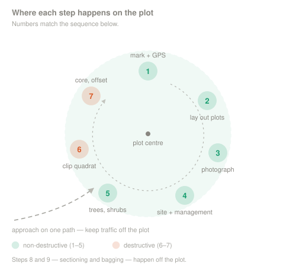

<p align="center">
  
</p>

---

# Part 3 — Field Methods

*Set up the plot, measure vegetation, collect soil, and keep every sample traceable.*

[← 2 — Project Planning](../02_Project_Planning/) · [Back to main guide](../README.md) · Next: [4 — Data Interpretation →](../04_Data_Interpretation/)

---

**Quick links:** [Vegetation Field Guide](../../_Shared/Vegetation-FINAL-Eng-2026.pdf) · [Non-Peat Soils Field Guide](../../_Shared/Non-peat-FINAL-Eng-2026.pdf) · [Datasheets](datasheets/) · [Skill checklists](checklists/)

## Overview

This section follows the field day in the order the work should happen.

| # | Stage | Main record |
|---:|---|---|
| 1 | [Set up the plot](#1-set-up-the-plot) | Plot & Site Log |
| 2 | [Measure vegetation](#2-measure-vegetation) | Vegetation Data |
| 3 | [Collect soil](#3-collect-soil) | Soil Data |
| 4 | [Label, cool, and reconcile samples](#4-label-cool-and-reconcile-samples) | Sample/Cooler Inventory |
| 5 | [Process roots only under an approved SOP](#5-supplemental-root-record) | Supplemental Root Record |

> [!IMPORTANT]
> Complete vegetation measurements before clipping or soil sampling disturbs the plot. In permanent plots, place destructive sampling outside the area that will be measured again.

### Method basis

The vegetation and soil methods on this page are based on:

- [*Measuring Carbon in Vegetation (Non-Tree)*](../../_Shared/Vegetation-FINAL-Eng-2026.pdf) (WWF-Canada, 2024)
- [*Measuring Carbon in Non-Peat Soils*](../../_Shared/Non-peat-FINAL-Eng-2026.pdf) (WWF-Canada, 2024)

Root separation is **not covered by either guide**. It remains a development method and must not be used until the project has a specialist-reviewed laboratory SOP.

---

## Field order

```text
1. Confirm the site and plot ID
2. Complete the undisturbed 14-photo series
3. Lay out the vegetation plots
4. Measure medium vegetation
5. Photograph and clip the small plot
6. Collect soil using the selected method
7. Label, cool, and reconcile every sample
8. Process roots only under an approved SOP
```



### Permanent and single-use plots

<table>
<tr>
<td width="50%">

**Single-use plot**

Complete all non-destructive measurements first. Destructive sampling may then occur in the documented sampling area.


</td>
<td width="50%">

**Permanent plot**

Protect the area that will be remeasured. Record the bearing and distance from the permanent marker to every clipping or soil-sampling location.


</td>
</tr>
</table>

---

## Equipment

Prepare the equipment for the collection method selected in Part 2. Confirm containers, storage temperature, holding time, minimum sample mass, and labelling requirements with the laboratory before fieldwork.

### Plot and vegetation equipment

| Plot setup | Medium vegetation | Small vegetation |
|---|---|---|
| Notebook and pencils | Notebook and pencils | Notebook and pencils |
| Large measuring tapes | DBH tape | Clippers |
| String or flagging tape | Measuring tapes | 1 × 1 m quadrat |
| Plastic measuring tape |  | 0.5 × 0.5 m quadrat |
| GPS |  | Resealable bags |
| Rangefinder, clinometer or compass |  | Permanent marker |
| Altimeter |  |  |
| Resealable bags and marker |  |  |


### Soil equipment

| Plot setup | Soil core | Soil pit | Shallow soil |
|---|---|---|---|
| GPS and soil probe | Soil corer and extractor | Shovel | Small shovel |
| Work gloves | Split plastic sleeves | Known-volume ring or disk | 0.25 × 0.25 m frame |
| Measuring tape | End caps and duct tape | Resealable bags | Resealable bags |
| Camera and notebook | Measuring tape | Permanent marker | Permanent marker |
| Markers, tarp and bags | Packing materials and cooler | Cooler | Cooler |


### Before leaving for the field

| Check | Confirm |
|---|---|
| **Design** | Plot coordinates, alternates, plot status, offsets, and selected soil method are recorded. |
| **Identifiers** | Plot, core, layer, bag, and container IDs are unique and match the datasheets. |
| **Laboratory** | Containers, storage, minimum mass, holding time, and submission requirements are confirmed. |
| **Safety** | Access, weather, fire, livestock, wildlife, first aid, communications, and emergency procedures are reviewed. |
| **Cold chain** | Coolers are labelled, cold, and large enough for the planned samples. |

---

## Timing

Vegetation sampling must match the biological stage defined in the sampling plan. Above-ground biomass is often measured near peak growing-season biomass, but the correct timing depends on the ecosystem and monitoring objective.

Record the sampling date and phenological stage on every vegetation datasheet.

---

## 1. Set up the plot

### Lay out the nested plots

Plot locations should be selected before the field visit using the sampling design from Part 2. Do not move a point simply because another location looks more convenient or representative.


| Plot | Vegetation measured |
|---|---|
| **Large** | Trees taller than 2 m; use the Forests tree protocol. |
| **Medium** | All individuals 0.5–2 m tall; typically 16–100 m². |
| **Small** | Vegetation below 0.5 m in a 1 × 1 m plot. |

1. Navigate to the assigned plot centre.
2. Record latitude, longitude, elevation, GPS accuracy, date, and plot ID.
3. Mark the plot boundaries with tapes or flagging.
4. Align the plot length north–south and width east–west where a compass is available.
5. For medium plots, record slope in both the north–south and east–west directions.
6. Record whether the plot is permanent or single-use.

### Complete the plot log

Record:

- project, site, study area, and plot IDs;
- location, date, latitude, longitude, elevation, datum, and GPS accuracy;
- plot type and dimensions;
- north–south and east–west slope for the medium plot;
- crew, management, restoration, fire, grazing, and disturbance notes; and
- bearing and distance to destructive samples in permanent plots.

### Take the 14-photo series

From the same point, take:

1. one photograph straight down;
2. one photograph straight up; and
3. three photographs in each cardinal direction: horizontal, 45° up, and 45° down.


Record the photo IDs on the Plot & Site Log. The before-and-after small-plot photographs are separate vegetation records and are not part of the 14-photo series.

> [!TIP]
> Before moving on, confirm that the plot is marked, the site record is complete, and the undisturbed photographs are saved.

---

## 2. Measure vegetation

Measure from least destructive to most destructive: medium vegetation first, then the small clipped plot.

### Medium plot — plants 0.5–2 m

The medium plot is normally 16–100 m². Record its actual dimensions and area.

For every individual plant between 0.5 and 2 m:

1. Assign a plant ID.
2. Record the species. If identification is uncertain, record a photo ID for later confirmation.
3. Identify the growth form.
4. Take the measurements below.

| Growth form | Measurements |
|---|---|
| **Short, single-stem tree** | Stem diameter in centimetres at 0.3 m above ground. |
| **Shrub or multi-stem plant** | Maximum height, east–west length, and north–south width in metres. |

<table>
<tr>
<td width="50%">

**Short-statured tree**


</td>
<td width="50%">

**Shrub measurements**


</td>
</tr>
</table>

Species identification may use a regional key, a verified identification application, or well-documented photographs showing leaves, branching, bark, buds, flowers, or seeds.


### Small plot — clip and weigh


1. Place the **1 × 1 m plot** at its assigned location.
2. Photograph the full plot from directly above and record the photo ID.
3. Mark a **0.25 m² harvest area** within it using either:
   - a 0.5 × 0.5 m frame; or
   - a circle with a 0.28 m radius.
4. Clip every plant in the harvest area **3 cm above ground**.
5. Place every unique species in its own labelled bag.
6. Label each bag with the plot ID, species, date, and sample ID.
7. Record any loss, contamination, or departure from the method.
8. Dry samples in the laboratory at 50–80°C for 48–72 hours, then record dry mass.


> [!IMPORTANT]
> The 0.25 m² frame is the harvest area inside the 1 × 1 m small plot. It is not a replacement for the full plot.

### Trees taller than 2 m

Use the [Forests tree protocol](../../Forests/03_Field_Methods/3A_Trees.md). Do not record large-tree measurements on the non-tree vegetation table.

---

## 3. Collect soil

Use the collection method selected in the sampling plan. If field conditions require a different method, record the reason and do not combine results silently.

| Method | Use when | Key volume record |
|---|---|---|
| **Intact core** | A complete vertical sample can be recovered with limited disturbance. | Corer diameter, hole depth, and recovered length. |
| **Soil pit** | Horizons need to be exposed and described. | Known-volume ring or disk from each horizon. |
| **Shallow-soil excavation** | Soil is too shallow for a useful core or pit profile. | Frame dimensions and measured excavation volume. |

### Check soil depth

Sampling depth is site-specific. Estimate it with a soil probe before sampling and follow the reporting depth selected in Part 2.

Common reporting depths such as 30 cm, 50 cm, 1 m, or 2 m are **reporting boundaries**, not fixed field increments. Record the actual depth reached and the reason for any refusal.

### Method A — intact soil core

<table>
<tr>
<td width="50%">

</td>
<td width="50%">

</td>
</tr>
</table>

1. Lay a clean tarp beside the sampling point and prepare the corer, sleeve, caps, labels, and cooler.
2. Estimate soil depth with a probe.
3. Gently push the corer into the soil while keeping it straight.
4. Twist and gently move the corer to release the bottom of the sample.
5. Remove the corer while supporting the bottom so material is not lost.
6. Turn the corer horizontal and place the split sleeve around it.
7. Push the sample from the corer into the sleeve with the extraction tool.
8. Mark top and bottom, fit labelled end caps, and tape the sleeve closed.
9. Measure the **depth of the hole** and the **length of the recovered core**.
10. Label the core and place it in the cooler.

> [!IMPORTANT]
> Keep the core intact for laboratory processing. The WWF guide sections the core by soil layer in the laboratory, not in the field.

### Method B — soil pit

<table>
<tr>
<td width="50%">

</td>
<td width="50%">

</td>
</tr>
</table>

1. Dig a pit at least 0.5 m wide and deep enough to expose the required horizons.
2. Identify each major horizon using the Canadian System of Soil Classification.
3. Record horizon name, top and bottom depth, colour, and texture.
4. Take a known-volume ring or disk sample from the middle of each horizon for bulk density.
5. Place it in a labelled bag.
6. Collect a separate sample from the same horizon for carbon or other analyses.
7. Cool and inventory every sample.

### Method C — shallow-soil excavation

1. Place a frame with known dimensions over the sampling area.
2. Excavate the complete soil sample within the frame and transfer it to a labelled bag.
3. Determine excavation volume using the approved known-volume method, such as filling the excavation with a measured volume of water.
4. Record the frame dimensions, measured volume, and sample ID.
5. Cool the sample and transfer it to the laboratory's required storage.

### Record field conditions

For every method, record:

- collection method and sample ID;
- actual top and bottom depths;
- corer, ring, or frame dimensions;
- hole depth, recovered length, or measured volume;
- horizon, colour, and texture where applicable;
- refusal, loss, moisture, compaction, or disturbance; and
- every linked soil-carbon and bulk-density container ID.

---

## 4. Label, cool, and reconcile samples

A label must identify the sample when separated from the datasheet.

```text
Project · Site · Plot · Core/sample · Depth or layer · Fraction · Date
```

Before leaving the site:

1. Count the plots visited.
2. Count soil samples attempted, accepted, and rejected.
3. Count vegetation bags and any approved root subsamples.
4. Match every container to the datasheet.
5. Record cooler ID, seal number, temperature, and closing time.
6. Explain every discrepancy.
7. Complete the chain of custody at each handoff.

> [!TIP]
> A discrepancy found at the plot is usually fixable. The same discrepancy found at the laboratory may make the sample unusable.

---

## 5. Supplemental root record

> [!WARNING]
> Root separation is not part of the attached WWF vegetation or non-peat soil guides. Do not use this section until the project has an approved, tested, laboratory-reviewed SOP.

The SOP must define:

- the root-processing subsample;
- washing or disaggregation;
- every sieve mesh size;
- fine-root loss;
- root diameter classes;
- live/dead or total-root rules;
- drying temperature and constant-mass criterion;
- ash correction, if used;
- QA/QC and mass balance; and
- whether soil and root carbon overlap.

Do not remove roots from material used to establish intact bulk density unless a validated mass-balance method accounts for the change.

If roots are present in the deepest recovered interval, report the result as **truncated at the sampled depth**.


---

## Field records

- [Grassland field data sheet](https://docs.google.com/document/d/1nXFCqNxG-r8lc7KogAFi5qWtFh93pyoVcG5LAm7Omds/edit)
- [`Grassland-Sample-Inventory-and-Chain-of-Custody.docx`](datasheets/Grassland-Sample-Inventory-and-Chain-of-Custody.docx)
- [`Grassland_Carbon_Skill_Checklist.docx`](checklists/Grassland_Carbon_Skill_Checklist.docx)

The field data sheet contains:

1. Plot & Site Log
2. Soil Data
3. Supplemental Root Record
4. Vegetation Data — complete this section before soil sampling
5. Sample/Cooler Inventory

---

## Safety

Complete a site-specific risk assessment. At minimum, address:

- heat, sun, smoke, storms, and dehydration;
- fire restrictions and dry vegetation;
- livestock, wildlife, ticks, and snakes where present;
- sharp tools, heavy equipment, pinch points, and unstable soil pits;
- communications, lone work, emergency access, and first aid;
- vehicles, gates, fences, and public-road hazards; and
- cleaning equipment between properties.

> 🧩 **[PLACEHOLDER — SAFETY FILE]** Add the operating organization's field risk assessment, emergency contacts, and tailgate checklist.

---

## Before leaving the plot

```text
☐ Correct plot and identifiers confirmed
☐ Plot coordinates, elevation, accuracy, dimensions, and slopes recorded
☐ Undisturbed 14-photo series complete
☐ Medium vegetation measured before clipping or soil sampling
☐ Full 1 × 1 m small plot photographed
☐ 0.25 m² harvest area clipped 3 cm above ground
☐ Each vegetation species bagged and labelled separately
☐ Selected soil method and all volume measurements recorded
☐ Intact core capped, taped, oriented, labelled, and cooled
☐ Pit or shallow-soil records complete where used
☐ Every sample and container ID matches the datasheet
☐ Deviations, loss, refusal, and disturbance recorded
☐ Cooler inventory reconciled
☐ Site left safe
```

---

## Files still needed

| File | Status |
|---|---|
| `images/banner_field_methods.svg` | Keep the existing workshop banner. |
| `images/field_workflow_order.svg` | Update to the eight-step field sequence. |
| `images/permanent_vs_single_use_field.svg` | Keep or update using the two field layouts above. |
| `images/root_processing_workflow.svg` | Keep, but label **Draft — approved SOP required**. |
| `datasheets/Grassland-Sample-Inventory-and-Chain-of-Custody.docx` | Review against the revised sample identifiers. |
| `Root-Separation-SOP.md` | Required before root methods are taught or used. |
| `Safety/Grassland-Field-Risk-Assessment.pdf` | Must come from the operating organization. |

> [!NOTE]
> Before publishing, move the GitHub-hosted image attachments into the repository's `images/` folder and confirm permission and attribution for any material reproduced from the WWF guides.

---

[← 2 — Project Planning](../02_Project_Planning/) · [Back to main guide](../README.md) · Next: [4 — Data Interpretation →](../04_Data_Interpretation/)
