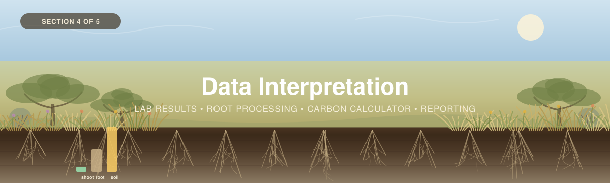

<p align="center">
  
</p>

---

[← 3 — Field Methods](../03_Field_Methods/) · [Back to main guide](../README.md) · Next: [5 — Monitoring →](../05_Monitoring/)

---

# Part 4 — Data Interpretation

*What happens after the cooler comes back: the lab chain — including the root chain nobody else
in this series has — and turning it all into a stock with an honest interval.*

**Quick links:** [Grassland Carbon Calculator](calculators/) · [Laboratory Analysis guide](../../_Shared/Lab-Guide-Eng-2026.pdf) · [Vegetation (Non-Tree)](../../_Shared/Vegetation-FINAL-Eng-2026.pdf) · [Non-Peat Soils](../../_Shared/Non-peat-FINAL-Eng-2026.pdf)

---

## Overview

| # | Step | Answers |
|---|------|---------|
| 1 | **[From the field to the lab](#step-1--from-the-field-to-the-lab)** | *How do I digitize, process roots, and choose a lab?* |
| 2 | **[Run the numbers](#step-2--run-the-numbers)** | *How do the measurements become carbon?* |
| 3 | **[Report the results](#step-3--reporting-the-results)** | *What do I report, and what does each number mean?* |

> 🧭 **Want to see it done?** Nine plots across grazed prairie, an ungrazed exclosure and a Black
> Oak savannah, followed end to end, in [`Worked_Example/`](../Worked_Example/).

> 🟠 **The `Fill Me In` tab is how this workshop asks you for things.** Every orange cell has a
> working default so the workbook computes from the moment you open it, and a flag that stays lit
> until you replace it. Work that one list rather than hunting across ten tabs.

---

## Step 1 — From the field to the lab

### 1.1 Digitize the sheets

Four tabs, in this order, because each joins to the one above it:

| Tab | One row per | Joins on |
|---|---|---|
| `1. Plot & Site Log` | **plot** | — fill this first |
| `2. Soil Data` | **depth increment** | `Plot ID`, `Core ID` |
| `3. Root Biomass` | **increment × diameter class × live/dead** | `Plot ID`, `Core ID` |
| `4. Vegetation Data` | **plot** | `Plot ID` |

Field columns are **yellow**, lab columns **blue**. Fill the yellow ones before results arrive —
that way the depth, recovery and management flags fire while the field season is fresh enough to
explain them.

### 1.2 The soil chain

Standard, and identical to [Forests](../../Forests/04_Data_Interpretation/):

1. **Dry to constant mass at 105 °C**, weigh.
2. **Bulk density** = oven-dry mass ÷ the volume the corer took.
3. **Organic carbon** by CHN, or by loss-on-ignition with a conversion factor.
4. Sieve out and record the **>2 mm fraction** if the lab is reporting on a fine-earth basis.

### 1.3 The root chain — and this one is yours to get right

No WWF guide covers it, so the procedure in
[Part 3](../03_Field_Methods/#separate-the-roots) is the reference. The four
steps that change the number:

| Step | Get it wrong and… |
|---|---|
| **Wash over a recorded mesh** | Roots finer than the mesh are lost. Fine-root biomass is a **known underestimate**, and without the mesh size nobody can say by how much |
| **Separate live from dead** | Necromass counted as live overstates the living pool. For a *stock* both hold carbon — but dead roots are arguably already soil organic matter |
| **Dry at 60–70 °C** — not 105 °C | 105 °C can volatilise organics in root tissue. Two samples, two ovens, two conventions |
| **Ash-correct** | Washed roots keep adhering mineral soil. Uncorrected root mass is **systematically too high**, badly so in clay soils |

```
corrected root mass  =  oven-dry mass × (1 − ash fraction)
```

> 🟠 **[FILL ME IN]** — `ROOT_SIEVE_MM`, `ASH_CORRECTED`, `ROOT_DRY_TEMP_C`. The calculator applies
> the ash correction only when `ASH_CORRECTED` says you did it, and flags every row while it
> doesn't.

### The double-counting trap

Measuring roots creates a trap, and the lab bench is where it springs.

<table>
<tr>
<td width="55%">

**Soil carbon analysis conventionally removes *visible* roots** — but fine roots inevitably stay in
the sample. So a standard soil carbon number **already includes** fine-root carbon.

Add separately-measured root carbon on top and **you have counted the same carbon twice**.

The conventional diameter split is **≤ 2 mm fine, > 2 mm coarse**. It is near-universal, and it is
a convention a field crew can apply with a sieve — not a biological boundary.

</td>
<td width="45%">

```
   ░░░  shoots (clipped)          ┐ ABOVE GROUND
   ────────────────────────────── ┤ ← the clip line
   ▓▓▓  coarse roots  > 2 mm      │
   ▓▓▓  fine roots   ≤ 2 mm       │ ROOTS — sieved out
   ────────────────────────────── ┤ ← the sieve mesh
   ███  root-free soil            │ SOIL — analysed after
   ███                            ┘
```

</td>
</tr>
</table>

**Two answers are defensible. Pick one, write it down, apply it to every sample.**

| | **Option 1 — Sieve first** ⭐ | **Option 2 — Fine roots stay in the soil** |
|---|---|---|
| **What you do** | Wash all roots out, analyse **root-free soil** for carbon, report root carbon separately | Remove only coarse (>2 mm) roots; analyse soil with fine roots still in it |
| **Report** | Soil C and root C as separate, addable pools | Soil C (includes fine roots) + coarse root C |
| **Pro** | Clean separation; root carbon is fully measured | Much less lab work |
| **Con** | The labour | Fine-root carbon is inside the soil number and cannot be broken out |

> 🟠 **[FILL ME IN]** — `ROOTS_REMOVED_BEFORE_SOIL_C` in the calculator's `7. Settings`. **Default
> is Option 1.** A QC flag fires on every soil row while root carbon is being added to a stock not
> confirmed root-free.
>
> **Being silent about which you did is the only wrong answer** — and silence is the default
> outcome if nobody decides in advance. Decide it in
> [Part 2](../02_Project_Planning/), not here.

### 1.4 Ask the lab three questions before the field season

| Ask | Why |
|---|---|
| **Which bulk-density basis do you report?** Fine earth over *total* volume, or over *fine-earth* volume? | The coarse-fragment correction depends entirely on the answer. Getting it wrong understates a stony site by up to a third — or double-corrects it. Mandatory in interior BC |
| **Can you process roots, and at what temperature?** | Many soil labs will not. If they do, confirm 60–70 °C and whether ash correction is included |
| **Can you run CHN on a subset?** | Lets you calibrate a loss-on-ignition factor against measured carbon rather than assuming one |

Also ask **cost and turnaround**, because they set how many cores you can afford to wash — which
[Part 2](../02_Project_Planning/README.md#a10--why-roots-may-need-more-samples) shows is the
binding constraint on the root estimate.

---

## Step 2 — Run the numbers

Everything below is computed by the workbook. This section is so you can explain it.

**One line per pool, before the detail:**

```
        soil carbon  =  depth × bulk density × carbon %        ← the majority of the stock
        root carbon  =  measured root mass × carbon %          ← MEASURED, not a ratio
       shoot carbon  =  clipped dry mass × carbon %            ← small, and seasonal
```

### The chain

```
Per soil increment
  BD used            = BD, or BD × (1 − CF%)   ← only if the lab reported a fine-earth-volume basis
  Stock (kg C/m²)    = BD used × (carbon % ÷ 100) × thickness (cm) × 10

Per root sample
  Corrected mass (g) = oven-dry mass × (1 − ash fraction)
  Root mass (g/m²)   = corrected mass ÷ core area (cm²) × 10,000
  Root C (kg C/m²)   = root mass × carbon fraction ÷ 1000

Per vegetation plot
  Herbaceous (kg C/m²) = (live + dead clip, g) ÷ quadrat area (m²) × carbon fraction ÷ 1000
  Shrub (kg C/m²)      = shrub biomass (kg) × carbon fraction ÷ medium plot area (m²)
  Tree (kg C/m²)       = carried across from the Forests calculator

Per plot   → soil summed over increments, averaged over cores; roots likewise; vegetation added
Per site   → mean of the plots, with an interval
Study area → area-weighted
```

Each pool is divided by **its own** plot area, which is what makes them addable.

### ⚠ The coarse-fragment correction is applied once, or not at all

Rocks hold no carbon, and **neither WWF guide's equations correct for them.** The workbook does —
but only on the right basis:

| Lab's basis | What the workbook does |
|---|---|
| **Fine earth / total volume** | Uses it as-is. Coarse fragments are **already accounted for** |
| **Fine earth / fine-earth volume** | Multiplies by `(1 − coarse fragment %)` |
| **Not confirmed** | Uses it as-is **and raises a flag.** Ask the lab |

### Four things the workbook does that the printed guides don't

<table>
<tr>
<td width="50%">

**1 · Roots are a measured pool.**

Neither guide measures below-ground biomass at all. The `3. Root Biomass` tab holds measured
mass by diameter class and depth — not a root:shoot ratio applied to the shoot figure.

**2 · Soil and roots are checked against separate targets.**

Roots are four to five times more variable than soil carbon, so one shared target would demand
four to five times the cores. The Site Summary prints `MET` / `NOT MET` **twice**.

</td>
<td width="50%">

**3 · Two soil bases, and the site mean uses the comparable one.**

Full profile *and* to the reporting depth. **The site mean and precision check run on the
reporting-depth figure**, because cores reach different depths and averaging full-profile stocks
would turn "we cored shallower here" into apparent variability.

**4 · The coarse-fragment correction, applied once.**

See above. The guides' equations omit it entirely.

</td>
</tr>
</table>

### What the interval does and does not capture

| Source | Captured? |
|---|---|
| **Plot-to-plot variation within a site** | ✅ Yes — this is what the SD across plots measures. Dominant |
| **Core-to-core within a plot** | Partly — averaged into the plot value |
| **Lab measurement error** | ❌ No. Usually small against spatial variation |
| **The carbon fraction** | ❌ No |
| **Roots lost through the sieve** | ❌ No — a **systematic** bias, not random error |
| **Cores that stopped short** | ❌ No — flagged, not intervalled |
| **Study-area extrapolation** | ❌ **No** |

> [!WARNING]
> **The study-area mean is area-weighted but carries no interval**, and the workbook says so on
> the face of the sheet. Propagating per-site intervals needs the stratified estimator:
>
> $$\bar{x}_{st} = \sum_h W_h \bar{x}_h, \qquad \mathrm{SE}(\bar{x}_{st}) = \sqrt{\sum_h W_h^2 \frac{s_h^2}{n_h}}$$
>
> The workbook computes $\bar{x}_{st}$ and stops there, because at three plots per stratum the
> degrees of freedom make the interval more misleading than useful. **Report the per-site
> intervals**, and give the study-area figure as a point estimate with those beside it.

---

## Step 3 — Reporting the results

### Work the QC flags first

Every flag is an instruction. Clear or explain all of them before reporting.

| Flag | What to do |
|---|---|
| `Bulk-density basis not confirmed with the lab` | Ask them. Until you do, the coarse-fragment correction may be wrong or doubled |
| `Root mass is NOT ash-corrected` | It is systematically too high. Ash a subsample, or report it as an upper bound |
| `Sieve mesh not recorded` | The fine-root figure cannot be interpreted. Recover it from the lab notes |
| `Root total reaches only X cm — the bottom of the core` | Report it as a **minimum**. Native grassland roots reach metres |
| `Root carbon added to a soil stock NOT confirmed root-free` | **Probable double count.** Set `ROOTS_REMOVED_BEFORE_SOIL_C`, or report the pools separately |
| `Cored shallower than the reporting depth` | That plot's reporting-depth figure is an underestimate |
| `Not confirmed as peak-season` | A standing crop measured off-peak is not comparable to anything |
| `Canopy cover at or above the threshold but no tree carbon` | Measure the trees, or say the pool is excluded |
| `Shrub figures are ABOVE-ground only` | Shrub roots are in no pool. Declare the gap |
| `NOT MET: ±X% against a ±Y% target` | Scrutinise the data, post-stratify on management, then add cores |

### What every report needs

| Element | Why |
|---|---|
| **The number, with units, depth and basis** | "10.4 kg C/m², soil to 30 cm plus measured roots" — not "10.4" |
| **Which pools are included** | Soil? Roots? Shoots? Trees? |
| **The reporting depth, and how deep you actually cored** | 30 cm is a floor. Say what is below it |
| **Sample size and interval, per pool** | Soil and roots have different targets and different achievements |
| **The root/soil boundary rule and the sieve mesh** | Otherwise the root figure is uninterpretable |
| **Whether roots were ash-corrected** | |
| **Management context** | Grazing regime, fire, cultivation history. A stock with no context cannot be read |
| **What is excluded** | Shrub roots, litter, below-ground tree biomass. Name the gaps |

### What each number means

| Number | Reads as |
|---|---|
| **kg C/m²** | Carbon density. Compare sites with this |
| **t C** | The size of the store |
| **t CO₂e** | kg C × 3.67. **A stock, not an offset** |
| **± half-width** | Your uncertainty, in the same units as the mean |
| **Achieved margin** | The half-width as a fraction of the mean — compare to your target |

> [!WARNING]
> **A carbon stock is not a carbon credit.** Multiplying by 3.67 converts units; it does not
> establish additionality, permanence or a baseline. A prairie holding 7,400 t C is *storing*
> carbon that would be released if it were broken — which is a conservation argument, and a
> strong one, but a different claim from sequestration.

### What the worked example reports

<details>
<summary><b>📊 Nine plots, three sites</b></summary>

<br>

| Site | *n* | Soil to 30 cm | Soil precision | Roots | Root precision |
|---|---|---|---|---|---|
| **S1** grazed prairie | 3 | 10.57 ±0.92 | **MET: ±9%** ✅ | 0.969 ±0.560 | **NOT MET: ±58%** ❌ |
| **S2** ungrazed exclosure | 3 | 11.37 ±2.78 | NOT MET: ±24% ❌ | 1.159 ±0.668 | NOT MET: ±58% ❌ |
| **S3** Black Oak savannah | 3 | 5.26 ±1.41 | NOT MET: ±27% ❌ | 0.648 ±0.689 | NOT MET: ±106% ❌ |

**Study area: 94.5 ha · 9,815 t C · 10.39 kg C/m² · 36,020 t CO₂e.**

**The pattern is the argument of Part 2.** One site meets its soil target; **none** meets its root
target — even though the root target is set twice as loose at ±40%. Root CVs come out **0.34,
0.34 and 0.63** against soil CVs of **0.05, 0.15 and 0.16**.

Roots run **5–19% of soil-plus-root carbon to 30 cm**, typically around 8–10%. Small in carbon
terms, and most of the living biomass.

**And the thing it cannot do.** The ungrazed exclosure holds more soil carbon than the grazed
paddock — 11.37 against 10.57. But the 90% interval on that difference runs **−1.33 to +2.95**,
which spans zero. **With three plots per site you cannot detect it.** Fourteen plots per group
would make the interval exclude zero — but that is a **coin flip**; having a real chance of
catching it takes **30**. The difference between those two numbers is what
[Part 5](../05_Monitoring/) is about.

</details>

---

## References

**Primary protocols**

- WWF-Canada (2024). *Measuring Carbon in Vegetation (Non-Tree): A Supplemental Guide.* → [PDF](../../_Shared/Vegetation-FINAL-Eng-2026.pdf)
- WWF-Canada (2026). *Measuring Carbon in Non-Peat Soils.* → [PDF](../../_Shared/Non-peat-FINAL-Eng-2026.pdf)
- WWF-Canada (2026). *Supplemental Guide: Laboratory Analysis.* → [PDF](../../_Shared/Lab-Guide-Eng-2026.pdf)

**Root methods**

> 📚 **[REFERENCES NEEDED]** — the root-processing procedure above is written at the level the
> method supports and **is not yet cited**. Candidates are listed in [`TODO.md`](../TODO.md):
> Freschet et al. (2021), McCormack et al. (2015), Addo-Danso et al. (2016), Jackson et al.
> (1996), Milchunas (2009), Böhm (1979), Smit et al. (2000). Academic domains are blocked from
> the build environment, so these must be confirmed against the sources before anything ships as
> authoritative.

---

## In this section

- [`calculators/Grassland_Carbon_Calculator.xlsx`](calculators/) — the workbook everything above runs in.
- `images/` — section banner.

> 🗺 **[COMMUNITY LED CARBON MAPPING — PLACEHOLDER]** — an **R-based analysis** that takes the
> plot measurements from this workshop and turns them into a **carbon map with uncertainty**: a
> baseline layer a community can hold, and re-map against later. Applies across all three
> workshops in this series, and will be added here when the workflow lands.
>
> Until then, the scaling above stops at the **area-weighted study-area total** — a number, not a
> map. It is complete and defensible on its own; it just cannot tell you *where* in the study
> area the carbon is.
>
> ✍️ **[SLIDE DECK NEEDED]** — the workshop presentation for Part 4.
>
> 💰 **[LAB QUOTES NEEDED]** — cost and turnaround for bulk density, carbon, **and root
> processing**, including which bulk-density basis each lab reports.
>
> 📊 **[R PIPELINE FOR STOCKS — DEFERRED]** — a reproducible R workflow reading the same workbook.
> Out of scope by agreement; the workshop stops at the spreadsheet.

---

[← 3 — Field Methods](../03_Field_Methods/) · [Back to main guide](../README.md) · Next: [5 — Monitoring →](../05_Monitoring/)
