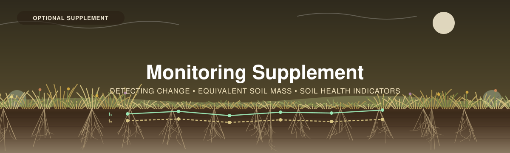

  

---

[← 4 — Data Interpretation](../04_Data_Interpretation/) · [Back to main guide](../README.md) · Next: [Worked Example →](../Worked_Example/)

---

# Part 5 — Monitoring and Change Detection *(optional)*

*Measuring the same place twice. What it takes to say a carbon stock has changed — and what to
measure instead when it will take forty years.*

**Quick links:** [Part 2 §5D — permanent plots](../02_Project_Planning/README.md#5d--permanent-or-single-use-plots) · [Appendix A10 — pool variability](../02_Project_Planning/README.md#a10--why-roots-need-more-cores-than-soil) · [Grassland Carbon Calculator](../04_Data_Interpretation/calculators/)

---

## What this adds, and what it doesn't

Parts 1–4 give you a **stock**: how much carbon is here now, with an honest interval. That is a
complete answer to *"how much carbon does this grassland hold?"*

It is not an answer to **"is it going up?"** — and for most of the partners this workshop is
written for, that is the actual question. Restoration is meant to build carbon. Grazing management
is meant to protect it. Fire management is meant to maintain the system that holds it. Every one of
those is a claim about **change**, and change is a substantially harder measurement than a stock.

**This supplement is about that gap, and it is deliberately unflattering.** The honest finding is
that a soil carbon stock is one of the *slowest-responding* things you could choose to monitor, and
that most monitoring programmes are designed to detect a change they have no statistical chance of
seeing. The way out is not a better estimator. It is knowing that before you commit, and choosing
the design — and sometimes the variable — accordingly.

| | |
|---|---|
| **Comes after** | [Part 4](../04_Data_Interpretation/) — you need a stock with an interval before you can have a *change* in one |
| **Reaches back into** | [Part 2 §5D](../02_Project_Planning/README.md#5d--permanent-or-single-use-plots) and [Part 3](../03_Field_Methods/#soil) — permanent plots and bulk density are decided there, and cannot be retrofitted |
| **Parallel to** | [Forests Part 5 — LiDAR](../../Forests/05_LiDAR_Supplement/) and [Wetlands Part 5 — Chronology](../../Wetlands/05_Chronology_Supplement/), the other two optional supplements in this series |

> [!IMPORTANT]
> **Read this before you finalise Part 2, not after your second visit.**
>
> Almost everything in this supplement is a *design* decision. Permanent markers, plot numbers,
> bulk density at every visit, archived samples, deeper cores — none of them can be added to a
> baseline that has already been collected. A campaign designed for a one-off stock is very often
> unusable as a monitoring baseline, and nothing in the analysis can repair it.

---

## Overview

| # | Section | Answers |
|---|------|---------|
| 1 | **[Why change is harder than a stock](#step-1--why-change-is-harder-than-a-stock)** | *Why can't I just subtract?* |
| 2 | **[Minimum detectable difference](#step-2--minimum-detectable-difference)** | *What change could I actually see?* |
| 3 | **[Paired plots, and what they really buy](#step-3--paired-plots-and-what-they-really-buy)** | *How much does going back to the same plot help?* |
| 4 | **[Equivalent soil mass](#step-4--equivalent-soil-mass)** | *Why did my carbon "change" when nothing happened?* |
| 5 | **[Fix everything you can between visits](#step-5--fix-everything-you-can-between-visits)** | *What has to stay the same?* |
| 6 | **[Soil-health indicators and carbon stocks](#step-6--soil-health-indicators-and-carbon-stocks)** | *Should I be measuring something else instead?* |
| 7 | **[Restoration and fire](#step-7--restoration-and-fire)** | *How do I design for the two cases I actually have?* |

---

## Step 1 — Why change is harder than a stock

### The arithmetic is trivial; the uncertainty is not

Subtracting two stocks is easy. The problem is that you are subtracting **two uncertain numbers**,
and the uncertainty of a difference is *larger* than the uncertainty of either one:

$$SE_{\text{difference}} = \sqrt{SE_1^2 + SE_2^2}$$

Two stocks each known to ±10% give a **difference** known to roughly ±14% *of the same stock* — but
the change you are looking for might be 5% of the stock. The interval on the difference is then
three times the thing you are trying to measure.

### What this looks like in the worked example

[Part 4](../04_Data_Interpretation/README.md#what-the-worked-example-reports) ends on this case, and
it is worth restating because it is the whole problem in one line. Two sites, three plots each,
soil carbon to 30 cm:

| Site | *n* | Soil C to 30 cm (kg C/m²) | SD |
|---|---|---|---|
| **S1** — grazed prairie | 3 | 10.57 | 0.55 |
| **S2** — ungrazed exclosure | 3 | 11.37 | 1.65 |
| | | **difference +0.81** | pooled SD 1.23 |

The exclosure holds more carbon. It is the direction every grazing-exclusion study would predict.
And the result is **not detectable**:

| | |
|---|---|
| Difference | **+0.81 kg C/m²** (+7.7% of the grazed mean) |
| 90% confidence interval | **−1.33 to +2.95 kg C/m²** |
| Verdict | **spans zero** — this design cannot distinguish it from no difference |

### The three sample sizes, and why you must say which one you mean

Ask "how many plots would I have needed?" and you get three different answers depending on the
criterion. **They differ by more than a factor of two, and the smallest one is the one people
quote.**

| Criterion | What it means | Plots per group |
|---|---|---|
| The 90% interval **just excludes zero** | You would detect this difference **about half the time** | **14** |
| **80% power** at 90% confidence | You would detect it 4 times in 5 | **30** |
| **90% power** at 90% confidence | You would detect it 9 times in 10 | **41** |

> [!WARNING]
> **The 14 is a coin flip.** "The interval half-width equals the difference" is the same as saying
> your study has **50% power** — design to it and you are as likely to miss a real effect as find
> it. [Part 4](../04_Data_Interpretation/README.md#what-the-worked-example-reports) quotes 14
> because that is the figure the calculator's achieved-precision logic implies; **this supplement is
> where the honest number lives, and it is 30.**
>
> Whenever anyone hands you a monitoring sample size, ask what power it assumes. If the answer is
> "we sized it so the confidence interval would be smaller than the expected change", the answer is
> 50%.

*All figures above: pooled two-sample $t$, α = 0.10 two-sided, computed with the same
$t$-inverse used throughout [Part 2](../02_Project_Planning/README.md#a9--plan-with-z-floor-it-with-t).*

---

## Step 2 — Minimum detectable difference

**Turn the sample-size question around.** Instead of asking how many plots you need for a change you
are guessing at, ask: *given the plots I can afford, what is the smallest change I could detect?*
That is the **minimum detectable difference (MDD)**, and it is the single most useful number in
monitoring design because it is the one you can compute before spending anything.

For two independent samples of $n$ plots, at confidence $1-\alpha$ and power $1-\beta$:

$$MDD = (t_{\alpha/2,\,df} + t_{\beta,\,df})\; \cdot\; CV \cdot \sqrt{\tfrac{2}{n}} \;\times\; \bar{x}$$

Same machinery as [A2](../02_Project_Planning/README.md#a2--working-backwards-from-precision-to-sample-size),
with two changes: the $\sqrt{2}$ because it is a difference, and the **second $t$ term**, which is
the power. Drop it and you have silently designed a 50%-power study.

> [!NOTE]
> **This is the standard framing, not a local invention.** Bilotto et al. (2024) size a pasture
> soil-carbon monitoring programme the same way — MDD first, sample size second — and use it to
> show *where* on a property more intensive sampling is needed to detect a significant change. See
> [`_references/`](../_references/), including the note on what transfers from New Zealand hill
> pasture and what does not.

### Independent resampling, soil carbon at CV = 0.30

| Change to detect | Plots **per visit** |
|---|---|
| 5% of the stock | **446** |
| 10% | **113** |
| 15% | **51** |
| 20% | **29** |
| 30% | **14** |

*α = 0.10 two-sided, power 80%. CV 0.30 is the middle of the soil range from
[A10](../02_Project_Planning/README.md#a10--why-roots-need-more-cores-than-soil).*

> [!NOTE]
> **Read the top row again.** Detecting a 5% change in soil carbon with independent plots takes
> **446 plots at each visit**. That is not a budget problem to be negotiated down — it is the method
> telling you this is the wrong design for that question. [Step 3](#step-3--paired-plots-and-what-they-really-buy)
> is the first fix and [Step 6](#step-6--soil-health-indicators-and-carbon-stocks) is the second.

### And now the number that should decide your programme

MDD is a percentage. **Whether you will ever see it depends on how fast carbon actually
accumulates**, so convert it into a waiting time. Using the worked example's grazed prairie
(10.57 kg C/m² to 30 cm) and **permanent** plots — already the better design of the two:

| Permanent plots | MDD | MDD (kg C/m²) | Years to detectability at 0.3 t C/ha/yr | at 0.5 | at 1.0 |
|---|---|---|---|---|---|
| 5 | 26.1% | 2.75 | **92** | 55 | 28 |
| 10 | 16.3% | 1.72 | **57** | 34 | 17 |
| 15 | 12.9% | 1.36 | **45** | 27 | 14 |
| 20 | 11.0% | 1.16 | **39** | 23 | 12 |
| 30 | 8.8% | 0.93 | **31** | 19 | 9 |
| 50 | 6.8% | 0.72 | **24** | 14 | 7 |

*Paired design, CV 0.30, plot correlation ρ = 0.80, α = 0.10, power 80%.*

> 📚 **[REFERENCE NEEDED]** — the accrual rates (0.3 / 0.5 / 1.0 t C/ha/yr) are **scenarios chosen
> to bracket a plausible range, not measured Canadian values.** A defensible rate for prairie
> restoration or grazing management in your region is one of the most valuable numbers a partner
> could contribute, because it converts directly into the middle column. See [`TODO.md`](../TODO.md).

**Ten permanent plots, on a realistic accrual rate, is a fifty-year programme.** This is not a
pessimistic reading; it is what the variance arithmetic says. Three consequences follow, and a
monitoring plan should state which one it has chosen:

1. **Accept the timescale.** Establish the baseline properly, archive everything, and plan the
   re-visit for a decade or more out. This is a legitimate and valuable choice — a well-marked,
   well-documented baseline is a gift to whoever measures next, and it is the only way the long
   answer ever gets known.
2. **Buy the plots.** More plots, or [stratify harder](../02_Project_Planning/README.md#step-2--divide-the-site-into-meaningfully-distinct-areas)
   so that within-stratum CV falls. Halving the CV quarters the plot count.
3. **Change the variable.** Monitor something that responds in years rather than decades, and treat
   the carbon stock as a periodic baseline rather than the monitoring signal.
   → [Step 6](#step-6--soil-health-indicators-and-carbon-stocks).

---

## Step 3 — Paired plots, and what they really buy

**Go back to the same plots.** It is the single largest improvement available, it costs almost
nothing, and it must be decided before the baseline.

### Why it works

The variance in your stock estimate has two parts:

$$\sigma^2_{\text{total}} = \underbrace{\sigma^2_{\text{between plots}}}_{\text{this plot vs that plot}} + \underbrace{\sigma^2_{\text{within plot}}}_{\text{this core vs that core, 2 m away}}$$

A plot that sits on a rise with thin soil will still sit on a rise with thin soil in ten years. When
you difference the **same plot** against itself, that permanent, plot-specific offset **cancels**.
You are no longer comparing a stock to a stock; you are averaging a set of *changes*.

Define ρ as the share of variance that is between-plot:

$$\rho = \frac{\sigma^2_{\text{between}}}{\sigma^2_{\text{between}} + \sigma^2_{\text{within}}} \qquad SD_{\text{difference}} = \sigma\sqrt{2(1-\rho)}$$

**Everything above ρ is variance you get to delete.** And it is usually most of it:

| SD between plots | SD within plot | ρ | Total CV |
|---|---|---|---|
| 0.30 | 0.15 | **0.80** | 0.34 |
| 0.30 | 0.20 | **0.69** | 0.36 |
| 0.25 | 0.25 | **0.50** | 0.35 |
| 0.20 | 0.45 | **0.16** | 0.49 |

### What it buys, in plots

Detecting a **10% change** in soil carbon, power 80%, CV 0.30:

| Design | Plots per visit |
|---|---|
| Independent plots | **113** |
| Paired, ρ = 0.5 | **58** |
| Paired, ρ = 0.7 | **35** |
| Paired, ρ = 0.8 | **24** |
| Paired, ρ = 0.9 | **13** |

**Between 2× and 9× fewer plots, for the price of a driven rod and a GPS fix.** There is no other
decision in this workshop with that return.

### ⚠ The catch, and it is a real one

**You cannot re-core the same hole.** Soil coring is destructive, so "the same plot" means *a new
point within the same plot* — and that means the **within-plot** variance is not differenced out.
It is doubled.

This has a consequence people get wrong: **ρ is not a temporal correlation you can look up or
guess.** It is the **intraclass correlation of your plots** — how much of your variability is *where
the plots are* versus *where in the plot you happened to core*. A plot large enough to contain real
internal heterogeneity, sampled at one point, can have a ρ low enough that pairing barely helps.

> [!TIP]
> **Take two cores per plot at the baseline, and keep them separate.** It costs one extra core per
> plot and it is the only way to estimate ρ — the between-plot and within-plot components separate
> only when you have replication *inside* a plot. Without it you are guessing at the number that
> determines your entire re-visit sample size.
>
> This is exactly the information that **compositing destroys**, which
> [A10 option 3](../02_Project_Planning/README.md#on-option-3-briefly) already warns about. If there
> is any chance this site becomes a monitoring site, do not composite.

### Roots are a different story, and a worse one

Root biomass has both a higher CV *and* a lower ρ. Roots are patchy at the scale of **centimetres** —
tussock versus gap — so a new core 2 m away shares very little with the old one. Most of the root
variance is *within* plot, which is precisely the part pairing cannot remove.

Detecting a **20% change**, power 80%:

| Pool | CV | ρ | Paired plots | Independent plots |
|---|---|---|---|---|
| **Soil** | 0.30 | 0.80 | **8** | 29 |
| **Soil** | 0.30 | 0.60 | **13** | 29 |
| **Roots** | 0.70 | 0.40 | **93** | 153 |
| **Roots** | 0.70 | 0.20 | **123** | 153 |

> [!IMPORTANT]
> **Do not promise root-biomass change detection.** Measure roots for the stock — that is what
> [Part 3A Stage 4](../03_Field_Methods/#separate-the-roots) is for, and it is a
> genuine measurement of a real pool. But at any realistic plot count, **root biomass change is not
> detectable**, and a monitoring plan that claims otherwise will fail at the second visit.
>
> If root response is the question, the defensible answers are a **much** larger campaign, a
> destructive method at a scale this workshop does not cover, or an above-ground proxy with its
> assumptions stated.

---

## Step 4 — Equivalent soil mass

**This is the correction that decides whether your comparison means anything, and it is the one most
often skipped.**

### The problem

A fixed-depth stock is $\text{BD} \times \text{depth} \times \%C$. Bulk density is in there, and in
grassland **bulk density changes** — trampling, machinery, freeze–thaw, the loss or recovery of
structure, a wet year against a dry one. [Part 3](../03_Field_Methods/#soil) already insists
you *measure* BD rather than take it from a table, for exactly this reason.

So when soil compacts, a fixed 30 cm core contains **more soil** than it did before. More soil means
more carbon in the sample — **even if not one gram of carbon was added anywhere.** You have not
measured a carbon gain. You have measured a depth of soil that now weighs more.

### Worked, on a real profile from this workshop

Plot **GP-01** from the [worked example](../Worked_Example/), as measured:

| Increment | BD (g/cm³) | Organic C (%) | Soil mass (kg/m²) | Carbon (kg C/m²) |
|---|---|---|---|---|
| 0–10 cm | 1.019 | 4.816 | 101.9 | 4.908 |
| 10–20 cm | 1.182 | 3.003 | 118.2 | 3.550 |
| 20–30 cm | 1.283 | 2.100 | 128.3 | 2.694 |
| 30–60 cm | 1.359 | 1.205 | 407.7 | 4.913 |
| **to 30 cm** | | | **348.4** | **11.151** |

Now re-visit it after the paddock has been grazed harder. **Bulk density in the profile has risen 8%
and absolutely no carbon has been gained or lost** — the same soil, in a shorter column:

| Basis | Time 2 | Change reported |
|---|---|---|
| **Fixed 30 cm** | 11.544 kg C/m² | **+0.393 kg C/m² — a 3.5% "gain"** |
| **Equivalent soil mass** (348.4 kg/m²) | 11.151 kg C/m² | **0.000 — correct** |

The fixed-depth core at time 2 holds **381.0 kg/m²** of soil against 348.4 before. That extra 32.6 kg
of soil, at the concentration of the material it displaced from below, *is* the entire reported gain.

**And it runs the other way too.** Let the same soil loosen instead — grazing removed, structure
recovering, BD down 7%:

| Basis | Time 2 | Change reported |
|---|---|---|
| **Fixed 30 cm** | 10.594 kg C/m² | **−0.557 kg C/m² — a 5.0% "loss"** |
| **Equivalent soil mass** | 11.151 kg C/m² | **0.000 — correct** |

> [!WARNING]
> **Look at the direction of that second case.** Remove grazing, the soil loosens, and a fixed-depth
> comparison reports that your restoration **lost** 5% of its soil carbon. The artefact does not
> merely add noise — it is *correlated with the treatment*, so it biases the answer, and it points
> the wrong way for the management action most likely to be doing good.
>
> For scale: 10 permanent plots can detect a real change of **16.3%**. A ±3.5–5.0% artefact is up to
> **a third of your entire detection limit**, manufactured by a correction you did not apply.

### The procedure

Compare at **equal cumulative soil mass**, not equal depth:

1. **Compute cumulative soil mass** down the profile at each visit — $\text{BD} \times \text{thickness} \times 10$
   gives kg/m² from g/cm³ and cm.
2. **Choose a reference mass.** The cumulative mass to your reporting depth at the **baseline** is
   the natural choice, and it must be the *same number* at every subsequent visit. Write it in the
   monitoring plan.
3. **Accumulate carbon at time 2 until you reach that mass**, interpolating within the final
   increment.
4. **Report the depth the reference mass corresponded to**, at every visit. It is the diagnostic —
   if it moves, bulk density moved, and you have just learned something about the management.

In the compaction case above, 348.4 kg/m² was reached at **27.78 cm**. In the loosening case, at
**32.22 cm**.

> [!IMPORTANT]
> **Core deeper than your reporting depth on every re-visit. This is a hard requirement.**
>
> Look at the loosening case: the reference mass sits at **32.22 cm**. A crew that cored to exactly
> 30 cm **cannot compute ESM at all** — the soil they need is still in the ground, and no analysis
> recovers it. Go at least 20% deeper than your reporting depth, every time.
>
> Which is the same instruction the workshop gives for a different reason —
> [sample the full soil profile](../README.md#sample-the-full-soil-profile), set as the default in
> [Part 2 Step 3](../02_Project_Planning/README.md#decide-your-sampling-depth-now-not-later).
> Deeper cores serve the stock *and* make the monitoring possible.

### What the workbook does and does not do

| | |
|---|---|
| **The workbook does** | report cumulative soil mass per increment, so you have the input ESM needs, and flag any core that stopped shallower than the reporting depth |
| **The workbook does not** | perform the ESM comparison. It is a single-visit calculator — one workbook is one campaign |

> 🛠 **[NOT YET BUILT]** — a **two-visit ESM comparison** belongs with the
> [R analysis pipeline](../04_Data_Interpretation/README.md), not in a spreadsheet: it needs two
> workbooks side by side, per-plot matching, and interpolation within increments. The calculation is
> fully specified above and the worked figures are here to test any implementation against. Recorded
> in [`TODO.md`](../TODO.md).

> 📚 **[REFERENCES NEEDED]** — ESM has a substantial methodological literature, including
> spline-based alternatives to the linear interpolation used here, and the choice of reference mass
> is itself debated. Candidates in [`TODO.md`](../TODO.md); **none has been verified from this
> build environment**, so the procedure above is written from first principles and the arithmetic is
> checkable, but it is not yet cited.

---

## Step 5 — Fix everything you can between visits

Every difference between visit 1 and visit 2 that is **not** the thing you are studying is a source
of bias, and bias does not average out with more plots. The discipline is simple: **change nothing
you do not have to.**

| Fix this | Why |
|---|---|
| **Plot locations** | The whole basis of [pairing](#step-3--paired-plots-and-what-they-really-buy). Driven rod, GPS fix, bearing and distance from two features, buried magnet, photograph |
| **Season and phenological stage** | Non-negotiable for vegetation, and it matters for soil too — moisture affects recovery, compaction and BD. Same weeks, same growth stage |
| **Depth increments** | Harmonising mismatched increments afterwards costs precision you did not have to spend |
| **Corer and diameter** | Different diameters have different compaction behaviour and different root-recovery efficiency |
| **Root sieve mesh** | A finer mesh recovers more roots. Change it and you have measured a different pool. `ROOT_SIEVE_MM` is on the `7. Settings` tab so it travels with the data |
| **Whether roots were removed before soil C** | The [double-counting switch](../03_Field_Methods/#-decide-the-boundary-before-you-start). Flip it between visits and the two stocks are not the same quantity |
| **Lab and method** | Different labs, different calibrations. LOI and CHN are not interchangeable, and neither are two labs' LOI |
| **Drying temperatures** | 60–70 °C for roots, 105 °C for bulk density, both times |

### The two things that save a monitoring programme

**Archive your samples.** Air-dry, sieve, label, store dry and dark, keep them indefinitely. Archived
soil is the only insurance against a lab changing, closing, or turning out to have been biased — and
when visit 2 comes, **re-analyse a subset of the baseline alongside the new samples, in the same
batch.** That single step converts a between-lab difference from an untestable worry into a measured
number.

**Write the protocol down to the level of the sieve mesh.** Not the method in general — the specific
choices. The `7. Settings` and `8. Fill Me In` tabs exist partly for this: they keep the decisions
attached to the data instead of in somebody's memory. Assume the crew in ten years includes nobody
who was there the first time, because it usually doesn't.

---

## Step 6 — Soil-health indicators and carbon stocks

Many partners already run soil-health monitoring — aggregate stability, active carbon, infiltration,
biological indicators. The natural question is whether that work substitutes for a carbon stock, or
feeds it.

**Neither, exactly. They answer different questions on different timescales, and the useful move is
to run both and be precise about which is which.**

### The distinction that matters

A carbon **stock** is a **mass per unit area** — kg C/m², computed from bulk density, depth and
concentration. Most soil-health indicators are **concentrations, ratios or rates**. Concentrations
and stocks are different quantities, and they can move in **opposite directions**:

> [!WARNING]
> **Soil organic carbon percentage can rise while the carbon stock falls.**
>
> $\text{stock} = BD \times \text{depth} \times \%C$. Let %C rise 5% while BD falls 10% — entirely
> ordinary when structure improves — and the stock has **dropped**. Report %C as evidence of a
> carbon gain and you may have it backwards.
>
> This is [Step 4](#step-4--equivalent-soil-mass)'s trap wearing different clothes: **carbon
> per gram of soil is not carbon per square metre**, and only one of them is a stock. It is also why
> an indicator programme that does not measure bulk density cannot be converted into a stock later,
> however many years of data it has.

### How the common indicators relate

| Indicator | What it is | Responds in | Relation to the carbon stock |
|---|---|---|---|
| **SOC concentration (%)** | mass fraction | years | **An input to the stock, not the stock.** Needs BD and depth |
| **Bulk density** | mass per volume | years | **An input to the stock** — and the reason ESM exists. Measure it regardless |
| **Active / labile carbon** (e.g. permanganate-oxidizable) | the fast-cycling fraction | 1–3 years | **A leading indicator.** A small, responsive slice of total SOC — moves years before the total does |
| **Aggregate stability** | structural resilience | 1–5 years | Correlated with organic matter; **not a carbon measurement.** Protects against the erosion that removes stock |
| **Microbial biomass / respiration** | the biology | months–years | Process, not stock. Respiration is a **flux**, and a high one can mean gain *or* loss |
| **Infiltration rate** | water function | 1–5 years | A co-benefit, and an erosion-risk indicator. No direct carbon content |
| **Vegetation cover and composition** | the input side | 1–3 years | The mechanism by which carbon arrives. **The most defensible early signal of restoration or fire response** |
| **Above-ground biomass** | standing crop | within a season | **Not a stock at all** — see below |

### Why indicators are the right answer to a ten-year question

Look back at [Step 2](#step-2--minimum-detectable-difference): ten permanent plots, fifty-seven
years. Now consider that **active carbon and vegetation composition respond within one to three
years**, and the case makes itself:

- **Indicators detect direction early.** They are how you know within a few years whether management
  is plausibly working, while the stock is still statistically silent.
- **The stock is the accountable number.** It is what converts to tonnes CO₂e, what compares to an
  IPCC default, what adds across pools, and what a carbon claim has to rest on. No indicator does
  that.
- **So: a carbon stock as a periodic baseline, indicators as the annual signal.** Measure the stock
  properly and rarely; measure indicators cheaply and often.

**Be equally honest about the limit.** An indicator moving in the right direction is *evidence for a
mechanism*, not a measured carbon gain, and it must never be reported as one. The bridge between
them — quantitatively predicting stock change from indicator change — does not reliably exist.

### And the one that is not a stock at all

**Above-ground herbaceous biomass is a standing crop.** It turns over annually and varies several-fold
within a season. [Part 1](../01_Background/) and
[Part 3](../03_Field_Methods/#plants) make this point where the numbers are recorded, and
it matters twice as much in monitoring: a clip-and-weigh difference between two visits is mostly
**weather**, and adding it to a soil stock change is meaningless. Sample at peak season, report it
separately, and label it as production rather than storage.

> 📚 **[REFERENCE NEEDED]** — **Herrick et al.**, *Monitoring Manual for Grassland, Shrubland and
> Savanna Ecosystems* (Jornada) is the standard source for the indicator method sheets, including
> the soil aggregate stability test, and is the natural bridge to partners' existing protocols. The
> table above is written from the general literature and **is not yet cited to it.** See
> [`TODO.md`](../TODO.md).

---

## Step 7 — Restoration and fire

The two cases partners most often bring. Both are **change** questions, so everything above applies;
each adds one trap of its own.

### Restoration: without a control, you have measured the weather

Grassland soil carbon responds to precipitation, and interannual swings can exceed a decade of
management effect. A before-and-after comparison on a restored site alone **cannot separate the
restoration from the year.**

The design that can is **BACI** — Before / After, Control / Impact:

|  | Control (unrestored) | Impact (restored) |
|---|---|---|
| **Before** | baseline | baseline |
| **After** | re-visit | re-visit |

The quantity of interest is the **difference of differences**: how much the restored site changed,
*minus* how much a comparable unrestored site changed over the same period. Climate hits both, so it
subtracts out.

| Requirement | Detail |
|---|---|
| **A control that is genuinely comparable** | Same soil type, same landscape position, same climate. A control on a different soil is not a control |
| **Both baselined** | A control established after the fact cannot be differenced |
| **More plots again** | A difference of differences has four uncertain numbers in it. Size it on the difference you expect *between* the two changes |
| **Stratify on what you cannot match** | [Part 2 Step 2](../02_Project_Planning/README.md#step-2--divide-the-site-into-meaningfully-distinct-areas) |

### Fire: the soil is the wrong place to look first

Prescribed fire is the management regime that maintains Black Oak savannah and much native prairie,
and it is the case where **the pool you should monitor is not the soil**.

| Trap | Why | What to do |
|---|---|---|
| **Above-ground biomass is near zero after a burn** | The pool was consumed. It is a *standing crop*, so this is expected and not a carbon loss from the system | Never compare clip-and-weigh across a burn as though it were a stock change. Sample at peak season in comparable years post-burn |
| **Ash is not soil carbon** | Ash is largely mineral and sits on the surface. Sampling straight after a burn mixes it into the 0–10 cm increment | Record days since fire. Let at least one wet season pass before re-sampling soil |
| **Pyrogenic carbon is real but slow** | Fire adds charcoal, which is genuinely stable soil carbon. It accumulates over many fire cycles, not one | Do not expect to detect it in a single interval. LOI does not distinguish it from other organic carbon |
| **Soil carbon response to fire is small and slow** | Most of the carbon is below ground and largely unaffected by a grass fire | Treat soil carbon as a **decadal baseline** here, not a fire-response variable |

**What to monitor for fire management instead:** vegetation composition and cover, native-versus-invasive
balance, woody encroachment, tree cover — counting stems over 2 m through the
[Forests protocol](../02_Project_Planning/README.md#are-there-trees) —
and the soil-health indicators from [Step 6](#step-6--soil-health-indicators-and-carbon-stocks).
These respond on the timescale fire management actually operates on. **Record fire history at every
visit regardless** — it is a stratification variable
([Part 2](../02_Project_Planning/README.md#savannah-and-parkland-fire-is-a-stratum-not-context)) and
the interpretive context for everything else.

---

## A monitoring plan in one page

The decision sequence, in the order it has to happen:

1. **Name the change you care about**, as a number and a period. *"A 10% increase in soil carbon to
   30 cm over 15 years."* Vague goals cannot be designed for.
2. **Compute the MDD** for the plots you can afford → [Step 2](#step-2--minimum-detectable-difference).
3. **Compare it to a plausible accrual rate.** If the wait is longer than the programme, stop and
   re-design now — do not collect a decade of data that was never going to answer the question.
4. **Commit to permanent plots**, and to two cores per plot at baseline so ρ is estimable →
   [Step 3](#step-3--paired-plots-and-what-they-really-buy).
5. **Set the reference soil mass**, and the rule to core at least 20% deeper than the reporting depth
   → [Step 4](#step-4--equivalent-soil-mass).
6. **Write the fixed protocol down**, to the sieve mesh → [Step 5](#step-5--fix-everything-you-can-between-visits).
7. **Add fast indicators** for the years in between, labelled as indicators →
   [Step 6](#step-6--soil-health-indicators-and-carbon-stocks).
8. **Establish a control** if there is a management intervention → [Step 7](#step-7--restoration-and-fire).
9. **Archive the samples.** All of them.

> [!TIP]
> **✅ Before you call a baseline a baseline:** permanent markers findable in ten years · two cores
> per plot, kept separate · bulk density measured, not assumed · cored deeper than the reporting
> depth · reference soil mass recorded · sieve mesh and every `7. Settings` value written down ·
> samples archived · a control site, baselined.

---

## Open questions for this supplement

> 📚 **[REFERENCES NEEDED]** — the three above, gathered in [`TODO.md`](../TODO.md): **FAO LEAP
> (2019)** for sampling design and equivalent soil mass · **Herrick et al.** (Jornada) for the
> indicator method sheets · **FAO SOC Mapping Cookbook (2nd ed.)** for validation and uncertainty.
> Academic and standards domains are blocked from the build environment, so these must be confirmed
> against the sources before anything here ships as authoritative. **The arithmetic in this
> supplement is independently checkable and was computed, not quoted; the citations are what is
> missing.**
>
> 📊 **[A CANADIAN ACCRUAL RATE]** — the single most valuable missing number. Everything in
> [Step 2](#step-2--minimum-detectable-difference)'s years-to-detectability table scales directly
> off it, and the scenarios there are brackets rather than measurements.
>
> 📊 **[A REAL REPEAT-MEASUREMENT DATASET]** — if a partner has sampled the same grassland twice,
> that is worth more to this supplement than any reference. Change detection is far easier to teach
> from a case where it was genuinely attempted, ESM included.
>
> 🛠 **[TWO-VISIT ESM COMPARISON]** — not built. Specified in
> [Step 4](#step-4--equivalent-soil-mass) with worked figures to test against; belongs with the R
> pipeline rather than the workbook.
>
> 🗺 **[COMMUNITY LED CARBON MAPPING]** — the mapping placeholder in
> [Part 4](../04_Data_Interpretation/) is where **re-mapping against a baseline** would land, which
> is the spatial version of everything on this page. Series-wide, and awaiting the workflow.
>
> ✍️ **[SLIDE DECK NEEDED]** — the workshop presentation for Part 5.

---

[← 4 — Data Interpretation](../04_Data_Interpretation/) · [Back to main guide](../README.md) · Next: [Worked Example →](../Worked_Example/)
