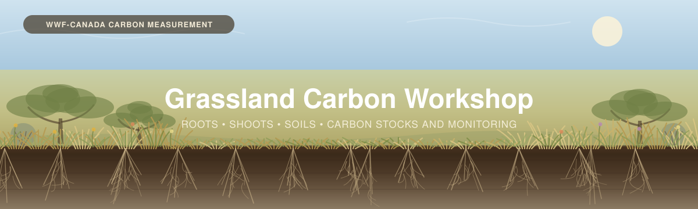

  

---

# Grassland Carbon Workshop

*Measuring carbon in grassland-type ecosystems, covering above-ground plant biomass, below-ground
plant biomass, and soil carbon.*

---

## Contents

| # | Section | What it covers |
|---|---------|----------------|
| 1 | [**Background**](01_Background/) | The carbon pools of grasslands; common grassland types found in Canada; measuring roots, shoots and soils. |
| 2 | [**Project Planning**](02_Project_Planning/) | How many cores, and where: setting a precision threshold, dividing the area into meaningfully distinct zones, and applying permanent vs single-use plots. |
| 3 | [**Field Methods**](03_Field_Methods/) | Plot setup, clip-and-weigh, shrubs, soil coring and root separation  |
| 4 | [**Data Interpretation**](04_Data_Interpretation/) | Lab results, root processing, the carbon calculator, scaling and reporting. |
| 5 | [**Monitoring Supplement**](05_Monitoring/) *(optional)* | Detecting **change**, for restoration, management and soil-health baselines. |

### Useful links

- **WWF-Canada Carbon Measurement library** — [wwf.ca/carbon-measurement](https://wwf.ca/carbon-measurement/)
- **Measuring Carbon in Vegetation (Non-Tree)** — [PDF](../_Shared/Vegetation-FINAL-Eng-2026.pdf)
- **Measuring Carbon in Non-Peat Soils** — [PDF](../_Shared/Non-peat-FINAL-Eng-2026.pdf)
- **Carbon Measurement: Sampling Design** — [PDF](../_Shared/Sampling-Design-Eng-2026.pdf)
- **Laboratory Analysis guide** — [PDF](../_Shared/Lab-Guide-Eng-2026.pdf)
- **Trees** — the [Forests workshop](../Forests/), for savannah and other areas with tree cover

---

## Overall Objectives

1. **Learn about grassland carbon**, above and below ground.
2. **Learn field methods for measuring it**, including soil coring, separating roots from soil, and
   clip-and-weigh methods
3. **Turn measurements into outputs**, carbon stocks, and baselines you can compare against

---

## How to think about this workshop

This workshop is both for learning about, and implementing, a carbon measurement project. To
implement a project it is sometimes useful to begin at the end and
work backwards from there. In this spirit, we will **start from the data sheet**

(Insert link the data sheet)

data sheet screenshot page 2 - Soil data - 

and page 4 Vegetation data - 

## A Brief Overview

[**Section 1 — Background**](01_Background/) is *why this matters*.
[**Section 2 — Project Planning**](02_Project_Planning/) is *making the data useful*.
[**Section 3 — Field Methods**](03_Field_Methods/) is *collecting the data*.
[**Section 4 — Data Interpretation**](04_Data_Interpretation/) turns the completed sheet into
carbon estimates.
[**Section 5 — Monitoring**](05_Monitoring/) is optional, and is about measuring the same place
over time.

---

(Make this a drop down link - "The people we send this to live and work in grasslands, they dont need a full list - Just keep this as a fun fact and focus on this map showing the distribution of grasslands and the loss of this ecosystem - along with a bit of info in what has been lost with it (Bird population, prarie species, essential services, etc)

## Some of Canada's grasslands

Canada's grasslands are diverse — differing in plants, climate, soil, hydrology, management and
more, which changes what you measure alongside the soil.

<table>
<tr>
<td width="56%">

These are **some** of the types you will encounter; the list is not exhaustive.

| | Where it is |
|---|---|
| 🌾 **Tallgrass prairie** | Red River valley in Manitoba, and remnants in southern Ontario |
| 🌾 **Mixed-grass prairie** | Southern Alberta, Saskatchewan and Manitoba |
| 🏜 **Dry mixedgrass / shortgrass** | Palliser's Triangle — southeastern Alberta, southwestern Saskatchewan |
| 🌾 **Fescue prairie** | Alberta foothills and the northern fescue belt |
| 🌳 **Aspen parkland** | The transition belt between prairie and boreal forest |
| 🏜 **Bunchgrass and sagebrush steppe** | Interior BC — Okanagan, Thompson, Chilcotin |
| 🌰 **Black Oak savannah** | Southern Ontario, fire-maintained, often sandy |
| 🌊 **Garry Oak meadows** | Vancouver Island and the Gulf Islands |
| 🪨 **Alvar** | Thin soils over limestone pavement — Ontario, Manitoulin, Quebec |

</td>
<td width="44%">

(REmove this and just have a map on top and below it a table of "Common Grassland ecosystem types across Canada" edit the list to reflect this"

</td>
</tr>
</table>

> [!NOTE]
> **Where there are trees, use the tree protocol.** Any tree over **2 m** tall is measured with
> the [Forests large plot and calculator](../Forests/03_Field_Methods/3A_Trees.md) — species, DBH
> and height, through the same allometric equations — and the result is carried across into this
> workshop's `4. Vegetation Data` tab.
>
> That threshold is also the clean handoff: the **medium plot** here covers shrubs and woody
> stems **0.5–2 m**, so nothing is missed between the two and nothing is counted twice.

---

(Change this section to TLDR - The workshop in a nutshell)
## Why this workshop is mostly about what you cannot see

<table>
<tr>
<td width="55%">

(For Claude - Swap this image out for the third one - 

</td>
<td width="45%">

Organic carbon cycles through grasslands starting with photosynthesis, then the deposition of these plant remains, and the decomposition of plant materials. Whatever is left over gets "Sequestered into the soils"

**The soil holds the majority of the carbon**, and it builds slowly, over long periods.

For more info , see [*Monitoring soil carbon formation during afforestation*](https://cid-inc.com/blog/monitoring-soil-carbon-formation-during-afforestation/)

</td>
</tr>
<tr>
<td width="55%">

</td>
<td width="45%">

**Of the living biomass, most is in the roots.** Grassland root biomass commonly exceeds shoot
biomass several times over, especially in Native grasses. The roots play a crucial role in soil health, and landscape stability - https://esajournals.onlinelibrary.wiley.com/doi/10.1002/ecs2.2582 

</td>
</tr>
<tr>
<td width="55%">

** Now add in the first image here - 
</td>
<td width="45%">

**Plants grow quickly, and decompose quickly as well.** The standing crop you can see turns over
on a seasonal cycle.

So a grassland carbon project should decide **which pools it cares about**, because that governs
how different stewardship techniques will show up in the numbers. Here we see a range of different native grasses and the vast underground networks we dont always see on the surface

</td>
</tr>
</table>

---

## Measuring Carbon stocks in Grasslands - Part 1: Biomass

<table>
<tr>
<td width="55%">

(for Claude - Split this into a 2 by 2 table - On the top left: Method 1 - Direct measurment - Top right - image of the clip and weight method

Botton left - Allometric relationships - Bottom right - Diagram showing the allometric relationship 

**1 · Direct measurement.** Clip the quadrat, wash the roots out of the core, weigh what you
have. This is what [Part 3](03_Field_Methods/) covers, and it is what the calculator's
`3. Root Biomass` and `4. Vegetation Data` tabs hold — measured mass, not a multiplier.

**2 · Allometric relationships.** A measurement you can take easily stands in for one you cannot:
shrub crown volume for shrub biomass, tree diameter for tree biomass, shoot mass for root mass.

An allometric relationship is *built from* direct measurement —
someone measured both quantities, on enough plants, to establish the relationship in the first
place. Root:shoot relationships in particular are often developed on a **regional or study-area
basis**, where the ratio is compared across sites and against plant relative abundance, then
modelled out.

</td>
<td width="45%">

(For Claude - Add this as text under the table )

**Why it is worth collecting data towards this**

Every campaign that measures both quantities contributes to a local relationship. Once you have
one, **later surveys can collect less field data for the same answer**, because the relationship
carries part of the work — and it is the step that makes drone and aerial survey for carbon
possible at all.

> [!IMPORTANT]
> **This applies to plant biomass only.** There is no equivalent shortcut for **soil carbon**:
> bulk density and carbon concentration have to be measured. Soil is also the largest pool, so
> the pool you can least afford to estimate indirectly is the one you cannot.

> 📸 **[FIGURE NEEDED]** — measured vs modelled, side by side: a washed root sample on one side,
> a fitted root:shoot relationship on the other.

</td>
</tr>
</table>

---

## Measuring Carbon stocks in Grasslands - Part 2: Soil Organic Carbon

<table>
<tr>
<td width="55%">

**The method is to sample the whole profile** — from the surface down to the parent material, or
to refusal. Not a fixed 30 cm window.

**Why:** a fixed depth does not hold a fixed amount of soil. As bulk density changes, a 30 cm
window holds a different *mass* of soil from one survey to the next, so you are not comparing
like with like — you are comparing two different quantities of material.

That failure has a direction, and it is the wrong one. A disturbance that **compacts** the top
30 cm raises bulk density there, which **raises the apparent carbon stock in that window** — at
the same time as the disturbance is releasing carbon from the profile as a whole. Sample only
the top 30 cm and the number can go **up** while the site is **losing** carbon.

Sampling the full profile is also what lets you see landscape-scale change at all: the signal you
are looking for is frequently below 30 cm.

</td>
<td width="45%">

Rmove this and just show an image of Soil carbon sampling (placeholder for now)

</td>
</tr>
</table>

---

## The data sheet we're building toward

Everything in Parts 3 and 4 feeds one workbook:
**[`Grassland_Carbon_Calculator.xlsx`](04_Data_Interpretation/calculators/Grassland_Carbon_Calculator.xlsx)**

<table>
<tr>
<td width="52%">

the screenshots for this are added above

> 📸 **[SCREENSHOT NEEDED]** — the calculator open, showing the tab strip and a few filled rows,
> so a reader can see typed cells against calculated ones before they open it.

</td>
<td width="48%">

| Tab | Holds |
|---|---|
| `1. Plot & Site Log` | One row per plot — grassland type, management, grazing, fire history |
| `2. Soil Data` | One row per depth increment — bulk density, coarse fragments, carbon |
| `3. Root Biomass` | **Measured** root mass by diameter class and depth |
| `4. Vegetation Data` | Shrubs (medium plot) and clip-and-weigh (small plot) |
| `5. Plot Summary` · `6. Site Summary` | Calculated — stocks, intervals, whether you hit your target |
| `Fill Me In` | 🟠 **Every value the workshop cannot supply**, in one list |

</td>
</tr>
</table>

---

## Some resources to find in this workshop

- [`Grassland_Carbon_Calculator.xlsx`](04_Data_Interpretation/calculators/) — the calculator.
- [Field datasheet and skill checklist](03_Field_Methods/) — printable, for the field.
- [**Measuring Carbon in Vegetation (Non-Tree)**](../_Shared/Vegetation-FINAL-Eng-2026.pdf) and
  [**Non-Peat Soils**](../_Shared/Non-peat-FINAL-Eng-2026.pdf) — the protocols this follows.
- [Worked example](Worked_Example/) — one dataset from field sheet to reportable stock.
- [Monitoring supplement](05_Monitoring/) — measuring the same place over time.
- [`TODO.md`](TODO.md) — what this workshop still needs from you.

---

*Part of the [Terrestrial Carbon Workshops](../) series — Forests · Grasslands · Wetlands.*
