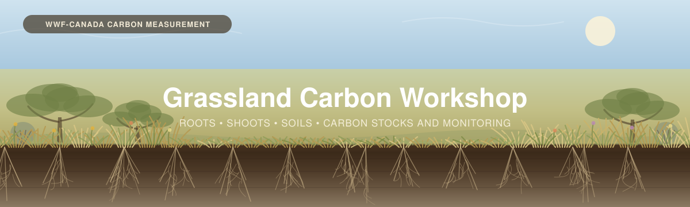

  

---

# Grassland Carbon Workshop

*This workshop covers how to measure carbon in grassland ecosystems, including above-ground plant biomass, below-ground plant biomass, and soil carbon. It is organized into four core parts, with an optional fifth part for teams measuring change through time.*

---

## Contents of this workshop

| # | Section | What it covers |
|---|---|---|
| 1 | [**Background**](01_Background/) | Grassland carbon pools, how carbon accumulates, and why roots, shoots, and soils are measured differently. |
| 2 | [**Project Planning**](02_Project_Planning/) | Project goals, study area boundaries, stratification, sample size, sampling locations, and permanent versus single-use plots. |
| 3 | [**Field Methods**](03_Field_Methods/) | Plot setup, vegetation measurements, soil and root coring, depth intervals, root separation, and field notes. |
| 4 | [**Data Interpretation**](04_Data_Interpretation/) | Laboratory results, calculator inputs, carbon stocks, uncertainty, scaling, and reporting. |
| 5 | [**Monitoring Supplement**](05_Monitoring/) *(optional)* | Detecting change through time for restoration, stewardship, and soil-health baselines. |

---

## TLDR: workshop objectives

1. **Understand grassland carbon** above and below ground.
2. **Learn field methods for measuring different carbon pools**, including vegetation plots, soil coring, and root separation.
3. **Turn field and laboratory measurements into carbon stocks and baselines** that can support comparison and monitoring.

---

## How to think about this workshop

For some carbon projects, it helps to begin at the end goal and work backwards. In that spirit, here we start with the spreadsheet that will eventually hold the field and laboratory data:

**[`Grassland_Carbon_Calculator.xlsx`](04_Data_Interpretation/calculators/Grassland_Carbon_Calculator.xlsx)**

Every input should be one of three things:

- documented in the project plan;
- measured or observed in the field; or
- returned by the laboratory under a defined method.

Once the workbook is complete and checked, those inputs can be converted into carbon stocks.

### Soil Data Sheet

  

**Each row represents one depth interval from one core.**

| Header or field group | What it describes | Where it is introduced | When it is filled |
|---|---|---|---|
| `Plot ID`, `Core ID` | The identifiers linking the soil sample to the site and plot records. | [Part 2 — Project Planning](02_Project_Planning/) and [Part 3 — Field Methods](03_Field_Methods/) | Assigned before fieldwork; confirmed in the field. |
| Stratum/site fields | The mapped area and comparison group represented by the sample. | [Part 2 — Project Planning](02_Project_Planning/#step-2--stratify-your-site) | Planning and plot setup. |
| Top and bottom depth | The depth interval represented by the sample. | [Part 3 — Field Methods](03_Field_Methods/#4-section-bag-and-label-the-core) | Field sectioning. |
| Corer/ring dimensions | The measurements defining sampled volume. | [Part 3 — Field Methods](03_Field_Methods/#3-collect-the-soil-and-root-core) | Equipment setup and field collection. |
| Hole depth | How far the sampler entered and how much material was recovered. | [Part 3 — Field Methods](03_Field_Methods/#3-collect-the-soil-and-root-core) | Field collection. |
| Coarse fragments | The stone or coarse-fragment record and its measurement basis. | [Part 3 — Field Methods](03_Field_Methods/#3-collect-the-soil-and-root-core) | Field and/or laboratory, under the selected method. |
| Bulk density | Dry soil mass per defined volume. | [Part 3 — Field Methods](03_Field_Methods/#3-collect-the-soil-and-root-core) | Laboratory or validated field/lab workflow. |
| Organic carbon concentration | The proportion of the prepared soil sample measured as organic carbon. | [Part 4 — Data Interpretation](04_Data_Interpretation/) | Laboratory result. |
| Calculated soil stock | Carbon concentration combined with bulk density, thickness, and required corrections. | [Part 4 — Data Interpretation](04_Data_Interpretation/) | Calculated by the workbook. |

### Vegetation Data tab

  

**One row represents a plot-level vegetation measurement or defined vegetation fraction.**

| Header or field group | What it describes | Where it is introduced | When it is filled |
|---|---|---|---|
| `Plot ID` | The identifier joining vegetation to the plot location. | [Part 2 — Project Planning](02_Project_Planning/) | Assigned before fieldwork; confirmed in the field. |
| Plot type and area | The small, medium, or large plot used for the measurement. | [Part 3 — Field Methods](03_Field_Methods/#2-measure-the-vegetation) | Field layout. |
| Vegetation pool/fraction | Shoots, standing dead material, shrubs, or trees, under the selected protocol. | [Part 2 — Project Planning](02_Project_Planning/#step-3--choose-what-to-measure) | Planned before fieldwork; confirmed in the field. |
| Species/group | The species name. | [Part 3 — Field Methods](03_Field_Methods/#2-measure-the-vegetation) | Field measurement and sorting. |
| Field measurement | Dry mass, stem diameter, crown dimensions, DBH, height. | [Part 3 — Field Methods](03_Field_Methods/#2-measure-the-vegetation) | Field and laboratory. |
| Date and phenological stage | When the plant was measured. | [Part 3 — Field Methods](03_Field_Methods/#2-measure-the-vegetation) | Field visit. |
| Calculated biomass/carbon | Plant biomass either measured or calculated using allometry | [Part 4 — Data Interpretation](04_Data_Interpretation/) | Calculated by the workbook after QC. |

---

## Brief Background on Canada's grasslands—and what has been lost

A significant proportion of grasslands across Canada have been lost to land conversion, among other drivers. Below, the map shows previous grassland extent in the Prairie provinces, what remains, and the difference. Canada also contains important grasslands, savannahs, parklands, and open ecosystems outside that extent, and loss and restoration opportunities.

<table>
<tr>
<td width="50%">

</td>
<td width="50%">

**Grassland extent and loss**

Prairie region grassland historical extent and losses shown in red.

</td>
</tr>
</table>

**Restoration potential**

Grassland regions have been identified as important opportunities for recovering biodiversity, ecological function, climate resilience, and carbon. Below is the result of a large-scale restoration analysis by WWF-Canada, in which the results highlight the importance of grassland areas in terms of restoration potential to benefit biodiversiry and sequester carbon.

Temperate grassland is among the world's least protected and most converted biomes, and much of Canada's native grassland has been converted or altered. The consequences extend beyond carbon as well, including:

- **Grassland birds** have experienced some of the steepest declines among North American bird groups.
- **Prairie-dependent species**, including swift fox, burrowing owl, greater sage-grouse, and black-footed ferret, are among Canada's species at risk.
- **Deep-rooted perennial cover supports multiple functions**, including water infiltration and storage, erosion control, drought resilience, forage, habitat, and carbon storage.

---

## What is grassland carbon?

Below we see Native Grassland plant above-ground and below-ground structure (often called the "roots" and the "shoots" of the plants. Notice, native grassland species plant structure includes a vast root network that can extend meters below ground. Compare this to the first plant depicted, which is common lawn grass, the difference between the lawn grass and native grasses are quite stark here.

  

Above-ground herbaceous biomass is a measure of the weight of a plant after it have been dried to remove the water of the plant. It can change quickly through growth, senescence, grazing, drought, or fire.

A grassland carbon project must decide which pools it will measure, because soil, roots, shoots, shrubs, and trees respond on different timescales and require different methods.

<table>
<tr>
<td width="55%">

</td>
<td width="45%">

**A large share of grassland living biomass can occur below ground.** Root amount and root:shoot relationships vary among species, sites, seasons, and management histories.

Roots are important for carbon, but also to building and maintaining the soil structure, water movement, plant recovery, and carbon inputs ([Ecosphere, 2019](https://esajournals.onlinelibrary.wiley.com/doi/10.1002/ecs2.2582)).

</td>
</tr>
</table>

---

## Measuring plant biomass in grasslands

There are two methods to estimate plant biomass:

<table>
<tr>
<td width="50%">

</td>
<td width="50%">

**Method 1 · Direct measurement**

Collect the plant material, dry it in an oven, and weigh it. In this workshop, we show that clipping small vegetation within a small quadrat as the preferred method to accomplish this.

[Part 3 — Field Methods](03_Field_Methods/) covers collection and data requirements here.

</td>
</tr>
<tr>
<td width="50%">

</td>
<td width="50%">

**Method 2 · Allometric relationships**

One or multiple measurements of an individual plant are taken, and the relationship of this to its biomass is modelled. Therefore, plant biomass is "estimated" without having to directly remove the plant, as long as one of these relationships is known.

</td>
</tr>
</table>

Collecting paired measurements can contribute to a local relationship that reduces destructive sampling in later surveys. However, an allometry should only be used when its species or functional group, size range, region, predictor definition, and validation are appropriate for the project.

---

## Measuring soil organic carbon

The current workshop method is to sample the **full soil profile**, this is from the top of the soil, beggining a the surface and extending down to the parent material or refusal (which is as far deep as you can go).

There are 2 main methods we will show to collect soil samples, these are "Soil Pits" shown in a) and "Soil Cores" shown in d), e), and f)

  

---

Lets dive into a bit more details on Carbon Cycling in Grasslands:

(Insert a link to go to the background tab)

## Further reading and other  resources

### Grassland extent, condition, and restoration

- **Canada's Grasslands** — [Explore grasslands](https://canadasgrasslands.ca/explore-grasslands)
- **Canadian Forage and Grassland Association** — [Grassland inventory](https://www.canadianfga.ca/en/conservation/grassland-inventory/)
- **Agriculture and Agri-Food Canada** — [National Ecological Framework for Canada](https://sis.agr.gc.ca/cansis/nsdb/ecostrat/): the Prairie Ecozone and related layers
- **Smart Prosperity Institute** — [Grasslands and Drought Resilience in the Prairies](https://institute.smartprosperity.ca/Grasslands-Drought-Resilience-Prairies)
- **WWF-Canada** — [Restoration analysis](https://wwf.ca/restoration-analysis/) · [Living Planet Data Hub (PDF)](https://github.com/user-attachments/files/32655788/Living.Planet.Data.Hub._.WWF-Canada.pdf)

### Carbon measurement guidance

- **WWF-Canada** — [Carbon Measurement library](https://wwf.ca/carbon-measurement/)
- **WWF-Canada guides in this repository** — [Measuring Carbon in Vegetation (Non-Tree)](../_Shared/Vegetation-FINAL-Eng-2026.pdf) · [Measuring Carbon in Non-Peat Soils](../_Shared/Non-peat-FINAL-Eng-2026.pdf) · [Carbon Measurement: Sampling Design](../_Shared/Sampling-Design-Eng-2026.pdf) · [Laboratory Analysis](../_Shared/Lab-Guide-Eng-2026.pdf)
- **[Forests workshop](../Forests/)** — for savannah, parkland, and other sites with trees in scope

---

## Resources in this workshop

- [`Grassland_Carbon_Calculator.xlsx`](04_Data_Interpretation/calculators/) — calculator workbook.
- [Field datasheet and skill checklist](03_Field_Methods/) — printable field resources.
- [Worked example](Worked_Example/) — one dataset from field sheet to reportable stock.
- [Monitoring supplement](05_Monitoring/) — measuring the same place through time.
- [`TODO.md`](TODO.md) — remaining evidence, asset, and method dependencies during development.

---

*Part of the [Terrestrial Carbon Workshops](../) series — Forests · Grasslands · Wetlands.*
