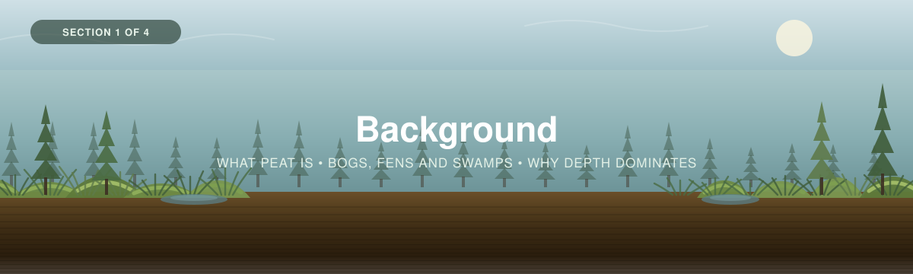

<p align="center">
  
</p>

---

[← Back to main guide](../README.md) · Next: [2 — Project Planning →](../02_Project_Planning/)

---

# Part 1 — Background

*Intro to peatland carbon in Canada, and why the number you get depends more on how deep you
dig than on anything you do in the lab.*

**Quick links:** [Measuring Carbon in Peat Soils](../03_Field_Methods/Peat-FINAL-Eng-2026.pdf) · [Bansal et al. (2023) — Practical Guide to Measuring Wetland Carbon Pools and Fluxes](../../_Shared/s13157-023-01722-2.pdf) · [Laboratory Analysis](../../_Shared/Lab-Guide-Eng-2026.pdf)

---

## What is wetland carbon?

**Wetland carbon** is the organic carbon held by a wetland — overwhelmingly in its soil, and to
a much smaller extent in the plants growing on top of it. Wetland plants photosynthesise like
any others. What makes wetlands different is what happens next.

In a forest, most of what a plant produces decomposes within a few years, and only a fraction is
worked into mineral soil. In a waterlogged wetland, **decomposition stalls**. Water fills the
pore space, oxygen cannot diffuse in, and the microbes that would otherwise finish the job run
at a fraction of their usual rate. Dead plant material accumulates *faster than it breaks down*,
and keeps accumulating — for centuries, and in many Canadian peatlands for the entire ten
thousand years since the ice left.

That is the whole mechanism. Everything else in this workshop follows from it.

Two words describe the two halves of the carbon story, and they are easy to mix up:

1. **Sequestration** — the *process*: plants pulling CO₂ out of the atmosphere, and the wetland
   locking a portion of it away. A **rate**, measured per year.
2. **Storage** — the *amount* currently held. A **stock**, measured at a point in time.

Parts 2 to 4 of this workshop measure **storage**: how much carbon is here now, per square
metre. That is the same thing the [Forests workshop](../../Forests/) measures.

**Peatlands are the one place where you can get the rate from a single visit**, because the peat
is a stratigraphic record — a dated column of its own past. That is what
[Part 5 — Chronology](../05_Chronology_Supplement/) is for, and it is the part that has no
equivalent in Forests.

> 📸 **[SLIDE NEEDED]** — a carbon-cycle diagram for a peatland: atmosphere, living vegetation,
> the acrotelm, the catotelm, and the methane pathway out. Same "pools and fluxes" framing as
> the eelgrass and forest decks.

---

## Where the carbon actually is

<table>
<tr>
<td width="55%">

Wetlands cover only **3 to 8% of the world's land surface**, and hold **up to half of all
terrestrial soil organic carbon**.

That is not a typo, and it is the reason this workshop exists. Peatlands, mangroves, salt
marshes and seagrass meadows have the highest soil organic carbon densities of any ecosystem on
Earth — reported as high as **2,000 Mg C/ha**, which is 200 kg C/m².

For scale, using the Canadian figures from the
[Forests workshop](../../Forests/01_Background/): Canada's forest **biomass** holds roughly
21 billion tonnes of carbon, and its **non-peat soils** hold over 208 billion tonnes in the top
metre. Peatlands are a small slice of the Canadian land surface holding a stock of the same
order as all of that put together — because they are not limited to the top metre.

</td>
<td width="45%">

> 📸 **[FIGURE NEEDED]** — the four Canadian pools on one axis, with peat soils added to the
> stacked bar from [Forests Part 1](../../Forests/01_Background/): forest biomass, non-peat soil
> to 1 m, non-treed vegetation, and peat. The visual point is that peat is the tall bar despite
> the small footprint.

*Sources: [Bansal et al. (2023)](../../_Shared/s13157-023-01722-2.pdf) pp.3, 13 (Lehner & Döll
2004; Mitsch & Gosselink 2015; Nichols & Peteet 2019; Uhran et al. 2021; Temmink et al. 2022).*

</td>
</tr>
</table>

Two more numbers worth carrying into a conversation with a partner or funder:

- Globally, wetlands sequester about **0.7 Pg C per year** as organic matter — roughly **6% of
  anthropogenic emissions** (Temmink et al. 2022). Peatlands, salt marshes and mangroves reach
  mean rates **up to 200 g C/m²/yr**, among the highest of any ecosystem.
- About **20% of the world's wetlands have been lost** to human conversion since 1700, mostly
  to agriculture (Fluet-Chouinard et al. 2023).

> [!NOTE]
> **Wetlands are also a methane source**, accounting for more than 20% of atmospheric CH₄
> emissions. A carbon *stock* is not a climate *benefit* on its own — a full greenhouse-gas
> account needs flux measurements, which this workshop does not cover.
> [Bansal et al.](../../_Shared/s13157-023-01722-2.pdf) covers chamber and eddy-covariance
> methods if you need them. Say plainly in your reporting that you measured a stock, not a
> balance.

---

## What peat actually is

A peat core and a lake-sediment core look similar and are not the same thing. The difference is
where the material came from, and it matters for every method in Part 5.

| | Peat | Sediment |
|---|---|---|
| **Origin** | Accumulates **in situ** — the plants grew here and died here | **Deposited from above** — transported in by water or wind |
| **Implication** | Each layer records the plant community that made it | Each layer records what was washing in |
| **Dating** | Layers can move and leach; roots grow down through them | Layers are usually more discrete |

*[Bansal et al.](../../_Shared/s13157-023-01722-2.pdf) p.13: peat "accumulates in situ in
waterlogged conditions, rather than being deposited from above."*

This distinction is why [Part 5](../05_Chronology_Supplement/) carries a warning that a
lake-sediment dating workflow does not: **²¹⁰Pb can migrate vertically through peat**, because
peat is a wet, porous, living-rooted medium rather than a settled pile of particles.

### Peat, mucky peat, and muck

Soil scientists split organic soil into three types by how far decomposition has gone. You will
use these names on the field sheet, so learn them now:

| Name | Horizon | Material | What it looks like | Carbon by weight |
|---|---|---|---|---|
| **Peat** | **Oi** | **Fibric** — minimally decomposed | Plant structure clearly visible; you can identify *Sphagnum* leaves, sedge roots | Highest |
| **Mucky peat** | **Oe** | **Hemic** — intermediate | Some structure visible, some not; squeezes to a paste | Middle |
| **Muck** | **Oa** | **Sapric** — advanced | Dark, greasy, structureless; nothing identifiable | Lowest |

*[Bansal et al.](../../_Shared/s13157-023-01722-2.pdf) p.13. Note the direction: **the more
decomposed the material, the less carbon per unit weight** — but also the higher its bulk
density, and those two partly cancel. Do not assume a muck layer holds less carbon per
centimetre than a fibric one; measure it.*

In the field you will record this on a finer scale — the **von Post humification scale**, H1
(undecomposed, squeezes clear water) to H10 (completely decomposed, extrudes entirely between
the fingers). [Part 3A](../03_Field_Methods/3A_Peat_Coring.md) has the full scale, and the
calculator's `R1. Reference` tab carries it as a lookup.

> [!IMPORTANT]
> **Three numbers that sound like they disagree, and don't.** You will meet all three, so get
> them straight:
>
> | Threshold | What it defines | Source |
> |---|---|---|
> | **≥ 17% organic carbon** by weight | An **organic soil horizon** in the Canadian System of Soil Classification. Below it, the horizon is *mineral* | [Peat guide](../03_Field_Methods/Peat-FINAL-Eng-2026.pdf) glossary |
> | **> 12% SOC** | The same idea in **US Soil Taxonomy**. Different country, different cut-off | Bansal p.13 |
> | **> 65% organic matter** | An informal description of material you'd call **"peat"** rather than just organic soil | Bansal p.13 |
> | **≥ 30 cm** of organic horizon | A **peatland** — a site classification, not a soil one | [Peat guide](../03_Field_Methods/Peat-FINAL-Eng-2026.pdf) glossary |
>
> The first three are consistent once you convert. At the workshop's default factor of 0.5
> (organic matter → carbon), 17% organic **carbon** is about 34% organic **matter** — so the
> Canadian organic-horizon threshold sits well below the 65% that earns the name "peat".
> A horizon can be organic without being peat. **Watch your units: carbon or matter, and say
> which.**

---

## Three wetlands, and what changes between them

The [landing page](../README.md#three-wetlands-one-method) introduced bogs, fens and swamps.
Here is the version you need for planning, because the differences run in a chain:
**water source → chemistry → vegetation → peat properties → how you sample.**

| | 🟤 **Bog** | 🟢 **Fen** | 🌲 **Swamp** |
|---|---|---|---|
| **Water source** | Precipitation only — **ombrotrophic** | Groundwater carrying minerals — **minerotrophic** | Variable; often flowing or seasonally flooded |
| **pH** | Strongly acidic, ~3.5–4.5 | Weakly acidic to alkaline, ~5–8 | Variable |
| **Nutrients** | Very poor | Moderate to rich | Moderate to rich |
| **Dominant peat formers** | *Sphagnum* moss | Sedges, brown mosses | Wood, leaf litter, sedges |
| **Peat type** | Fibric *Sphagnum* peat near surface, becoming hemic/sapric with depth | Sedge peat, often more decomposed | Woody peat, often with large inclusions |
| **Typical depth** | Deepest profiles; raised domes of several metres | Moderate to deep | **Shallow to very deep** — the most variable of the three |
| **Surface form** | Pronounced **hummock–hollow** microtopography | Flatter lawns; sometimes patterned ridges and flarks | Hummocks around tree bases, pits from windthrow |
| **Extra pools to measure** | Living *Sphagnum* (small) | Sedge biomass (small) | **Trees — substantial** |
| **The problem it gives you** | Very low bulk density surface peat; easy to compress | Denser, wetter peat; corer can smear | **Wood.** Buried logs stop a corer dead |

### What this means for your field plan

- **A swamp needs the Forests tree protocol.** At ≥25% tree cover, tree carbon is a real pool,
  not a rounding error. Measure DBH, species and height as in
  [Forests Part 3A](../../Forests/03_Field_Methods/3A_Trees.md), and run it through the same
  [allometric equations](../../Forests/04_Data_Interpretation/calculators/). The peat is still
  the bigger pool — but in a swamp it is no longer the *only* one worth the trip.
- **Shrubs and ground vegetation** in any of the three follow
  [Forests Part 3C](../../Forests/03_Field_Methods/3C_Understory.md).
- **Bogs need *Sphagnum* care.** The living green moss is vegetation; the brown material
  immediately beneath it is peat. A core taken from the surface has already counted the brown
  material, so counting it again as vegetation double-counts it.
  [Part 3B](../03_Field_Methods/3B_Vegetation.md) sets out where to draw the line.
- **Fens and swamps are harder to core than bogs**, for opposite reasons — fen peat smears,
  swamp peat has wood in it. Budget more field time per core, not less.

> [!NOTE]
> **A peatland is defined by its soil, not its plants.** A treed swamp on 3 m of peat is a
> peatland; a *Sphagnum* lawn on 15 cm of organic material over till is not. The threshold is
> **30 cm of organic horizon**. The calculator flags cores below it rather than rejecting them,
> because "this site is not a peatland" is itself a finding worth reporting.
>
> **Marshes are the fourth type, and mostly out of scope.** Emergent marshes are wetlands but
> usually not peatlands — mineral soils, shallow organic horizons, high productivity and rapid
> turnover. The coring method here works on them; the interpretation changes, and the
> fixed-depth figure becomes the headline rather than the full profile. The calculator accepts
> `Marsh` as a wetland type for this reason.

---

## Why depth dominates the stock

This is the single most important thing in Part 1, and it is arithmetic rather than ecology.

Carbon stock in a peat profile is, to a good approximation,

```
stock  =  depth  ×  bulk density  ×  carbon fraction
```

Three terms. They do **not** vary equally. Take a plausible mid-range profile — 150 cm of peat
at 0.10 g/cm³ and 50% carbon, which gives **75 kg C/m²** — and swing each term across the range
you might actually see, holding the other two fixed:

| Term | Realistic range | Stock goes from → to | Fold change |
|---|---|---|---|
| **Peat depth** | 30 cm → 800 cm | 15.0 → 400.0 kg C/m² | **26.7 ×** |
| **Bulk density** | 0.03 → 0.20 g/cm³ | 22.5 → 150.0 kg C/m² | 6.7 × |
| **Carbon fraction** | 45% → 55% | 67.5 → 82.5 kg C/m² | 1.2 × |

Depth wins, and it is not close. Bulk density matters and is not negligible — but it varies over
a narrower range *within a single site*, and it is strongly structured by depth anyway, since
peat compacts and decomposes as it is buried. Carbon fraction is nearly a constant; peat runs
45–55% carbon almost everywhere.

**Now the practical point.** Of those three terms, depth is the one you can measure **cheaply,
non-destructively, and hundreds of times a day with a steel probe.** Bulk density and carbon
fraction each require a core, a drying oven, and a lab invoice.

<table>
<tr>
<td width="60%">

So the highest-value hour of your field season is the one you spend walking a depth grid — and
that is why [Part 2, Step 5](../02_Project_Planning/README.md) treats the **depth survey as the
design instrument**, not as a preliminary. A single core becomes defensible for a whole plot
only because you have surveyed the plot's depths and know the core sits at a representative one.

</td>
<td width="40%">

> 📸 **[FIGURE NEEDED]** — cross-section through a raised bog: peat thickening from the lagg
> margin to the dome centre, mineral contact marked, and probe points along the surface showing
> what the depth survey actually captures.

</td>
</tr>
</table>

> [!IMPORTANT]
> **Do not stop at 30 cm.** Sampling to only the depth a conventional soil survey uses will miss
> most of the carbon. [Bansal et al.](../../_Shared/s13157-023-01722-2.pdf) p.19 reports that
> when US wetlands were sampled to 120 cm, **65% of the organic carbon pool sat between 30 and
> 120 cm** (Nahlik & Fennessy 2016) — below where many surveys stop. Organic layers in wetlands
> run "from a few centimetres to several metres."
>
> This workshop therefore reports **to the mineral contact** as the headline figure, with a
> **fixed 100 cm** figure alongside so your numbers stay comparable with studies that used a
> standard depth. You get both from the same core, and the calculator computes both.

---

## The acrotelm and the catotelm

One more idea, and it is the one that makes [Part 5](../05_Chronology_Supplement/) make sense.

A peat column is not uniform. It has two functional layers:

<table>
<tr>
<td width="50%">

**The acrotelm** — the upper layer, above the lowest water table.

- Periodically **aerobic**
- Living roots present
- Decomposition is still **active**
- Water moves through it rapidly
- Typically the top 10–50 cm

Material here is still *being* decomposed. Much of what is currently in the acrotelm will never
make it into long-term storage.

</td>
<td width="50%">

**The catotelm** — everything below, permanently saturated.

- **Anaerobic**, permanently
- No living roots
- Decomposition is very slow
- Water barely moves
- Everything from the acrotelm base to the mineral contact

Material that reaches the catotelm is, for practical purposes, **locked in** — this is the
long-term carbon store.

</td>
</tr>
</table>

> [!WARNING]
> **This is why a peatland has two carbon accumulation rates, and why comparing them naively
> produces a wrong headline.**
>
> - **RERCA** — the *recent* rate, from ²¹⁰Pb and ¹³⁷Cs dating over the last ~100–150 years. It
>   is measured mostly through the **acrotelm**, where decomposition has not finished.
> - **LORCA** — the *long-term* rate, from ¹⁴C dating of the whole profile. It is the net rate of
>   carbon that actually made it into the **catotelm**.
>
> **RERCA is almost always larger than LORCA**, often by a factor of two or more. In the
> [worked example](../Worked_Example/) it is 2.09 × larger. That is **not** evidence of
> accelerating sequestration. It is the acrotelm, caught mid-decomposition. Reporting it as a
> trend is the commonest serious error in peatland carbon work, and Young et al. (2019, *Sci
> Rep*) is a whole paper about it. The calculator flags the ratio automatically so you cannot
> report it by accident.

---

## Disturbance: what takes the carbon back out

A peatland accumulates carbon only while it stays wet. Nearly every way a peatland loses carbon
runs through **drainage**, directly or indirectly — lower the water table, let oxygen into the
peat, and a store built over millennia starts decomposing on a timescale of decades.

| Disturbance | What it does | Timescale |
|---|---|---|
| **Drainage** — ditching for forestry, agriculture, or development | Lowers the water table, thickening the aerobic acrotelm. Peat oxidises and the surface subsides | Decades, and it keeps going |
| **Peat extraction** | Removes the store physically, and drains what is left behind | Immediate, plus ongoing loss from the residual peat |
| **Fire** | Burns the surface peat directly. **Drained peat can burn deep and smoulder for months** — an intact wet peatland mostly cannot | Days to months, losses equivalent to centuries of accumulation |
| **Permafrost thaw** | Mobilises frozen carbon. Can go either way: thermokarst collapse may create a wetter, still-accumulating system, or may drain it | Decades |
| **Water-table drawdown from climate** | Same mechanism as ditching, without the ditch | Decades |
| **Restoration — rewetting** | Raises the water table, stops oxidation, restarts accumulation. Often raises CH₄ emissions at first | Years to decades |

Two consequences for how you work:

1. **Record the disturbance history of every site.** A drained bog and an intact bog can hold
   the same stock today and be on completely opposite trajectories. A stock measurement with no
   hydrological context cannot tell them apart, and your report should say which you have.
2. **Permafrost peatlands are cored in winter.** Counter-intuitive but correct:
   [Bansal et al.](../../_Shared/s13157-023-01722-2.pdf) p.16 notes permafrost peatlands are
   best cored while frozen, so the seasonally-thawed active layer can actually be recovered.
   Thawed bogs and fens *nearby* are easier in summer or autumn. If your study area spans both,
   you may need two field campaigns in different seasons.

---

## So how do you measure peatland carbon?

The chain is short, and every step has a page in this workshop:

1. **Survey the depth.** A steel probe on a grid, across the site and within each plot. This
   sets your strata, your plot locations, and your coring points.
   → [Part 2](../02_Project_Planning/)
2. **Core to the mineral contact.** A Russian-style side-filling corer, in 50 cm drives, until
   you hit mineral soil or refusal. → [Part 3A](../03_Field_Methods/3A_Peat_Coring.md)
3. **Section the core** and send the sections for **bulk density** and **carbon content**
   (loss-on-ignition, ideally calibrated against a CHN analyser).
   → [Part 3A](../03_Field_Methods/3A_Peat_Coring.md) and the
   [Lab Guide](../../_Shared/Lab-Guide-Eng-2026.pdf)
4. **Measure the other pools if they're there** — trees in a swamp, shrubs and ground layer
   anywhere. → [Part 3B](../03_Field_Methods/3B_Vegetation.md)
5. **Multiply up and add an interval.** Section stocks → core → plot → site → study area, with
   an honest confidence interval at every level.
   → [Part 4](../04_Data_Interpretation/)
6. **Optionally, date the core** and get an accumulation rate as well as a stock.
   → [Part 5](../05_Chronology_Supplement/)

> [!TIP]
> **Step 6 changes step 2.** Dating a core needs **1–2 cm continuous sections** through the
> upper 10–50 cm, and ideally three replicate cores per site. You cannot decide that after the
> field season — the sections either exist or they don't. If accumulation rates are anywhere in
> your objectives, read [Part 5](../05_Chronology_Supplement/) **before** you finalise Part 2.

---

## Know your region before you plan

Canada's peatlands are not one thing. A raised *Sphagnum* bog on the Boreal Shield, a patterned
fen in the Hudson Bay Lowlands, a permafrost peat plateau in the Northwest Territories and a
red maple swamp in southern Ontario differ in depth, peat type, accessibility, and the season
you can work in them.

> 🔗 **[REGIONAL PROTOCOL NEEDED]** — the Forests workshop pairs its methods with a regional
> protocol ([Southern Ontario – St. Lawrence](../../Forests/01_Background/SO-StLawrence-Eng-2026.pdf)),
> which sets out geography, soils and project-design considerations region by region. **No
> equivalent wetland regional protocol is included in this folder yet.** If one exists in the
> series, it belongs here. Until then, treat the depth survey in
> [Part 2](../02_Project_Planning/) as doing that work empirically: it tells you what your site
> is actually like, whatever the region-level description says.

Two things to establish before you write a sampling plan, regardless of region:

- **Is it a peatland at all?** Probe first. A site with 20 cm of organic material over till is a
  different project from one with 4 m of peat, and you can find out in an afternoon.
- **Can you get there, and when?** Peatlands are the one ecosystem in this series where access
  is routinely the binding constraint. Frozen ground, low water, boardwalks, helicopter
  time — all of it belongs in the plan, not in the field notes.

---

## In the next section

We'll move to **Project Planning**: stratifying a site that varies far more than a forest does,
deciding how many cores you actually need (and why the textbook formula under-answers that
question at small sample sizes), and running the depth survey that makes one core stand for a
whole plot.

---

## In this section

- `images/` — section banners.

> ✍️ **[SLIDE DECK NEEDED]** — the workshop presentation for Part 1, as `.pptx` and `.pdf`, to
> sit alongside this page the way the eelgrass and forest decks do.
> 🔗 **[VIDEO NEEDED]** — the WWF peat coring video referenced by the
> [peat guide](../03_Field_Methods/Peat-FINAL-Eng-2026.pdf) ("this guide and its corresponding
> video"). The playlist URL belongs here.

---

[← Back to main guide](../README.md) · Next: [2 — Project Planning →](../02_Project_Planning/)
