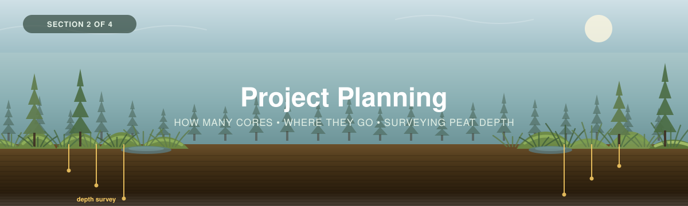

<p align="center">
  
</p>

---

[← 1 — Background](../01_Background/) · [Back to main guide](../README.md) · Next: [3 — Field Methods →](../03_Field_Methods/)

---

# Part 2 — Project Planning

## From a carbon question to a sampling design

**Quick links:** [Sampling Design Guide](../../_Shared/Sampling-Design-Eng-2026.pdf) · [Measuring Carbon in Peat Soils](../03_Field_Methods/Peat-FINAL-Eng-2026.pdf) · [Bansal et al. (2023)](../../_Shared/s13157-023-01722-2.pdf) · [Sampling design tools](Sampling%20Design%20Tools/) · [Appendix A — sampling logic](#appendix-a--a-brief-lesson-in-sampling-logic)

---

**Before establishing any plots**, four questions are worth addressing:

1. **What do I want to know?** Baseline stock? A comparison between an intact and a drained
   peatland? Accumulation rates? All of the above?
2. **Where does that question apply?** The whole complex, just the bog, the treed margin?
3. **How much data do I need?** How many cores is enough, and what is our capacity?
4. **Where should the cores go?**

Answering these is what a **sampling design** aims to achieve. It turns a carbon question into a
field plan: a number of cores, and a set of coordinates.

This section covers the five steps of a sampling design.

| # | Step | Answers |
|---|------|---------|
| 1 | **[Define the study area](#step-1--define-your-study-area)** | *Where, roughly, am I working?* |
| 2 | **[Stratify](#step-2--stratify-your-site)** | *How does this wetland complex split up — and how does each wetland split up internally?* |
| 3 | **[Choose the carbon pools](#step-3--choose-which-pools-to-measure)** | *Peat, trees, understory — which, and why?* |
| 4 | **[Decide how many cores](#step-4--decide-how-many-cores)** | *How many cores meet my goal?* |
| 5 | **[Decide where they go](#step-5--decide-where-the-cores-go)** | *Exactly where, and how is each plot laid out?* |

> The methods here follow WWF-Canada's [Sampling Design guide](../../_Shared/Sampling-Design-Eng-2026.pdf)
> and the plot specifications in [Measuring Carbon in Peat Soils](../03_Field_Methods/Peat-FINAL-Eng-2026.pdf),
> with sampling-design guidance from
> [Bansal et al. (2023)](../../_Shared/s13157-023-01722-2.pdf) pp.10, 16–17.

### Two differences from the Forests workshop, up front

If you have worked through [Forests Part 2](../../Forests/02_Project_Planning/), most of this
will be familiar. Two things genuinely change, and both make the page longer rather than shorter.

1. **Stratification is not optional here.** In a forest it is a cost-saving option. In a
   peatland complex it is the difference between a defensible number and a meaningless one,
   because peat depth — and therefore carbon — varies by an order of magnitude across a single
   basin. Step 2 is the longest step on this page for that reason.
2. **The depth survey does double duty.** It places your cores *and* supplies your variability
   prior, which means you can size the campaign properly from a steel probe and an afternoon,
   without waiting on lab results. [Step 4](#step-4--decide-how-many-cores) shows the evidence
   for that.

> [!WARNING]
> **The sampling tool in this folder is a placeholder.** No wetland-specific Earth Engine tool
> exists yet. The [Forests sampling tool](Sampling%20Design%20Tools/) has been copied in because
> its statistics core is ecosystem-free — Cochran's formula, proportional allocation and the
> precision check are the same maths whatever you are measuring — but **its built-in priors are
> forest values and its default plot size is 400 m²**. Using them unchanged for a peatland will
> under-size your campaign. Read
> [`Sampling Design Tools/README.md`](Sampling%20Design%20Tools/) before you open it, and type
> in your own prior and a 100 m² plot size.
>
> You do not need the tool. Everything it computes is set out longhand in
> [Appendix A](#appendix-a--a-brief-lesson-in-sampling-logic), and the depth survey — which
> matters more — needs nothing but a probe and a tape.

---

## Background: what sampling is, and why it works

You cannot core an entire peatland. So you core a **sample** of it, and use that sample to say
something about the whole — with a stated margin of error.

Three ideas carry the whole of Part 2:

| Idea | In one line |
|---|---|
| **A sample estimates a population** | Your cores are not the answer; they are evidence about the answer |
| **Precision comes from *n* and variability** | $SE = s/\sqrt{n}$ — four times the cores buys twice the precision, never four times |
| **Structure can be removed** | If you can *map* a source of variation, you can stratify on it and stop paying for it |

The third one is where peatlands differ most from forests, and it is worth being concrete about
why. Peat depth is not random noise scattered across a basin. It is **structured**: deep in the
middle, shallow at the edges, deeper under hollows than hummocks. Structure you can see and map
is structure you can stratify on. Variation you leave unstratified shows up in your confidence
interval instead — and in a peatland, it shows up *large*.

### The takeaway

**Every hour spent understanding the structure of your site before you core is worth several
hours of coring.** In a forest that is good advice. In a peatland it is the difference between a
±20% answer and a ±80% one — and you will see exactly that happen in the
[worked example](../Worked_Example/).

---

# Implementing a sampling design

## Step 1 — Define your study area

*Where, roughly, am I working?*

Draw the boundary of the area your estimate will apply to, and get its **area in m²**. Every
scaling step in [Part 4](../04_Data_Interpretation/) multiplies by this number, so an
over-generous boundary inflates your reported carbon directly.

Three peatland-specific cautions:

- **Wetland boundaries are fuzzy, and the fuzz is carbon.** A bog grades into a lagg, which
  grades into upland. Decide where your boundary sits and **write down the rule you used** —
  "organic depth ≥30 cm, probed", or "the wetland polygon from the provincial layer", or "the
  visible *Sphagnum* extent". Any of these is defensible. Not saying which is not.
- **Do not take a mapped wetland polygon as truth.** Provincial and national wetland layers are
  built for inventory, not for carbon accounting. They frequently miss small wetlands, merge
  adjacent ones, and place edges tens of metres out. Probe the edge in a few places before you
  trust it.
- **Exclude open water unless you intend to core it.** A beaver pond inside your boundary has a
  different carbon profile from the peat around it, and averaging it in silently is a real error.

> 📸 **[SCREENSHOT NEEDED]** — a peatland complex boundary drawn over imagery, with the bog,
> fen and swamp units visible and the total area reported.

> [!TIP]
> **✅ Before moving on, you should have:**
> - A boundary you can defend, and the **rule** you used to draw it
> - Its **area in m²**
> - Any internal exclusions (open water, roads, upland inclusions) removed from that area

---

## Step 2 — Stratify your site

*How does this wetland complex split up — and how does each wetland split up internally?*

**Stratification** divides the study area into internally similar sub-areas — **strata** — and
samples each separately. [Bansal et al.](../../_Shared/s13157-023-01722-2.pdf) p.17 calls the
result a **stratified random design**, and notes it is the common choice "since it ensures
sampling in representative strata while maintaining randomization."

In a peatland you stratify **twice**, at two different scales, and they do different jobs.

### 2A — Between wetlands: the obvious split

Different wetland types are different populations. Do not average a bog and a swamp together and
report a single mean; you will get a number that describes neither.

| Stratify by | Typical strata | Why it works |
|---|---|---|
| **Wetland type** | Bog · fen · swamp · marsh | Different hydrology, different peat, different depth distributions |
| **Basin / unit** | Each discrete wetland in a complex | Each has its own depocentre and its own depth range |
| **Disturbance history** | Intact · drained · extracted · rewetted | A drained bog is on a different trajectory, and often a different stock |
| **Permafrost presence** | Peat plateau · thawed bog/fen | Changes the stock, the method, **and the season you can work** |

The [worked example](../Worked_Example/) uses exactly this: three strata, one per wetland type,
and it is the reason the three site means (153, 125, 71 kg C/m²) are reportable at all.

### 2B — Within a wetland: the split that actually costs you

This is the part that has no forest equivalent, and the part most campaigns skip.
[Bansal et al.](../../_Shared/s13157-023-01722-2.pdf) pp.16–17 and 74 name four axes of
within-wetland variation. All four are visible on the ground or in imagery, which means all four
are stratifiable.

<table>
<tr>
<td width="55%">

| Axis | What it looks like | Effect on carbon |
|---|---|---|
| **Landscape position** | Centre vs **margin**; the **depocentre** where the basin is deepest | **The big one.** Depth can differ several-fold between centre and edge |
| **Vegetation zone** | Concentric zones in a depressional wetland; *Sphagnum* lawn → shrub → treed margin | Tracks hydrology, and therefore peat type and density |
| **Microform** | **Hummock / hollow / lawn**, at a scale of 0.5–2 m | Hollows accumulate faster and are wetter; hummocks are drier and more decomposed at the surface |
| **Geomorphic setting** | Riverine vs depressional vs slope vs flat | Sets whether sediment focuses in a depocentre at all |

</td>
<td width="45%">

> 📸 **[FIGURE NEEDED]** — a depressional wetland from above with concentric vegetation zones
> marked, plus a cross-section beneath it showing the depocentre and the hummock–hollow surface.

**Sediment focusing** is the mechanism behind depocentres: wind and animal movement redistribute
material toward the deepest part of a basin, and can also trap it in the vegetated edge
(Bansal p.16, citing Zarrinabadi et al. 2023). It is why "core the middle" and "core at random"
give different answers, and why neither on its own is right.

</td>
</tr>
</table>

> [!IMPORTANT]
> **You do not have to stratify on all four.** Stratify on what you can map at the scale your
> plots sit at, and let the rest land in your confidence interval:
>
> - **Landscape position and vegetation zone** are mappable from imagery and a depth survey.
>   **Stratify on these.** They carry most of the variance.
> - **Microform** is real but operates at 0.5–2 m, below plot scale. You cannot stratify a
>   100 m² plot by hummock and hollow — but you can **record which one your coring point sat
>   on**, which is why the calculator's `1. Plot & Site Log` has a `Microform` column. That
>   turns it into a covariate you can post-stratify on later, at no field cost.

### 2C — How far apart do plots need to be?

If plots sit closer together than the distance over which the peat is spatially autocorrelated,
the second plot tells you much of what the first already did — you paid for a core and bought
less than a core's worth of information.

[Bansal et al.](../../_Shared/s13157-023-01722-2.pdf) p.10 gives the formal answer:
**semivariograms**, computed from existing field data or remotely sensed information, "help
determine the minimum distance that plots need to be separated to minimize spatial
autocorrelation among plots" (Cohen et al. 1990; Doughty et al. 2021; Glukhova et al. 2022).
Combined with geostatistics and the probability distribution of the quantity, they can optimise
the design outright (Fennessy et al. 1994a; Vargas and Le 2023).

**In practice, most projects will not have the prior data a semivariogram needs.** Two workable
substitutes:

1. **Use your own depth survey.** Once you have probed a grid (Step 5), you have exactly the
   dataset a semivariogram wants. Even by eye: if depth is still changing steadily between
   adjacent grid points 25 m apart, your plots need to be further apart than 25 m.
2. **Default to the guide's grid spacing.** The [peat guide](../03_Field_Methods/Peat-FINAL-Eng-2026.pdf)
   puts depth-probe lines **10–25 m apart**. Placing plots at least that far apart is a
   reasonable floor in the absence of anything better.

<details>
<summary><b>📊 Worked example</b> &nbsp;·&nbsp; <i>how the Mica Bog complex stratified — and what it cost them not to go further</i></summary>

<br>

Three strata, one per wetland type, drawn from imagery and confirmed by probing:

| Stratum | Wetland | Area | Why |
|---|---|---|---|
| **S1** | Mica Bog | 240,000 m² (24 ha) | Raised *Sphagnum* bog, ombrotrophic, black spruce scattered |
| **S2** | Rushing Fen | 155,000 m² (15.5 ha) | Minerotrophic sedge fen along a creek |
| **S3** | Cedar Swamp | 88,000 m² (8.8 ha) | Eastern white cedar, ≥25% tree cover |

**Total: 483,000 m² (48.3 ha).**

**What they got right:** stratifying by type. The three sites turned out to differ nearly
two-fold in mean stock, and each is reportable on its own.

**What they did not do:** stratify *within* each wetland by landscape position. Each site got
three plots placed at random within it — and in two of the three, one of those three plots
landed near the basin margin:

| Site | Plot depths to mineral contact | Achieved precision |
|---|---|---|
| **S1 — bog** | 352, 366, **214** cm ← margin plot | **NOT MET: ±44%** |
| **S2 — fen** | 182, 196, 158 cm | **MET: ±18%** |
| **S3 — swamp** | 96, 104, **26** cm ← margin plot | **NOT MET: ±82%** |

That is the whole lesson of Step 2 in one table. The fen — laterally uniform, no strong
depocentre — hit its target with three cores. The bog and the swamp, both with a pronounced
centre-to-margin depth gradient, missed it badly, because an unstratified mean has to absorb
that gradient as variance.

**Had they split each wetland into `centre` and `margin` strata and allocated by area, the same
nine cores would have produced two tighter means per site instead of one wide one.** Same
fieldwork, better answer. This is the single highest-return decision on the page.

</details>

> [!NOTE]
> **Stratify on something you can see and map.** A stratum must be delineable across the whole
> study area, because you need its **area** to weight it. "The wet bit" is not a stratum;
> "organic depth >2 m, from the probe grid" is — and after Step 5 you will have exactly that
> layer.

> [!TIP]
> **✅ Before moving on, you should have:**
> - Strata **drawn and named**, at the between-wetland level at minimum
> - The **area of each in m²** — these are the weights [Part 4](../04_Data_Interpretation/) uses
> - A decision on **within-wetland strata** (centre/margin at least), or an explicit note that
>   you chose not to and expect a wider interval
> - A **minimum plot spacing**

---

## Step 3 — Choose which pools to measure

*Peat, trees, understory — which, and why?*

This step is simpler than its forest equivalent, because in a peatland one pool dominates so
heavily that the decision is mostly made for you.

| Pool | Share of the stock | Cost to measure | Recommendation |
|---|---|---|---|
| **Peat** | The overwhelming majority | Coring + lab analysis. The bulk of your budget | ✅ **Always.** This is the project |
| **Trees** (swamps) | Real but secondary — single-digit percent of a deep-peat swamp's total | One plot visit, no lab cost | ✅ **Yes if ≥25% tree cover** |
| **Shrubs / ground layer** | Small, typically <1% | Destructive harvest + drying | ⬜ Optional |
| **Living *Sphagnum*** | Very small | Trivial once you're coring | ⬜ Optional, but see the trap below |
| **Dead wood / litter** | Modest in swamps | Separate protocol | ❌ Not covered — a genuine gap, same as in Forests |
| **Methane and CO₂ fluxes** | n/a — a rate, not a stock | Chambers or eddy covariance | ❌ Not covered. See [Bansal et al.](../../_Shared/s13157-023-01722-2.pdf) |

### Is this a swamp?

If tree cover is **≥25%**, trees are a pool worth measuring, and the protocol is already written:

- **Trees** → [Forests Part 3A](../../Forests/03_Field_Methods/3A_Trees.md). DBH, species,
  height, in a 400 m² large plot. Run it through the same
  [allometric equations](../../Forests/04_Data_Interpretation/calculators/) — Lambert et al.
  (2005) and Ung et al. (2008), with the published root:shoot ratios for below-ground biomass.
- **Shrubs and ground vegetation** → [Forests Part 3C](../../Forests/03_Field_Methods/3C_Understory.md).

**Note the plot-size mismatch, because it affects Step 4.** A tree plot is 400 m²; a peat plot is
100 m². They nest — the peat plot sits inside the tree plot — but they have different population
sizes $N$, so **run the sample-size calculation separately for each pool.**
[Part 3](../03_Field_Methods/) sets out the nested layout.

> [!WARNING]
> **The *Sphagnum* double-counting trap.** Living green *Sphagnum* is vegetation. The brown
> material directly beneath it is peat — and a core taken from the peat surface has **already
> counted it**. If you also harvest a moss quadrat down into the brown layer and add it as
> vegetation carbon, you have counted the same carbon twice.
>
> The rule: **the core starts where the vegetation harvest stops.** Decide the boundary in the
> field, write it on the sheet, and keep it consistent across plots.
> [Part 3B](../03_Field_Methods/3B_Vegetation.md) has the detail.

### Decide your reporting basis now, not later

This is the peatland equivalent of the forest workshop's "decide your reporting depth now", and
it is a bigger decision here because there is no obvious right answer.

| Basis | What it is | Good for | Weakness |
|---|---|---|---|
| **Full profile** *(this workshop's default)* | Surface to the **mineral contact** | The real stock. What is actually there | Cores differ in length, so plots are not directly comparable without care |
| **Fixed depth** | Surface to a set depth — **100 cm** by default | Comparability with other studies and with coastal-carbon convention (Howard et al. 2014) | **Misses most of the carbon** in deep peat |
| **Both** | Report full profile as the headline, fixed depth alongside | Everything above | Nothing. Do this |

**The calculator computes both from the same core**, so "both" costs you nothing. The
`REFERENCE_DEPTH_CM` setting controls the fixed figure; 100 cm is the default, and 30, 50 and
200 cm are all in use elsewhere.

> [!IMPORTANT]
> **A fixed 30 cm depth is not adequate for a peatland**, and reporting one without saying so is
> misleading. [Bansal et al.](../../_Shared/s13157-023-01722-2.pdf) p.19: when US wetlands were
> sampled to 120 cm, **65% of the organic carbon sat between 30 and 120 cm** (Nahlik & Fennessy
> 2016). If a funder or a standard requires a 30 cm figure, give it — and give the full profile
> next to it, with the ratio between them stated.

> [!TIP]
> **✅ Before moving on, you should have:**
> - A **pool list** with a reason for each inclusion and exclusion
> - A yes/no on **trees** (is tree cover ≥25%?)
> - A **reporting basis** — full profile, fixed depth, or both — written down
> - If vegetation is in scope, the ***Sphagnum* boundary rule** you will use

---

## Step 4 — Decide how many cores

*How many cores meet my project goal?*

Too few cores and your estimate carries too much uncertainty to support a decision. Too many and
you have spent a field season and a lab budget on precision nobody needed.

You provide four things, and the calculation returns a number of cores:

| You provide | Meaning | Typical |
|---|---|---|
| **Area** (m²) | Per stratum, from Step 2 | from Steps 1–2 |
| **Margin of error** ($E$) | How precise the estimate must be | ±10% or ±20% |
| **Confidence level** | How reliable that interval has to be | 80% or 90% |
| **A variability prior** | Roughly how much carbon, and how patchy | see below |

### One number per pool, per stratum

Each pool has its own plot size, so its own population size $N$, and therefore its own required
$n$. And each **stratum** has its own variability, so its own $n$ too.

| Pool | Plot size | $N$ in a 10 ha stratum |
|---|---|---|
| **Peat** | **100 m²** — the 10 × 10 m plot the depth survey is run over, one coring point per plot | 1,000 |
| Trees (swamps only) | 400 m² | 250 |
| Understory (medium) | 16 or 100 m² | 6,250 or 1,000 |

> [!NOTE]
> **In a peatland, $N$ makes almost no difference, and Part 2 should say so plainly rather than
> leaving you to work it out.** At 100 m² plots a 10 ha stratum already holds 1,000 possible
> plot locations, and Cochran's finite-population correction has effectively stopped mattering
> by then — the answer lands within one core of the infinite-population value at every
> variability level in the table below.
>
> This is a real difference from Forests, where 400 m² plots in a 12 ha block give $N$ = 300 and
> the correction still bites a little. **You can use the simple form**
> $n = (z \cdot CV / E)^2$ for peat and lose nothing. The full formula is in
> [A3](#a3--cochrans-correction-why-big-areas-stop-needing-more-plots) if you want to check.
>
> It also means **a bigger peatland is not a more expensive survey.** Variability drives your
> sample size; area does not. That is worth being able to explain to a funder.

### Where the prior comes from

The calculation needs a rough idea of how variable the carbon is *before* you have measured
anything. That is a **prior**, and in a peatland you have an unusually good option available.

| | Source | Use when |
|---|---|---|
| **1** | **Your own depth survey** — the CV of probed peat depth across the stratum | **Almost always. See below — this is the recommendation.** |
| **2** | **A pilot survey** — mean and SD of stock from a handful of your own cores | You have lab results from an earlier season |
| **3** | **CanPeat and national soil-carbon maps** — modelled peat profile and soil carbon data | No field access yet, scoping stage only |
| **4** | **Published regional values** for comparable peatland types | Nothing else available |

For option 3, the scoping script in the Forests folder already loads the relevant assets:

```javascript
// CanPeat — Canadian peat profile observations
ee.FeatureCollection('projects/north-star-project-470316/assets/peat_profiles')
// WoSIS — world soil profile database, Canadian subset
ee.FeatureCollection('projects/north-star-project-470316/assets/wosis_layers_canada')
// Sothe et al. — Canadian soil carbon, 250 m, kg C/m²
ee.ImageCollection('projects/sat-io/open-datasets/carbon_stocks_ca/sc')
```

*A larger version of that scoping tool is in development. See
[`Sampling Design Tools/README.md`](Sampling%20Design%20Tools/) for its current status.*

### The depth survey is your variability prior

Here is the most useful thing on this page, and it is specific to peatlands.

Recall from [Part 1](../01_Background/) that stock ≈ depth × bulk density × carbon fraction, and
that depth varies far more than the other two. If that is true, then the **CV of peat depth**
should be a good estimate of the **CV of carbon stock** — and depth costs you a steel probe
rather than a lab invoice.

It holds, and the [worked example](../Worked_Example/) lets you check it:

| Site | CV of **probed depth** | CV of **measured stock** | Ratio |
|---|---|---|---|
| S1 — bog | 0.270 | 0.263 | **0.97** |
| S2 — fen | 0.108 | 0.105 | **0.97** |
| S3 — swamp | 0.570 | 0.518 | **0.91** |

Within a wetland type, depth CV predicts stock CV to within about 10%, and errs slightly
**high** — which is the safe direction for sizing a campaign.

> [!WARNING]
> **It does not hold across wetland types, and this is the failure mode to avoid.** Pooling all
> nine plots in the worked example gives a depth CV of 0.600 against a stock CV of 0.406 — a
> ratio of 0.68, badly overstated.
>
> The reason is that carbon **density per centimetre of peat** differs systematically between
> types:
>
> | Site | kg C/m² per cm of peat |
> |---|---|
> | S1 — bog (fibric *Sphagnum* peat) | **0.49** |
> | S2 — fen (sedge peat) | **0.69** |
> | S3 — swamp (woody, more decomposed) | **0.93** |
>
> Swamp peat is shallower *and* denser, so depth and density partly cancel. Pool the types and
> depth alone over-predicts variability.
>
> **So: use depth CV as your prior *within* a stratum, never across strata.** Which is another
> reason Step 2 comes first.

### How many cores that actually means

At **90% confidence** and a **±20% target**, with 100 m² plots:

| CV | **Cochran $n$** (the design figure) | What that $n$ actually delivers | ***t*-corrected $n$** (the floor) |
|---|---|---|---|
| 0.105 *(worked example fen)* | 1 | ±47% | **3** |
| 0.20 | 3 | ±34% | **5** |
| 0.263 *(worked example bog)* | 5 | ±25% | **7** |
| 0.30 | 7 | ±22% | **9** |
| 0.406 | 12 | ±21% | **14** |
| 0.518 *(worked example swamp)* | 19 | ±21% | **21** |
| 0.60 | 25 | ±21% | **27** |
| 0.80 | 44 | ±20% | **46** |

> [!IMPORTANT]
> **⚠ Plan with $z$, but never field fewer cores than the $t$-corrected floor.**
>
> The middle column is not a rounding artefact. Cochran's formula uses $z$, the multiplier for a
> *known* population standard deviation. You do not know it — you estimate it from your own
> cores, which means the honest multiplier is Student's $t$, and at small $n$ that is a large
> difference: at $n$ = 3 and 90% confidence, $t$ = **2.92** against $z$ = **1.645**.
>
> So a bog campaign sized at "5 cores for ±20%" actually returns about **±25%**, and a fen
> campaign sized at 1 core returns ±47% — or rather, returns nothing, since one core gives no
> variance estimate at all.
>
> **Why keep the Cochran number at all?** Because it is what the
> [UNFCCC A6.4 tool](#a6--symbol-crosswalk-to-the-unfccc-a64-tool), the WWF sampling-design
> guide and the [interim GEE tool](Sampling%20Design%20Tools/) all compute. Changing it here
> would put this page at odds with the tool the reader is holding. So:
>
> - **Report the Cochran $n$** as your design figure. It is the standard, and it is auditable.
> - **Field at least the $t$-corrected $n$.** Two extra cores is cheap; a second field season is
>   not.
> - **Never fewer than 3 cores per stratum**, whatever the formula says — with fewer you cannot
>   estimate variance, and with two you cannot detect an outlier. [Bansal et al.](../../_Shared/s13157-023-01722-2.pdf)
>   p.17 says the same thing from the other direction: "multiple cores within a wetland (e.g.,
>   three or more) are needed to characterize soil C pools," and "the actual number of cores
>   required will likely increase with wetland size and habitat heterogeneity."
>
> [Appendix A9](#a9--plan-with-z-floor-it-with-t) shows the arithmetic.

### What the peat guide says, and how it squares with this

The [peat guide](../03_Field_Methods/Peat-FINAL-Eng-2026.pdf) gives field-tested rules of thumb
rather than a formula:

| Guide's rule | Reading it against the table above |
|---|---|
| **1 to 5 plots per site**, "depending on the nature of the site" | At a bog's typical CV of ~0.26, five plots buys about **±25%**. Fine for a reconnaissance stock figure; **not** fine for a baseline someone will be held to |
| Study areas **>10,000 ha**: 12–15 plots per site, 5–10 sites per study area | 12–15 plots lands around ±10–15% at moderate CV. This is the tier where the guide and the formula agree closely |
| "Plot dimensions and number of samples may have to be adjusted based on the size of the study area" | Exactly right, and the formula is how you adjust |

**Neither is wrong.** The guide's numbers are a sensible default for a team without a prior. The
formula is how you justify departing from them — in either direction.

<details>
<summary><b>📊 Worked example</b> &nbsp;·&nbsp; <i>what the Mica Bog team calculated, and what they got</i></summary>

<br>

**Their inputs:**

- **Areas** — S1 240,000 m², S2 155,000 m², S3 88,000 m² → at 100 m² per plot, $N$ = 2,400 /
  1,550 / 880
- **Confidence level** — 90% ($z$ = 1.645, $t$ at $n$=3 = 2.92)
- **Margin of error** — ±20% ($E$ = 0.20)
- **Prior** — none. A first season with no depth survey and no regional values, so they followed
  the peat guide's "1 to 5 plots per site" and took **3 per site**

**What they got:**

| Site | Mean (kg C/m²) | ± half-width | Achieved | Target |
|---|---|---|---|---|
| S1 — bog | 153.2 | ±67.6 | **±44%** ❌ | ±20% |
| S2 — fen | 124.5 | ±22.0 | **±18%** ✅ | ±20% |
| S3 — swamp | 71.5 | ±58.8 | **±82%** ❌ | ±20% |

**Study area total: 62,357 t C over 48.3 ha — 129.1 kg C/m², or 228,850 t CO₂e.**

**What they would do differently**, in order of return:

1. **Stratify each wetland by centre vs margin** (Step 2B). Costs nothing extra in the field.
2. **Probe a depth grid first**, and get a real prior. Their own depths, run through the table
   above, would have told them the swamp needed **21 cores**, not 3 — before they committed.
3. **Add cores where the CV is high**, not evenly. The fen was already fine at 3.

The [Site Summary](../04_Data_Interpretation/) tab reports the achieved precision either way. An
under-powered result reported honestly is worth more than a confident one that hides its own
uncertainty.

</details>

> [!TIP]
> **✅ Before moving on, you should have:**
> - A **target margin of error** and **confidence level** you can justify
> - A **variability prior per stratum**, and a note of where it came from
> - A **required number of cores per stratum, per pool** — Cochran figure *and* $t$-floor
> - A **minimum of 3 cores in every stratum**, whatever the formula returned
>
> After the field season you come back and check whether you hit the target — see
> [A8](#a8--after-the-campaign-did-you-hit-your-target). The calculator does it for you.

---

## Step 5 — Decide where the cores go

*Exactly where, and how is each plot laid out?*

Three separate questions: **where the plots go across the site**, **how each plot is laid out**,
and **where in the plot the corer actually goes in**.

### 5A — The depth survey: the design instrument, not a preliminary

<table>
<tr>
<td width="58%">

Everything in Step 5 runs off a **peat depth survey** with a steel probe. The
[peat guide](../03_Field_Methods/Peat-FINAL-Eng-2026.pdf) specifies it at two scales:

**Across the site** — overlay a grid digitally before you go, then probe at every line
intersection in the field. **Grid lines 10–25 m apart.** Larger study areas (≥10,000 ha) need
mapping software to place plots rather than a walked grid.

**Within each plot** — probe at every **1 m** intersection in a **10 × 10 m** plot. Two ways to
do it: overlay a 1 m grid digitally, or run one tape along the plot edge and a second
perpendicular to it, probing each metre and moving the second tape a metre at a time.

</td>
<td width="42%">

> 📸 **[FIGURE NEEDED]** — the two survey scales side by side: a 10–25 m grid across a whole
> peatland with a depth value at each node, and a 10 × 10 m plot with 121 probe points and the
> chosen coring location marked.

*From the [peat guide](../03_Field_Methods/Peat-FINAL-Eng-2026.pdf), Site Selection and Site
Preparation.*

</td>
</tr>
</table>

**Why it earns the time**, in order:

1. It tells you **whether this is a peatland at all** — is the organic layer ≥30 cm?
2. It gives you your **strata**: centre vs margin, and a depth contour you can actually draw.
3. It gives you your **variability prior**, per the evidence in
   [Step 4](#the-depth-survey-is-your-variability-prior).
4. It tells you **how long your cores will be**, which sets how many drives, how much time per
   core, and how many sample bags and lab analyses to budget for.
5. It makes **one core defensible for a whole plot**, because you can show the coring point sat
   at a representative depth.

> [!IMPORTANT]
> **Probe depths are not core depths, and the difference is not noise.** A probe finds
> resistance; a corer recovers material. A probe can be stopped by buried wood, a dense woody
> layer, or a gravel lens well above the true mineral contact — and it can also punch *through*
> soft mineral material and overstate depth.
>
> Treat the probe survey as a **relative** map of depth, excellent for stratifying and placing
> plots, and calibrate it against your actual cores. Record both numbers: `Bore depth` and
> `Depth to mineral contact` are separate columns in the calculator's `2. Core Log` for this
> reason. In the worked example, `CS-02-C1` hit refusal on buried wood at 104 cm and never
> reached the contact — its stock is flagged as a **minimum**, not a total.

### 5B — Where the plot centres go

| Approach | When | Notes |
|---|---|---|
| **Stratified random** | **Default.** Randomise within each stratum from Step 2 | Bansal p.17's recommendation. Avoids bias, still guarantees coverage of each stratum |
| **Systematic grid** | Large or uniform sites | Easy to navigate, and gives even coverage; check that the grid pitch is not aligned with any real periodicity (patterned fens have ridge–flark spacing) |
| **Depth-stratified** | Where the depth survey shows clear structure | Bin the probe grid by depth class and randomise within each bin. The guide endorses this: "plots can be established across the varying soil depths to capture the variation across the site" |
| **Purely judgemental** | ❌ Avoid | "Core the deepest bit" overestimates; "core where we could walk" underestimates. Both are unfixable after the fact |

Then two rules on top, from [A7](#a7--proportional-allocation-across-strata):
allocate $n$ across strata **proportionally to area**, round each stratum **up**, and raise any
stratum below **3 cores** to 3 (the Forests floor is 5; a peatland campaign of 3 is common enough
that 3 is the honest minimum to state, and 5 remains better).

**Respect your minimum spacing** from [Step 2C](#2c--how-far-apart-do-plots-need-to-be). If
randomisation puts two plots 4 m apart, re-draw.

### 5C — How each plot is laid out

<table>
<tr>
<td width="55%">

The **peat plot is 10 × 10 m = 100 m²**, with **one coring point** in it.

That single coring point is what your whole plot estimate rests on, so how you choose it matters.
The guide's rule: select the coring spot as **"a representation of the entire plot — typically
average depth of the area, free from obstructions."**

**Choose the point at the plot's median probed depth**, not its deepest or shallowest. Median
rather than mean, because a single very deep probe reading — often a hole between hummocks, or a
probe that punched into soft mineral — should not drag the target.

Then move off it only for a physical reason, and **write the reason on the sheet**:

- A tree, root mass or buried log at the surface
- Standing water too deep to work in safely
- Ground too unstable to stand on

</td>
<td width="45%">

**If trees are in scope (swamps):** the plots nest, as in
[Forests Part 3](../../Forests/03_Field_Methods/).

| Plot | Size | Holds |
|---|---|---|
| **Large** | 400 m² | Trees ≥ DBH threshold |
| **Medium** | 16 or 100 m² | Shrubs |
| **Small** | 1 or 0.25 m² | Ground layer, moss |
| **Peat** | 100 m² | **One coring point** |

**The ordering rule is absolute: all vegetation work finishes before any coring starts.**
Coring is destructive, and a corer hole in a moss quadrat you have not yet measured is a lost
plot. [Part 3](../03_Field_Methods/) covers this.

</td>
</tr>
</table>

### 5D — If you will date the core, decide it now

This is the peatland equivalent of the Forests workshop's LiDAR-calibration special case: a
downstream analysis that reaches back and changes the field protocol.

[Part 5 — Chronology](../05_Chronology_Supplement/) turns a core into an **accumulation rate**
rather than just a stock. It requires things you cannot add retrospectively:

| Requirement | Why | Consequence if you skip it |
|---|---|---|
| **1–2 cm continuous sections** through the upper 10–50 cm | ²¹⁰Pb and ¹³⁷Cs resolve the last ~150 years within that depth range. 5 cm sections smear the ¹³⁷Cs peak away | No recent-rate (RERCA) model. Unrecoverable without re-coring |
| **Sectioned to supported ²¹⁰Pb background** — keep going until activity flattens | The CRS model **requires the entire ²¹⁰Pb inventory**; a truncated profile biases every date | Ages systematically wrong, not just imprecise |
| **Three replicate cores per site**, ideally | Age models are noisy; replication is how you tell signal from core-specific artefact | A single unreplicated age model, which reviewers will discount |
| **A basal sample suitable for ¹⁴C** — terrestrial seeds or leaves, not roots or aquatic macrofossils | Roots grew down from above and date too young; aquatic material carries a reservoir effect and dates too old | No long-term rate (LORCA), or a wrong one |

> [!WARNING]
> **Sectioning at 1–2 cm through the top 50 cm multiplies your lab bill.** A 350 cm core at 5 cm
> sections is 70 samples. The same core with 1 cm sections through the top 50 cm and 5 cm below
> is 110 samples — plus the radiometric analyses themselves.
>
> **So decide in Step 4, not after the field season.** A defensible compromise many projects
> use: **one core per site sectioned finely for dating, the rest at standard resolution for
> stocks.** You get a rate for the site and a stock for every plot. Say clearly in your reporting
> that the rate is unreplicated if it is.

> [!TIP]
> **✅ Before moving on, you should have:**
> - **Plot coordinates** per stratum, from a stratified-random or depth-stratified draw
> - A **depth survey plan** — grid spacing across the site, 1 m within plots
> - A **rule for choosing the coring point** within a plot (median probed depth)
> - A decision on **dating**, and if yes, which cores get fine sectioning

---

## ✅ Sampling design complete

You should now have, on paper, before anyone drives anywhere:

| | Item |
|---|---|
| ☐ | A **boundary** and its area, and the rule you used to draw it |
| ☐ | **Strata**, named, with areas — between wetlands, and within them where you could |
| ☐ | A **pool list**, and a yes/no on trees |
| ☐ | A **reporting basis** — full profile, and a reference depth alongside |
| ☐ | A **target precision** and **confidence level** |
| ☐ | A **variability prior** per stratum, and where it came from |
| ☐ | A **core count** per stratum — Cochran figure and $t$-floor, minimum 3 |
| ☐ | **Plot coordinates**, and a minimum spacing |
| ☐ | A **depth survey plan** |
| ☐ | A **dating decision**, and its sectioning consequences |
| ☐ | The **season** you can physically work the site |

Next: [Part 3 — Field Methods](../03_Field_Methods/), where this becomes a day in the field.

---

# Appendix A — A brief lesson in sampling logic

*and the derivations that drive this work*

Steps 1–5 don't require any of this. But if you want to know why the tools behave the way they
do, or you need to defend a core count to a reviewer, it's all here — in the order the ideas
actually build on each other.

| | | Used in |
|---|---|---|
| [A1](#a1--what-an-estimate-actually-is) | What an estimate actually is | Background |
| [A2](#a2--working-backwards-from-precision-to-sample-size) | Working backwards: from precision to sample size | Step 4 |
| [A3](#a3--cochrans-correction-why-big-areas-stop-needing-more-plots) | Cochran's correction | Step 4 |
| [A4](#a4--what-actually-drives-sample-size) | What actually drives sample size | Step 4 |
| [A5](#a5--the-proportion-form) | The proportion form | Step 4 |
| [A6](#a6--symbol-crosswalk-to-the-unfccc-a64-tool) | Symbol crosswalk to the UNFCCC A6.4 tool | Step 4 |
| [A7](#a7--proportional-allocation-across-strata) | Proportional allocation across strata | Step 5 |
| [A8](#a8--after-the-campaign-did-you-hit-your-target) | After the campaign: did you hit your target? | Step 4 |
| [**A9**](#a9--plan-with-z-floor-it-with-t) | **Plan with $z$, floor it with $t$** — *new in this workshop* | Step 4 |

---

### A1 — What an estimate actually is

You core a subset of plots and average them. That average, $\bar{x}$, is your estimate of the
site's true mean carbon.

How far off might it be? That depends on two things: how much the plots differ from each other
(the standard deviation, $s$) and how many you took ($n$). Combined, they give the **standard
error of the mean**:

$$SE = \frac{s}{\sqrt{n}}$$

The $\sqrt{n}$ is the whole story of sampling economics. Four times the cores buys you *twice*
the precision — never four times.

The **margin of error** scales that standard error by a multiplier set by your confidence level:

$$E \cdot \bar{x} = z\,\frac{s}{\sqrt{n}}$$

where $z = 1.282$ at 80% confidence, $1.645$ at 90%, and $1.96$ at 95%. Writing $E$ as a
*relative* quantity (a fraction of the mean) is what lets you say "±20%" without knowing the
answer in advance.

---

### A2 — Working backwards: from precision to sample size

Everything in A1 runs in reverse. If you know the precision you want, solve for the $n$ that
delivers it:

$$E \cdot \bar{x} = z\,\frac{s}{\sqrt{n}} \qquad \Longrightarrow \qquad n = \left(\frac{z \cdot s}{E \cdot \bar{x}}\right)^{2}$$

Then replace $s/\bar{x}$ with the **coefficient of variation**, $CV$:

$$n = \left(\frac{z \cdot CV}{E}\right)^{2}, \qquad CV = \frac{s}{\bar{x}}$$

Expressing variability as a $CV$ makes the result **scale-free** — it no longer depends on
whether carbon is in kg C/m², t C/ha, or anything else. A bog with $CV = 0.5$ needs the same
number of cores whether it holds 50 or 500 kg C/m².

Notice what's squared: **$z$, $CV$ and $E$**. That single fact explains almost everything in A4.

**This is the form to use for peat.** It is the infinite-population form, and
[A3](#a3--cochrans-correction-why-big-areas-stop-needing-more-plots) shows why the correction for
finite population is not worth carrying at a 100 m² plot size.

---

### A3 — Cochran's correction: why big areas stop needing more plots

A 10 ha stratum at 100 m² per plot holds exactly 1,000 possible plot locations. Sampling theory
gives you credit for how much of that you've covered. Cochran's **finite-population correction**
accounts for it:

$$n \geq \frac{z^2\, N\, CV^2}{(N-1)\,E^2 + z^2\, CV^2}$$

where $N$ = stratum area ÷ plot footprint.

**One modelling choice everything depends on:** each plot represents a **footprint, not a
pinprick**. Change the plot size and every number downstream shifts — which is why
[Step 4](#step-4--decide-how-many-cores) runs the calculation separately for peat (100 m²) and
trees (400 m²).

As $N$ grows, $(N-1)E^2$ dominates the denominator and the correction fades. At the peat plot size
it fades almost immediately. At $CV$ = 0.40, ±20%, 90% confidence:

| Stratum area | $N$ | $n$ |
|---|---|---|
| 0.5 ha | 50 | 10 |
| 1 ha | 100 | 10 |
| **10 ha** | **1,000** | **11** |
| 100 ha | 10,000 | 11 |
| infinite | ∞ | 11 |

**One core of difference across a 200-fold range of area.** This is the plateau, and in a
peatland it is essentially total. Use the simple form from
[A2](#a2--working-backwards-from-precision-to-sample-size) and spend the effort you saved on the
depth survey instead.

*(Contrast [Forests A3](../../Forests/02_Project_Planning/README.md#a3--cochrans-correction-why-big-areas-stop-needing-more-plots),
where 400 m² plots in a 12 ha block give $N$ = 300 and the correction still does a little work.)*

---

### A4 — What actually drives sample size

*If you read one appendix section, read this one.*

Four inputs dominate, and two of them sit **squared** in the formula.

All numbers below are anchored on a **10 ha stratum** ($N$ = 1,000 peat plots), **±20% margin of
error**, **90% confidence**, $CV$ = 0.40 → **11 cores**. One knob turned at a time:

```
                                              cores needed (from 11)
  Precision      ±20% → ±10%     ████████████████████████  42
  Variability    CV 0.40 → 0.80  ████████████████████████  42
  Confidence     90% → 95%       █████████                 16
  Study area     10 ha → 100 ha  ██████                    11
```

| Knob | Turn it… | Effect on *n* | Why |
|---|---|---|---|
| **Margin of error, $E$** | tighter: ±20% → ±10% | **3.8× more** (11 → 42) | $E$ is squared |
| **Variability, $CV$** | patchier: 0.40 → 0.80 | **3.8× more** (11 → 42) | also squared |
| **Confidence** | stricter: 90% → 95% | **~45% more** (11 → 16) | $z$ is squared too, but 1.645 → 1.96 is a small step |
| **Study area** | bigger: 10 ha → 100 ha | **none** (11 → 11) | see [A3](#a3--cochrans-correction-why-big-areas-stop-needing-more-plots) |

Three things here routinely surprise people, and one is peatland-specific.

**CV is the hidden driver.** It's squared, exactly like $E$ — so a site twice as patchy needs
**nearly four times** the cores. This is why a good variability prior matters more than any other
input, and why [Step 4](#the-depth-survey-is-your-variability-prior) puts so much weight on
getting it from a depth survey rather than guessing.

**Precision is expensive; confidence is cheap.** Tightening $E$ from ±20% to ±10% nearly
quadruples the fieldwork. Raising confidence from 90% to 95% costs under half as much again. **If
the budget is fixed, loosening $E$ buys back far more cores than dropping confidence** — and a
wider interval at 95% is usually easier to defend than a tight one at 90%.

**Area barely matters.** A stratum ten times larger needs **exactly the same** 11 cores. You are
estimating a *mean*, and pinning down a mean depends on variability, not the size of the field.
This is the most counter-intuitive result in sampling design and the one most worth being able to
explain to a funder: **a bigger peatland is not a more expensive survey.**

**The peatland twist: $CV$ is largely a depth statistic, and depth is cheap to measure.** In most
ecosystems the CV is the input you cannot control and cannot cheaply estimate. In a peatland you
*can* estimate it, with a probe, before committing to anything — which converts the most
important and most expensive-to-get-wrong input into an afternoon's work. Take the afternoon.

---

### A5 — The proportion form

Everything above estimates a **continuous** variable. Some questions are instead about a
**proportion** — what fraction of the site has peat deeper than 2 m, what percentage of plots
reached the mineral contact. Those use a parallel formula:

$$n \geq \frac{z^2\, N\, p\,q}{(N-1)\,E^2 p^2 + z^2\, p\, q}, \qquad q = 1-p$$

where $p$ is the expected proportion. **Use $p = 0.5$ when you have no prior** — it maximises
$p\,q$ and therefore returns the largest, most conservative $n$.

This form is more useful in a peatland than in a forest, because "how much of this site is
peatland at all?" (organic depth ≥30 cm) is a proportion question, and one a probe survey answers
directly.

---

### A6 — Symbol crosswalk to the UNFCCC A6.4 tool

| This guide | UNFCCC tool | Meaning |
|---|---|---|
| $z$ | $Z_{\alpha/2}$ | z-multiplier set by confidence level |
| $E$ | $e_{abs}$ | target **relative** precision (0.20 = ±20% of the mean) |
| $s$ | $SD$ | expected standard deviation (your prior) |
| $\bar{x}$ | mean | expected mean (your prior) |
| $CV$ | $CV$ | coefficient of variation, $s/\bar{x}$ |
| $N$ | $N$ | population size |
| $n$ | $n$ | number of plots to establish |

> **Where the calculators differ — and it's only one thing.** The formula is identical. They
> differ in how $N$ is obtained: the WWF-Canada area-based calculator derives it from **total
> area ÷ plot size**, while the UNFCCC tool takes a **population count** directly. Because
> $(N-1)$ barely moves the result once $N$ is large, both converge — which at a 100 m² peat plot
> size means they converge essentially immediately
> ([A3](#a3--cochrans-correction-why-big-areas-stop-needing-more-plots)).
>
> **None of them apply the $t$-correction in [A9](#a9--plan-with-z-floor-it-with-t).** That is not
> an error in the tools — it is a convention, and it matters most at exactly the small sample
> sizes a peatland campaign runs at.

---

### A7 — Proportional allocation across strata

Each stratum receives a share of the total $n$ proportional to its area:

$$n_h = \frac{g_h}{N}\times n$$

where $g_h$ is the size of stratum $h$ and $N$ is the total study area.

Then three practical rules on top: round each $n_h$ **up** to a whole core; raise any stratum
below **3 cores** to 3; and prefer 5 where you can afford it. All three push the total above $n$ —
deliberately. Rounding down or allowing a 2-core stratum would leave you unable to estimate
variance within that stratum at all.

**Worked through on the [worked example](../Worked_Example/)**, allocating $n$ = 12 across its
three strata:

| Stratum | Area | Share | Raw $n_h$ | Rounded up |
|---|---|---|---|---|
| S1 — bog | 240,000 m² | 0.497 | 5.96 | **6** |
| S2 — fen | 155,000 m² | 0.321 | 3.85 | **4** |
| S3 — swamp | 88,000 m² | 0.182 | 2.19 | **3** |
| | **483,000 m²** | | | **13** |

The total landing at 13 rather than 12 is expected, not an error.

> **Proportional allocation is not the only option, and in a peatland it is often not the best
> one.** It allocates on **area**. Where you already know one stratum is far more variable than
> another — and a depth survey tells you that — allocating on $\text{area} \times CV$ (Neyman
> allocation) puts the cores where the uncertainty is. In the worked example, proportional
> allocation gives the swamp 3 cores; its $CV$ of 0.518 calls for 21. Area-proportional allocation
> would not have caught that. **Check each stratum's own required $n$ as well as its share.**

> **The worked example breaks the minimum too, and says so.** Every site got 3 cores. Three gives
> a mean and an interval, but a wide and fragile one, and two of the three sites missed their
> target as a result. The [Site Summary](../04_Data_Interpretation/) reports it rather than hiding
> it, which is the point.

---

### A8 — After the campaign: did you hit your target?

Sample-size planning uses *expected* variability. Real cores may be more or less variable than
your prior assumed, so before trusting the estimate, check the **achieved** precision against the
target you set.

Recompute precision from what you actually measured:

$$\text{RME} = \frac{t \cdot SE}{\bar{x}}, \qquad SE = \frac{s}{\sqrt{n}}$$

Here $s$ and $\bar{x}$ are the **sample** standard deviation and mean — measured, not assumed.
With a small number of cores, use $t$ rather than $z$: with 3 cores at 90% confidence,
$t = 2.92$ against $z = 1.645$.

Compare the **relative margin of error (RME)** to the target $E$ you set in Step 4:

- **RME ≤ E** → the estimate meets its reliability criterion. Report it.
- **RME > E** → the site was patchier than your prior assumed.

**The calculator's [Site Summary](../04_Data_Interpretation/) tab does this automatically** and
prints `MET` or `NOT MET` against your target.

**If you miss the target,** work down the ladder in order:

1. **Scrutinize the raw data** — a core that failed to reach the mineral contact, a recovery
   ratio below 0.9, a mis-recorded depth. In a peatland the commonest cause of a blown interval
   is a single core that is not measuring the same thing as the others.
2. **Post-stratify** — is there structure you didn't account for? **Check landscape position
   first.** This is where the microform and vegetation-zone columns on the plot log earn their
   keep: if your margin plots are systematically shallower, split them out and report two means.
3. **Add cores**, guided by each stratum's own CV rather than evenly.
4. **As a last resort**, report the conservative confidence bound — the interval end that
   *understates* carbon — so the estimate stays defensible.

---

### A9 — Plan with $z$, floor it with $t$

*New in this workshop. It matters here and not in Forests because peatland campaigns run at small
$n$.*

**The problem.** Cochran's formula uses $z$, the multiplier appropriate when the population
standard deviation $\sigma$ is **known**. It never is. You estimate it from the same cores you
are using for the mean, and the honest multiplier for an estimated SD is **Student's $t$** with
$n-1$ degrees of freedom — which is what [A8](#a8--after-the-campaign-did-you-hit-your-target)
already uses when you check your result.

Using $z$ to plan and $t$ to check means **the plan is systematically optimistic**, and the gap
grows as $n$ falls:

| $n$ | $t$ (90%, two-sided) | $z$ | $t/z$ |
|---|---|---|---|
| 3 | 2.920 | 1.645 | **1.78 ×** |
| 5 | 2.132 | 1.645 | 1.30 × |
| 10 | 1.833 | 1.645 | 1.11 × |
| 20 | 1.729 | 1.645 | 1.05 × |
| 50 | 1.677 | 1.645 | 1.02 × |

At $n$ = 30 or more the gap is a rounding error, which is why nobody worries about it in a
large forest inventory. At $n$ = 3 it is a factor of 1.78, and **a peatland stratum with three
cores is the normal case**, not a pathological one.

**The two calculations, side by side:**

$$\textbf{Cochran (design figure):}\quad n = \left(\frac{z\cdot CV}{E}\right)^{2}$$

$$\textbf{t-floor (what you field):}\quad \text{smallest } n \text{ such that } \frac{t_{n-1}\cdot CV}{\sqrt{n}} \leq E$$

The second has $n$ on both sides, so it is solved by stepping $n$ upward until the inequality
holds — two lines of arithmetic, or the table below.

**At 90% confidence and ±20%:**

| $CV$ | Cochran $n$ | RME that $n$ actually delivers | $t$-floor | Extra cores |
|---|---|---|---|---|
| 0.105 | 1 | ±47% | **3** | +2 |
| 0.20 | 3 | ±34% | **5** | +2 |
| 0.263 | 5 | ±25% | **7** | +2 |
| 0.30 | 7 | ±22% | **9** | +2 |
| 0.40 | 11 | ±22% | **13** | +2 |
| 0.406 | 12 | ±21% | **14** | +2 |
| 0.518 | 19 | ±21% | **21** | +2 |
| 0.60 | 25 | ±21% | **27** | +2 |
| 0.80 | 44 | ±20% | **46** | +2 |

**Read the "extra cores" column before you worry about any of this.** Across every variability
level in the table — a CV of 0.105 to 0.80, and $n$ from 1 to 44 — the correction costs **exactly
two cores**. It is not a reason to redesign a campaign; it is a reason not to field the bare
Cochran minimum.

**How to report it.** Both numbers, in one sentence:

> *"Design $n$ = 5 cores per stratum (Cochran, 90% confidence, ±20% target, $CV$ = 0.26 from the
> depth survey). Fielded $n$ = 7 to account for the $t$-multiplier at small sample size. Achieved
> precision is reported in the Site Summary."*

That sentence is auditable against the standard tools and honest about what the standard tools
omit.

> [!NOTE]
> **Why this workshop doesn't simply replace Cochran with the $t$-form.** Three reasons, and they
> are practical rather than theoretical:
>
> 1. The Cochran figure is what the [UNFCCC A6.4 tool](#a6--symbol-crosswalk-to-the-unfccc-a64-tool),
>    the WWF [sampling-design guide](../../_Shared/Sampling-Design-Eng-2026.pdf) and the
>    [interim GEE tool](Sampling%20Design%20Tools/) all compute. A page that disagreed with the
>    tool in the reader's other hand would be worse, not better.
> 2. It keeps Wetlands consistent with [Forests](../../Forests/02_Project_Planning/), so a team
>    that has done both is not carrying two conventions.
> 3. $CV$ itself is a prior, with far more uncertainty in it than the $t$-vs-$z$ gap. Precision
>    about the multiplier while guessing the $CV$ would be false rigour.
>
> **But a reader planning three cores should not be told that buys ±20%.** Hence: Cochran for the
> record, $t$ for the field, and both stated.

---

## In this section

- [`Sampling Design Tools/`](Sampling%20Design%20Tools/) — **placeholders.** The Forests sampling
  tool as an interim stand-in, with a README setting out exactly what transfers to a peatland and
  what does not.

> 📸 **[SCREENSHOTS NEEDED]** — a stratified peatland complex in the GEE tool; a depth-probe grid
> with interpolated depth contours; a 10 × 10 m plot with its 121 probe points and chosen coring
> location.
>
> ✍️ **[SLIDE DECK NEEDED]** — the workshop presentation for Part 2, as `.pptx` and `.pdf`.
>
> 🛠 **[TOOL NEEDED]** — a wetland sampling-design tool: peatland priors, 100 m² plots,
> stratification by wetland type and landscape position, and the $t$-floor from
> [A9](#a9--plan-with-z-floor-it-with-t) reported alongside the Cochran figure.

---

[← 1 — Background](../01_Background/) · [Back to main guide](../README.md) · Next: [3 — Field Methods →](../03_Field_Methods/)
