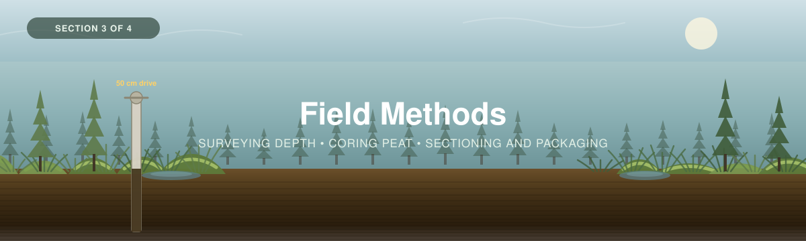

<p align="center">
  
</p>

---

[← 2 — Project Planning](../02_Project_Planning/) · [Back to main guide](../README.md) · Next: [4 — Data Interpretation →](../04_Data_Interpretation/)

---

# Part 3 — Field Methods

*A day in a peatland, in the order it has to happen.*

**Quick links:** [Measuring Carbon in Peat Soils](Peat-FINAL-Eng-2026.pdf) · [Bansal et al. (2023)](../../_Shared/s13157-023-01722-2.pdf) · [Datasheets](datasheets/) · [Checklists](checklists/)

---

## Overview

This section is the **collecting the data** half of the workshop. The sampling design is set
([Part 2](../02_Project_Planning/)); now the crew goes out and fills the sheets.

Part 3 splits into two pages. **Read this page first**: it covers what applies to both, and above
all the **order** things have to happen in.

| | Page | Covers | Fills |
|---|---|---|---|
| **3A** | [**Peat Coring**](3A_Peat_Coring.md) | Depth survey, Russian corer, revealing and sectioning, von Post | `1. Plot & Site Log` · `2. Core Log` · `3. Peat Data` |
| **3B** | [**Vegetation**](3B_Vegetation.md) *(optional)* | Trees in swamps, shrubs, ground layer, the *Sphagnum* boundary | Routes to the [Forests calculator](../../Forests/04_Data_Interpretation/calculators/) |

**3A is the workshop.** In a peatland, one pool holds nearly all the carbon, and it is the one
under your boots. 3B exists because a treed swamp has a real above-ground pool, and because
*Sphagnum* creates a double-counting problem you need a rule for.

### Sources for this section

- [*Measuring Carbon in Peat Soils: A Supplemental Guide*](Peat-FINAL-Eng-2026.pdf) (WWF-Canada, 2024) — the step-by-step coring protocol this page follows
- [*Practical Guide to Measuring Wetland Carbon Pools and Fluxes*](../../_Shared/s13157-023-01722-2.pdf) (Bansal et al. 2023, *Wetlands* 43:105) — corer selection, safety, and what to record
- [*Supplemental Guide: Laboratory Analysis*](../../_Shared/Lab-Guide-Eng-2026.pdf) (WWF-Canada, 2026) — what happens to the samples after the field
- [*Supplemental Guide: Sampling Design*](../../_Shared/Sampling-Design-Eng-2026.pdf) (WWF-Canada, 2026)

> 🎥 **[VIDEO NEEDED]** — the peat guide states that it has "a corresponding video" demonstrating
> coring in the field. The playlist URL belongs here, and at the coring steps in
> [3A](3A_Peat_Coring.md).

---

## ⚠ The order matters more than anything else on this page

The [peat guide](Peat-FINAL-Eng-2026.pdf) states it plainly:

> **"Peat sampling is a destructive sampling technique; as a result, vegetation surveys must be
> completed before soil samples are collected in all plot types."**

A corer takes a 5 cm hole out of the ground and a tarp's worth of trampling around it. Do that
first and every vegetation measurement afterwards is taken in a plot you have already damaged.

A second rule follows, for **permanent plots** you intend to re-measure:

> **Take cores OUTSIDE the vegetation plots.**

Otherwise your next visit, in five or ten years, measures regrowth on ground you dug up.

**The working order at each plot:**

```
 1. Navigate to the plot, mark it, record GPS         ──┐
 2. Lay out the plot boundaries                          │
 3. 14-photo series                                      │  non-destructive
 4. Water table depth, microform, vegetation zone        │
 5. Trees        (3B, swamps)                            │
 6. Shrubs and ground layer   (3B, optional)           ──┘
 7. Peat depth survey — 1 m grid across the plot        ─┐
 8. Choose the coring point (median probed depth)        │  destructive
 9. Core, reveal, measure, photograph                    │
10. Package whole, or section in the field             ──┘
```

> [!WARNING]
> **Step 7 is destructive too, slightly.** A depth probe leaves a 1 cm hole and a boot print. On a
> hummock–hollow surface, 121 probe points plus the walking between them is real disturbance to a
> moss quadrat. If vegetation is in scope, **probe after the vegetation work**, not before — and
> keep your route through the plot deliberate rather than wandering.

---

## Setting up a plot — common to both pages

### Navigate and mark

| | |
|---|---|
| **Plot** | **10 × 10 m (100 m²)** for peat. If trees are in scope, a 400 m² large plot around it — see [3B](3B_Vegetation.md) |
| **Coordinates** | Record at the **coring point**, not the plot corner, and record your **GNSS accuracy** with them. A handheld unit under canopy in a treed swamp can be 5–10 m out |
| **Permanent plots** | Mark so you can find it in ten years. In a peatland that is harder than in a forest — there are no trees to tag in a bog, and the surface itself rises and falls seasonally. Use a driven rod with a recorded depth-to-surface, plus a bearing and distance from something durable |

**Fill the [`1. Plot & Site Log`](../04_Data_Interpretation/calculators/) row before you core.**
Every other tab joins to it on `Plot ID`, so a missing row orphans a core's worth of data.

Four fields on that sheet are peatland-specific and easy to forget:

| Field | How to measure it | Why it matters |
|---|---|---|
| **Wetland type** | Bog / fen / swamp / marsh, from vegetation and water source | Your stratification, and whether 3B applies |
| **Microform** | Hummock / hollow / lawn — where the **corer** goes in | A covariate you can post-stratify on if your interval comes out wide ([A8](../02_Project_Planning/README.md#a8--after-the-campaign-did-you-hit-your-target)) |
| **Vegetation zone** | *Sphagnum* lawn, sedge lawn, shrub fen, treed swamp, lagg margin… your own scheme, used consistently | Tracks hydrology, and therefore peat type |
| **Water table depth** | Dig or probe a small hole beside the plot, let it equilibrate for a few minutes, measure **down** from the peat surface | The single best one-number description of a peatland's current state. **Positive = below the surface; negative = standing water above it** |

### The 14-photo series

Straight from the [peat guide](Peat-FINAL-Eng-2026.pdf). From the coring spot:

| | Photos | Aim |
|---|---|---|
| **1** | 1 | **Straight down** — vegetation |
| **2** | 1 | **Straight up** — canopy (or sky) |
| **3–14** | 12 | For **each cardinal direction**: one parallel with the ground, one angled **45° up**, one angled **45° down** |

**14 photos per plot.** They cost two minutes and are the only record of what the site looked
like before you cored it. A repeat visit in ten years compares against them directly.

> 📸 **[FIELD PHOTOS NEEDED]** — an example 14-photo series from a bog, a fen and a swamp, so a
> crew can see what "45° down" is supposed to capture.

### CoreID convention

The peat guide's scheme is **location–site–sample**:

```
PE-01-B
│  │  └── sample / core letter (B = the second core at this site)
│  └───── coring site number
└──────── location code (PE = Peawanuck)
```

This workshop's calculator uses the same idea with `Plot ID` and `Core ID`, and the
[worked example](../Worked_Example/) shows it filled in:

```
MB-01-C1        MB   = Mica Bog (study area)
                01   = plot number within the site
                C1   = first core in that plot
```

**Pick one scheme and write it on the datasheet header.** Mixed conventions inside one campaign
are the most common cause of data that cannot be joined later.

---

## Safety

Peatlands are the most physically hazardous ecosystem in this workshop series, and the hazards
are not obvious. [Bansal et al.](../../_Shared/s13157-023-01722-2.pdf) p.10 puts it directly:
"many areas can have **deep holes or soft sediments in which researchers can be trapped**."

<table>
<tr>
<td width="50%">

**Ground that will not hold you**

- **Floating mats and quaking fens** can be metres of water under a thin root mat. If the surface
  moves when you step, treat it as water, not ground
- **Deep holes** — old ditches, thermokarst collapses, beaver channels — are invisible under
  vegetation
- **Never work a peatland alone**, and keep your partner within sight and voice
- Carry a **wading staff** and probe ahead where the surface is uncertain
- **A PFD is appropriate** on a floating mat or in any wetland with open water. Waders that fill
  are a hazard in themselves — wear a belt

</td>
<td width="50%">

**Everything else**

- **Hypothermia**, even in summer. You will be wet from the knees down all day
- **Heat and dehydration**, at the same time, because you are also working hard in waders
- **Insects** — a head net is standard equipment in a Canadian peatland in June, not an optional
  comfort
- **The corer itself** — extension rods under load, a sledgehammer at knee height, a serrated
  knife on a wet tarp
- **Wildlife.** Bansal's list is US-centric (pythons and alligators); in Canada think **bears**,
  and think about **not hammering cores near breeding waterfowl** in spring

</td>
</tr>
</table>

> [!IMPORTANT]
> **The peat guide calls for a team of three to four people to extract a core**, and that is a
> safety specification as much as a practical one. One person lifting a stuck corer out of deep
> peat is how backs get hurt. Plan your crew size from the coring step, not the walking step.

> [!TIP]
> **Season is a safety decision, and [Part 2](../02_Project_Planning/) should already have made
> it.** Low water is easier and safer; frozen ground is the *only* way to core a permafrost peat
> plateau and recover the active layer
> ([Bansal](../../_Shared/s13157-023-01722-2.pdf) p.16). Spring high water in a treed swamp is the
> worst of every option.

---

## Equipment

From the [peat guide](Peat-FINAL-Eng-2026.pdf)'s equipment list, reorganised by when you use it.

<table>
<tr>
<td width="33%">

**Setting up a plot**

- Measuring tapes (2 × 30 m)
- **Peat depth probe** — a graduated steel rod, extendable
- Flagging and pin flags
- GNSS unit
- Camera
- Small **whiteboard** and markers
- Notebook (waterproof) and pencils
- Permanent markers
- Work gloves
- Tarps

</td>
<td width="33%">

**Taking a core**

- **Side-filling peat corer** — Russian / Macaulay style
- **Extension rods** — roughly one more per additional metre of depth
- Corer **handle**
- Vice grips
- Sledgehammer *(optional, for dense peat)*
- Utility / serrated knife
- Duct tape
- Wash water and a brush

</td>
<td width="33%">

**Packaging**

*Whole core:*
- PVC pipe cut lengthwise, at least core length
- Plastic wrap, aluminium foil
- Poster board / cardboard cut to pipe size
- Duct tape, permanent marker
- Cooler

*Field sectioning:*
- Measuring tape, knife, trowel or flat blade
- Resealable bags, pre-labelled
- Permanent markers / labels
- Cooler

</td>
</tr>
</table>

### Choosing a corer

[Bansal et al.](../../_Shared/s13157-023-01722-2.pdf) Table 4 (pp.19–22) reviews the options. Three
matter for Canadian peatlands:

| Corer | Best for | Watch out for |
|---|---|---|
| **Macaulay / Russian** *(this workshop's default)* | Peat, organic sediment and fluid mineral soils. Extension rods reach ≥5–10 m. **Minimal compaction** | "Not suitable for stiff, mineral-rich sediments" — it will not take you into the till below the contact |
| **Wardenaar box corer** | **Fibrous surface peat.** Takes a large, uncompressed monolith of the top 50–100 cm | Only reaches 50–100 cm, and is heavy. May need a separate bulk-density core |
| **Modified Hoffer probe** | **Frozen peat** — the permafrost case. 1 m extensions to 5 m | "Shattering and compaction can occur" |

> [!TIP]
> **If you are dating the core, consider using two corers.** A Russian corer handles the loose,
> fibrous acrotelm poorly — exactly the depth range where
> [Part 5](../05_Chronology_Supplement/) needs clean 1–2 cm sections. A **Wardenaar box corer for
> the top 50 cm and the Russian corer below it** gives you an uncompressed surface monolith and a
> deep sequence from the same point. Note the overlap depth on the sheet so the two can be
> stitched without double-counting.

---

## Datasheets and skill checklists

<table>
<tr>
<td width="50%">

**📋 Printable field datasheets**

- [`Peat-Core-Data-Sheet.docx`](datasheets/Peat-Core-Data-Sheet.docx)

This mirrors the calculator's `1. Plot & Site Log`, `2. Core Log` and `3. Peat Data` tabs field
for field, so transcription is a straight copy.

**For vegetation**, use the Forests sheets — they are the same measurements:
[`Tree-Survey-Datasheet.docx`](../../Forests/03_Field_Methods/datasheets/Tree-Survey-Datasheet.docx)

</td>
<td width="50%">

**✅ Skill checklists**

- [`Peat_Carbon_Skill_Checklist.docx`](checklists/Peat_Carbon_Skill_Checklist.docx)

Work through it with a trainer: tick the left box when you've practised a skill, the right when
your trainer confirms it. Good for training days and for demonstrating competency to a partner.

Coring is a **team skill** — several of the items can only be signed off with three or four
people present.

</td>
</tr>
</table>

---

## In this section

- [**3A — Peat Coring**](3A_Peat_Coring.md) · [**3B — Vegetation**](3B_Vegetation.md)
- [`Peat-FINAL-Eng-2026.pdf`](Peat-FINAL-Eng-2026.pdf) — the WWF-Canada peat coring protocol.
- [`datasheets/`](datasheets/) · [`checklists/`](checklists/)
- `images/` — banner and field photos.

> ✍️ **[SLIDE DECK NEEDED]** — the workshop presentation for Part 3, as `.pptx` and `.pdf`.

---

[← 2 — Project Planning](../02_Project_Planning/) · [Back to main guide](../README.md) · Next: [4 — Data Interpretation →](../04_Data_Interpretation/)
