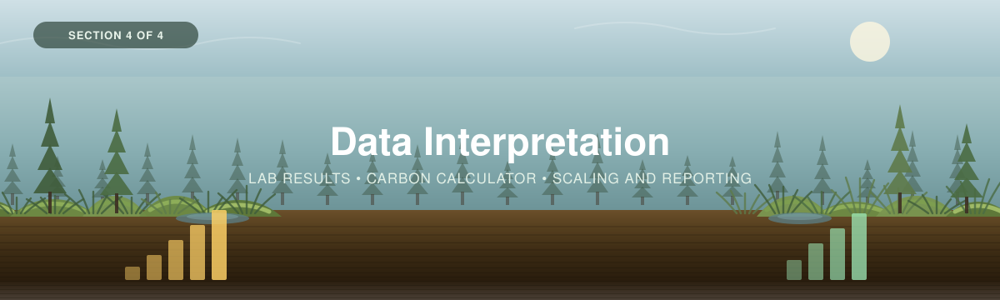

<p align="center">
  
</p>

---

[← 3 — Field Methods](../03_Field_Methods/) · [Back to main guide](../README.md) · Next: [5 — Chronology Supplement →](../05_Chronology_Supplement/)

---

# Part 4 — Data Interpretation

*What happens after the cores come out of the freezer: getting them analysed, turning bulk
density and loss-on-ignition into a carbon stock, and reporting it with an interval you can
defend.*

**Quick links:** [Wetland Carbon Calculator](calculators/) · [Laboratory Analysis guide](../../_Shared/Lab-Guide-Eng-2026.pdf) · [Measuring Carbon in Peat Soils](../03_Field_Methods/Peat-FINAL-Eng-2026.pdf) · [Bansal et al. (2023)](../../_Shared/s13157-023-01722-2.pdf)

---

## Overview

You came back with **completed datasheets**, **bagged peat sections** and, if you sampled
vegetation, **bagged clippings**. Only the datasheets are data yet. Everything else needs a lab.

| # | Step | Answers |
|---|------|---------|
| 1 | **[From the field to the lab](#step-1--from-the-field-to-the-lab)** | *How do I digitize, prep samples, and choose a lab?* |
| 2 | **[Run the numbers](#step-2--run-the-numbers)** | *How do bulk density and LOI become a carbon stock?* |
| 3 | **[Report the results](#step-3--reporting-the-results)** | *What do I report, and what does each number mean?* |

> 🧭 **Want to see it done?** A full worked example — nine plots across a bog, a fen and a
> treed swamp, followed from field sheet to a reportable stock — lives in
> [`Worked_Example/`](../Worked_Example/).

> [!NOTE]
> **This workshop stops at the spreadsheet.** Everything in Part 4 is computed by the
> [Wetland Carbon Calculator](calculators/); there is no R pipeline for stocks. The one place
> this workshop does route you to R is [Part 5](../05_Chronology_Supplement/), for age–depth
> modelling — and even there, the *rates* are computed in the workbook.

---

## Step 1 — From the field to the lab

### 1.1 Digitize the sheets

Type the paper sheets into the calculator **before anything else**, ideally the same week. Three
tabs, filled in this order because each joins to the one above it:

| Tab | One row per | Joins on |
|---|---|---|
| `1. Plot & Site Log` | **plot** | — fill this first, everything else keys to it |
| `2. Core Log` | **core** | `Plot ID` |
| `3. Peat Data` | **section** | `Core ID` |

The calculator flags a `Core ID not in Core Log` or `Plot ID not in Plot & Site Log` the moment
a join fails, which is the cheapest possible time to find a typo.

> [!TIP]
> **Digitize before the lab results arrive, not after.** The field columns and the lab columns
> are deliberately separate (**yellow = you typed it in the field, blue = the lab did**). Filling
> the yellow ones first means the QC flags for depth gaps, recovery ratio and missing mineral
> contact fire while the field season is still fresh enough to explain them.

### 1.2 Prep the samples

Follow the [Laboratory Analysis guide](../../_Shared/Lab-Guide-Eng-2026.pdf). In outline:

1. **Keep them frozen** until processing. Warm wet peat respires.
2. **Weigh wet**, before anything else, if you want moisture content.
3. **Pick out visible live roots** from each section and note that you did
   ([3B](../03_Field_Methods/3B_Vegetation.md) explains why: root carbon may already be counted
   in the tree pool).
4. **Dry to constant mass at 105 °C**, weigh again.
5. **Homogenise** the dried section before subsampling for LOI or CHN.

### 1.3 Find a lab, and ask it three questions

Contact the lab **before** the field season, not after. Three questions decide whether their
numbers are usable, and two of them are peat-specific:

| Ask | Why it matters |
|---|---|
| **Which bulk-density basis do you report?** Whole sample, or fine fraction (<2 mm)? | Peat has few coarse fragments, so the two are usually close — but "usually" is not "always" in a woody swamp peat, and a lab that sieves out wood is reporting something different from what is in the ground. The calculator has a `Bulk density basis` column so the answer travels with the data |
| **What volume do you assume for a half-cylinder core?** | A Russian corer chamber is a **half** cylinder. A lab that computes volume as a full cylinder halves every bulk density and therefore halves every carbon stock. This is a real and easy-to-miss factor of two |
| **Can you run CHN on a subset?** | You need it to calibrate the LOI→carbon factor. See [1.4](#the-loi--carbon-factor-is-not-a-constant) |

Also ask about **cost per sample** and **turnaround**, because they set how finely you can afford
to section. A 350 cm core at 5 cm is 70 samples; the same core sectioned at 1 cm through the top
50 cm for [dating](../05_Chronology_Supplement/) is 110.

### 1.4 What comes back from the lab

Four measurements, of which you need the first two and want all four:

| Measurement | What it is | Goes in |
|---|---|---|
| **Dry bulk density** (g/cm³) | Oven-dry mass ÷ volume of the section | `Bulk density (g/cm³)` |
| **Loss-on-ignition, LOI₅₅₀** (%) | Mass lost combusting the dried sample at 550 °C for ≥4 h — the **organic matter** fraction | `LOI₅₅₀ (%)` |
| **Moisture content** (%) | (wet − dry) ÷ wet | `Water content (%)` |
| **Organic carbon** (%) | From a **CHN elemental analyser** — carbon measured directly rather than inferred | `Organic carbon (%)` |

**The calculator prefers measured carbon over inferred.** If you fill `Organic carbon (%)`, it
uses it; if you leave it blank and fill `LOI₅₅₀ (%)`, it converts. Fill both and it uses the
measured value and says so in the flags.

```
Carbon % used  =  measured Organic carbon %      if given
               =  LOI₅₅₀ % × CARBON_FRACTION_OM  otherwise
```

#### The LOI → carbon factor is not a constant

The [peat guide](../03_Field_Methods/Peat-FINAL-Eng-2026.pdf) says organic matter is "typically
composed of 50 per cent carbon by weight," and **0.5 is this workbook's default**. It is a
reasonable default for peat. It is not a law.

Published factors span nearly a **three-fold range** — the calculator's `R1. Reference` tab
carries the sourced table:

| Factor | Source | System |
|---|---|---|
| **0.58** | van Bemmelen (historical) | The long-standing general factor; Pribyl (2010) considers it too high for many soils |
| **0.53** | Braun et al. (2020) | Freshwater coastal wetlands, Lake Michigan |
| **0.52** | Ouyang & Lee (2020) | Salt marsh |
| **0.50** | **This workshop / WWF peat guide** | **The default** |
| **0.47** | Baustian et al. (2017) | All Louisiana soils |
| **0.43** | Fourqurean et al. (2012) | Global seagrass sediments |
| **0.21** | Ouyang & Lee (2020) | Mangrove — the low end, and the warning |
| **0.4–0.6** | Craft et al. (1991) | Varies with organic-matter content and soil age |

> [!IMPORTANT]
> **[Bansal et al.](../../_Shared/s13157-023-01722-2.pdf) recommend determining a local SOM:SOC
> ratio on a subset of your own samples**, and this is the single cheapest improvement you can
> make to a peatland carbon estimate.
>
> **How:** run CHN on **10–20 sections spanning your full range of LOI and depth** — surface
> fibric peat, mid-profile hemic, basal sapric, and at least one mineral-contact section.
> Regress measured %C on LOI₅₅₀. If the slope is near 0.5, you have justified the default. If it
> is not, use your slope.
>
> **Set `OM_FACTOR_IS_LOCAL` to `Yes` once you have.** Until you do, every section carrying an
> inferred carbon value gets the advisory flag *"Carbon derived from LOI using the default factor
> of 0.5, which has not been calibrated locally."* That is not an error — it is a disclosure, and
> it belongs in your reporting either way.

> [!WARNING]
> **LOI overestimates organic matter in clay-rich material.** Structural water is driven off
> clay lattices at 550 °C and counts as mass lost. This matters little in peat and a great deal
> in the **mineral-contact sections** at the base of your core — exactly where you are trying to
> decide where the peat ends. Treat a basal LOI in the 5–15% range as approximate, and lean on
> bulk density and field description (`von Post at base`, mineral texture and colour) to place
> the contact.

---

## Step 2 — Run the numbers

*How bulk density and LOI become a carbon stock.*

Everything below is computed by the workbook. This section is so you can explain it — to a
reviewer, a partner, or yourself in two years.

### The chain, section to study area

Following the [peat guide](../03_Field_Methods/Peat-FINAL-Eng-2026.pdf) Eq 1–8:

```
Per section
  Carbon density (g/cm³)   = bulk density (g/cm³) × (carbon % ÷ 100)          Eq 1
  Stock of section (g/cm²) = carbon density × section thickness (cm)          Eq 2
  Stock of section (kg C/m²) = stock (g/cm²) × 10                             Eq 4

Per core
  Stock of core            = Σ its sections                                   Eq 3

Per plot
  Peat (kg C/m²)           = mean of the plot's cores
  Vegetation (kg C/m²)     = from the Forests calculator, if in scope
  TOTAL (kg C/m²)          = peat + vegetation

Per site
  Site mean (kg C/m²)      = mean of its plots                                Eq 5
  Site total (kg C)        = site mean × site area (m²)                       Eq 6

Study area
  Mean (kg C/m²)           = Σ site totals ÷ Σ site areas                     Eq 7
  Total (kg C)             = study-area mean × study area (m²)                Eq 8
  CO₂e (t)                 = kg C × 3.67 ÷ 1000
```

**Sections must add up to 100% of the core** for Eq 3 to mean anything — the guide says so, and
the calculator checks it. A gap between the bottom of one section and the top of the next is
carbon you have silently set to zero.

> [!NOTE]
> **Eq 7 is an area-weighted mean, not a mean of site means.** Sites differ in size, and a 24 ha
> bog should not carry the same weight as an 8.8 ha swamp. Dividing total carbon by total area
> does the weighting correctly. The guide gets this right and so does the calculator.

### Four things the workbook does that the printed guide doesn't

<table>
<tr>
<td width="50%">

**1 · The full profile is the headline, with a fixed depth beside it.**

The guide's Eq 3 sums all of a core's sections, whatever depth it reached. But a 366 cm core
holds more carbon than a 96 cm core largely for being deeper — averaging them across a site
describes no defined depth.

The workbook reports **both**: **stock to the mineral contact** (what is actually there) and
**stock to `REFERENCE_DEPTH_CM`**, default **100 cm** (comparable with everyone else's).
Every core is integrated to the same reference depth, and cores that stop short of it are
flagged.

</td>
<td width="50%">

**2 · Every estimate carries an interval.**

The guide reports point estimates with no standard error and no confidence interval — which
leaves the precision target you set in [Part 2](../02_Project_Planning/) with nothing to check
against.

The `6. Site Summary` tab computes SD, standard error, the *t*-multiplier and a confidence
interval across plots, and prints **`MET`** or **`NOT MET`** against your target. At small *n*
the multiplier matters: at *n* = 3 and 90% confidence it is **2.92**, not 1.645.

</td>
</tr>
<tr>
<td width="50%">

**3 · Accumulation rates, not just stocks.**

A core is a stratigraphic record as well as a stock. Given depth–age pairs, the
`4. Chronology` tab returns **SAR**, **RERCA** and **LORCA**, with the guardrails that stop the
commonest misreading. See [Part 5](../05_Chronology_Supplement/).

</td>
<td width="50%">

**4 · Eq 5's printed units are corrected.**

See the box below. The guide's spreadsheet is right and its printed equation has a typo; the
workbook follows the spreadsheet.

</td>
</tr>
</table>

> [!NOTE]
> None of these contradict the guide. The guide's arithmetic is exactly what runs inside each
> section and each core. These add the depth harmonisation, the uncertainty and the rates that
> the printed guide leaves out.

### ⚠ A units typo in the guide's Eq 5, and which version to trust

The printed guide gives:

> **Eq 5:** Average carbon stock of site **(kg/m²)** = sum of average carbon stocks of cores
> **(g/cm²)** / number of cores

Those two units cannot both be right — you cannot sum g/cm² values and get kg/m². **The
left-hand side is correct**, and so is the guide's own step-6 prose, which says to "add up the
average carbon values from **Eq 4 (kg/m²)** for each core."

The guide's companion spreadsheet, [`Carbon-Calculation-Example-Peat-Soil.xlsx`](../_source/Carbon-Calculation-Example-Peat-Soil.xlsx),
also has it right — its column header reads *"Average carbon stock of site (kg/m2) = sum of
average carbon stocks of cores **(kg/m2)** / number of cores."*

So it is a typo in the parenthetical, not a methodological disagreement. **This workshop uses
the correct form** — sum the per-core **kg/m²** values and divide by the number of cores — and
says so here rather than leaving you to wonder which to follow. If you had followed the printed
parenthetical literally you would be out by a factor of 10.

> [!TIP]
> **This is worth knowing about generally.** Unit slips between g/cm², kg/m² and t/ha are the
> most common arithmetic error in soil carbon work, and they are all factors of 10. Two habits
> catch nearly all of them: **carry units in every column header** (the calculator does), and
> **sanity-check the magnitude** — peat to a metre lands in the tens of kg C/m², a deep bog
> profile in the low hundreds. If a core comes out at 3 or at 3,000, it is a unit error, not a
> discovery.

### Where the uncertainty actually comes from

Worth being explicit, because the interval the workbook prints is **not** the whole uncertainty
budget:

| Source | Captured by the interval? | Notes |
|---|---|---|
| **Plot-to-plot variation in the site** | ✅ **Yes** — this is what the SD across plots measures | Dominant. Mostly depth ([Part 2](../02_Project_Planning/)) |
| **Core-to-core within a plot** | Partly — averaged into the plot value | Take ≥2 cores per plot where you can |
| **Lab measurement error** | ❌ No | Usually small relative to spatial variation |
| **The LOI→C factor** | ❌ No | Can be **±10% or worse** if uncalibrated. This is why calibration matters |
| **Depth-to-contact error** | ❌ No | A core that missed the contact is a **minimum**, flagged but not intervalled |
| **Study-area extrapolation** | ❌ **No** | See below — the big one |

> [!WARNING]
> **The study-area mean is area-weighted but carries no interval, and the workbook says so on
> the face of the sheet.** Propagating per-site intervals into a study-area interval needs the
> **stratified estimator**:
>
> $$\bar{x}_{st} = \sum_h W_h \bar{x}_h, \qquad W_h = \frac{A_h}{A}, \qquad \mathrm{SE}(\bar{x}_{st}) = \sqrt{\sum_h W_h^2 \frac{s_h^2}{n_h}}$$
>
> where $A_h$ and $n_h$ are stratum $h$'s area and plot count. The workbook computes
> $\bar{x}_{st}$ (that is Eq 7) but stops short of $\mathrm{SE}(\bar{x}_{st})$, because with
> three plots per stratum the degrees of freedom are so low that the interval would be more
> misleading than useful.
>
> **Report the per-site intervals, and report the study-area figure as a point estimate with the
> per-site precision beside it.** Do not quietly present the study-area total as if it were as
> well-constrained as the site means.
>
> For scale: the guide's own example extrapolates **three cores in 300 m² of plots** to a
> **95.5 ha** study area. That is a 3,000-fold extrapolation, and the printed chain returns it
> with no interval at all.

---

## Step 3 — Reporting the results

### Work the QC flags first

The calculator writes plain-English flags, not error codes. **Every one is an instruction.**
Clear or explain all of them before you report anything.

| Flag | What it means | What to do |
|---|---|---|
| `Core did not reach the mineral contact` | The full-profile stock is a **minimum** | Report it as a minimum, or re-core. Never present it as a total |
| `Organic depth under 30 cm: by the guide's definition this is not peatland` | Site classification, not a data error | Report it. "This unit is not peatland" is a finding |
| `Recovered only X% of the bore depth` | Chamber did not fill; **material is missing** | Report the stock as uncertain. **Do not** apply a compaction correction |
| `Core stops short of the reference depth` | Its reference-depth stock is an **underestimate** | Use the full-profile figure for this core, and say the reference-depth mean is biased low |
| `Bulk density outside QC range` | Below 0.02 or above 1.2 g/cm³ | Above the range usually means you passed the mineral contact. Check the section's field description |
| `Carbon above 60%` | Probably **organic matter entered as carbon** | Check units with the lab. Peat runs 45–55% |
| `Carbon derived from LOI using the default factor` | Advisory, not an error | Calibrate locally if you can; disclose it if you can't |
| `Both LOI and measured carbon given` | The measured value wins | Fine. Just know which was used |
| `Say which bulk-density basis the lab reported` | The basis column is empty | Ask the lab |
| `Only one core in this plot` | Bansal recommends three or more per wetland | Note the limitation |
| `Only one plot: a mean can be reported but never an uncertainty` | *n* = 1 | Report the mean, no interval, and say why |
| `NOT MET: ±X% against a ±20% target` | The site was patchier than your prior assumed | Work the ladder in [A8](../02_Project_Planning/README.md#a8--after-the-campaign-did-you-hit-your-target) — scrutinise, post-stratify, then add cores |

### What every report needs

| Element | Why |
|---|---|
| **The number, with units and a basis** | "129.1 kg C/m², full profile to the mineral contact" — not "129.1" |
| **The reference-depth figure alongside** | So anyone can compare you against a study that used 100 cm |
| **Sample size per site** | *n* = 3 is a different claim from *n* = 30 |
| **The interval, and the confidence level** | "±44% at 90% confidence" |
| **Whether the target was met** | And what you will do if it wasn't |
| **The LOI→C factor and whether it was calibrated** | A reader cannot judge your %C without it |
| **Which pools are included** | Peat only? Peat + trees? Say so |
| **Cores that did not reach the contact** | How many, and how you handled them |
| **What is not included** | Dead wood, litter, methane fluxes. Name the gaps |

### What each number means

| Number | Reads as |
|---|---|
| **kg C/m²** | Carbon density. Compare sites with this |
| **t C** (site or study-area total) | The size of the store. Compare projects with this |
| **t CO₂e** | kg C × 3.67. What a climate audience expects — **but a stock, not an offset** |
| **± half-width** | The width of your uncertainty in the same units as the mean |
| **Achieved margin** | The half-width as a fraction of the mean. This is what you compare to your target |
| **g C/m²/yr** | An accumulation **rate** — a different quantity entirely. [Part 5](../05_Chronology_Supplement/) |

> [!WARNING]
> **A carbon stock is not a carbon credit, and CO₂e does not make it one.** Multiplying by 3.67
> converts units; it does not establish additionality, permanence, a baseline or a counterfactual.
> A peatland holding 62,000 t C is not sequestering 228,000 t CO₂e — it is *storing* carbon that
> would be released if the site were drained. Those are different claims and a funder will know
> the difference.

### What the worked example reports

<details>
<summary><b>📊 The Mica Bog complex</b> &nbsp;·&nbsp; <i>nine plots, three wetland types</i></summary>

<br>

| Site | Type | *n* | Mean (kg C/m²) | ± | Precision |
|---|---|---|---|---|---|
| **S1** | Bog | 3 | 153.2 | ±67.6 | **NOT MET: ±44%** |
| **S2** | Fen | 3 | 124.5 | ±22.0 | **MET: ±18%** |
| **S3** | Treed swamp | 3 | 71.5 | ±58.8 | **NOT MET: ±82%** |

**Study area: 483,000 m² · 62,357 t C · 129.1 kg C/m² · 228,850 t CO₂e**, on the full-profile
basis, with 100 cm reported alongside.

**Two of three sites missed the target**, and the write-up says so rather than burying it. The
cause is diagnosable: in both failing sites one of the three plots sat near the **basin margin**
(214 cm against 352–366 in the bog; 26 cm against 96–104 in the swamp). That is the depocentre
effect [Part 2](../02_Project_Planning/) is about, and the fix is stratification, not more cores.

An under-powered result reported honestly is worth more than a confident one that hides its own
uncertainty. See the [full walk-through](../Worked_Example/).

</details>

### Communicating with partners

Three translations that land, and one to avoid:

- **"This bog holds about as much carbon per hectare as *N* hectares of mature forest."** Using
  Part 1's figures, a metre of peat holds roughly what the top metre of forest soil holds several
  times over. Check the arithmetic for your own site before saying it.
- **"Most of this is below 30 cm."** Non-specialists assume soil carbon is a surface phenomenon.
  Nahlik & Fennessy's 65%-between-30-and-120-cm is the most useful single fact you have.
- **"Drain it and this comes back out over decades."** This is the actionable framing, and it is
  accurate ([Part 1](../01_Background/)).
- **Avoid: "this peatland removes X tonnes of CO₂ per year"** unless you measured a rate
  ([Part 5](../05_Chronology_Supplement/)) — and even then, a long-term accumulation rate is not
  a current-year flux.

---

## References

**Primary protocols**

- WWF-Canada (2024). *Measuring Carbon in Peat Soils: A Supplemental Guide.* → [PDF](../03_Field_Methods/Peat-FINAL-Eng-2026.pdf)
- WWF-Canada (2026). *Supplemental Guide: Laboratory Analysis.* → [PDF](../../_Shared/Lab-Guide-Eng-2026.pdf)
- WWF-Canada (2026). *Supplemental Guide: Sampling Design.* → [PDF](../../_Shared/Sampling-Design-Eng-2026.pdf)
- Bansal, S., Creed, I.F., Tangen, B.A., Bridgham, S.D., Desai, A.R., Krauss, K.W., Neubauer, S.C. … Zhu, X. (2023). Practical Guide to Measuring Wetland Carbon Pools and Fluxes. *Wetlands*, 43(8), 105. → [PDF](../../_Shared/s13157-023-01722-2.pdf)

**Organic matter → carbon conversion**

- Craft, C.B., Seneca, E.D. & Broome, S.W. (1991). Loss on ignition and Kjeldahl digestion for estimating organic carbon and total nitrogen in estuarine marsh soils. *Estuaries*, 14(2), 175–179.
- Fourqurean, J.W. et al. (2012). Seagrass ecosystems as a globally significant carbon stock. *Nature Geoscience*, 5, 505–509.
- Baustian, M.M., Stagg, C.L., Perry, C.L. et al. (2017). Relationships between salinity and short-term soil carbon accumulation rates in marsh soils. *Estuaries and Coasts*, 40, 1394–1405.
- Braun, K.N. et al. (2020). Organic matter and carbon in freshwater coastal wetland soils. *Journal of Great Lakes Research*.
- Ouyang, X. & Lee, S.Y. (2020). Improved estimates on global carbon stock and carbon pools in tidal wetlands. *Nature Communications*, 11, 317.
- Pribyl, D.W. (2010). A critical review of the conventional SOC to SOM conversion factor. *Geoderma*, 156(3–4), 75–83.

**Depth, storage and sampling**

- Nahlik, A.M. & Fennessy, M.S. (2016). Carbon storage in US wetlands. *Nature Communications*, 7, 13835.
- Mitsch, W.J. & Gosselink, J.G. (2015). *Wetlands*, 5th ed. Wiley.
- Howard, J. et al. (2014). *Coastal Blue Carbon.* Conservation International / IOC-UNESCO / IUCN.

---

## In this section

- [`calculators/Wetland_Carbon_Calculator.xlsx`](calculators/) — the workbook everything above runs in.
- `images/` — section banner.

> ✍️ **[SLIDE DECK NEEDED]** — the workshop presentation for Part 4, as `.pptx` and `.pdf`.
>
> 🧪 **[LAB QUOTES NEEDED]** — per-sample cost and turnaround for bulk density, LOI₅₅₀ and CHN
> from two or three Canadian labs, **including which bulk-density basis each one reports**. This
> is the number teams ask for first and the one this workshop cannot currently answer.
>
> 📊 **[R PIPELINE — DEFERRED]** — an R workflow for stocks, reading the same workbook and
> producing the same numbers with reproducible code. Agreed to be out of scope for this build;
> the workshop stops at the spreadsheet.

---

[← 3 — Field Methods](../03_Field_Methods/) · [Back to main guide](../README.md) · Next: [5 — Chronology Supplement →](../05_Chronology_Supplement/)
