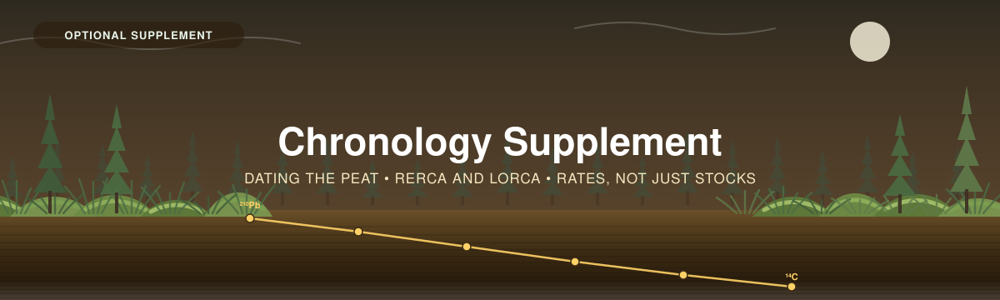

<p align="center">
  
</p>

---

[← 4 — Data Interpretation](../04_Data_Interpretation/) · [Back to main guide](../README.md) · Next: [Worked Example →](../Worked_Example/)

---

# Part 5 — Chronology Supplement *(optional)*

*Turning a stock into a rate — how fast this peatland has been accumulating carbon, and over
what period.*

**Workflow repository:** [`CathalD/SedimentChronologies_R`](https://github.com/CathalD/SedimentChronologies_R)

---

## What this adds, and what it doesn't

Parts 1–4 give you a **stock**: how much carbon is here now, with an interval. That is a
complete and defensible answer to "how much carbon does this peatland hold?"

It is not an answer to **"how fast did it get there?"** — and a peatland is the one ecosystem
where a single visit can answer that too, because the peat is its own archive. The
[peat guide](../03_Field_Methods/Peat-FINAL-Eng-2026.pdf) opens by naming "accumulation rates
of soils… the rate at which peat builds up" as one of the three things a core can tell you, and
defines *carbon accumulation rate*, *lead-210 dating* and *radio-carbon dating* in its glossary
— but its Eq 1–8 are stock-only. [Bansal et al.](../../_Shared/s13157-023-01722-2.pdf) make the
same point: coring gives a **pool**, not a **rate**, without further analysis.

**This supplement is that gap.**

<table>
<tr>
<td width="55%">

The logic is short:

1. **Date some horizons** in the core — radiometrically or against a known marker.
2. **Fit an age–depth model** through those dates, so every depth has an age.
3. **Divide the carbon above a dated horizon by its age.** That is a carbon accumulation rate.

```
peat sections (carbon)  +  dated horizons (ages)
        └──── age–depth model, in R ────┐
                                         ▼
       depth → age everywhere  ──►  SAR (cm/yr)
                                    RERCA, LORCA (g C/m²/yr)
```

**The carbon half you already have** — it is in the calculator's `3. Peat Data` tab. What this
supplement adds is the age half.

</td>
<td width="45">

> [!IMPORTANT]
> **The workbook computes the rates. R computes the ages.**
>
> The `4. Chronology` tab takes depth–age pairs as *input* and returns SAR, RERCA and LORCA. It
> does not do age–depth modelling — that is genuinely a job for R, and it is what the linked
> repository is for.
>
> If your lab hands you a table of dated depths, **you may not need R at all.** Type them into
> the tab and you have your rates.

</td>
</tr>
</table>

---

## Does this apply to you?

Four prerequisites. **If you don't have all four, stay with Parts 1–4** — the stock estimate is
complete and defensible on its own.

| | Prerequisite | Why |
|---|---|---|
| **1** | **Cores sectioned at 1–2 cm through the upper 10–50 cm** | Radiometric dating cannot be added retrospectively. 5 cm sections smear the ¹³⁷Cs peak past recovery |
| **2** | **Budget for radiometric analysis** | ²¹⁰Pb/¹³⁷Cs per sample, ×20–30 samples per core, ×replicate cores. ¹⁴C is dearer still |
| **3** | **A core that is datable at all** | See [the red flags](#red-flags-a-core-that-cannot-be-dated). Some cores simply are not |
| **4** | **Someone who can run R**, *or* a lab that returns a finished age–depth table | Option B is real and often cheaper than option A |

> [!WARNING]
> **This supplement changes the field plan, and the decision belongs in
> [Part 2](../02_Project_Planning/), not here.** Fine sectioning through the upper core and
> three replicate cores per site are choices made before the field season. By the time you are
> reading this page in earnest, the sections either exist or they don't.
>
> A defensible compromise many projects use: **one core per site sectioned finely for dating,
> the rest at standard resolution for stocks.** You get a rate for the site and a stock for every
> plot. Say clearly in your reporting that the rate is unreplicated if it is.

---

## The three clocks

Each isotope covers a different window, and they are complementary rather than alternatives.

| | **²¹⁰Pb** | **¹³⁷Cs** | **¹⁴C** |
|---|---|---|---|
| **Half-life** | **22.23 yr** | 30.17 yr | **5,730 ± 40 yr** |
| **Window** | ~100–150 years | ~1950 to present | to ~55,000 years |
| **Origin** | Natural, continuously produced from ²²⁶Ra decay | **Nuclear fission** — atmospheric testing from 1952 | Cosmic rays on atmospheric nitrogen |
| **What it gives you** | A continuous age–depth curve for the recent profile | **Fixed marker horizons**, not a curve | Ages for the deep profile and the basal date |
| **Key dates** | — | **1954** onset of detection · **1963** peak · **1986** Chernobyl (second peak, Europe) | — |
| **Used for** | **RERCA** | Validating ²¹⁰Pb | **LORCA** |

*Half-lives and dates from [Bansal et al.](../../_Shared/s13157-023-01722-2.pdf) p.75.*

**Use them together.** Bansal is explicit that ¹³⁷Cs accuracy "can be increased by incorporating
the 1954 or 1963 dates with other dating methods like ²¹⁰Pb… and vice versa" (Drexler et al.
2018; Thorne et al. 2018; Creed et al. 2022). A ²¹⁰Pb model that puts 1963 at the depth where
¹³⁷Cs actually peaks is a model you can defend. One that doesn't, isn't.

### Supported vs excess ²¹⁰Pb — the idea the whole method rests on

Most sediment contains ²²⁶Ra, which produces ²¹⁰Pb *in situ*. That is **supported** ²¹⁰Pb, and
it is not a clock — it is a constant background. The clock is the **excess** (or *unsupported*)
²¹⁰Pb that arrived from the atmosphere and has been decaying ever since:

```
excess ²¹⁰Pb  =  total ²¹⁰Pb  −  supported ²¹⁰Pb
```

Everything downstream depends on estimating that background correctly. Two ways:

- **Measure ²²⁶Ra directly**, per depth. Best, because supported activity can vary down-profile.
- **Take the asymptote** — the mean activity of the deepest sections, where excess has decayed
  to nothing. Cheaper, and adequate if your core goes deep enough.

> [!TIP]
> **Section deep enough to reach background.** The CRS model **requires the entire ²¹⁰Pb
> inventory**; a profile truncated before activity flattens biases every date in it, not just the
> deepest. You cannot tell in the field where that depth is, so section finely deeper than you
> think you need. Bansal p.78: measure "until ²¹⁰Pb reaches supported background levels or until
> the full ¹³⁷Cs peak has been captured."

---

## The peatland caveat: lead-210 moves

This is the single most important thing on this page, and it is absent from any lake-sediment
framing of the method.

> [!WARNING]
> **²¹⁰Pb can migrate vertically in peat.**
>
> Radiometric dating assumes the isotope stays where it was deposited. In lake sediment — a
> settled pile of mineral particles under permanent water — that assumption is usually sound. In
> **peat** it is not automatic. Peat is wet, porous, acidic, chemically active and threaded with
> living roots, and lead is mobile under those conditions.
>
> [Bansal et al.](../../_Shared/s13157-023-01722-2.pdf) p.75, citing **Urban et al. (1990)** and
> **Vile et al. (1999)** specifically for peatlands:
>
> > *"²¹⁰Pb can mobilize vertically in wetland sediments, particularly peatlands, when
> > interpreting results. ²¹⁰Pb dating may not be appropriate if mobilization has occurred or
> > sediment activity is too low for reliable measurement… in which case ¹³⁷Cs may be preferred."*
>
> **What to do about it:**
>
> 1. **Do not run ²¹⁰Pb alone in a peatland.** Measure ¹³⁷Cs on the same sections. It costs little
>    extra on a gamma detector — the same count gives you both.
> 2. **Check the ²¹⁰Pb model against the 1963 ¹³⁷Cs peak.** Agreement is your evidence that
>    mobilisation has not wrecked the profile. Disagreement is a finding, not a nuisance.
> 3. **If the profile is not monotonic** — flat, or increasing with depth — stop. See
>    [the red flags](#red-flags-a-core-that-cannot-be-dated).
> 4. **Say in your reporting that you checked.** A peatland ²¹⁰Pb chronology published without
>    reference to this literature is one a reviewer will ask about.

**And the complementary problem:** ¹³⁷Cs peaks "are not always distinct, particularly in
wetlands that experience variation in redox conditions related to wet–dry cycles" (Drexler et
al. 2018). A fluctuating water table — which is to say, most fens and swamps, and bogs in a dry
summer — can blur the peak you were relying on to check the ²¹⁰Pb.

**Neither isotope is reliable alone in a peatland. Run both, and expect to have to interpret.**

---

## What changes in the field

Everything here is a [Part 3A](../03_Field_Methods/3A_Peat_Coring.md) decision.

| Requirement | Specification | Source |
|---|---|---|
| **Section thickness** | **1–2 cm continuous** through the upper part of the core. "Thicker sampling increments lead to greater uncertainty in age–depth models" | Bansal p.78 (Lu & Matsumoto 2005; MacKenzie et al. 2011) |
| **Depth range** | Upper **10–50 cm** typically represents ~50–100 years | Bansal p.78 |
| **Where to stop** | At supported background, **or** once the full ¹³⁷Cs peak is captured — whichever is deeper | Bansal p.78 |
| **Continuity** | **No gaps.** CRS needs the entire inventory | Bansal p.78 |
| **Replication** | Ideally **20 (at least 10) dates from each of three replicate cores** for ¹³⁷Cs | Bansal p.81 |
| **Corer choice** | A **Wardenaar box corer** for the top 50 cm gives an uncompressed monolith; a Russian corer handles loose acrotelm poorly | Bansal Table 4 |
| **Contamination** | Radionuclide work "requires additional care to avoid contamination" — clean blade, washed between sections | Bansal p.22 (IAEA 2003; Brenner & Kenney 2013) |

### Choosing ¹⁴C targets — this one decision can invalidate a date

| Material | Use it? | Why |
|---|---|---|
| **Terrestrial plant macrofossils** — seeds, leaves, twigs, needles | ✅ **The target** | Fixed atmospheric CO₂ at the surface, in the year the layer formed |
| **Aquatic plant macrofossils** | ❌ **Avoid** | "Atmospheric CO₂ is not their primary source of C for photosynthesis" — the **reservoir effect** makes them date **too old** |
| **Roots** | ❌ **Avoid** | They grew **down** from a younger surface into older peat. Dates **too young** |
| **Bulk peat** | ⚠️ Last resort | Contains both: "older and younger components of C, such as from roots (younger) or recycled C from the water (older), which can compromise the accuracy" |

*Bansal pp.75–76. AMS needs only **10–100 mg**, so a few seeds are enough — the hard part is
finding and identifying them, which needs a macrofossil specialist.*

> [!NOTE]
> **The bomb spike makes recent ¹⁴C ambiguous.** Open-air nuclear testing raised atmospheric ¹⁴C
> sharply in the mid-twentieth century, so a post-1950 sample has **multiple possible calendar
> ages**. CALIBomb (Reimer et al. 2004) exists for this, but Bansal notes the method is "harder
> to interpret in recently deposited sediments without additional chronological constraints."
>
> **Practical consequence: use ²¹⁰Pb and ¹³⁷Cs for the last century, and ¹⁴C below it.** That is
> not a redundancy — it is a division of labour.

---

## Red flags: a core that cannot be dated

Some cores cannot produce a defensible chronology, and finding that out before you spend the
analysis budget is worth a careful look at the core description.

**From the activity profile:**

| Red flag | What it means |
|---|---|
| **²¹⁰Pb flat with depth** | No usable excess signal. Nothing to date |
| **²¹⁰Pb *increasing* with depth** | Physically impossible for undisturbed deposition — mobilisation, mixing, or a measurement problem |
| **Dynamic range < 3** (surface ÷ background activity) | Too little signal for CRS. 3–5 is moderate, **> 5 is robust** |
| **No detectable ¹³⁷Cs peak** | Either the core doesn't reach 1954, or redox cycling has blurred it |
| **¹⁴C age reversals** | Older material above younger. Mixing, slumping, or a bad target |

**From the core description** — Bansal p.78's criteria for a "good" core, all of which you
recorded in [3A, Stage 3](../03_Field_Methods/3A_Peat_Coring.md#stage-3--reveal-measure-and-photograph):

- **Inversions** — older material mixed above younger
- **Truncations** — erosion has removed part of the column
- **Inclusions** — wood chunks in the profile
- **Discontinuities** — gaps in deposition
- **Anomalous roots or stones** — signs of a disturbed setting

> [!TIP]
> **This is why the stratigraphy notes from 3A matter.** "A core that does not have any signs of
> disturbance as seen visually" is a judgement made on the tarp with the core open in front of
> you — not one you can make afterwards from a spreadsheet. If you plan to date, photograph and
> describe more carefully, not less.

---

## What the lab does, and what it costs you

| | **Gamma spectrometry** | **Alpha spectrometry** | **AMS (for ¹⁴C)** |
|---|---|---|---|
| **Measures** | ²¹⁰Pb, ²²⁶Ra **and ¹³⁷Cs together** | ²¹⁰Pb (via ²¹⁰Po) | ¹⁴C |
| **Sample prep** | **None** — no chemical treatment | **Chemical leaching** with HCl and HNO₃ | Macrofossil picking, then combustion |
| **Destructive?** | **No** | **Yes** | Yes |
| **Sample size** | Larger | Smaller | **10–100 mg** |
| **Why choose it** | One count gives you the ²¹⁰Pb/¹³⁷Cs pair the [peatland caveat](#the-peatland-caveat-lead-210-moves) requires | Better sensitivity | The only option for old material |

*Bansal p.76–77.*

> [!IMPORTANT]
> **For a peatland, gamma is usually the right call** — not because it is more sensitive, but
> because it returns ²¹⁰Pb and ¹³⁷Cs from the same count, and in a peatland you need both.
> Alpha's sensitivity advantage is worth less than the cross-check.

> 💰 **[LAB QUOTES NEEDED]** — per-sample cost and turnaround for gamma ²¹⁰Pb/¹³⁷Cs and for AMS
> ¹⁴C from Canadian labs. Cost per sample × 20–30 samples × 3 replicate cores is the number that
> decides whether a project can do this at all, and neither this workshop nor the linked
> repository currently carries it.

---

## Stratigraphic markers — the cheap complement

Not every chronohorizon needs a detector. Bansal pp.76–77 lists markers that cost almost nothing
once you are already looking at the core:

| Marker | Dates | Notes |
|---|---|---|
| ***Ambrosia* (ragweed) pollen rise** | European settlement and land clearance — regionally specific | The classic North American horizon. Pollen preserves exceptionally well in peat |
| **Total lead (not ²¹⁰Pb)** | Rises from the late 19th century, sharply from **1921** (leaded gasoline), falls after the **mid-1970s** | A characteristic *pattern*, not a single date |
| **Volcanic tephra** | The eruption, exactly | Only where there was fallout; needs geochemical fingerprinting |
| **Non-native species pollen** | Introduction date | Region-specific |

> [!NOTE]
> **Pollen biostratigraphy is unusually good in peatlands** — Bansal notes it "is particularly
> useful in wetland sediments because of favorable preservation conditions." If you have a
> palynologist available, an *Ambrosia* horizon is a free, independent check on a ²¹⁰Pb model.
>
> One caution: markers can be **reworked** — mixed with older material by erosion or tidal
> forces — which produces an artificially old date. Knowledge of local geology, hydrology and
> land-use history is part of the interpretation.

---

## The workflow repository — an honest account

[`CathalD/SedimentChronologies_R`](https://github.com/CathalD/SedimentChronologies_R) implements
the ²¹⁰Pb half of this. **Everything below was verified by reading the repository at its current
head**, and it is set out plainly so you know what you are getting before you spend a day on it.

### What exists — and it is substantial

`RERCA/` holds **four independent ²¹⁰Pb age models**, a comparison script and a Quarto report —
about **2,330 lines** of R:

| Script | Package | Model |
|---|---|---|
| `01_pb210_CRS.R` | [`pb210`](https://github.com/paleolimbot/pb210) | CRS (Constant Rate of Supply) |
| `02_rplum.R` | [`rplum`](https://cran.r-project.org/package=rplum) | Bayesian, Plum |
| `03_serac.R` | [`serac`](https://github.com/rosalieb/serac) | CRS **and CFCS** |
| `04_bayesian_pb210.R` | Stan, hand-written | Bayesian |
| `05_Multi-ModelSummaryandComparison.R` + `05_RERCA_Report.qmd` | — | Cross-model comparison and a rendered report |

**Running four models and comparing them is the right design.** A single age–depth model gives
you no way to tell a robust chronology from a fragile one; four models that agree is evidence,
and four that disagree tells you where the core is problematic.

### The decision thresholds it encodes — worth learning even if you never run it

These are good, and they are the part of the repository most worth carrying into your own work:

| Threshold | Meaning |
|---|---|
| **Dynamic range > 5** (surface ÷ background activity) | Robust signal for CRS. **3–5 moderate. < 3 limited** |
| **Inter-model age spread < 10 yr** | Strong agreement between the four models |
| **R² > 0.9** on the log-activity regression | Consistent with constant sedimentation → **CFCS appropriate** |
| **Rhat < 1.01** | Bayesian sampler converged well (< 1.05 acceptable) |

### What does not exist yet

> [!WARNING]
> **`LORCA/` contains a README and no code.** It describes planned ¹⁴C work — `rbacon`,
> calibration via Bchron or OxCal, integration with the ²¹⁰Pb chronology — under the heading
> *"Coming soon: Scripts will be added here in a future update."* **There is no ¹⁴C code in the
> repository today.**
>
> **This is less of a gap than it looks**, because `02_rplum.R` already runs **Plum**, and Plum
> is built on **Bacon**. `rplum` takes ²¹⁰Pb, ¹³⁷Cs, ¹⁴C *and* calendar ages from stratigraphic
> markers into a **single whole-core model**. So the integration route the LORCA README describes
> is largely already installed — it needs ¹⁴C dates passed to the existing script, not a new one.

**Also note:** the workflow stops at a **"CAR-ready" table** and asks you to supply your own
carbon fraction. **RERCA itself is never computed in R.** That is fine — the calculator's
`4. Chronology` tab computes it, from carbon you have already measured rather than a fraction
you assumed. Take the age–depth table out of R and finish in the workbook.

### Known issues, as of the current head

**Documented, not fixed** — this workshop does not modify the repository. Each has been verified
directly; each is small.

| # | Issue | Effect |
|---|---|---|
| **1** | All four scripts default to `data_file <- "RERCA/data/example_pb210_data.csv"`, but the repo ships **`template_pb210_data.csv`** | **Every script fails at `read.csv()` as cloned.** Set `data_file` to your own path — the scripts tell you to, on the same line |
| **2** | In `01` and `03`, `bg_value`/`bg_error` are assigned **only in the no-Ra-226 branch**, then used unconditionally further down (`01` line 226, `03` line 340) | A core that **has** ²²⁶Ra data errors with `object 'bg_value' not found`. Well-characterised cores fail; poorly-characterised ones run |
| **3** | The same code treats supported ²¹⁰Pb as a **scalar**, while the ²²⁶Ra branch correctly makes it **per-depth** | Even with #2 fixed, the scalar path would discard depth-varying ²²⁶Ra information |
| **4** | `01` writes `01_activity_profile.csv` with six columns — **bulk density is not among them** — and `05` looks for `dry_bulk_density_g_cm3` there | `car_factor` is **NA for every row**. The script prints a note telling you to add the column manually |
| **5** | `has_cs137` also tests `01_activity_profile.csv` for `cs137_dpm_g`, which is likewise not carried through | The ¹³⁷Cs validation section **never runs** — the one cross-check the [peatland caveat](#the-peatland-caveat-lead-210-moves) most requires |
| **6** | Where the ¹³⁷Cs block *would* run, `05_RERCA_Report.qmd` line 272 computes `year_AD` from **`Sys.Date()`** | Calendar years are wrong by however many years elapsed between coring and running the report. (`03_serac.R` uses `coring_year` correctly — the concept is in the repo, just not here) |
| **7** | `02_rplum.R` reads `RERCA/output/crs_ages.csv`; `01` writes `RERCA/output/**01_**crs_ages.csv` | The CRS-vs-Plum overlay silently never draws |
| **8** | `readline()` prompts in `01` and `03` | Blocks non-interactive runs (`Rscript`, CI, `targets`) |
| **9** | The top-level README's table lists `03_serac.R` as **"CRS / CIC / CFCS"**; the script calls `model = c("CRS", "CFCS")` | **CIC is not implemented.** The script's own header comment is correct |
| **10** | Framing throughout is **lake sediment**, not peat | None of the peatland caveats on this page are in it. That is what this page is for |

> [!NOTE]
> **Issues 4 and 5 have the same one-line cause and the same one-line fix.** Script `01`'s
> `select()` at line 362 drops `dry_bulk_density_g_cm3` and `cs137_dpm_g` before writing the
> activity profile — but **the input template already carries both columns**. Adding them to that
> `select()` would make `car_factor` compute and the ¹³⁷Cs validation run. The data is there; the
> hand-off between scripts loses it.
>
> Recorded here for whoever picks the repository up. **Nothing in this workshop depends on it** —
> the calculator computes RERCA and LORCA from carbon it already holds.

---

## The handoff: from R back to the calculator

```
   cores sectioned 1–2 cm  ──►  lab: ²¹⁰Pb, ²²⁶Ra, ¹³⁷Cs, ¹⁴C
                                        │
                                        ▼
                      SedimentChronologies_R  (age–depth modelling)
                                        │
                                        ▼
                          depth ─ age ─ uncertainty ─ source
                                        │
                                        ▼
          Wetland Carbon Calculator  ──►  4. Chronology  ──►  SAR · RERCA · LORCA
```

**What you type into `4. Chronology`** — one row per dated horizon:

| Column | Enter |
|---|---|
| `Core ID` | Must match `2. Core Log` |
| `Depth (cm)` | The dated depth |
| `Age (yr before coring)` | **Before coring**, not before 1950 and not calendar years. Convert first |
| `Age ± (yr)` | The uncertainty. **Every radiometric age has one** — the tab flags a missing value |
| `Date source` | `Pb-210 CRS` · `Pb-210 Plum` · `Cs-137 1963` · `Cs-137 1954` · `C-14 calibrated` · `stratigraphic marker` |

Carbon comes from `3. Peat Data` automatically. The tab returns:

```
SAR   (cm/yr)      =  Δdepth ÷ Δage  between consecutive dated horizons
RERCA (g C/m²/yr)  =  cumulative carbon above the Pb-210 datable horizon ÷ its age
LORCA (g C/m²/yr)  =  total profile carbon ÷ basal age
```

> [!TIP]
> **Convert your ages before typing them in.** A ²¹⁰Pb model usually returns **calendar years
> AD**; ¹⁴C returns **years BP**, where "present" is **1950** by convention. The tab wants **years
> before *your* coring date**. Two conversions:
>
> ```
> from calendar AD:   age = coring_year − year_AD
> from ¹⁴C cal BP:    age = cal_BP − (1950 − coring_year)
> ```
>
> For a core taken in 2026: a horizon dated 1963 AD is **63 years old**; a calibrated date of
> 4,000 cal BP is **4,076 years** before coring. Getting this wrong shifts every rate.

---

## Reading the result

### RERCA is almost always bigger than LORCA, and that is not a finding

> [!WARNING]
> **The commonest serious error in peatland carbon work is reporting RERCA > LORCA as
> accelerating sequestration.** It isn't. It is the acrotelm.
>
> Recall [Part 1](../01_Background/): the upper peat is periodically aerobic and still actively
> decomposing. **RERCA is measured through that layer** — through material that has not finished
> losing mass. **LORCA is the net rate of carbon that actually survived into the catotelm.** The
> two measure different things, and the ratio between them is a decomposition signal, not a trend.
>
> Young et al. (2019, *Scientific Reports*), *"Misinterpreting carbon accumulation rates in
> records from near-surface peat"*, is a whole paper on exactly this.
>
> **The `4. Chronology` tab flags the ratio automatically** rather than leaving you to notice:
>
> > *"RERCA is Nx LORCA. This is EXPECTED, not a finding: near-surface peat has not finished
> > decomposing, so recent rates always look higher. Do not report it as accelerating
> > sequestration."*
>
> In the [worked example](../Worked_Example/) the ratio is **2.09×**, which is unremarkable.

### Sanity bounds

Published long-term peatland accumulation rates run roughly **4.6–85.8 g C/m²/yr**, mean **~20**.
The calculator flags anything outside `LORCA_MIN` (4) to `LORCA_MAX` (90) — **flags, not rejects.**
A value outside that range is usually one of: a units error, an age entered in the wrong
reference frame, or a core that did not reach its base. Check those three before concluding you
have found an unusual peatland.

### Interval rates are more informative than either headline

The tab computes **interval CAR** between consecutive dated horizons. In the worked example these
decay down the profile:

```
94.6 → 63.7 → 46.0 → 41.3 → 48.2 → 50.0 → 24.6 → 20.6 → 25.1   g C/m²/yr
```

**That decline is the acrotelm/catotelm transition made numeric** — the same story the RERCA:LORCA
ratio tells, with depth resolution. It is usually the most interesting figure in a chronology,
and the one worth plotting.

---

## Reporting rules — non-negotiable

| Rule | Why |
|---|---|
| **Report RERCA and LORCA separately, with their periods** | "53.3 g C/m²/yr over the last 127 years (²¹⁰Pb CRS)" and "25.6 g C/m²/yr over 6,820 years (¹⁴C)" are different claims about different things |
| **Never present the ratio as a trend** | See above |
| **State the age model and the package** | CRS, CFCS, Plum or Bayesian — and which R package. They do not always agree |
| **State the dating method per horizon** | The tab's `Date source` column exists for this |
| **Give uncertainties on ages, not just depths** | A rate without an age uncertainty cannot be defended |
| **Say whether ²¹⁰Pb was cross-checked against ¹³⁷Cs** | In a peatland this is the difference between a chronology and a guess |
| **Say if the chronology is unreplicated** | One dated core per site is common and fine — but say so |
| **An accumulation rate is not a current flux** | LORCA is a millennial average. It is not what the site did last year, and it is not an offset |

---

## Where this fits

| | |
|---|---|
| **Comes after** | [Part 4](../04_Data_Interpretation/) — you need section carbon before you can have a carbon *rate* |
| **Reaches back into** | [Part 2](../02_Project_Planning/) and [Part 3A](../03_Field_Methods/3A_Peat_Coring.md) — sectioning and replication are decided there |
| **Parallel to** | [Forests Part 5 — LiDAR](../../Forests/05_LiDAR_Supplement/), which likewise wraps an external R pipeline around the core workshop |

---

## Open questions for this supplement

> 🔧 **The ten known issues above** — recorded for whoever next works on
> `SedimentChronologies_R`. Issues 4 and 5 are one `select()` statement.
>
> 📐 **LORCA scripts** — `rbacon`/`rplum` with ¹⁴C calibration. The `LORCA/` folder is a README
> today, and `02_rplum.R` is closer to whole-core capability than that folder suggests.
>
> 💰 **Lab costs** — per-sample gamma and AMS pricing, Canadian labs.
>
> 📸 **[FIGURE NEEDED]** — a real ²¹⁰Pb/¹³⁷Cs activity profile from a Canadian peatland, with
> excess ²¹⁰Pb, supported background and the ¹³⁷Cs peak marked, beside the resulting age–depth
> model. Bansal's Fig. 19a is the model for this.
>
> 🧪 **A peat-specific worked chronology** — the [worked example](../Worked_Example/) carries a
> constructed one. A real dated core, with its activity profile, would be better.

---

[← 4 — Data Interpretation](../04_Data_Interpretation/) · [Back to main guide](../README.md) · Next: [Worked Example →](../Worked_Example/)
