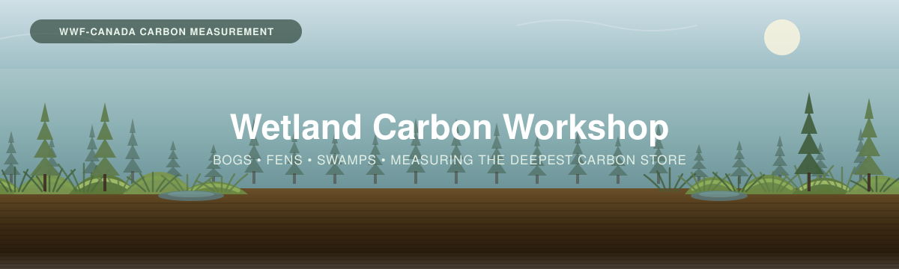

<p align="center">
  
</p>

# Wetland Carbon Workshop

Materials from the **Wetland Carbon Workshop** on measuring carbon in Canadian peatlands —
bogs, fens and swamps — from the background, through field methods, to analysis and reporting.

This workshop is organised in **four parts**, with an **optional fifth** for teams that want
accumulation *rates* rather than just stocks. You can go in order, or jump to any section.

---

## Contents

| # | Section | What it covers |
|---|---------|----------------|
| 1 | [**Background**](01_Background/) | What peat is and how it forms; bogs, fens and swamps; why nearly all of the carbon is underground. |
| 2 | [**Project Planning**](02_Project_Planning/) | How many cores and where: the peat **depth survey**, stratifying by wetland type and microform, and sizing the campaign. |
| 3 | [**Field Methods**](03_Field_Methods/) | [Coring peat](03_Field_Methods/3A_Peat_Coring.md) with a Russian corer, and [vegetation](03_Field_Methods/3B_Vegetation.md) where it matters. |
| 4 | [**Data Interpretation**](04_Data_Interpretation/) | Lab results, the carbon calculator, scaling and reporting. |
| 5 | [**Chronology Supplement**](05_Chronology_Supplement/) *(optional)* | Dating the peat to get **rates**: RERCA from ²¹⁰Pb and ¹³⁷Cs, LORCA from ¹⁴C. |

### Useful links

- **WWF-Canada Carbon Measurement library** — [wwf.ca/carbon-measurement](https://wwf.ca/carbon-measurement/)
- **Measuring Carbon in Peat Soils** — [PDF](03_Field_Methods/Peat-FINAL-Eng-2026.pdf)
- **Carbon Measurement: Sampling Design** — [PDF](../_Shared/Sampling-Design-Eng-2026.pdf)
- **Laboratory Analysis guide** — [PDF](../_Shared/Lab-Guide-Eng-2026.pdf)
- **Bansal et al. (2023), *Practical Guide to Measuring Wetland Carbon Pools and Fluxes*** — [PDF](../_Shared/s13157-023-01722-2.pdf) · the comprehensive reference behind this workshop
- **Trees and understory** — the [Forests workshop](../Forests/), for swamps

---

## Objectives

1. **Learn about peatland carbon in Canada** — what it is, where it sits, and why it matters.
2. **Learn field methods for measuring it** — surveying peat depth and coring to the mineral contact.
3. **Turn measurements into outputs** — carbon stocks, and optionally accumulation rates.

---

## How to think about this workshop

This is a *wetland carbon* workshop: at its heart, it is about collecting the data needed to
quantify carbon in an ecosystem. The clearest way to see what a team needs to collect is to
start from the **data sheet** the analysis is built on, and work back from there. Each heading
on that sheet is something real we measure in the peatland — a depth, a weight, a carbon
concentration — and once the sheet is complete, those numbers let us calculate carbon stock,
compare areas, and inform decisions.

The workshop focuses on two things, in the order you'd do them:

1. **Making the data useful** — making sure that *before* you collect anything, the samples you
   plan to take will actually answer your team's questions.
2. **Collecting the data** following best practices, in line with what the **data sheet** asks for.

[**Section 2 — Project Planning**](02_Project_Planning/) is *making the data useful*.
[**Section 3 — Field Methods**](03_Field_Methods/) is *collecting the data*.
[**Section 4 — Data Interpretation**](04_Data_Interpretation/) turns the completed sheet into
carbon estimates.

---

## Three wetlands, one method

Canada's peatlands are usually sorted into three types. They differ in where their water comes
from, which changes their chemistry, their plants — and how much of this workshop you need.

<table>
<tr>
<td width="55%">

| | Water source | Typical vegetation | What you measure |
|---|---|---|---|
| 🟤 **Bog** | **Rain and snow only** (ombrotrophic). Acidic, nutrient-poor | *Sphagnum* moss, ericaceous shrubs, stunted black spruce | Peat — usually the deepest profiles |
| 🟢 **Fen** | **Groundwater** carrying minerals from surrounding soil (minerotrophic). Less acidic | Sedges, brown mosses, tamarack | Peat |
| 🌲 **Swamp** | Variable; standing or moving water | **≥ 25% tree cover** — organic depth from shallow to very deep | Peat **and trees** |

*Definitions follow the [peat guide's glossary](03_Field_Methods/Peat-FINAL-Eng-2026.pdf).*

</td>
<td width="45%">

> 📸 **[FIGURE NEEDED]** — the three wetland types side by side, showing the water-source
> difference: rain falling on a raised bog, groundwater feeding a fen, and a treed swamp.

</td>
</tr>
</table>

**The method is the same in all three.** You survey peat depth, core to the mineral contact,
section the core, and send samples for bulk density and carbon. What changes is what *else*
you measure:

- **Swamps have trees**, and trees hold real carbon. Measure them with the
  [Forests tree protocol](../Forests/03_Field_Methods/3A_Trees.md) — DBH, species, height —
  and use the same [allometric equations](../Forests/04_Data_Interpretation/calculators/).
- **Shrubs and ground vegetation** in any of the three follow the
  [Forests understory protocol](../Forests/03_Field_Methods/3C_Understory.md).
- ***Sphagnum* needs care.** The living moss is vegetation; the dead moss beneath it is peat.
  [Part 3B](03_Field_Methods/3B_Vegetation.md) covers how to keep from counting it twice.

> [!NOTE]
> **A peatland is defined by its soil, not its plants** — the guide's threshold is an organic
> horizon **30 cm deep or more**. A treed swamp on deep peat is still a peatland, and the peat
> is still where most of the carbon is.

---

## Why this workshop is mostly about depth

<table>
<tr>
<td width="55%">

In a forest, soil carbon is roughly ten times the tree carbon. In a peatland the imbalance is
starker still: peat profiles run from **30 cm to 8 metres**, and peat is roughly half carbon by
weight all the way down.

That has a blunt consequence for how you sample. Carbon stock is approximately

```
depth  ×  bulk density  ×  carbon fraction
```

and across a single peatland, **depth is the term that varies most**. Bulk density and carbon
content are fairly stable; depth can go from 40 cm at the margin to 4 m at the centre.

**So the depth survey in [Part 2](02_Project_Planning/) is the single highest-value thing you
do.** It is what makes one core defensible for a whole plot.

</td>
<td width="45%">

> 📸 **[FIGURE NEEDED]** — a cross-section through a raised bog showing peat thickening from the
> lagg margin to the dome centre, with coring points and the mineral contact marked.

</td>
</tr>
</table>

> [!IMPORTANT]
> **Don't stop at 30 cm.** Bansal et al. found that when wetlands were sampled to 120 cm,
> **65% of the organic carbon sat between 30 and 120 cm** — below the depth many soil surveys
> stop at. This workshop reports **to the mineral contact** by default, with a fixed-depth
> figure alongside so your numbers stay comparable with everyone else's.

---

## The data sheet we're building toward

Everything in Parts 3 and 4 feeds one workbook:

**👉 [`Wetland_Carbon_Calculator.xlsx`](04_Data_Interpretation/calculators/)**
· a fully worked copy lives in [`Worked_Example/`](Worked_Example/).

| What the sheet captures | Filled in during | Covered in |
|---|---|---|
| Plot & site log (location, wetland type, microform, water table) | the field | [Part 3](03_Field_Methods/) |
| Core log (drives, bore depth, recovery, mineral contact) | the field | [3A — Peat Coring](03_Field_Methods/3A_Peat_Coring.md) |
| Peat data (section depths, von Post, notes) | the field | [3A](03_Field_Methods/3A_Peat_Coring.md) |
| Lab results (bulk density, LOI₅₅₀ or %C) | after the lab | [Part 4](04_Data_Interpretation/) |
| Carbon stock, plot and site totals | calculated for you | [Part 4](04_Data_Interpretation/) |
| Depth–age pairs → accumulation rates | if you date the core | [Part 5](05_Chronology_Supplement/) |

---

# TLDR

**Once the sheet is filled, how carbon stock is calculated**

For each section of a core, how much peat there is (bulk density) multiplied by how much of it
is carbon, over the thickness of that section:

```
Carbon stock (kg C/m²) = bulk density (g/cm³) × (%C ÷ 100) × thickness (cm) × 10
```

Sum the sections to get the core, average the cores to get the site, multiply by area to get
the total. Deeper peat, denser peat and higher carbon content all mean more carbon stored per
square metre — and in a peatland, **depth does most of the work**.

**If you also date the core** ([Part 5](05_Chronology_Supplement/)), the same carbon numbers
give you *rates*:

```
LORCA (g C/m²/yr) = total profile carbon ÷ age at the base of the peat
RERCA (g C/m²/yr) = carbon above a dated recent horizon ÷ its age
```

> [!NOTE]
> **Why 0.5?** Peat organic matter is roughly **50% carbon by weight**, which is the convention
> the peat guide uses to convert LOI₅₅₀ to carbon. It is a convention, not a measurement, and
> published values range from 0.21 to 0.58 across wetland types —
> [Part 4](04_Data_Interpretation/) covers when it is worth measuring directly.
>
> To report in **CO₂ equivalents** rather than carbon, multiply by **3.67**.

---

## Some resources to find in this workshop

- [`Wetland_Carbon_Calculator.xlsx`](04_Data_Interpretation/calculators/) — the calculator, stocks and rates.
- [Peat field datasheet and skill checklist](03_Field_Methods/) — printable, for the field.
- [**Measuring Carbon in Peat Soils**](03_Field_Methods/Peat-FINAL-Eng-2026.pdf) — the protocol this workshop follows.
- [**Bansal et al. (2023)**](../_Shared/s13157-023-01722-2.pdf) — the 169-page reference behind almost every judgement call here.
- [Chronology supplement](05_Chronology_Supplement/) — dating peat for accumulation rates.

---

*Part of the [Terrestrial Carbon Workshops](../) series — Forests · Grasslands · Wetlands.*
